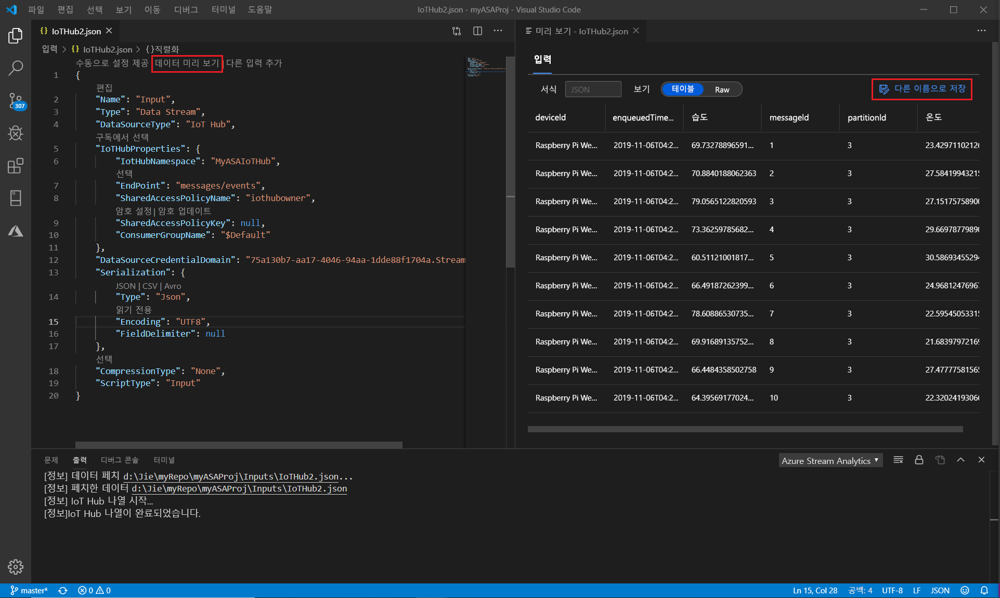

# Visual Studio Code를 통해 샘플 데이터를 사용하여 로컬로 Stream Analytics 쿼리 테스트

Visual Studio Code Azure Stream Analytics 도구를 사용 하 여 샘플 데이터를 사용 하 여 Stream Analytics 작업을 로컬로 테스트할 수 있습니다. JSON 파일에서 프로젝트의 **Localrunoutputs** 폴더에 있는 쿼리 결과를 찾을 수 있습니다.

## 사전 요구 사항

* [.Net CORE SDK](https://dotnet.microsoft.com/download) 를 설치 하 고 Visual Studio Code를 다시 시작 합니다.

* 이 [빠른](quick-create-vs-code.md) 시작을 사용 하 여 Visual Studio Code를 사용 하 여 Stream Analytics 작업을 만드는 방법을 알아봅니다.

## 샘플 데이터 준비

먼저 샘플 입력 데이터 파일을 준비 해야 합니다. 컴퓨터에 일부 샘플 데이터 파일이 이미 있는 경우이 단계를 건너뛰고 다음 단계로 이동할 수 있습니다.

1. 맨 위 줄에서 입력 구성 파일의 **데이터 미리 보기** 를 클릭 합니다. 일부 입력 데이터는 IoT Hub에서 페치 되며 미리 보기 창에 표시 됩니다. 이는 다소 시간이 걸릴 수 있습니다.

2. 데이터가 표시 되 면 다른 **이름으로 저장** 을 클릭 하 여 데이터를 로컬 파일에 저장 합니다.

 

## 로컬 입력 정의

1. Stream Analytics 프로젝트의 입력 폴더에서 **input.js를** 클릭 합니다. 그런 다음 맨 위 줄에서 **로컬 입력 추가** 를 선택 합니다.

    

    **Ctrl + Shift + P** 를 사용 하 여 명령 팔레트를 열고 사용자 **: 입력 추가**를 입력할 수도 있습니다.

   

2. **로컬 입력**을 선택 합니다.

    

3. **+ 새 로컬 입력**을 선택 합니다.

    

4. 쿼리에서 사용한 것과 동일한 입력 별칭을 입력 합니다.

    

5. 새로 생성 된 **LocalInput_Input.js** 파일에서 로컬 데이터 파일이 있는 파일 경로를 입력 합니다.

    

6. **데이터 미리 보기** 를 선택 하 여 입력 데이터를 미리 봅니다. JSON 또는 CSV의 경우 데이터의 serialization 형식이 자동으로 검색 됩니다. 선택기를 사용 하 여 **테이블** 또는 **원시** 형식으로 데이터를 볼 수 있습니다. 다음 표는 **테이블 형식의**데이터에 대 한 예입니다.

     

    다음 표는 **원시 형식의**데이터에 대 한 예입니다.

    

## 로컬로 쿼리 실행

쿼리 편집기로 돌아가서 **로컬에서 실행**을 선택 합니다. 그런 다음 드롭다운 목록에서 **로컬 입력 사용** 을 선택 합니다.

오른쪽 창에 결과가 표시 됩니다. **실행** 을 클릭 하 여 다시 테스트할 수 있습니다. **폴더에서 열기** 를 선택 하 여 파일 탐색기에서 결과 파일을 확인 하 고 다른 도구를 사용 하 여 결과 파일을 추가로 열 수도 있습니다. 결과 파일은 JSON 형식 으로만 사용할 수 있습니다.

## 다음 단계

* [Visual Studio Code를 사용 하 여 라이브 입력으로 Azure Stream Analytics 작업을 로컬로 테스트](visual-studio-code-local-run-live-input.md)

* [Visual Studio Code를 사용 하 여 Azure Stream Analytics 작업 살펴보기 (미리 보기)](visual-studio-code-explore-jobs.md)
