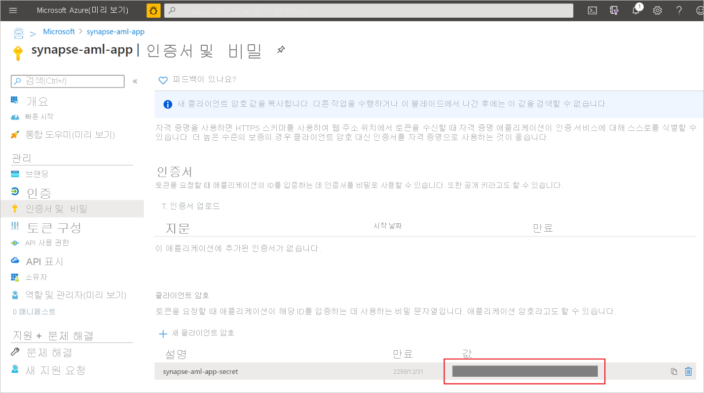
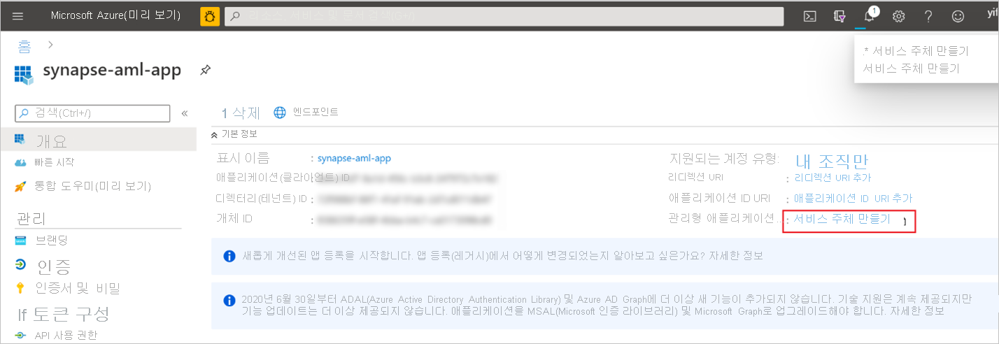
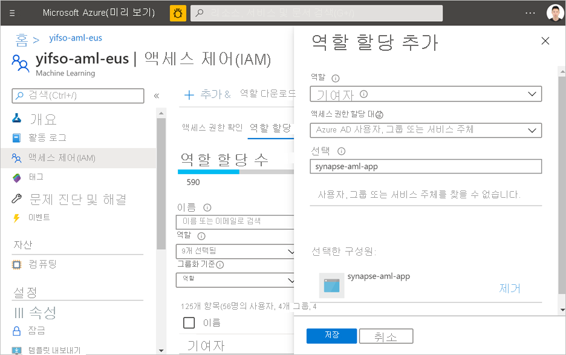

# 빠른 시작: Synapse에서 새로운 Azure Machine Learning 연결된 서비스 만들기

이 빠른 시작에서는 Synapse Analytics 작업 영역을 Azure Machine Learning 작업 영역에 연결합니다. 이러한 작업 영역을 연결하면 Synapse의 다양한 환경에서 Azure Machine Learning을 활용할 수 있습니다.

예를 들어 Azure Machine Learning 작업 영역에 연결하면 다음과 같은 환경을 사용할 수 있습니다.

- Synapse 파이프라인의 한 단계로 Azure Machine Learning 파이프라인을 실행합니다. 자세한 내용은 [Azure Machine Learning 파이프라인 실행](/azure/data-factory/transform-data-machine-learning-service)을 참조하세요.

- Azure Machine Learning 모델 레지스트리에서 기계 학습 모델을 가져오고 Synapse SQL 풀에서 모델 점수 매기기를 수행하여 예측을 통해 데이터를 보강합니다. 자세한 내용은 [자습서: Synapse SQL 풀에 대한 기계 학습 모델 점수 매기기 마법사](tutorial-sql-pool-model-scoring-wizard.md)를 참조하세요.

## 사전 요구 사항

- Azure 구독 - [체험 구독 만들기](https://azure.microsoft.com/free/)
- 기본 스토리지로 구성된 ADLS Gen2 스토리지 계정이 있는 [Synapse Analytics 작업 영역](../get-started-create-workspace.md). 작업하려는 ADLS Gen2 파일 시스템의 **Storage Blob 데이터 기여자**여야 합니다.
- [Azure Machine Learning 작업 영역](/azure/machine-learning/how-to-manage-workspace).
- 연결된 서비스를 만드는 데 사용할 수 있는 서비스 주체와 비밀을 만들려면 권한(또는 권한이 있는 사용자에게 요청)이 필요합니다. 이 서비스 주체에 Azure Machine Learning 작업 영역의 기여자 역할을 할당해야 합니다.

## Azure Portal에 로그인

[Azure 포털](https://portal.azure.com/)

## 서비스 주체 만들기

이 단계에서는 새 서비스 주체를 만듭니다. 기존 서비스 주체를 사용하려면 이 단계를 건너뜁니다.
1. Azure Portal을 엽니다. 

1. **Azure Active Directory** -> **앱 등록**으로 이동합니다.

1. **새 등록**을 클릭합니다. 그런 다음, UI에 대한 지침에 따라 새 애플리케이션을 등록합니다.

1. 애플리케이션을 등록한 후, 애플리케이션에 대한 비밀을 생성합니다. **애플리케이션** -> **인증서 및 비밀**로 이동합니다. **클라이언트 암호 추가**를 클릭하여 비밀을 생성합니다. 비밀을 안전하게 유지하고 나중에 사용 합니다.

   

1. 애플리케이션의 서비스 주체를 만듭니다. **애플리케이션** -> **개요**로 이동한 다음, **서비스 주체 만들기**를 클릭합니다. 경우에 따라 이 서비스 주체가 자동으로 만들어집니다.

   

1. 서비스 주체를 Azure Machine Learning 작업 영역의 “기여자”로 추가합니다. 이렇게 하려면 Azure Machine Learning 작업 영역이 속한 리소스 그룹의 소유자가 되어야 합니다.

   

## 연결된 서비스 만들기

1. 새로운 Azure Machine Learning 연결된 서비스를 만들려는 Synapse 작업 영역에서 **관리** -> **연결된 서비스**로 이동하여 “Azure Machine Learning” 유형의 새 연결된 서비스를 만듭니다.

   

2. 양식을 작성합니다.

   - 서비스 주체 ID: 애플리케이션의 **애플리케이션(클라이언트) ID**입니다.
  
     > [!NOTE]
     > 애플리케이션의 이름이 아닙니다. 이 ID는 애플리케이션의 개요 페이지에서 찾을 수 있습니다. 이는 “81707eac-ab38-406u-8f6c-10ce76a568d5”처럼 긴 문자열이어야 합니다.

   - 서비스 주체 키: 이전 섹션에서 생성한 비밀입니다.

3. **연결 테스트**를 클릭하여 구성이 올바른지 확인합니다. 연결 테스트에 통과하면 **저장**을 클릭합니다.

   연결 테스트에 실패한 경우 서비스 주체 ID와 비밀이 올바른지 확인한 후 다시 시도하십시오.

## 다음 단계

- [자습서: 기계 학습 모델 점수 매기기 마법사 - SQL 풀](tutorial-sql-pool-model-scoring-wizard.md)
- [Azure Synapse Analytics의 Machine Learning 기능(작업 영역 미리 보기)](what-is-machine-learning.md)
