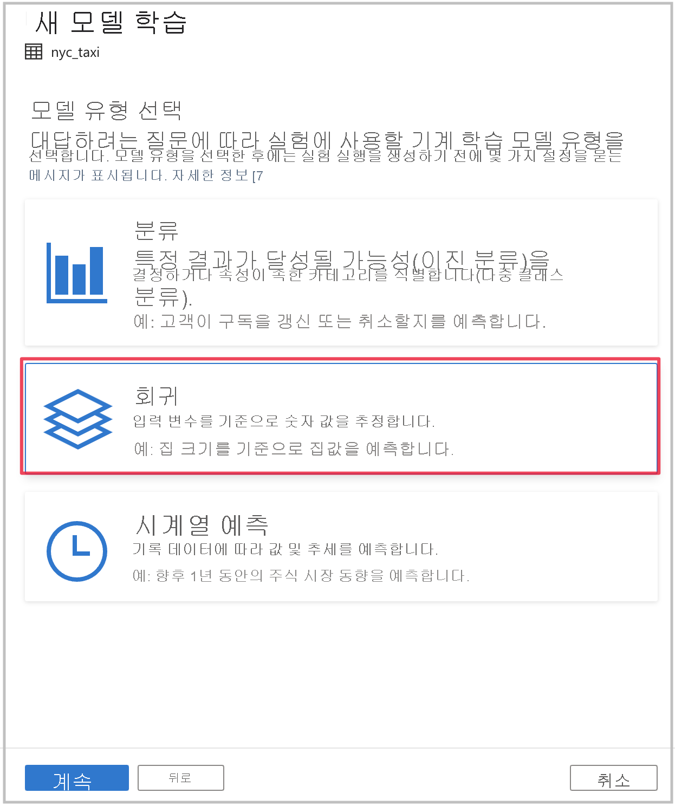
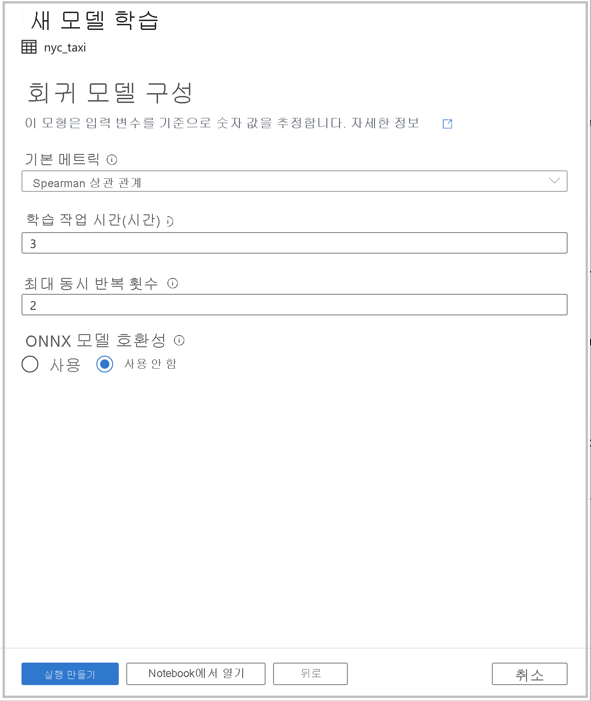

# 자습서: 코드를 사용하지 않고 기계 학습 모델 학습

[자동화된 기계 학습](https://docs.microsoft.com/azure/machine-learning/concept-automated-ml)을 사용하여 학습하는 새로운 기계 학습 모델을 통해 Spark 테이블의 데이터를 보강할 수 있습니다. Azure Synapse Analytics에서는 기계 학습 모델을 빌드하기 위한 교육 데이터 세트로 사용할 작업 영역에서 Spark 테이블을 선택할 수 있으며 코드가 없는 환경에서 이 작업을 수행할 수 있습니다.

이 자습서에서는 Azure Synapse Analytics 스튜디오에서 코드가 없는 환경을 사용하여 기계 학습 모델을 학습하는 방법에 대해 알아봅니다. 환경을 수동으로 코딩하는 대신 Azure Machine Learning에서 자동화된 기계 학습을 사용합니다. 학습되는 모델의 유형은 해결하려는 문제에 따라 달라집니다.

Azure 구독이 없는 경우 [시작하기 전에 체험 계정을 만듭니다](https://azure.microsoft.com/free/).

## 사전 요구 사항

- [Azure Synapse Analytics 작업 영역](../get-started-create-workspace.md). 다음 스토리지 계정이 기본 스토리지로 구성되었는지 확인합니다. Azure Data Lake Storage Gen2. 작업하는 Data Lake Storage Gen2 파일 시스템의 경우 **Storage Blob 데이터 기여자** 인지 확인합니다.
- Azure Synapse Analytics 작업 영역의 Apache Spark 풀. 자세한 내용은 [빠른 시작: Azure Synapse Analytics 스튜디오를 사용하여 전용 SQL 풀 만들기](../quickstart-create-sql-pool-studio.md)를 참조하세요.
- Azure Synapse Analytics 작업 영역의 Azure Machine Learning 연결 서비스. 자세한 내용은 [빠른 시작: Azure Synapse Analytics에서 새 Azure Machine Learning 연결된 서비스 만들기](quickstart-integrate-azure-machine-learning.md)를 참조하세요.

## Azure Portal에 로그인

[Azure Portal](https://portal.azure.com/)에 로그인합니다.

## 학습 데이터 세트용 Spark 테이블 만들기

이 자습서에는 Spark 테이블이 필요합니다. 다음 Notebook이 Spark 테이블 하나를 만듭니다.

1. [Create-Spark-Table-NYCTaxi- Data.ipynb](https://go.microsoft.com/fwlink/?linkid=2149229) Notebook을 다운로드합니다.

1. Notebook을 Azure Synapse Analytics 스튜디오로 가져옵니다.

1. 사용하려는 Spark 풀을 선택하고, **모두 실행** 을 선택합니다. 이는 열린 데이터 세트에서 뉴욕 택시 데이터를 가져와서 기본 Spark 데이터베이스에 저장합니다.

1. Notebook 실행이 완료되면 기본 Spark 데이터베이스 아래에 새 Spark 테이블이 표시됩니다. **데이터** 에서 **nyc_taxi** 라는 테이블을 찾습니다.

## 자동화된 기계 학습 마법사 시작

방법은 다음과 같습니다.

1. 이전 단계에서 만든 Spark 테이블을 마우스 오른쪽 단추로 클릭합니다. 마법사를 열려면 **Machine Learning** > **새 모델로 보강** 을 선택합니다.

1. 그런 다음, Azure Machine Learning에서 실행되는 자동화된 기계 학습 실험을 만들기 위한 구성 세부 정보를 제공할 수 있습니다. 이 실행은 여러 모델을 학습시키고, 성공한 실행 중 최상의 모델은 Azure Machine Learning 모델 레지스트리에 등록됩니다.

   

    - **Azure Machine Learning 작업 영역**: Azure Machine Learning 작업 영역은 자동화된 기계 학습 실험 실행을 만드는 데 필요합니다. 또한 [연결된 서비스](quickstart-integrate-azure-machine-learning.md)를 사용하여 Azure Synapse Analytics 작업 영역을 Azure Machine Learning 작업 영역과 연결해야 합니다. 모든 필수 구성 요소를 충족한 후 이 자동화된 실행에 사용할 Azure Machine Learning 작업 영역을 지정할 수 있습니다.

    - **실험 이름**: 실험 이름을 지정합니다. 자동화된 기계 학습 실행을 제출할 때 실험 이름을 제공합니다. 실행에 대한 정보는 Azure Machine Learning 작업 영역의 해당 실험 아래에 저장됩니다. 이 환경에서는 기본적으로 새 실험을 만들고 제안된 이름을 생성하지만 기존 실험의 이름을 제공할 수도 있습니다.

    - **최상의 모델**: 자동화된 실행에서 최상의 모델에 대한 이름을 지정합니다. 최상의 모델에는 이 이름이 지정되고, 이 실행 후에 Azure Machine Learning 모델 레지스트리에 자동으로 저장됩니다. 자동화된 기계 학습 실행은 많은 기계 학습 모델을 만듭니다. 이후 단계에서 선택하는 기본 메트릭에 따라 이러한 모델을 비교하여 최상의 모델을 선택할 수 있습니다.

    - **대상 열**: 이는 예측을 위해 모델에서 학습되는 항목입니다. 예측하려는 열을 선택합니다. (이 자습서에서는 `fareAmount` 숫자 열을 대상 열로 선택합니다.)

    - **Spark 풀**: 자동화된 실험 실행에 사용할 Spark 풀입니다. 계산은 지정한 풀에서 실행됩니다.

    - **Spark 구성 세부 정보**: Spark 풀 외에도 세션 구성 세부 정보를 제공하는 옵션도 있습니다.

1. **계속** 을 선택합니다.

## 작업 유형 선택

답변하려는 질문에 따라 실험에 대한 기계 학습 모델 유형을 선택합니다. `fareAmount`는 대상 열이고 숫자 값이므로 여기에서 **회귀** 를 선택합니다. 그런 다음, **계속** 을 선택합니다.

## 추가 구성

이전 섹션에서 모델 유형으로 **회귀** 또는 **분류** 를 선택한 경우, 다음 구성을 사용할 수 있습니다.

- **기본 메트릭**: 모델의 성능을 측정하는 데 사용되는 메트릭입니다. 이는 자동화된 실행에서 만든 여러 모델을 비교하여 가장 효율적으로 수행되는 모델을 결정하는 데 사용되는 메트릭입니다.

- **학습 작업 시간(시간)** : 실험에서 모델을 실행하고 학습시키는 데 걸리는 최대 시간(시간)입니다. 1보다 작은 값을 제공할 수도 있습니다(예: `0.5`).

- **최대 동시 반복 횟수**: 동시에 실행되는 최대 반복 횟수를 나타냅니다.

- **ONNX 모델 호환성**: 이 옵션을 사용하면 자동화된 기계 학습으로 학습된 모델이 ONNX 형식으로 변환됩니다. 이는 특히 모델을 Azure Synapse Analytics SQL 풀의 점수 매기기에 사용하려는 경우에 적합합니다.

이러한 설정에는 모두 사용자 지정할 수 있는 기본값이 있습니다.

필요한 모든 구성이 완료되면 자동화된 실행을 시작할 수 있습니다. 코드를 사용하지 않고 직접 실행을 시작하는 **실행 만들기** 를 선택할 수 있습니다. 또는 코드를 선호하는 경우 **Notebook에서 열기** 를 선택할 수 있습니다. 이 옵션을 사용하면 실행을 만드는 코드를 보고 Notebook을 실행할 수 있습니다.

>[!NOTE]
>이전 섹션에서 모델 유형으로 **시계열 예측** 을 선택하는 경우 추가 구성을 수행해야 합니다. 또한 예측은 ONNX 모델 호환성을 지원하지 않습니다.

### 직접 실행 만들기

자동화된 기계 학습 실행을 직접 시작하려면 **실행 시작** 을 선택합니다. 실행이 시작되고 있다는 알림이 표시됩니다. 그런 다음, 성공을 나타내는 또 다른 알림이 표시됩니다. 알림에서 링크를 선택하여 Azure Machine Learning의 상태를 확인할 수도 있습니다.

### Notebook을 사용하여 실행 만들기

Notebook을 생성하려면 **Notebook에서 열기** 를 선택합니다. 그런 다음, **모두 실행** 을 선택합니다. 이렇게 하면 추가 설정을 자동화된 기계 학습 실행에 추가할 수도 있습니다.

실행이 성공적으로 제출되면 Notebook 출력의 Azure Machine Learning 작업 영역에 실험 실행 링크가 표시됩니다. 링크를 클릭하여 Azure Machine Learning에서 자동화된 실행을 모니터링합니다.
)

## 다음 단계

- [자습서: 전용 SQL 풀을 위한 기계 학습 모델 점수 매기기 마법사(미리 보기)](tutorial-sql-pool-model-scoring-wizard.md)
- [빠른 시작: Azure Synapse Analytics에서 새 Azure Machine Learning 연결된 서비스 만들기](quickstart-integrate-azure-machine-learning.md)
- [Azure Synapse Analytics의 기계 학습 기능](what-is-machine-learning.md)
