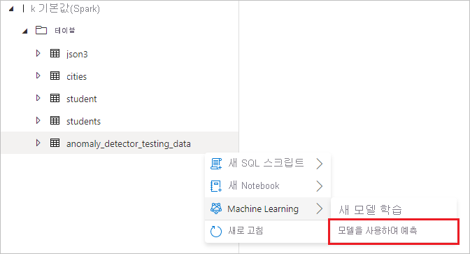
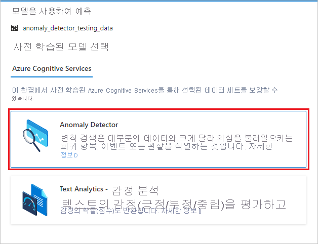

# 자습서: Cognitive Services를 사용하여 변칙 검색(미리 보기)

이 자습서에서는 [Azure Cognitive Services](../../cognitive-services/index.yml)를 사용하여 Azure Synapse Analytics에서 데이터를 쉽게 보강하는 방법에 대해 알아봅니다. [Anomaly Detector](../../cognitive-services/anomaly-detector/index.yml)를 사용하여 변칙을 찾습니다. Azure Synapse의 사용자는 변칙 검색을 위해 보강할 테이블을 선택하기만 하면 됩니다.

이 자습서에서는 다음 내용을 다룹니다.

> [!div class="checklist"]
> - 시계열 데이터가 포함된 Spark 테이블 데이터 세트를 가져오는 단계입니다.
> - Azure Synapse의 마법사 환경을 사용하여 Cognitive Services의 Anomaly Detector를 통해 데이터를 보강합니다.

Azure 구독이 없는 경우 [시작하기 전에 체험 계정을 만듭니다](https://azure.microsoft.com/free/).

## 사전 요구 사항

- [Azure Synapse Analytics 작업 영역](../get-started-create-workspace.md)(기본 스토리지로 구성된 Azure Data Lake Storage Gen2 스토리지 계정이 있음). 사용하는 Data Lake Storage Gen2 파일 시스템의 *Storage Blob 데이터 기여자* 여야 합니다.
- Azure Synapse Analytics 작업 영역의 Spark 풀. 자세한 내용은 [Azure Synapse에서 Spark 풀 만들기](../quickstart-create-sql-pool-studio.md)를 참조하세요.
- [Azure Synaps에서 Cognitive Services 구성](tutorial-configure-cognitive-services-synapse.md)의 사전 구성 단계 완료

## Azure Portal에 로그인

[Azure Portal](https://portal.azure.com/)에 로그인합니다.

## Spark 테이블 만들기

이 자습서에는 Spark 테이블이 필요합니다.

1. Spark 테이블을 생성하는 코드가 포함된 [prepare_anomaly_detector_data.ipynb](https://go.microsoft.com/fwlink/?linkid=2149577) Notebook 파일을 다운로드합니다.

1. Azure Synapse 작업 영역에 파일을 업로드합니다.

   

1. Notebook 파일을 열고 **모두 실행** 을 선택하여 모든 셀을 실행합니다.

   

1. 이제 **anomaly_detector_testing_data** 라는 Spark 테이블이 기본 Spark 데이터베이스에 표시됩니다.

## Cognitive Services 마법사 열기

1. 이전 단계에서 만든 Spark 테이블을 마우스 오른쪽 단추로 클릭합니다. **Machine Learning** > **기존 모델을 사용하여 보강** 을 차례로 선택하여 마법사를 엽니다.

   

2. 구성 패널이 표시되고, Cognitive Services 모델을 선택하라는 메시지가 표시됩니다. **Anomaly Detector** 를 선택합니다.

   

## 인증 세부 정보 제공

Cognitive Services를 인증하려면 키 자격 증명 모음의 비밀을 참조해야 합니다. 다음 입력은 이 시점 이전에 완료해야 하는 [필수 구성 요소 단계](tutorial-configure-cognitive-services-synapse.md)에 따라 달라집니다.

- **Azure 구독**: Key Vault가 속한 Azure 구독을 선택합니다.
- **Cognitive Services 계정**: 연결할 Text Analytics 리소스를 입력합니다.
- **Azure Key Vault 연결된 서비스**: 필수 구성 요소 단계의 일부로 Text Analytics 리소스에 대한 연결된 서비스를 만들었습니다. 여기서 이를 선택합니다.
- **비밀 이름**: Cognitive Services 리소스를 인증하기 위한 키가 포함된 키 자격 증명 모음에 비밀 이름을 입력합니다.

## Anomaly Detector 구성

Anomaly Detector를 구성하려면 다음 세부 정보를 제공합니다.

- **세분성**: 데이터가 샘플링되는 속도입니다. **monthly(매월)** 를 선택합니다. 

- **Timestamp column(타임스탬프 열)** : 계열의 시간을 나타내는 열입니다. **timestamp (string)(타임스탬프(문자열))** 를 선택합니다.

- **Timeseries value column(시계열 값 열)** : Timestamp column(타임스탬프 열)에 지정된 시간의 계열 값을 나타내는 열입니다. **value (double)(값(double))** 를 선택합니다.

- **Grouping column(그룹화 열)** : 계열을 그룹화하는 열입니다. 즉, 이 열에 동일한 값이 있는 모든 행은 하나의 시계열을 형성해야 합니다. **group (string)(그룹(문자열))** 을 선택합니다.

완료되면 **Open notebook(Notebook 열기)** 을 선택합니다. 그러면 Azure Cognitive Services를 사용하여 변칙을 검색하는 PySpark 코드가 포함된 Notebook이 자동으로 생성됩니다.

## 노트북 실행

방금 연 Notebook은 [mmlspark 라이브러리](https://github.com/Azure/mmlspark)를 사용하여 Cognitive Services에 연결합니다. 제공한 Azure Key Vault 세부 정보를 사용하면 이 환경에서 비밀을 공개하지 않고도 안전하게 참조할 수 있습니다.

이제 모든 셀을 실행하여 변칙 검색을 수행할 수 있습니다. **모두 실행** 을 선택합니다. [Cognitive Services의 Anomaly Detector에 대해 자세히 알아보세요](../../cognitive-services/anomaly-detector/index.yml).

## 다음 단계

- [자습서: Azure Cognitive Services를 사용한 감정 분석](tutorial-cognitive-services-sentiment.md)
- [자습서: Azure Synapse 전용 SQL 풀에서 기계 학습 모델 채점](tutorial-sql-pool-model-scoring-wizard.md)
- [Azure Synapse Analytics의 Machine Learning 기능](what-is-machine-learning.md)
