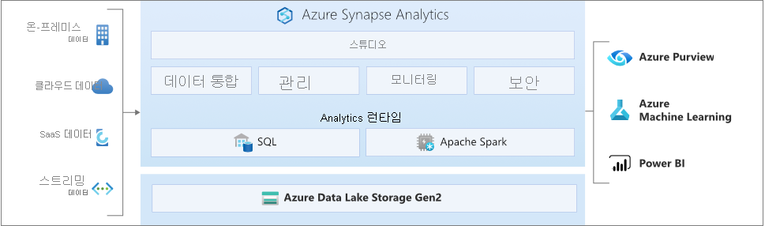

# Azure Synapse Analytics란?

**Azure Synapse** 는 데이터 웨어하우스와 빅 데이터 시스템 전체에서 인사이트를 얻는 시간을 앞당길 수 있는 엔터프라이즈 분석 서비스입니다. Azure Synapse는 엔터프라이즈 데이터 웨어하우징에 사용되는 최고의 **SQL** 기술, 빅 데이터에 사용되는 **Spark** 기술, 데이터 통합 및 ETL/ELT를 위한 **파이프라인**, **Power BI**, **CosmosDB** 및 **AzureML** 과 같은 Azure 서비스와의 긴밀한 통합을 결합합니다.

## 업계 최고의 SQL

**Synapse SQL** 은 데이터 웨어하우징 및 데이터 가상화 시나리오를 지원하고 T-SQL을 확장하여 스트리밍 및 기계 학습 시나리오를 처리하는 T-SQL용 분산 쿼리 시스템입니다.

* Synapse SQL은 **서버리스** 및 **전용** 리소스 모델을 모두 제공합니다. 예측 가능한 성능 및 비용을 위해 전용 SQL 풀을 생성하여 SQL 테이블에 저장된 데이터를 위한 처리 성능을 예약합니다. 계획하지 않은 워크로드나 버스티 워크로드에는 항상 사용 가능한 서버리스 SQL 엔드포인트를 사용합니다.
* 기본 제공 **스트리밍** 기능을 사용하여 클라우드 데이터 원본의 데이터를 SQL 테이블로 이동합니다.
* [T-SQL PREDICT 함수](/sql/t-sql/queries/predict-transact-sql?view=azure-sqldw-latest&preserve-view=true)를 통해 데이터의 점수를 매기는 **기계 학습** 모델을 사용하여 AI와 SQL을 통합합니다.

## 업계 표준 Apache Spark

**Azure Synapse용 Apache Spark** 는 데이터 준비, 데이터 엔지니어링, ETL 및 기계 학습에 사용되는 가장 인기있는 오픈 소스 빅 데이터 엔진인 Apache Spark를 긴밀하고 원활하게 통합합니다.

* Linux Foundation Delta Lake가 기본적으로 지원되는 Apache Spark 2.4용 AzureML 통합 및 SparkML 알고리즘이 포함된 ML 모델
* 클러스터 관리에 대해 걱정할 필요가 없는 간소화된 리소스 모델
* 신속한 Spark 시작 및 적극적인 자동 크기 조정
* Spark 애플리케이션 내에서 기존 .NET 코드와 C# 전문 지식을 활용할 수 있도록 .NET for Spark 기본 지원

## Data Lake 사용

Azure Synapse는 SQL과 Spark를 함께 사용하는 기존의 기술 장벽을 제거합니다. 사용자의 요구 사항과 전문 지식에 맞게 원활하게 조합하여 사용할 수 있습니다.

* 데이터 레이크의 파일에서 정의된 테이블은 Spark 또는 Hive에서 원활하게 사용됩니다.
* SQL과 Spark는 데이터 레이크에 저장된 Parquet, CSV, TSV 및 JSON 파일을 직접 검색하고 분석할 수 있습니다.
* SQL과 Spark 데이터베이스 사이의 빠르고 확장성 있는 데이터 로딩

## 기본 제공 데이터 통합

Azure Synapse에는 Azure Data Factory와 동일한 데이터 통합 엔진과 환경이 포함되어 있으므로 Azure Synapse Analytics를 종료하지 않고도 다양한 규모의 ETL 파이프라인을 만들 수 있습니다.

* 90개 이상의 데이터 원본에서 데이터 수집
* 데이터 흐름 활동을 사용하는 코드 없는 ETL
* Notebooks, Spark 작업, 저장 프로시저, SQL 스크립트 등 오케스트레이션

## 통합 환경 

**Synapse Studio** 는 기업이 단일 사용자 환경에서 솔루션을 빌드하고, 유지 관리하고, 보안을 유지하는 단일 방법을 제공합니다.

* 주요 작업 수행: 수집, 탐색, 준비, 오케스트레이션, 시각화
* SQL 및 Spark 전반에 걸쳐 리소스, 사용량 및 사용자 모니터링
* 역할 기반 액세스 제어를 사용하여 분석 리소스에 대한 액세스 간소화
* SQL 또는 Spark 코드를 작성하고 엔터프라이즈 CI/CD 프로세스와 통합

## Synapse 커뮤니티에 참여

- [Microsoft Q&A](/answers/topics/azure-synapse-analytics.html): 기술 관련 질문
- [Stack Overflow](https://stackoverflow.com/questions/tagged/azure-synapse): 개발에 관한 질문을 합니다.

## 다음 단계

* [Azure Synapse Analytics 시작](get-started.md)
* [작업 영역 만들기](quickstart-create-workspace.md)
* [서버리스 SQL 풀 사용](quickstart-sql-on-demand.md)
