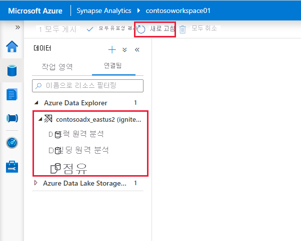
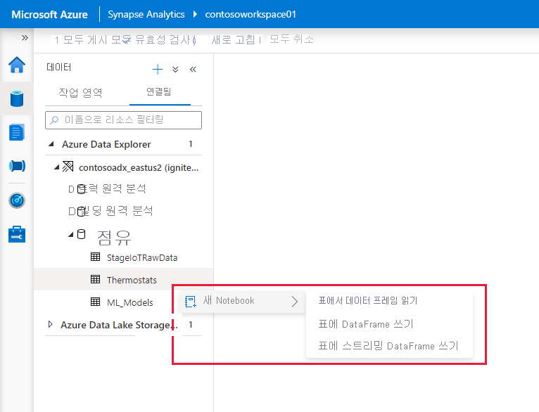

# Synapse Apache Spark를 사용하여 Azure Data Explorer에 연결

이 문서에서는 Synapse Apache Spark를 사용하여 Synapse Studio에서 Azure Data Explorer 데이터베이스에 액세스하는 방법에 대해 설명합니다. 

## 필수 구성 요소

* [Azure Data Explorer 클러스터 및 데이터베이스 만들기](/azure/data-explorer/create-cluster-database-portal).
* 이 [빠른 시작](./quickstart-create-workspace.md)에 따라 기존 Synapse 작업 영역을 만들거나 새 작업 영역을 만듭니다. 
* 기존 Synapse Apache Spark 풀을 사용하거나 이 [빠른 시작](./quickstart-create-apache-spark-pool-portal.md)에 따라 새 풀을 만듭니다.
* [Azure AD 애플리케이션을 프로비저닝하여 Azure AD 앱을 만듭니다.](/azure/data-explorer/kusto/management/access-control/how-to-provision-aad-app)
* [Azure Data Explorer 데이터베이스 권한 관리](/azure/data-explorer/manage-database-permissions)에 따라 데이터베이스 액세스 권한을 Azure AD 앱에 부여합니다.

## Synapse Studio로 이동

Synapse 작업 영역에서 **Synapse Studio 시작**을 선택합니다. Synapse Studio 홈페이지에서 **데이터**를 선택합니다. 그러면 **데이터 개체 탐색기**로 이동합니다.

## Synapse 작업 영역에 Azure Data Explorer 데이터베이스 연결

Azure Data Explorer 데이터베이스를 작업 영역에 연결하는 작업은 연결된 서비스를 통해 수행됩니다. Azure Data Explorer 연결된 서비스를 사용하면 사용자가 Azure Synapse Analytics용 Apache Spark에서 데이터를 찾아보고, 검색하고, 읽고, 쓰고 파이프라인에서 통합 작업을 실행할 수 있습니다.

데이터 개체 탐색기에서 다음 단계에 따라 Azure Data Explorer 클러스터를 직접 연결합니다.

1. 데이터 근처 **+** 아이콘을 선택합니다.
2. 외부 데이터에 대한 **연결**을 선택합니다.
3. **Azure Data Explorer(Kusto)** 를 선택합니다.
5. **계속**을 선택합니다.
6. 연결된 서비스 이름을 지정합니다. 이름은 개체 탐색기에 표시되며, Synapse 런타임에서 데이터베이스에 연결하는 데 사용됩니다. 친숙한 이름을 사용하는 것이 좋습니다.
7. 구독에서 Azure Data Explorer 클러스터를 선택하거나 URI를 입력합니다.
8. "서비스 주체 ID" 및 "서비스 주체 키"를 입력합니다(이 서비스 주체에게 읽기 작업의 데이터베이스에 대한 보기 액세스 권한 및 데이터 수집에 대한 수집기 액세스 권한이 있는지 확인).
9. Azure Data Explorer 데이터베이스 이름을 입력합니다.
10. **연결 테스트**를 클릭하여 올바른 사용 권한이 있는지 확인합니다.
11. **만들기**

    

    > [!NOTE]
    > (선택 사항) 연결 테스트는 쓰기 액세스의 유효성을 검사하지 않으므로 Azure Data Explorer 데이터베이스에 대한 쓰기 액세스 권한이 서비스 주체 ID에 있는지 확인합니다.

12. Azure Data Explorer 클러스터 및 데이터베이스는 Azure Data Explorer 섹션의 **연결됨** 탭 아래에 표시됩니다. 

    

    > [!NOTE] 
    > 현재 릴리스에서 데이터베이스 개체는 Azure Data Explorer 데이터베이스에 대한 AAD 계정 권한에 따라 채워집니다. Apache Spark Notebook 또는 통합 작업을 실행하는 경우 연결된 서비스의 자격 증명(예: 서비스 주체)이 사용됩니다.

## 코드 생성 작업과 빠르게 상호 작용

* 마우스 오른쪽 단추로 데이터베이스 또는 테이블을 클릭하면 데이터를 읽고, 쓰고, Azure Data Explorer로 스트림하는 Spark Notebook 샘플을 트리거하는 제스처 목록이 표시됩니다. 
    

* 데이터를 읽는 예는 다음과 같습니다. Notebook을 Spark 풀에 연결하고,  셀을 실행합니다.

   > [!NOTE] 
   > 처음 실행하는 경우 Spark 세션을 시작하는 데 3분 넘게 걸릴 수 있습니다. 이후 실행은 훨씬 더 빠릅니다.  

## 제한 사항
Azure Data Explorer 커넥터는 현재 Azure Synapse 관리형 VNET에서 지원되지 않습니다.

## 다음 단계

* [고급 옵션을 사용하는 샘플 코드](https://github.com/Azure/azure-kusto-spark/blob/master/samples/src/main/python/SynapseSample.py)
* [Azure Data Explorer(Kusto) Spark 커넥터](https://github.com/Azure/azure-kusto-spark)