# 빠른 시작: Synapse Studio를 사용하여 Apache Spark 풀(미리 보기) 만들기

Azure Synapse Analytics는 데이터를 수집, 변환, 모델링, 분석 및 제공하는 데 도움이 되는 다양한 분석 엔진을 제공합니다. Apache Spark 풀은 오픈 소스 빅 데이터 컴퓨팅 기능을 제공합니다. Synapse 작업 영역에서 Apache Spark 풀을 만든 후에는 데이터를 로드, 모델링, 처리 및 제공하여 인사이트를 얻을 수 있습니다.  

이 빠른 시작에서는 Synapse Studio를 사용하여 Synapse 작업 영역에 Apache Spark 풀을 만드는 단계를 설명합니다.

> [!IMPORTANT]
> Spark 인스턴스 요금은 인스턴스 사용 여부에 관계없이 분 단위 비례 배분 방식으로 청구됩니다. Spark 인스턴스를 사용한 후 꼭 인스턴스를 종료하거나 짧은 시간 제한을 설정해야 합니다. 자세한 내용은 이 문서의 **리소스 정리** 섹션을 참조하세요.

Azure 구독이 없는 경우 [시작하기 전에 체험 계정을 만듭니다](https://azure.microsoft.com/free/).

## 사전 요구 사항

- Azure 구독 - [체험 구독 만들기](https://azure.microsoft.com/free/)
- [Synapse 작업 영역](./quickstart-create-workspace.md)

## Azure Portal에 로그인

[Azure 포털](https://portal.azure.com/)

## Synapse 작업 영역으로 이동

1. 검색 창에 서비스 이름(또는 리소스 이름)을 직접 입력하여 Apache Spark 풀이 생성될 때 Synapse 작업 영역으로 이동합니다.
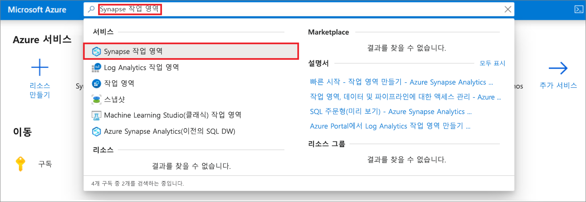
1. 작업 영역 목록에서 열려는 작업 영역의 이름(또는 이름의 일부)을 입력합니다. 이 예제에서는 **contosoanalytics**라는 작업 영역을 사용합니다.
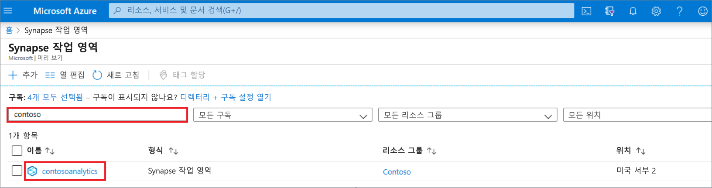

## Synapse Studio 시작 

1. 작업 영역 개요에서 **Synapse Studio 시작**을 선택하여 Apache Spark 풀을 만들 위치를 엽니다. 서비스 이름 또는 리소스 이름을 검색 창에 직접 입력합니다.
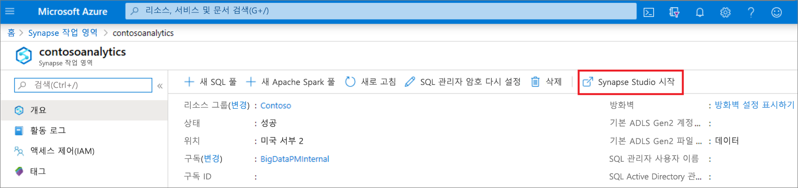

## Synapse Studio에서 Apache Spark 풀 만들기

1. Synapse Studio 홈 페이지의 왼쪽 탐색 영역에서 **관리** 아이콘을 선택하여 **관리 허브**로 이동합니다.
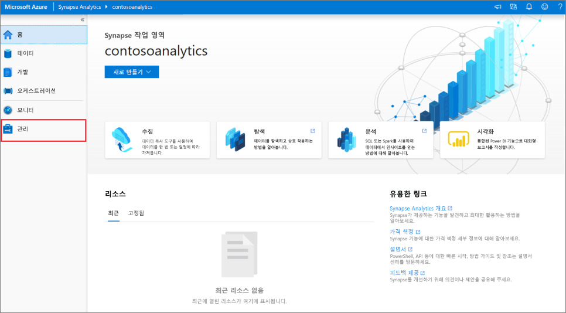

1. 관리 허브에서 **Apache Spark 풀** 섹션으로 이동하여 작업 영역에서 사용할 수 있는 Apache Spark 풀의 현재 목록을 확인합니다.
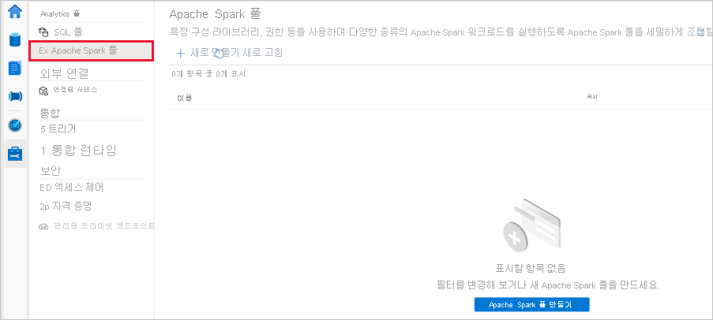

1. **+ 새로 만들기**를 선택하면 새 Apache Spark 풀 만들기 마법사가 나타납니다. 
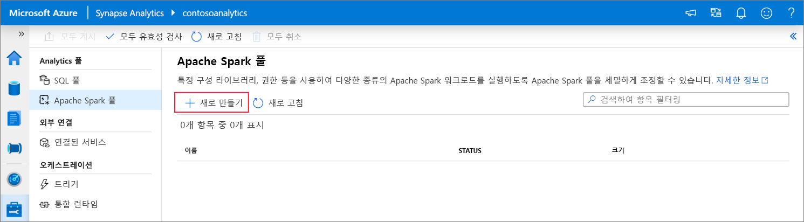

1. **기본 사항** 탭에서 다음 정보를 입력합니다.

    | 설정 | 제안 값 | Description |
    | :------ | :-------------- | :---------- |
    | **Apache Spark 풀 이름** | contosospark | Apache Spark 풀이 사용할 이름입니다. |
    | **노드 크기** | 작음(4 vCPU/32GB) | 이 빠른 시작에서는 비용을 줄이기 위해 이 값을 가장 작은 크기로 설정합니다. |
    | **Autoscale** | 사용 안 함 | 이 빠른 시작에 자동 크기 조정이 필요하지 않습니다. |
    | **노드 수** | 8 | 이 빠른 시작에 대한 비용을 제한하려면 작은 크기를 사용합니다.|
    
    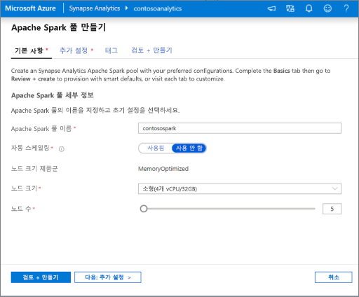
    > [!IMPORTANT]
    > Apache Spark 풀이 사용할 수 있는 이름과 관련된 제한 사항이 있습니다. 이름은 문자 또는 숫자만 포함해야 하고, 15자 이하여야 하고, 문자로 시작하고 예약어를 포함하지 않아야 하고, 작업 영역에서 고유해야 합니다.

1. 다음 탭(추가 설정)에서 모든 기본값을 그대로 두고 **검토 + 만들기**를 누릅니다(태그를 추가하지 않음).
 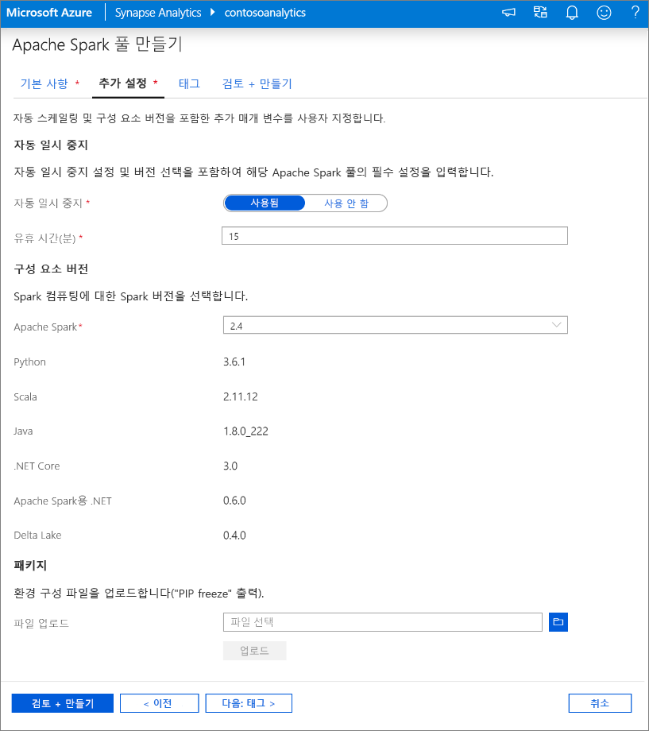

1. 지금은 태그를 추가하지 않을 것이므로 **검토 + 만들기**를 누릅니다.

1. **검토 + 만들기** 탭에서 이전에 입력한 내용에 따라 세부 정보가 올바른지 확인하고 **만들기**를 누릅니다. 
 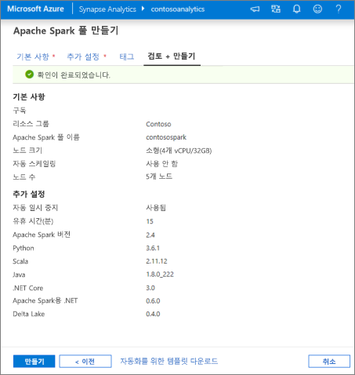

1. Apache Spark 풀이 프로비저닝 프로세스를 시작합니다.
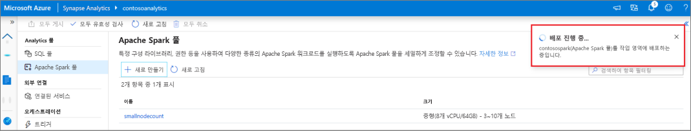

1. 프로비저닝이 완료되면 새 Apache Spark 풀이 목록에 표시됩니다.
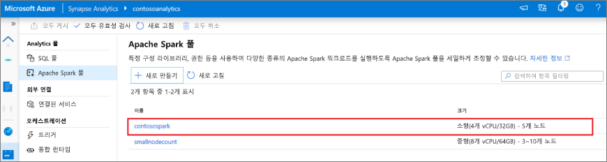

## Synapse Studio를 사용하여 Apache Spark 풀 리소스 정리

Synapse Studio를 사용하여 작업 영역에서 Apache Spark 풀을 삭제하려면 다음 단계를 수행합니다.
> [!WARNING]
> Spark 풀을 삭제하면 작업 영역에서 분석 엔진이 제거됩니다. 그러면 더 이상 풀에 연결할 수 없으며, 이 Spark 풀을 사용하는 모든 쿼리, 파이프라인 및 Notebook은 더 이상 작동하지 않습니다.

Apache Spark 풀을 삭제하려면 다음을 수행합니다.

1. Synapse Studio에서 관리 허브의 Apache Spark 풀로 이동합니다.
1. 삭제할 Apache 풀(이 경우 **contosospark**) 옆에 있는 줄임표를 선택하여 Apache Spark 풀에 대한 명령을 표시합니다.
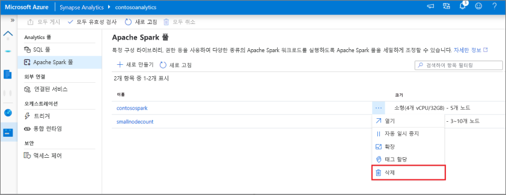
1. **삭제**를 누릅니다.
1. 삭제를 확인하고 **삭제** 단추를 누릅니다.
 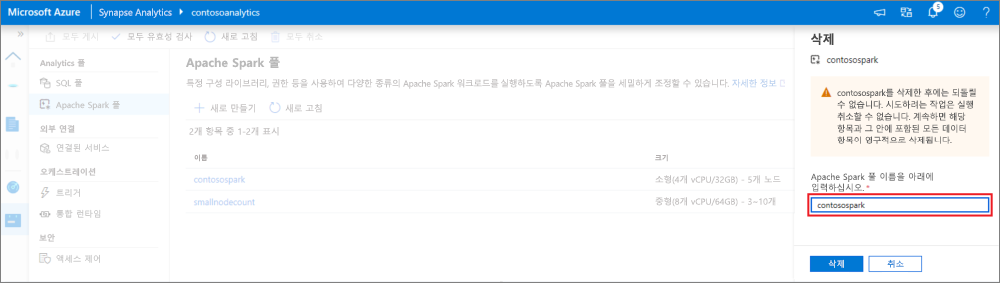
1. 프로세스가 성공적으로 완료되면 Apache Spark 풀이 작업 영역 리소스에 더 이상 나열되지 않습니다. 

## 다음 단계

- [빠른 시작: 웹 도구를 사용하여 Synapse Studio에서 Apache Spark 풀 만들기](quickstart-apache-spark-notebook.md)를 참조하세요.
- [빠른 시작: Azure Portal을 사용하여 Apache Spark 풀 만들기](quickstart-create-apache-spark-pool-portal.md)를 참조하세요.