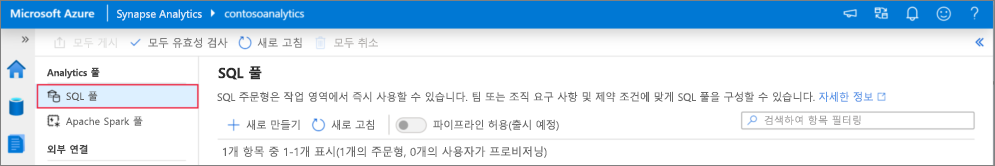
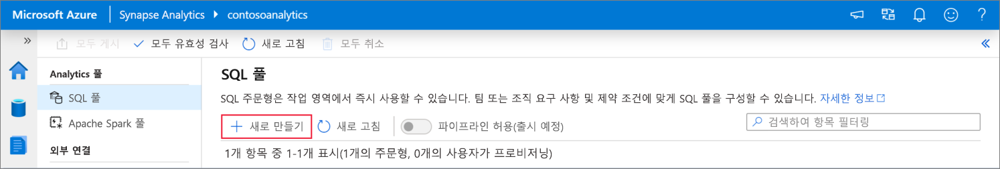
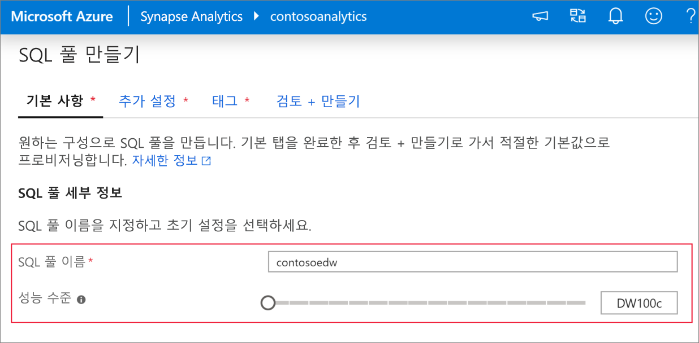
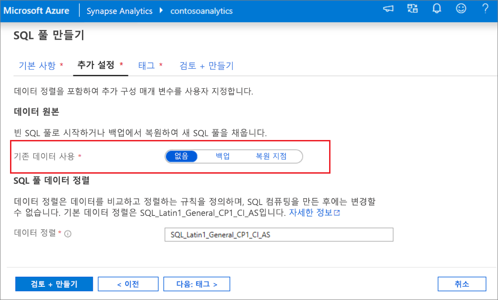
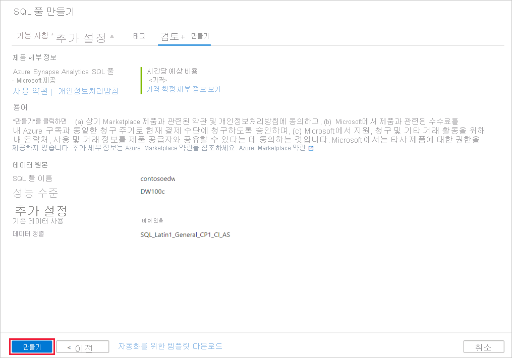
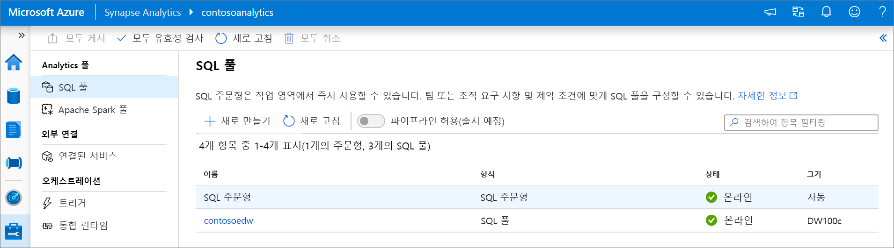
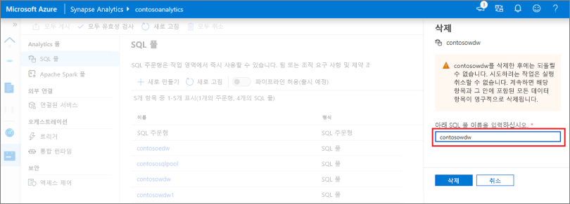

# 빠른 시작: Synapse Studio를 사용하여 Synapse SQL 풀(미리 보기) 만들기

Azure Synapse Analytics는 데이터를 수집, 변환, 모델링 및 분석하는 데 도움이 되는 다양한 분석 엔진을 제공합니다. SQL 풀은 T-SQL 기반 컴퓨팅 및 스토리지 기능을 제공합니다. Synapse 작업 영역에서 SQL 풀을 만든 후 보다 빠른 인사이트를 위해 데이터를 로드, 모델링, 처리 및 전달할 수 있습니다.

이 빠른 시작에서는 Synapse Studio를 사용하여 Synapse 작업 영역에 SQL 풀을 만드는 단계를 설명합니다.

Azure 구독이 없는 경우 [시작하기 전에 체험 계정을 만듭니다](https://azure.microsoft.com/free/).

## 필수 구성 요소

- Azure 구독 - [체험 구독 만들기](https://azure.microsoft.com/free/)
- [Synapse 작업 영역](quickstart-create-workspace.md)

## Azure Portal에 로그인

[Azure 포털](https://portal.azure.com/)

## Synapse 작업 영역으로 이동

1. 검색 창에 서비스 이름(또는 리소스 이름)을 직접 입력하여 SQL 풀이 생성될 때 Synapse 작업 영역으로 이동합니다.

1. 작업 영역 목록에서 열려는 작업 영역의 이름(또는 이름의 일부)을 입력합니다. 이 예제에서는 **contosoanalytics**라는 작업 영역을 사용합니다.

## Synapse Studio 시작

1. 작업 영역 개요에서 **Synapse Studio 시작**을 선택하여 SQL 풀을 만들 위치를 엽니다. 서비스 이름 또는 리소스 이름을 검색 창에 직접 입력합니다.

## Synapse Studio에서 SQL 풀 만들기

1. Synapse Studio 홈 페이지의 왼쪽 탐색 영역에서 **관리** 아이콘을 선택하여 **관리 허브**로 이동합니다.

1. 관리 허브에서 **SQL 풀** 섹션으로 이동하여 작업 영역에서 사용할 수 있는 SQL 풀의 현재 목록을 확인합니다.

1. **+ 새로 만들기**를 선택하면 새 SQL 풀 만들기 마법사가 나타납니다. 

1. **기본 사항** 탭에서 다음 정보를 입력합니다.

    | 설정 | 제안 값 | Description |
    | :------ | :-------------- | :---------- |
    | **SQL 풀 이름** | contosoedw | SQL 풀이 사용할 이름입니다. |
    | **성능 수준** | DW100c | 이 빠른 시작에서는 비용을 줄이기 위해 이 값을 가장 작은 크기로 설정합니다. |

    
    > [!IMPORTANT]
    > SQL 풀이 사용할 수 있는 이름과 관련된 제한 사항이 있습니다. 이름은 특수 문자를 포함할 수 없고, 15자 이하여야 하고, 예약어를 포함할 수 없고, 작업 영역에서 고유해야 합니다.

4. 다음 탭 **추가 설정**에서 **없음**을 선택하여 데이터 없이 SQL 풀을 프로비저닝합니다. 기본 데이터 정렬을 선택한 상태로 둡니다.

1. 지금은 태그를 추가하지 않을 것이므로 **다음: 리뷰 + 만들기**를 클릭합니다.

1. **검토 + 만들기** 탭에서 이전에 입력한 내용에 따라 세부 정보가 올바른지 확인하고 **만들기**를 누릅니다. 

1. 이제 리소스 프로비저닝 흐름이 시작됩니다.

1. 프로비전이 완료된 후 작업 영역으로 돌아가면 새로 만든 SQL 풀에 대한 새 항목이 표시됩니다.
 

1. SQL 풀이 만들어지면 작업 영역에서 데이터를 로드하고, 스트림을 처리하고, 레이크에서 데이터를 읽는 등에 사용할 수 있습니다.

## Synapse Studio를 사용하여 SQL 풀 정리    

Synapse Studio를 사용하여 작업 영역에서 SQL 풀을 삭제하려면 다음 단계를 수행합니다.
> [!WARNING]
> SQL 풀을 삭제하면 작업 영역에서 분석 엔진이 제거됩니다. 그러면 더 이상 풀에 연결할 수 없으며, 이 SQL 풀을 사용하는 모든 쿼리, 파이프라인, 스크립트가 더 이상 작동하지 않습니다.

SQL 풀을 삭제하려면 다음을 수행합니다.

1. Synapse Studio에서 관리 허브의 SQL 풀로 이동합니다.
1. 삭제할 SQL 풀(이 경우에는 **contosoedw**)에서 줄임표를 선택하여 SQL 풀 명령을 표시합니다. 
1. **삭제**를 누릅니다.
1. 삭제를 확인하고 **삭제** 단추를 누릅니다.
 
1. 프로세스가 성공적으로 완료되면 SQL 풀이 작업 영역 리소스에 더 이상 나열되지 않습니다.

## 다음 단계 
- [빠른 시작: Apache Spark Notebook 만들기](quickstart-apache-spark-notebook.md)를 참조하세요.
- [빠른 시작: Azure Portal을 사용하여 Synapse SQL 풀 만들기](quickstart-create-sql-pool-portal.md)를 참조하세요.