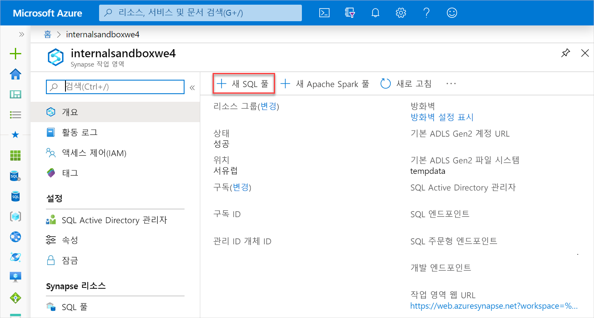
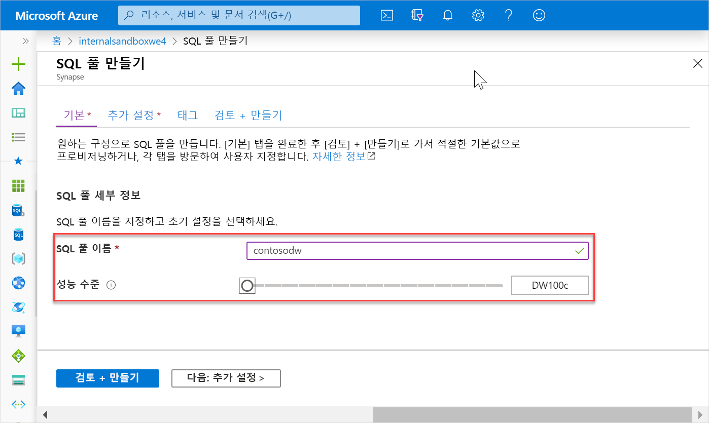
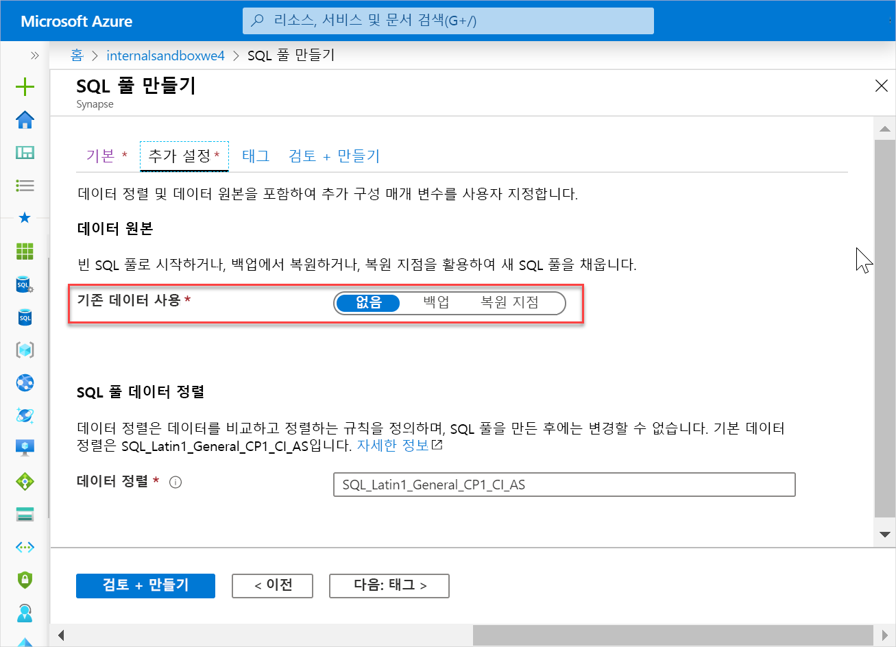
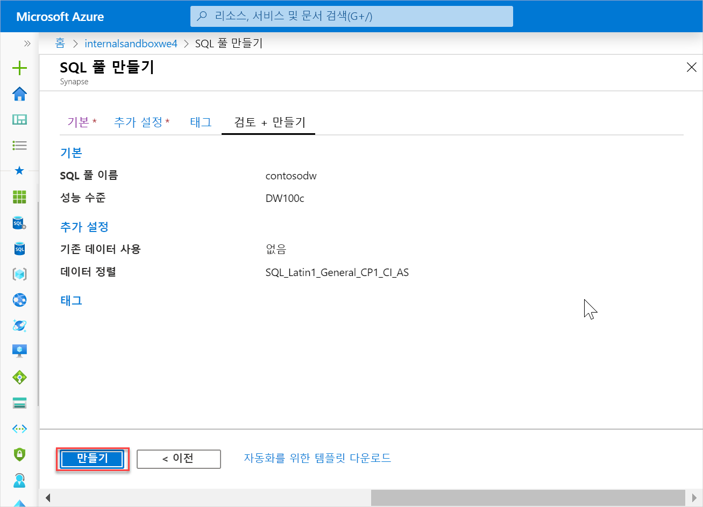
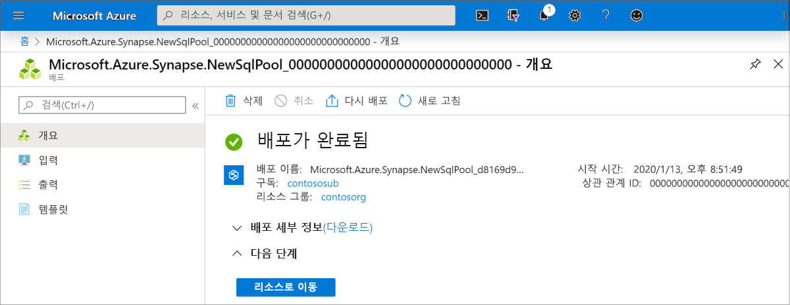
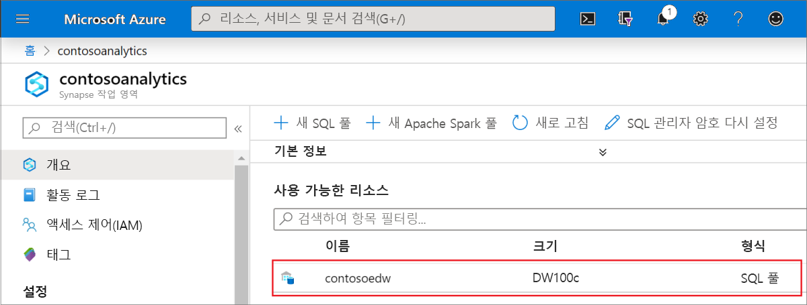
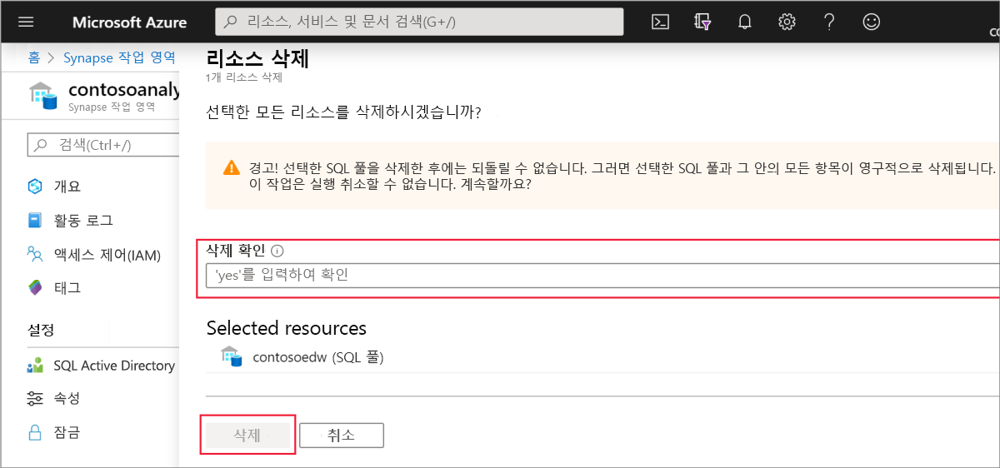

# 빠른 시작: Synapse SQL 풀 만들기

Azure Synapse Analytics는 데이터를 수집, 변환, 모델링, 분석 및 제공하는 데 도움이 되는 다양한 분석 엔진을 제공합니다. SQL 풀은 T-SQL 기반 컴퓨팅 및 스토리지 기능을 제공합니다. Synapse 작업 영역에서 SQL 풀을 만든 후에는 데이터를 로드, 모델링, 처리 및 제공하여 인사이트를 얻을 수 있습니다.

이 빠른 시작에서는 Azure Portal을 사용하여 Synapse 작업 영역에 SQL 풀을 만드는 방법을 배웁니다.

Azure 구독이 없는 경우 [시작하기 전에 체험 계정을 만듭니다](https://azure.microsoft.com/free/).

## 사전 요구 사항

[Synapse 작업 영역](quickstart-create-workspace.md)

## Azure Portal에 로그인

[Azure 포털](https://portal.azure.com/)

## 새 SQL 풀 만들기

1. SQL 풀을 만들려는 Synapse 작업 영역의 위쪽 표시줄에서 **새 SQL 풀** 명령을 클릭합니다.

2. **기본 사항** 탭에서 다음 정보를 입력합니다.

    | 설정 | 제안 값 | Description |
    | :------ | :-------------- | :---------- |
    | **SQL 풀 이름** | 유효한 이름 | SQL 풀 이름입니다. |
    | **성능 수준** | DW100c | 이 빠른 시작에서는 비용을 줄이기 위해 이 값을 가장 작은 크기로 설정합니다. |
    ||||
  
    
    > [!IMPORTANT]
    > SQL 풀이 사용할 수 있는 이름과 관련된 제한 사항이 있습니다. 이름은 특수 문자를 포함할 수 없고, 15자 이하여야 하고, 예약어를 포함할 수 없고, 작업 영역에서 고유해야 합니다.

3. **다음: 추가 설정**을 선택하여 사용자 지정 설정을 더 많이 구성합니다.
4. **없음**을 선택하여 데이터 없이 SQL 풀을 프로비저닝합니다. 기본 데이터 정렬을 선택한 상태로 둡니다.

5. **검토 + 만들기**를 클릭합니다.
6. 이전에 입력한 내용에 따라 세부 정보가 올바른지 확인하고 **만들기**를 클릭합니다.

7. 이제 리소스 프로비저닝 흐름이 시작됩니다.
 

8. 프로비전이 완료된 후 작업 영역으로 돌아가면 새로 만든 SQL 풀에 대한 새 항목이 표시됩니다.
 

## 리소스 정리

작업 영역에서 SQL 풀을 삭제하려면 다음 단계를 수행합니다.
> [!WARNING]
> SQL 풀을 삭제하면 분석 엔진과 삭제된 SQL 풀의 데이터베이스에 저장된 데이터가 작업 영역에서 모두 제거됩니다. 그러면 더 이상 SQL 풀에 연결할 수 없으며, 이 SQL 풀에 대한 읽기 또는 쓰기 권한이 있는 모든 쿼리, 파이프라인 및 Notebook은 더 이상 작동하지 않습니다.

SQL 풀을 삭제하려면 다음 단계를 완료합니다.

1. 작업 영역에서 SQL 풀 블레이드로 이동합니다.
1. 삭제할 SQL 풀을 선택합니다(여기서는 **contosoedw**).
1. 선택한 다음 **삭제**를 누릅니다.
1. 삭제를 확인하고 **삭제** 단추를 누릅니다.
 
1. 프로세스가 성공적으로 완료되면 SQL 풀이 작업 영역 리소스에 더 이상 나열되지 않습니다.

SQL 풀이 만들어지면 작업 영역에서 데이터를 로드하고, 스트림을 처리하고, 레이크에서 데이터를 읽는 등에 사용할 수 있습니다.

## 다음 단계

- [빠른 시작: 웹 도구를 사용하여 Synapse Studio에서 Apache Spark 풀 만들기](quickstart-apache-spark-notebook.md)를 참조하세요.
- [빠른 시작: Azure Portal을 사용하여 Apache Spark 풀 만들기](quickstart-create-apache-spark-pool.md)를 참조하세요.
