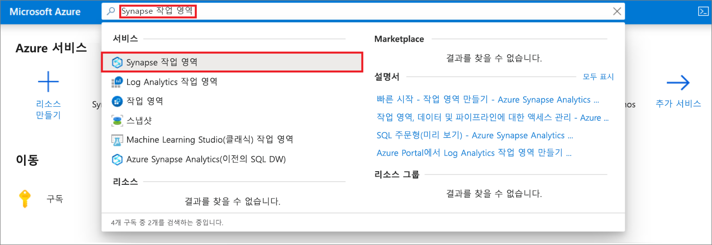
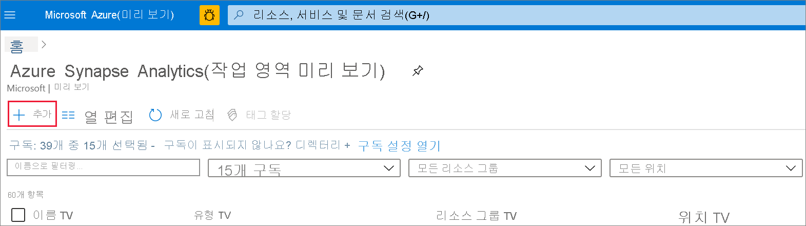
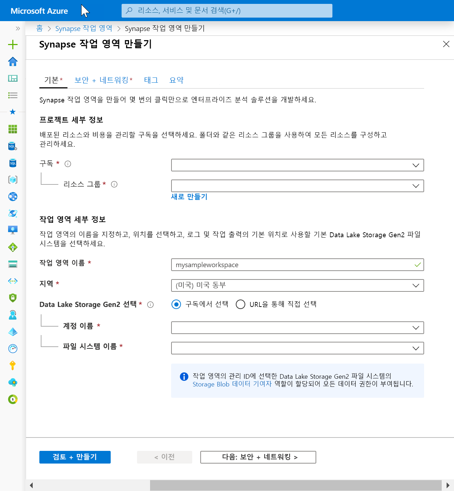
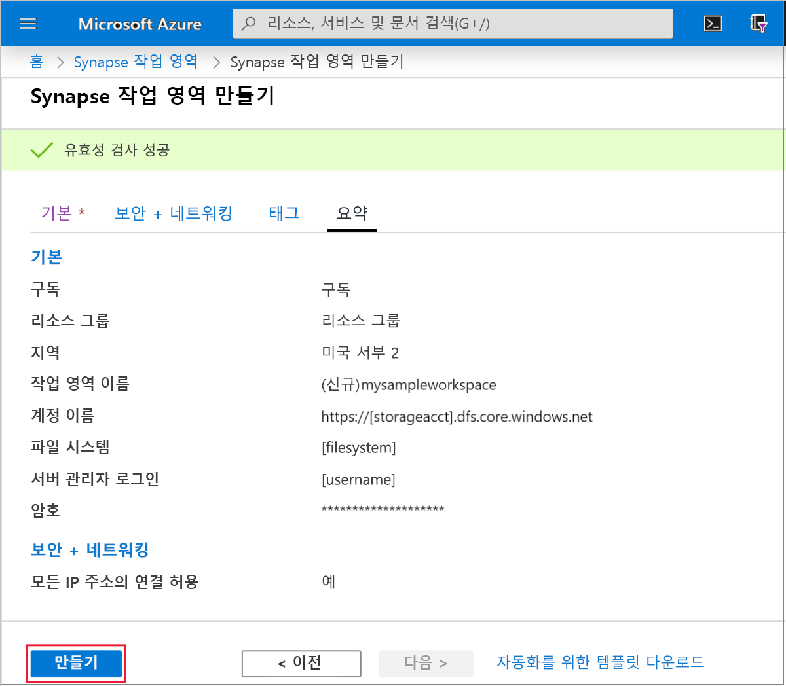
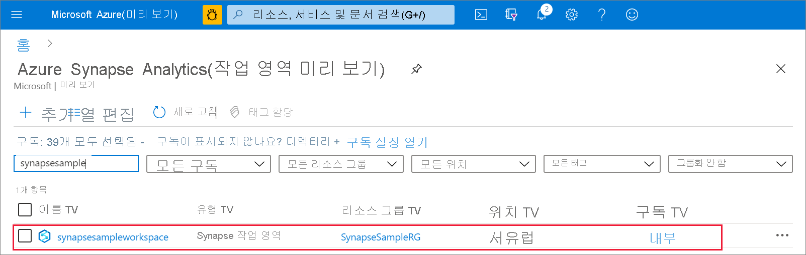
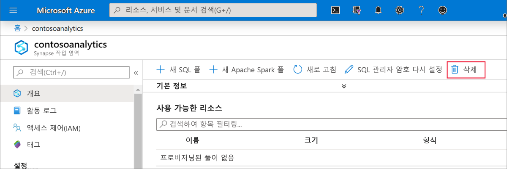
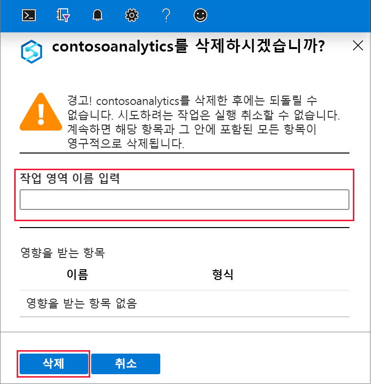

# 빠른 시작: Synapse 작업 영역 만들기

이 빠른 시작에서는 Azure Portal을 사용하여 Azure Synapse 작업 영역을 만드는 단계를 설명합니다.

Azure 구독이 없는 경우 [시작하기 전에 체험 계정을 만듭니다](https://azure.microsoft.com/free/).

## 필수 구성 요소

- [Azure Data Lake Storage Gen2 스토리지 계정](../storage/common/storage-account-create.md?toc=/azure/synapse-analytics/toc.json&bc=/azure/synapse-analytics/breadcrumb/toc.json)

## Azure Portal에 로그인

[Azure 포털](https://portal.azure.com/)

## Azure Portal을 사용하여 Azure Synapse 작업 영역 만들기

1. Microsoft Azure 검색 창에 **Synapse 작업 영역**을 입력하고 이 서비스를 선택합니다.

2. **Synapse 작업 영역** 페이지에서 **+ 추가**를 클릭합니다.

3. **Azure Synapse 작업 영역** 양식에 다음 정보를 입력합니다.

    | 설정 | 제안 값 | Description |
    | :------ | :-------------- | :---------- |
    | **구독** | *구독* | 구독에 대한 자세한 내용은 [구독](https://account.windowsazure.com/Subscriptions)을 참조하세요. |
    | **리소스 그룹** | *리소스 그룹* | 유효한 리소스 그룹 이름은 [명명 규칙 및 제한 사항](/azure/architecture/best-practices/resource-naming?toc=/azure/synapse-analytics/toc.json&bc=/azure/synapse-analytics/breadcrumb/toc.json&view=azure-sqldw-latest)을 참조하세요. |
    | **작업 영역 이름** | mysampleworkspace | 작업 영역의 이름을 지정합니다. 이 이름은 연결 엔드포인트에도 사용됩니다.|
    | **지역** | 미국 동부2 | 작업 영역의 위치를 지정합니다.|
    | **Data Lake Storage Gen2** | 계정: `storage account name`   파일 시스템: `root file system to use` | 기본 스토리지로 사용할 ADLS Gen2 스토리지 계정과 사용할 파일 시스템을 지정합니다.|
    ||||

    

    스토리지 계정은 다음 위치에서 선택할 수 있습니다.
    - 해당 구독에서 사용할 수 있는 ADLS Gen2 계정 목록
    - 계정 이름을 사용하여 수동으로 입력

    > [!IMPORTANT]
    > 선택한 ADLS Gen2 계정을 Azure Synapse 작업 영역에서 읽고 쓸 수 있어야 합니다. 또한 기본 스토리지 계정으로 연결하는 모든 스토리지 계정의 경우 스토리지 계정을 만들 때 **계층 구조 네임스페이스**를 사용하도록 설정해야 합니다.
    >
    > ADLS Gen2 선택 필드 아래에서 작업 영역의 관리 ID에는 선택한 Data Lake Storage Gen2 파일 시스템에 대한 **Storage Blob 데이터 기여자** 역할이 할당되어 모든 액세스 권한이 부여된다는 내용이 표시됩니다.

4. (선택 사항) **보안 + 네트워킹 기본값** 탭을 수정합니다.
5. (선택 사항) **태그** 탭에서 태그를 추가합니다.
6. **요약** 탭에서는 작업 영역을 만들 수 있도록 필수 유효성 검사가 실행됩니다. 유효성 검사가 성공하면 **만들기** 
7. 리소스 프로비저닝 프로세스가 성공적으로 완료되면 생성된 작업 영역의 항목이 Synapse 작업 영역 목록에 표시됩니다. 

## 리소스 정리

Azure Synapse 작업 영역을 삭제하려면 다음 단계를 수행합니다.
> [!WARNING]
> Azure Synapse 작업 영역을 삭제하면 포함된 SQL 풀 및 작업 영역 메타데이터 데이터베이스에 저장된 분석 엔진과 데이터가 제거됩니다. 더 이상 SQL 엔드포인트, Apache Spark 엔드포인트에 연결할 수 없게 됩니다. 모든 코드 아티팩트(쿼리, Notebook, 작업 정의 및 파이프라인)가 삭제됩니다.
>
> 작업 영역을 삭제해도 작업 영역에 연결된 Data Lake Store Gen2의 데이터에는 영향을 주지 **않습니다**.

Azure Synapse 작업 영역을 삭제하려면 다음 단계를 완료합니다.

1. 삭제하려는 Azure Synapse 작업 영역으로 이동합니다.
1. 명령 모음에서 **삭제**를 누릅니다.
 
1. 삭제를 확인하고 **삭제** 단추를 누릅니다.
 
1. 프로세스가 성공적으로 완료되면 Azure Synapse 작업 영역이 작업 영역 목록에 더 이상 나열되지 않습니다.

## 다음 단계

다음으로 [SQL 풀 만들기](quickstart-create-sql-pool-studio.md) 또는 [Apache Spark 풀 만들기](quickstart-create-apache-spark-pool-studio.md)를 수행하여 데이터를 분석하고 살펴볼 수 있습니다.
