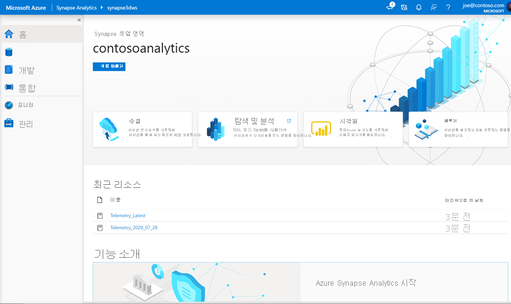
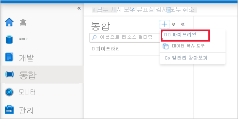

# <a name="quickstart-transform-data-using-mapping-data-flows"></a>빠른 시작: 매핑 데이터 흐름을 사용 하 여 데이터 변환

이 빠른 시작에서는 Azure Synapse Analytics를 사용 하 여 데이터 흐름 매핑을 사용 하 여 Azure Data Lake Storage Gen2 (ADLS Gen2) 원본의 데이터를 ADLS Gen2 싱크로 변환 하는 파이프라인을 만듭니다. 이 빠른 시작의 구성 패턴은 데이터 흐름 매핑을 사용 하 여 데이터를 변환할 때 확장 될 수 있습니다.

이 빠른 시작에서는 다음 단계를 수행 합니다.

> [!div class="checklist"]
> * Azure Synapse Analytics에서 데이터 흐름 작업을 사용 하 여 파이프라인을 만듭니다.
> * 네 가지 변환으로 매핑 데이터 흐름을 작성 합니다.
> * 파이프라인 실행 테스트
> * 데이터 흐름 작업 모니터링

## <a name="prerequisites"></a>필수 구성 요소

* **Azure 구독**: Azure 구독이 아직 없는 경우 시작하기 전에 [체험 계정](https://azure.microsoft.com/free/)을 만듭니다.
* **Azure Synapse 작업 영역**: [빠른 시작: Synapse 작업 영역 만들기](quickstart-create-workspace.md)의 지침에 따라 Azure Portal를 사용 하 여 Synapse 작업 영역을 만듭니다.
* **Azure storage 계정**: ADLS 저장소를 *원본* 및 *싱크* 데이터 저장소로 사용 합니다. 스토리지 계정이 없는 경우 [Azure Storage 계정 만들기](../storage/common/storage-account-create.md)를 참조하세요.

    이 자습서에서 변형 하는 파일은 [여기](https://raw.githubusercontent.com/djpmsft/adf-ready-demo/master/moviesDB.csv)에서 찾을 수 있는 MoviesDB.csv 되었습니다. GitHub에서 파일을 검색 하려면 해당 내용을 원하는 텍스트 편집기에 복사 하 여 로컬에 .csv 파일로 저장 합니다. 저장소 계정에 파일을 업로드 하려면 [Azure Portal을 사용 하 여 Blob 업로드](../storage/blobs/storage-quickstart-blobs-portal.md)를 참조 하세요. 예제는 ' sample-s t r i n s ' 라는 컨테이너를 참조 합니다.

### <a name="navigate-to-the-synapse-studio"></a>Synapse Studio로 이동

Azure Synapse 작업 영역이 만들어지면 다음 두 가지 방법으로 Synapse Studio를 열 수 있습니다.

* [Azure Portal](https://ms.portal.azure.com/#home)에서 Synapse 작업 영역을 엽니다. 시작 아래에서 open Synapse Studio 카드에서 **열기** 를 선택 합니다.
* [Azure Synapse Analytics](https://web.azuresynapse.net/)를 열고, 작업 영역에 로그인합니다.

이 빠른 시작에서는 "adftest2020"이라는 작업 영역을 예로 사용합니다. 그러면 자동으로 Synapse Studio 홈 페이지로 이동합니다.



## <a name="create-a-pipeline-with-a-data-flow-activity"></a>데이터 흐름 작업을 사용 하 여 파이프라인 만들기

파이프라인에는 일련의 활동을 실행하기 위한 논리적 흐름이 포함됩니다. 이 섹션에서는 데이터 흐름 작업을 포함 하는 파이프라인을 만듭니다.

1. **통합** 탭으로 이동합니다. 파이프라인 헤더 옆에 있는 더하기 아이콘, [파이프라인]을 차례로 선택합니다.

   

1. 파이프라인의 **속성** 설정 페이지에서 **이름** 에 **TransformMovies** 을 입력 합니다.

1. *작업* 창의 *이동 및 변환* 에서 **데이터 흐름** 을 파이프라인 캔버스로 끌어 옵니다.

1. **데이터 흐름 페이지 추가** 팝업에서 **새 데이터 흐름**  ->  **데이터 흐름** 만들기를 선택 합니다. 완료되면 **확인** 을 클릭합니다.

   

1. **속성** 페이지에서 데이터 흐름의 이름을 **TransformMovies** 로 설정 합니다.

## <a name="build-transformation-logic-in-the-data-flow-canvas"></a>데이터 흐름 캔버스의 빌드 변환 논리

데이터 흐름을 만들면 데이터 흐름 캔버스로 자동으로 전송 됩니다. 이 단계에서는 ADLS 저장소에서 MoviesDB.csv를 사용 하 고 1910에서 2000로의 평균 등급을 집계 하는 데이터 흐름을 작성 합니다. 그런 다음이 파일을 ADLS 저장소에 다시 작성 합니다.

1. 데이터 흐름 캔버스 위에서의 **데이터 흐름 디버그** 슬라이더를 밉니다. 디버그 모드에서는 라이브 Spark 클러스터에 대 한 변환 논리의 대화형 테스트를 수행할 수 있습니다. 데이터 흐름 클러스터는 준비 하는 데 5-7 분 정도 걸리며, 사용자가 데이터 흐름 개발을 수행할 계획인 경우 먼저 디버그를 설정 하는 것이 좋습니다. 자세한 내용은 [디버그 모드](https://docs.microsoft.com/azure/data-factory/concepts-data-flow-debug-mode?toc=/azure/synapse-analytics/toc.json&bc=/azure/synapse-analytics/breadcrumb/toc.json)를 참조하세요.

    

1. 데이터 흐름 캔버스에서 **원본 추가** 상자를 클릭 하 여 원본을 추가 합니다.

1. 원본 이름을 **MoviesDB** 로 합니다. **새로 만들기를 클릭 하 여** 새 원본 데이터 집합을 만듭니다.

    

1. **Azure Data Lake Storage Gen2** 를 선택 합니다. 계속을 클릭합니다.

    

1. **DelimitedText** 를 선택 합니다. 계속을 클릭합니다.

1. 데이터 집합의 이름을 **MoviesDB** 로 합니다. 연결 된 서비스 드롭다운에서 **새로 만들기** 를 선택 합니다.

1. 연결 된 서비스 만들기 화면에서 ADLS Gen2 연결 된 서비스 **ADLSGen2** 의 이름을 지정 하 고 인증 방법을 지정 합니다. 그런 다음 연결 자격 증명을 입력 합니다. 이 빠른 시작에서는 계정 키를 사용 하 여 저장소 계정에 연결 합니다. **연결 테스트** 를 클릭 하 여 자격 증명이 올바르게 입력 되었는지 확인할 수 있습니다. 작업을 마쳤으면 **만들기** 를 클릭합니다.

    

1. 데이터 집합 만들기 화면에 다시 돌아와 **파일 경로** 필드에 파일이 있는 위치를 입력 합니다. 이 빠른 시작에서 파일 "MoviesDB.csv"는 컨테이너 "샘플-데이터"에 있습니다. 파일에 헤더가 있으므로 **첫 번째 행을 헤더로** 선택 합니다. 저장소에 있는 파일에서 직접 헤더 스키마를 가져오려면 **연결/저장소에서를** 선택 합니다. 완료되면 **확인** 을 클릭합니다.

    

1. 디버그 클러스터가 시작 된 경우 원본 변환의 **데이터 미리 보기** 탭으로 이동 하 고 **새로 고침** 을 클릭 하 여 데이터의 스냅숏을 가져옵니다. 데이터 미리 보기를 사용 하 여 변환이 올바르게 구성 되었는지 확인할 수 있습니다.

    

1. 데이터 흐름 캔버스의 원본 노드 옆에 있는 더하기 아이콘을 클릭 하 여 새 변환을 추가 합니다. 추가 하는 첫 번째 변환은 **필터** 입니다.

    

1. 필터 변환의 이름을 **Filteryears** 로 합니다. **필터 설정** 옆의 식 상자를 클릭 하 여 식 작성기를 엽니다. 여기서 필터링 조건을 지정 합니다.

1. 데이터 흐름 식 작성기를 사용 하면 다양 한 변환에서 사용할 식을 대화형으로 작성할 수 있습니다. 식에는 기본 제공 함수, 입력 스키마의 열 및 사용자 정의 매개 변수가 포함 될 수 있습니다. 식을 작성 하는 방법에 대 한 자세한 내용은 [데이터 흐름 식 작성기](https://docs.microsoft.com/azure/data-factory/concepts-data-flow-expression-builder?toc=/azure/synapse-analytics/toc.json&bc=/azure/synapse-analytics/breadcrumb/toc.json)를 참조 하세요.

    이 빠른 시작에서는 1910 년과 2000 년 사이에 제공 된 장르 코미디의 영화를 필터링 하려고 합니다. 현재 연도는 문자열 이므로 함수를 사용 하 여 정수로 변환 해야 ```toInteger()``` 합니다. 다음 보다 크거나 같음 (>=) 및 작거나 같음 (<=) 연산자를 사용 하 여 리터럴 연도 값 1910 및 200을 비교 합니다. 이러한 식을 and (&&) 연산자와 결합 합니다. 식은 다음과 같이 제공 됩니다.

    ```toInteger(year) >= 1910 && toInteger(year) <= 2000```

    Comefa영화를 찾으려면 함수를 사용 하 여 ```rlike()``` 장르 열에서 ' 코미디 ' 패턴을 찾을 수 있습니다. Get과 같은 연도 비교를 사용 하 여 rlike 식을 결합 합니다.

    ```toInteger(year) >= 1910 && toInteger(year) <= 2000 && rlike(genres, 'Comedy')```

    

    디버그 클러스터가 활성 상태 이면 **새로 고침** 을 클릭 하 여 논리를 확인할 수 있습니다. 사용 된 입력에 대 한 식 출력을 볼 수 있습니다. 데이터 흐름 식 언어를 사용 하 여이 논리를 수행 하는 방법에는 두 개 이상의 올바른 대답이 있습니다.

    **저장을** 클릭 하 고 식을 사용 하 여 작업을 완료 합니다.

1. **데이터 미리 보기** 를 가져와 필터가 제대로 작동 하는지 확인 합니다.

1. 추가할 다음 변환은 **Schema modifier** 의 **집계** 변환입니다.

    

1. 집계 변환의 이름을 **AggregateComedyRatings** 로 합니다. **묶는 방법** 탭의 드롭다운에서 **year** 를 선택 하 여 해당 집계가 생성 된 연도를 기준으로 집계를 그룹화 합니다.

    

1. **집계** 탭으로 이동 합니다. 왼쪽 텍스트 상자에서 집계 열의 이름을 **AverageComedyRating** 로 합니다. 오른쪽 식 상자를 클릭 하 여 식 작성기를 통해 집계 식을 입력 합니다.

    

1. 열 **등급** 의 평균을 얻으려면 집계 함수를 사용 합니다 ```avg()``` . **등급** 은 문자열이 고 ```avg()``` 숫자 입력을 사용 하므로 함수를 통해 값을 숫자로 변환 해야 합니다 ```toInteger()``` . 이 식은 다음과 같습니다.

    ```avg(toInteger(Rating))```

    **저장을 클릭 하 고** 완료 되 면 마침을 클릭 합니다.

    

1. **데이터 미리 보기** 탭으로 이동 하 여 변환 출력을 볼 수 있습니다. 두 개의 열만 **year** 및 **AverageComedyRating** 입니다.

    

1. 다음으로 **대상** 아래에 **싱크** 변환을 추가 하려고 합니다.

    

1. 싱크 **싱크의** 이름을로 합니다. **새로** 만들기를 클릭 하 여 싱크 데이터 집합을 만듭니다.

1. **Azure Data Lake Storage Gen2** 를 선택 합니다. 계속을 클릭합니다.

1. **DelimitedText** 를 선택 합니다. 계속을 클릭합니다.

1. 싱크 데이터 집합의 이름을 **MoviesSink** 합니다. 연결 된 서비스의 경우 7 단계에서 만든 ADLS Gen2 연결 된 서비스를 선택 합니다. 데이터를 쓸 출력 폴더를 입력 합니다. 이 빠른 시작에서는 ' sample-data ' 컨테이너의 ' output ' 폴더에 쓰고 있습니다. 폴더는 미리 존재 하지 않아도 되며 동적으로 만들 수 있습니다. **첫 번째 행을 머리글로** true로 설정 하 고 **스키마 가져오기** 에 대해 **없음** 을 선택 합니다. 완료되면 **확인** 을 클릭합니다.

    

이제 데이터 흐름 빌드를 완료 했습니다. 파이프라인에서 실행할 준비가 되었습니다.

## <a name="running-and-monitoring-the-data-flow"></a>데이터 흐름 실행 및 모니터링

파이프라인을 게시 하기 전에 디버그할 수 있습니다. 이 단계에서는 데이터 흐름 파이프라인의 디버그 실행을 트리거합니다. 데이터 미리 보기에서 데이터를 쓰지는 않지만 디버그 실행은 싱크 대상에 데이터를 씁니다.

1. 파이프라인 캔버스로 이동 합니다. 디버그 **를 클릭 하 여 디버그** 실행을 트리거합니다.

    

1. 데이터 흐름 작업의 파이프라인 디버그는 활성 디버그 클러스터를 사용 하지만 초기화 하는 데 적어도 1 분이 걸립니다. **출력** 탭을 통해 진행률을 추적할 수 있습니다. 성공적으로 실행 되 면 안경 아이콘을 클릭 하 여 모니터링 창을 엽니다.

    

1. 모니터링 창에서 각 변환 단계에서 소요 된 행 수와 시간을 확인할 수 있습니다.

    

1. 데이터의 열 및 분할에 대 한 자세한 정보를 보려면 변환을 클릭 합니다.

    

이 빠른 시작을 올바르게 수행한 경우 싱크 폴더에 83 개의 행과 2 개의 열을 작성 해야 합니다. Blob 저장소를 확인 하 여 데이터를 확인할 수 있습니다.


## <a name="next-steps"></a>다음 단계

Azure Synapse Analytics 지원에 대해 알아보려면 다음 문서로 이동 합니다.

> [!div class="nextstepaction"]
> [파이프라인 및 활동](https://docs.microsoft.com/azure/data-factory/concepts-pipelines-activities?toc=/azure/synapse-analytics/toc.json&bc=/azure/synapse-analytics/breadcrumb/toc.json) 
>  [매핑 데이터 흐름 개요](https://docs.microsoft.com/azure/data-factory/concepts-data-flow-overview?toc=/azure/synapse-analytics/toc.json&bc=/azure/synapse-analytics/breadcrumb/toc.json) 
>  [데이터 흐름 식 언어](https://docs.microsoft.com/azure/data-factory/data-flow-expression-functions?toc=/azure/synapse-analytics/toc.json&bc=/azure/synapse-analytics/breadcrumb/toc.json)
