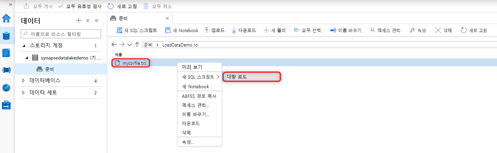
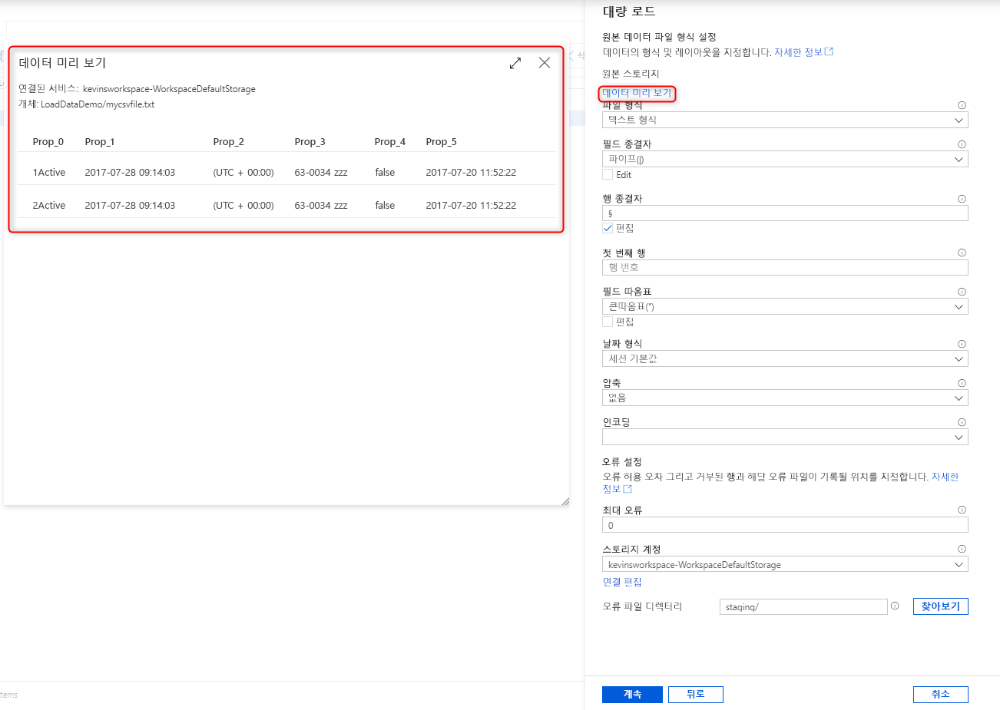
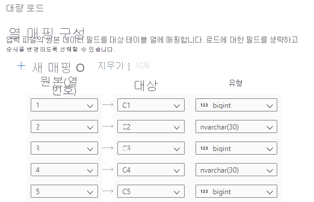
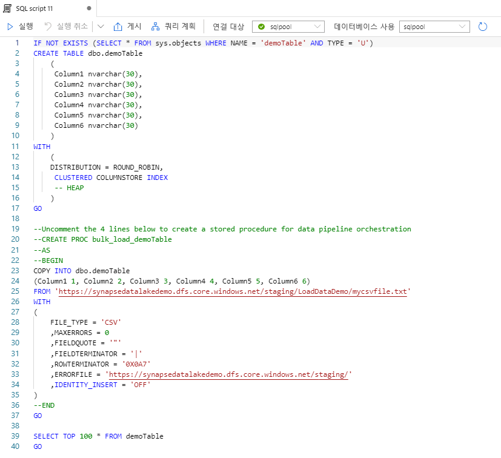

# 빠른 시작: Synapse Studio를 사용하여 대량 로드

Synapse Studio에서 대량 로드 마법사를 사용하면 데이터를 쉽게 로드할 수 있습니다. Synapse Studio는 Azure Synapse Analytics의 기능입니다. 대량 로드 마법사는 [COPY 문](/sql/t-sql/statements/copy-into-transact-sql?view=azure-sqldw-latest&preserve-view=true)을 사용하여 T-SQL 스크립트를 만드는 방법부터 데이터를 전용 SQL 풀에 대량으로 로드하는 방법까지 안내합니다. 

## 대량 로드 마법사의 진입점

Synapse Studio 내에서 작업 영역에 연결된 Azure 스토리지 계정의 파일 또는 폴더를 마우스 오른쪽 단추로 클릭하여 데이터를 대량 로드할 수 있습니다.

## 필수 구성 요소

- 이 마법사는 COPY 문을 생성하고, Azure AD(Azure Active Directory) 통과를 사용하여 인증합니다. [Azure AD 사용자는 작업 영역에 대한 액세스 권한](./sql-data-warehouse/quickstart-bulk-load-copy-tsql-examples.md#d-azure-active-directory-authentication)이 있고 Azure Data Lake Storage Gen2 계정에 대한 Storage Blob 데이터 기여자 이상의 Azure 역할이 있어야 합니다. 

- 데이터를 로드할 테이블을 새로 만들려면 [COPY 문 사용 권한](/sql/t-sql/statements/copy-into-transact-sql?view=azure-sqldw-latest&preserve-view=true#permissions) 및 테이블 만들기 권한이 필요합니다.

- Data Lake Storage Gen2 계정과 연결되는 연결된 서비스에는 데이터를 로드할 *파일 또는 폴더에 대한 액세스 권한* 이 있어야 합니다. 예를 들어 연결된 서비스의 인증 메커니즘이 관리 ID인 경우 작업 영역 관리 ID에는 스토리지 계정에 대한 Storage Blob 데이터 읽기 권한자 이상의 권한이 있어야 합니다.

- 작업 영역에서 가상 네트워크를 사용하는 경우 원본 데이터 및 오류 파일 위치에 대한 Data Lake Storage Gen2 계정의 연결된 서비스에 연결되는 통합 런타임에서 대화형 작성을 사용하도록 설정해야 합니다. 마법사 내에서 자동 스키마를 검색하고, 원본 파일 내용을 미리 살펴보고, Data Lake Storage Gen2 스토리지 계정을 검색하려면 대화형 작성 기능이 필요합니다.

## 단계

1. **원본 스토리지 위치** 패널에서 스토리지 계정과 로드할 데이터가 있는 파일 또는 폴더를 선택합니다. 마법사는 파일의 원본 필드를 적절한 대상 SQL 데이터 형식으로 매핑하는 것을 포함하여 Parquet 파일과 구분된 텍스트(CSV) 파일을 자동으로 검색하려고 합니다. 

   

2. 대량 로드 프로세스 중에 거부된 행이 있는 경우의 오류 설정을 포함하는 파일 형식 설정을 선택합니다. 또한 **데이터 미리 보기** 를 선택하여 파일 형식 설정을 구성하는 데 도움이 되도록 COPY 문이 파일을 구문 분석하는 방법을 확인할 수 있습니다. 파일 형식 설정을 변경할 때마다 **데이터 미리 보기** 를 선택하여 COPY 문이 업데이트된 설정으로 파일을 구문 분석하는 방법을 확인하세요.

    

   > [!NOTE]  
   >
   > - 대량 로드 마법사는 다중 문자 필드 종결자를 사용하여 데이터를 미리 보는 기능을 지원하지 않습니다. 다중 문자 필드 종결자를 지정하면 마법사가 단일 열 내의 데이터를 미리 봅니다. 
   > - **열 이름 유추** 를 선택하면 대량 로드 마법사가 **첫 번째 행** 필드에 지정된 첫 번째 행에서 열 이름을 구문 분석합니다. 대량 로드 마법사는 이 헤더 행을 무시하도록 COPY 문의 `FIRSTROW` 값을 자동으로 1씩 증가시킵니다. 
   > - COPY 문에서는 다중 문자 행 종결자를 지정하는 기능이 지원됩니다. 그러나 대량 로드 마법사는 이 기능을 지원하지 않고 오류를 throw 합니다.

3. 기존 테이블에 로드할 것인지 아니면 새 테이블에 로드할 것인지 여부를 포함하여 데이터 로드에 사용할 전용 SQL 풀을 선택합니다.
   
4. **열 매핑 구성** 을 선택하여 열 매핑이 적절한지 확인합니다. **열 이름 유추** 를 사용하도록 설정하면 열 이름이 자동으로 검색됩니다. 새 테이블의 경우 대상 열 데이터 형식을 업데이트하려면 열 매핑을 구성해야 합니다.

   
5. **스크립트 열기** 를 선택합니다. 데이터 레이크에서 데이터를 로드하는 COPY 문을 사용하여 T-SQL 스크립트가 생성됩니다.
   

## 다음 단계

- COPY 기능에 대한 자세한 내용은 [COPY 문](/sql/t-sql/statements/copy-into-transact-sql?view=azure-sqldw-latest&preserve-view=true#syntax) 문서를 확인하세요.
- ETL(추출, 변환 및 로드) 프로세스를 사용하는 방법에 대한 자세한 내용은 [데이터 로드 개요](./sql-data-warehouse/design-elt-data-loading.md#what-is-elt) 문서를 확인하세요.
