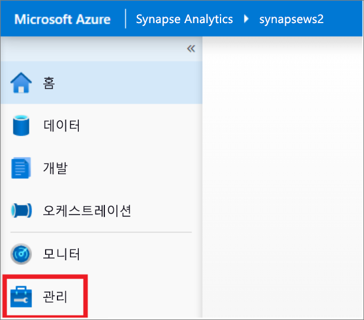
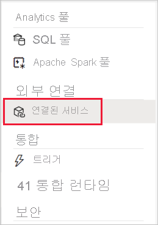
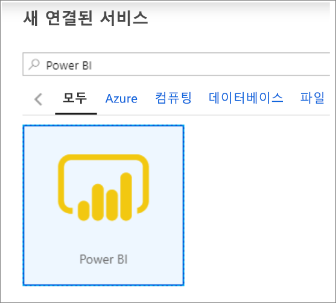
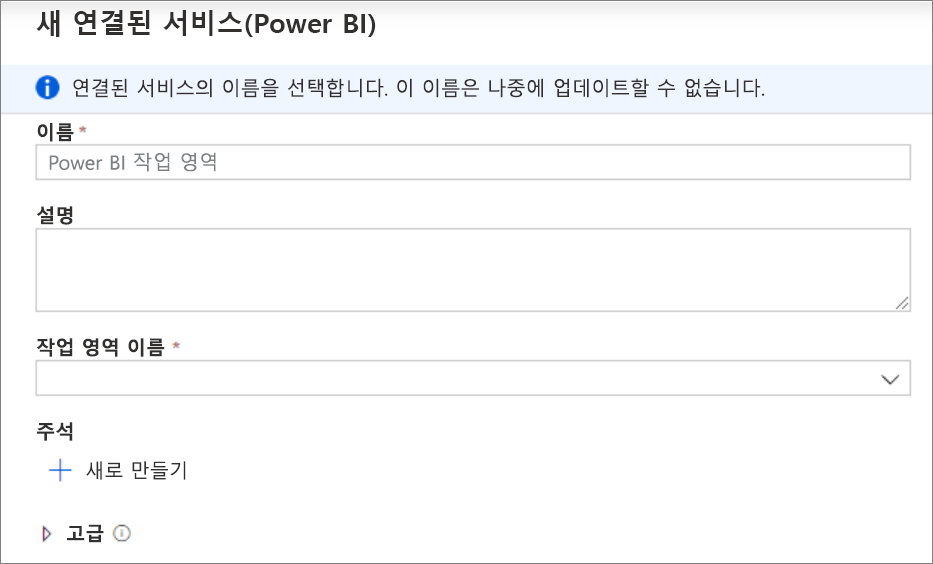
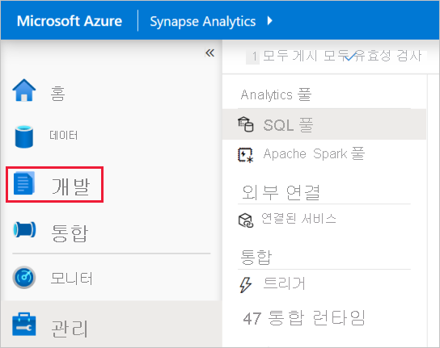
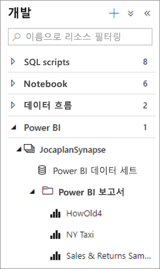
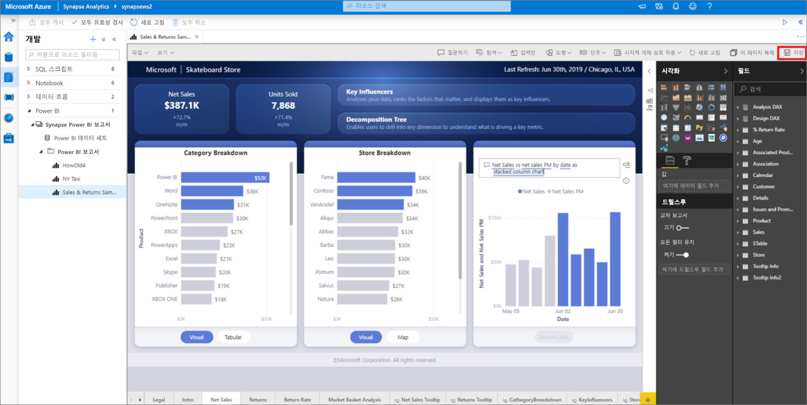

# 빠른 시작: Synapse 작업 영역에 Power BI 작업 영역 연결

이 빠른 시작에서는 Synapse Analytics 작업 영역에 Power BI 작업 영역을 연결하여 Synapse Studio(미리 보기)에서 새 Power BI 보고서 및 데이터 세트를 만드는 방법에 대해 설명합니다.

Azure 구독이 없는 경우 [시작하기 전에 체험 계정을 만듭니다](https://azure.microsoft.com/free/).

## 필수 구성 요소

- [Azure Synapse 작업 영역 및 연결된 스토리지 계정 만들기](quickstart-create-workspace.md)
- [Power BI Professional 또는 Premium 작업 영역](https://docs.microsoft.com/power-bi/service-create-the-new-workspaces)

## Synapse 작업 영역에 Power BI 작업 영역 연결

1. Synapse Studio에서 시작하여 **관리**를 클릭합니다.

    

2. **외부 연결**에서 **연결된 서비스**를 클릭합니다.

    

3. **+새로 만들기**를 클릭합니다.

    

4. **Power BI**를 클릭하고 **계속**을 클릭합니다.

    

5. 연결된 서비스의 이름을 입력하고 드롭다운 목록에서 작업 영역을 선택합니다.

    

6. **만들기**를 클릭합니다.

## Synapse Studio에서 Power BI 작업 영역 보기

작업 영역이 연결되면 Synapse Studio에서 Power BI 데이터 세트를 찾아보고, 새 Power BI 보고서를 편집/만들 수 있습니다.

1. **개발**을 클릭합니다.

    

2. Power BI 및 사용하려는 작업 영역을 확장합니다.

    

**개발** 탭의 맨 위에 있는 **+** 를 클릭하여 새 보고서를 만들 수 있습니다. 보고서 이름을 클릭하여 기존 보고서를 편집할 수 있습니다. 저장된 변경 내용은 Power BI 작업 영역에 다시 기록됩니다.

## 다음 단계

[Azure Storage에 저장된 파일에 대한 Power BI 보고서 만들기](sql/tutorial-connect-power-bi-desktop.md)에 대해 자세히 알아보세요.
