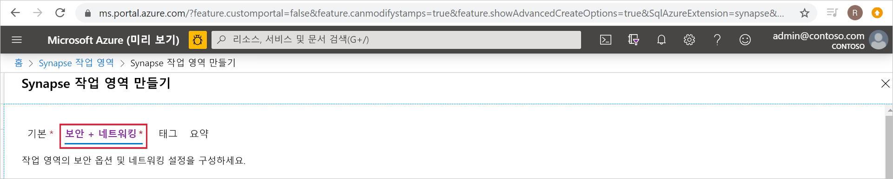
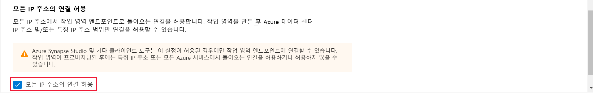
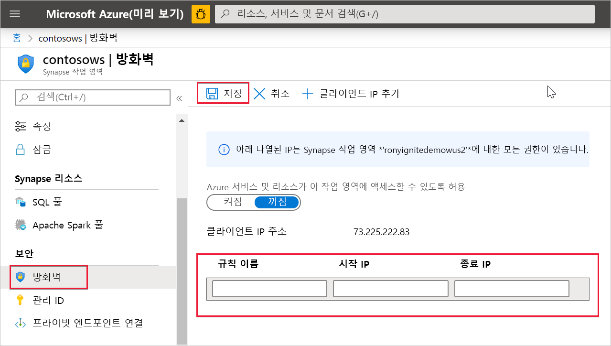

# Azure Synapse Analytics IP 방화벽 규칙(미리 보기)

이 문서에서는 IP 방화벽 규칙을 설명하고 Azure Synapse Analytics에서 구성하는 방법을 설명합니다.

## IP 방화벽 규칙

IP 방화벽 규칙은 각 요청이 시작된 IP 주소를 기준으로 하여 Synapse 작업 영역 액세스 권한을 부여하거나 거부합니다. 작업 영역에 대한 IP 방화벽 규칙을 구성할 수 있습니다. 작업 영역 수준에서 구성된 IP 방화벽 규칙은 작업 영역의 모든 퍼블릭 엔드포인트(SQL 풀, SQL 주문형 및 개발)에 적용됩니다.

## IP 방화벽 규칙 만들기 및 관리

Synapse 작업 영역에 IP 방화벽 규칙을 추가하는 방법에는 두 가지가 있습니다. 작업 영역에 IP 방화벽을 추가하려면 **보안 + 네트워킹**을 선택하고, 작업 영역을 만드는 동안 **모든 IP 주소에서 연결 허용**을 선택합니다.

작업 영역을 만든 후에 Synapse 작업 영역에 IP 방화벽 규칙을 추가할 수도 있습니다. Azure Portal의 **보안**에서 **방화벽**을 선택합니다. 새 IP 방화벽 규칙을 추가하려면 이름, 시작 IP 및 끝 IP를 지정합니다. 완료되면 **저장** 을 선택합니다.

## 사용자 고유의 네트워크에서 Synapse에 연결

Synapse Studio를 사용하여 Synapse 작업 영역에 연결할 수 있습니다. SSMS(SQL Server Management Studio)를 사용하여 작업 영역의 SQL 리소스(SQL 풀 및 SQL 주문형)에 연결할 수도 있습니다.

네트워크와 로컬 컴퓨터의 방화벽이 Synapse Studio에 대한 TCP 포트 80, 443 및 1443에서 나가는 통신을 허용해야 합니다.

또한 Synapse Studio용 UDP 포트 53에서 나가는 통신을 허용해야 합니다. SSMS 및 Power BI와 같은 도구를 사용하여 연결하려면 TCP 포트 1433에서 나가는 통신을 허용해야 합니다.

기본 리디렉션 연결 정책 설정을 사용하는 경우 추가 포트에서 나가는 통신을 허용해야 할 수도 있습니다. [여기](https://docs.microsoft.com/azure/sql-database/sql-database-connectivity-architecture#connection-policy)에서 연결 정책에 대해 자세히 알아볼 수 있습니다.

## 다음 단계

[Azure Synapse 작업 영역](../quickstart-create-workspace.md) 만들기

[관리형 작업 영역 VNet](./synapse-workspace-managed-vnet.md)이 연결된 Azure Synapse 작업 영역 만들기