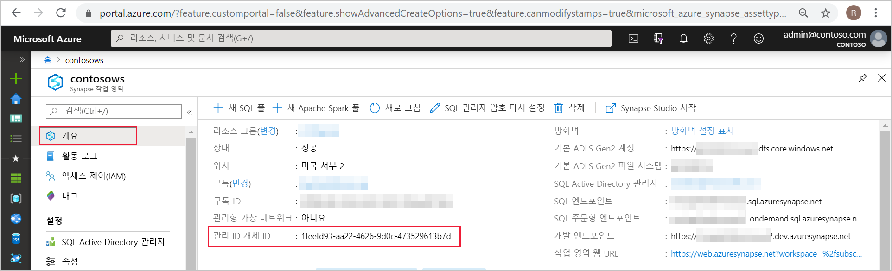
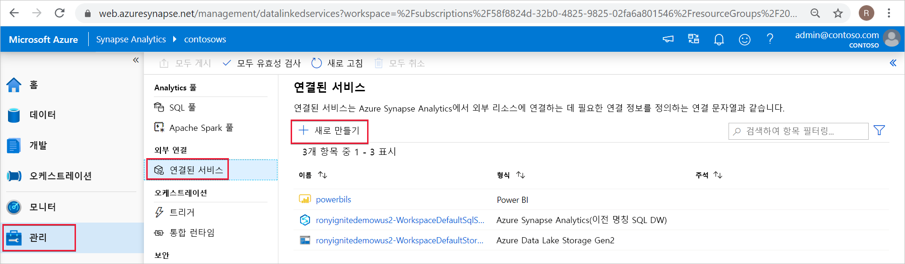
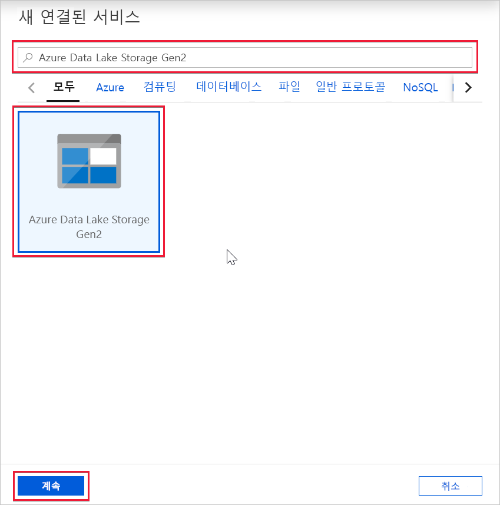
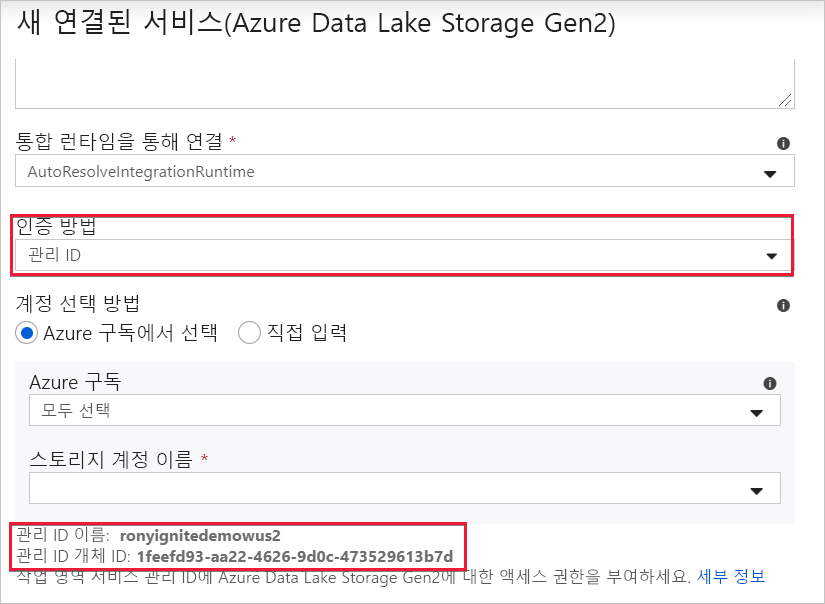

# Azure Synapse 작업 영역 관리 ID(미리 보기)

이 문서에서는 Azure Synapse 작업 영역의 관리 ID에 대해 알아봅니다.

## 관리 ID

Azure 리소스에 대한 관리 ID는 Azure Active Directory의 기능입니다. 이 기능은 Azure AD에서 자동으로 관리되는 ID를 Azure 서비스에 제공합니다. 관리 ID 기능을 사용하여 Azure AD 인증을 지원하는 모든 서비스에 인증할 수 있습니다.

Azure 리소스에 대한 관리 ID는 이전에 MSI(관리 서비스 ID)로 알려진 서비스에 대한 새 이름입니다. 자세히 알아보려면 [관리 ID](../../active-directory/managed-identities-azure-resources/overview.md?toc=/azure/synapse-analytics/toc.json&bc=/azure/synapse-analytics/breadcrumb/toc.json)를 참조하세요.

## Azure Synapse 작업 영역 관리 ID

작업 영역을 만들 때 Azure Synapse 작업 영역에 대해 시스템이 할당한 관리 ID가 만들어집니다.

>[!NOTE]
>이 작업 영역 관리 ID는 이 문서의 나머지 부분에서 관리 ID라고 합니다.

Azure Synapse는 관리 ID를 사용하여 파이프라인을 오케스트레이션합니다. 관리 ID 수명 주기는 Azure Synapse 작업 영역에 직접 연결됩니다. Azure Synapse 작업 영역을 삭제하면 관리 ID도 정리됩니다.

작업 영역 관리 ID에는 파이프라인에서 작업을 수행할 수 있는 권한이 필요합니다. 권한을 부여할 때 개체 ID 또는 Azure Synapse 작업 영역 이름을 사용하여 관리 ID를 찾을 수 있습니다.

## Azure Portal에서 관리 ID 검색

Azure Portal에서 관리 ID를 검색할 수 있습니다. Azure Portal에서 Azure Synapse 작업 영역을 열고 왼쪽 탐색에서 **개요**를 선택합니다. 관리 ID의 개체 ID는 주 화면에 표시됩니다.

관리 ID 정보는 Azure Synapse Studio에서 관리 ID 인증을 지원하는 연결된 서비스를 만드는 경우에도 표시됩니다.

**Azure Synapse Studio**를 시작하고 왼쪽 탐색에서 **관리** 탭을 선택합니다. 그런 다음, **연결된 서비스**를 선택하고 **+ 새로 만들기** 옵션을 선택하여 새로 연결된 서비스를 만듭니다.

**새로 연결된 서비스** 창에서 *Azure Data Lake Storage Gen2*를 입력합니다. 아래 목록에서 **Azure Data Lake Storage Gen2** 리소스 종류를 선택하고 **계속**을 선택합니다.

다음 창에서 **인증 방법**에 대해 **관리 ID**를 선택합니다. 관리 ID의 **이름** 및 **개체 ID**가 표시됩니다.

## 다음 단계

[Azure Synapse 작업 영역 관리 ID에 권한 부여](./how-to-grant-workspace-managed-identity-permissions.md)
