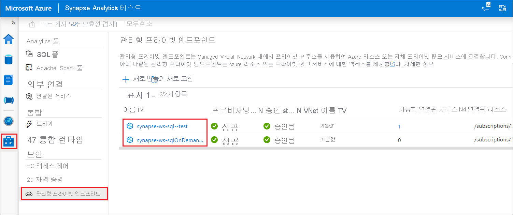

# Synapse 관리형 프라이빗 엔드포인트(미리 보기)

이 문서에서는 Azure Synapse Analytics의 관리형 프라이빗 엔드포인트에 대해 설명합니다.

## 관리형 프라이빗 엔드포인트

관리형 프라이빗 엔드포인트는 Azure 리소스에 대한 프라이빗 링크를 설정하는 관리형 작업 영역 Microsoft Azure Virtual Network에서 생성된 프라이빗 엔드포인트입니다. Azure Synapse는 사용자 대신 이러한 프라이빗 엔드포인트를 관리합니다.

Azure Synapse는 프라이빗 링크를 지원합니다. 프라이빗 링크를 사용하면 Azure Virtual Network에서 Azure 서비스(예: Azure Storage, Azure Cosmos DB, Azure SQL Data Warehouse) 및 Azure에 호스트되는 고객/파트너 서비스에 안전하게 액세스할 수 있습니다.

프라이빗 링크를 사용하는 경우 Virtual Network와 작업 영역 간의 트래픽은 전적으로 Microsoft 백본 네트워크를 통해 트래버스됩니다. Private Link는 데이터 반출 위험을 방지합니다. 프라이빗 엔드포인트를 만들어 리소스에 대한 프라이빗 링크를 설정합니다.

프라이빗 엔드포인트는 Virtual Network의 개인 IP 주소를 사용하여 서비스를 Virtual Network로 효과적으로 가져옵니다. 프라이빗 엔드포인트는 전체 서비스가 아닌 Azure의 특정 리소스에 매핑됩니다. 고객은 연결 범위를 조직에서 승인한 특정 리소스로 제한할 수 있습니다. [프라이빗 링크 및 프라이빗 엔드포인트](https://docs.microsoft.com/azure/private-link/)에 대해 자세히 알아보세요.

>[!IMPORTANT]
>관리형 프라이빗 엔드포인트는 관리형 작업 영역 Virtual Network가 연결된 Azure Synapse 작업 영역에서만 지원됩니다.

>[!NOTE]
>관리형 프라이빗 엔드포인트를 제외한 관리형 작업 영역 Virtual Network의 모든 아웃바운드 트래픽은 향후에 차단될 예정입니다. 작업 영역 외부의 모든 Azure 데이터 원본에 연결하는 관리형 프라이빗 엔드포인트를 만드는 것이 좋습니다. 

Azure Synapse에서 관리형 프라이빗 엔드포인트를 만들 때 프라이빗 엔드포인트 연결이 "보류 중" 상태로 생성됩니다. 승인 워크플로가 시작됩니다. 프라이빗 링크 리소스 소유자가 연결을 승인 또는 거부합니다.

소유자가 연결을 승인하면 프라이빗 링크가 설정됩니다. 거부하면 프라이빗 링크가 설정되지 않습니다. 어떤 경우든 관리형 프라이빗 엔드포인트는 연결 상태로 업데이트 됩니다.

승인된 상태의 관리형 프라이빗 엔드포인트만이 지정된 프라이빗 링크 리소스에 트래픽을 보낼 수 있습니다.

## SQL 풀 및 SQL 주문형의 관리형 프라이빗 엔드포인트

SQL 풀 및 SQL 주문형은 Azure Synapse 작업 영역의 분석 기능입니다. 이러한 기능은 [관리형 작업 영역 Virtual Network](./synapse-workspace-managed-vnet.md)에 배포되지 않은 다중 테넌트 인프라를 사용합니다.

작업 영역이 만들어지면 Azure Synapse는 해당 작업 영역의 SQL 풀과 SQL 주문형에 대한 두 개의 관리형 프라이빗 엔드포인트를 만듭니다. 

이러한 두 개의 관리형 프라이빗 엔드포인트는 Azure Synapse Studio에 나열됩니다. 왼쪽 탐색 영역에서 **관리**를 선택한 다음, **관리형 가상 네트워크**를 선택하여 Studio에서 확인합니다.

SQL 풀을 대상으로 하는 관리형 프라이빗 엔드포인트를 *synapse-ws-sql--\<workspacename\>* 이라고 하고, SQL 주문형을 대상으로 하는 관리형 프라이빗 엔드포인트를 *synapse-ws-sqlOnDemand--\<workspacename\>* 라고 합니다.

이러한 두 개의 관리형 프라이빗 엔드포인트는 Azure Synapse 작업 영역을 만들 때 자동으로 만들어집니다. 두 관리형 프라이빗 엔드포인트에 대한 요금은 청구되지 않습니다.

## 다음 단계

[데이터 원본에 대한 관리형 프라이빗 엔드포인트 만들기](./how-to-create-managed-private-endpoints.md)
