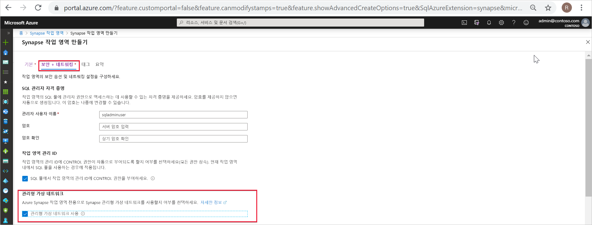
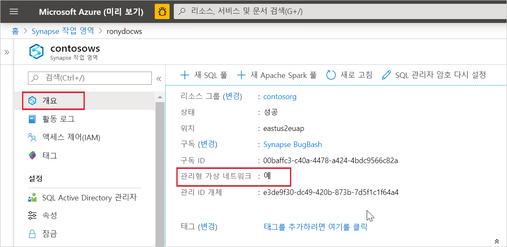

# Azure Synapse Analytics 관리형 가상 네트워크(미리 보기)

이 문서에서는 Azure Synapse Analytics의 관리형 Virtual Network에 대해 설명합니다.

## 관리형 작업 영역 VNet

Azure Synapse 작업 영역을 만들 때 작업 영역을 VNet과 연결하도록 선택할 수 있습니다. 작업 영역과 연결된 VNet은 Azure Synapse에서 관리합니다. 이 VNet을 *관리형 작업 영역 VNet*이라고 합니다.

관리형 작업 영역 VNet은 다음과 같은 네 가지 가치를 제공합니다.

- 관리형 작업 영역 VNet을 사용하면 Azure Synapse에 대한 VNet 관리 부담에서 벗어날 수 있습니다.
- Azure Synapse 관리 트래픽이 VNet에 진입하도록 허용하기 위해 자체 VNet에서 인바운드 NSG 규칙을 구성할 필요가 없습니다. 이러한 NSG 규칙을 잘못 구성하면 서비스가 중단됩니다.
- 최대 부하를 기준으로 Spark 클러스터의 서브넷을 만들 필요가 없습니다.
- 관리형 작업 영역 VNet은 관리형 프라이빗 엔드포인트와 함께 데이터 반출을 방지합니다. 관리형 작업 영역 VNet이 연결된 작업 영역에는 관리형 프라이빗 엔드포인트만 만들 수 있습니다.

관리형 작업 영역 VNet이 연결된 작업 영역을 만들면 작업 영역이 네트워크에서 다른 작업 영역과 격리됩니다. Azure Synapse는 작업 영역에 데이터 통합, Apache Spark, SQL 풀, SQL 주문형 등의 다양한 분석 기능을 제공합니다.

작업 영역에 관리형 작업 영역 VNet이 있으면 데이터 통합 및 Spark 리소스가 해당 VNet에 배포됩니다. 또한 관리형 작업 영역 VNet은 각 Spark 클러스터가 자체 서브넷에 있기 때문에 Spark 작업에 대한 사용자 수준 격리를 제공합니다.

SQL 풀 및 SQL 주문형은 다중 테넌트 기능이므로 관리형 작업 영역 VNet 외부에 상주합니다. 작업 영역 내에서 SQL 풀 및 SQL 주문형과의 통신에는 Azure 프라이빗 링크가 사용됩니다. 이러한 프라이빗 링크는 관리형 작업 영역 VNet이 연결된 작업 영역을 만들 때 자동으로 생성됩니다.

>[!IMPORTANT]
>작업 영역이 생성된 후에는 이 작업 영역 구성을 변경할 수 없습니다. 예를 들어 관리형 작업 영역 VNet이 연결되지 않은 작업 영역을 다시 구성한 후 VNet을 연결할 수 없습니다. 마찬가지로 관리형 작업 영역 VNet이 연결된 작업 영역을 다시 구성한 후 VNet 연결을 해제할 수 없습니다.

## 관리형 작업 영역 VNet이 연결된 Azure Synapse 작업 영역 만들기

아직 등록하지 않은 경우 네트워크 리소스 공급자를 등록합니다. 리소스 공급자를 등록하면 구독이 리소스 공급자에서 작동하도록 구성됩니다. [등록](https://docs.microsoft.com/azure/azure-resource-manager/management/resource-providers-and-types)할 때 리소스 공급자 목록에서 *Microsoft.Network*를 선택합니다.

관리형 작업 영역 VNet이 연결된 Azure Synapse 작업 영역을 만들려면 Azure Portal에서 **보안 + 네트워킹** 탭을 선택하고 **관리형 가상 네트워크 사용** 확인란을 선택합니다.

확인란을 선택하지 않으면 작업 영역에 VNet이 연결되지 않습니다.

>[!IMPORTANT]
>관리형 작업 영역 VNet이 연결된 작업 영역에는 프라이빗 링크만 사용할 수 있습니다.

>[!NOTE]
>관리형 프라이빗 엔드포인트를 제외한 관리 작업 영역 VNet의 모든 아웃바운드 트래픽은 향후에 차단될 예정입니다. 작업 영역 외부의 모든 Azure 데이터 원본에 연결하는 관리형 프라이빗 엔드포인트를 만드는 것이 좋습니다. 

Azure Portal에서 **개요**를 선택하여 Azure Synapse 작업 영역이 관리형 작업 영역 VNet에 연결되었는지 확인할 수 있습니다.

## 다음 단계

[Azure Synapse 작업 영역](../quickstart-create-workspace.md) 만들기

[관리형 프라이빗 엔드포인트](./synapse-workspace-managed-private-endpoints.md)에 대한 자세한 정보

[데이터 원본에 대한 관리형 프라이빗 엔드포인트 만들기](./how-to-create-managed-private-endpoints.md)
