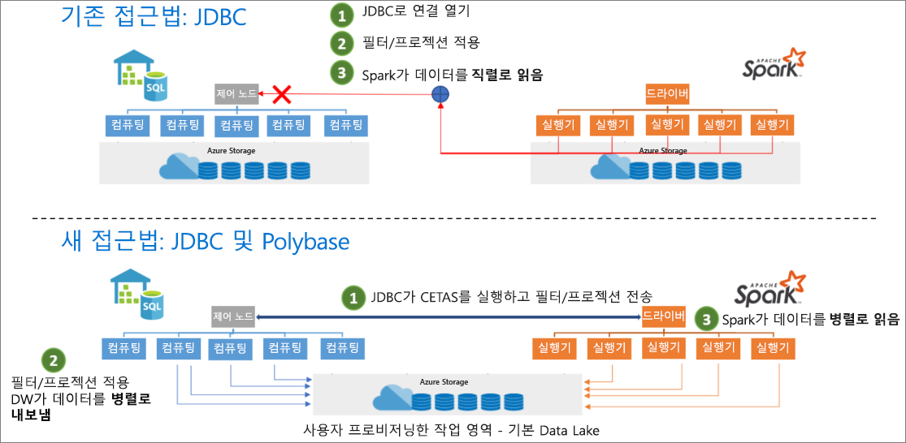

# <a name="introduction"></a>소개

Azure Synapse Apache Spark-Synapse SQL 커넥터는 Azure Synapse에서 Spark 풀(미리 보기)과 SQL 풀 간에 데이터를 효율적으로 전송하도록 설계되었습니다. Azure Synapse Apache Spark-Synapse SQL 커넥터는 SQL 풀에서만 작동하며, SQL 주문형에서는 작동하지 않습니다.

## <a name="design"></a>디자인

JDBC를 사용하여 Spark 풀과 SQL 풀 간에 데이터를 전송할 수 있습니다. 그러나 Spark 및 SQL 풀과 같은 두 개의 분산 시스템이 사용되므로 JDBC는 직렬 데이터를 전송할 때 병목 상태가 발생하는 경향이 있습니다.

Azure Synapse Apache Spark 풀-Synapse SQL 커넥터는 Apache Spark에 대한 데이터 원본 구현입니다. Azure Data Lake Storage Gen2 및 SQL 풀의 Polybase를 사용하여 Spark 클러스터와 Synapse SQL 인스턴스 간에 데이터를 효율적으로 전송합니다.



## <a name="authentication-in-azure-synapse-analytics"></a>Azure Synapse Analytics의 인증

시스템 간 인증은 Azure Synapse Analytics에서 원활하게 수행됩니다. 스토리지 계정 또는 데이터 웨어하우스 서버에 액세스할 때 사용할 보안 토큰을 얻기 위해 Azure Active Directory와 연결하는 토큰 서비스가 있습니다.

따라서 스토리지 계정 및 데이터 웨어하우스 서버에서 AAD 인증을 구성하면 자격 증명을 만들거나 커넥터 API에서 자격 증명을 지정할 필요가 없습니다. AAD 인증을 구성하지 않는 경우 SQL 인증을 지정할 수 있습니다. 자세한 내용은 [사용](#usage) 섹션에서 확인할 수 있습니다.

## <a name="constraints"></a>제약 조건

- 이 커넥터는 Scala에서만 작동합니다.

## <a name="prerequisites"></a>필수 구성 요소

- 데이터를 주고 받을 데이터베이스/SQL 풀에서 **db_exporter** 역할의 멤버여야 합니다.
- 기본 스토리지 계정의 Storage Blob 데이터 기여자 역할 멤버여야 합니다.

사용자를 만들려면 SQL 풀 데이터베이스에 연결하고 다음 예제를 따릅니다.

```sql
--SQL User
CREATE USER Mary FROM LOGIN Mary;

--Azure Active Directory User
CREATE USER [mike@contoso.com] FROM EXTERNAL PROVIDER;
```

역할을 할당하는 방법은 다음과 같습니다.

```sql
--SQL User
EXEC sp_addrolemember 'db_exporter', 'Mary';

--Azure Active Directory User
EXEC sp_addrolemember 'db_exporter',[mike@contoso.com]
```

## <a name="usage"></a>사용

import 문은 필요하지 않습니다. Notebook 환경용으로 미리 가져오기됩니다.

### <a name="transferring-data-to-or-from-a-sql-pool-attached-with-the-workspace"></a>작업 영역과 연결된 SQL 풀과 데이터 전송

> [!NOTE]
> **Notebook 환경에서 가져올 필요 없음**

```scala
 import com.microsoft.spark.sqlanalytics.utils.Constants
 import org.apache.spark.sql.SqlAnalyticsConnector._
```

#### <a name="read-api"></a>읽기 API

```scala
val df = spark.read.sqlanalytics("<DBName>.<Schema>.<TableName>")
```

위의 API는 SQL 풀의 내부(관리형)뿐 아니라 외부 테이블에 대해서도 작동합니다.

#### <a name="write-api"></a>쓰기 API

```scala
df.write.sqlanalytics("<DBName>.<Schema>.<TableName>", <TableType>)
```

쓰기 API는 SQL 풀에 테이블을 만든 다음, Polybase를 호출하여 데이터를 로드합니다.  테이블이 SQL 풀에 존재하지 않아야 합니다. 그렇지 않으면 "같은 이름의 개체가 이미 있습니다"라는 내용의 오류가 반환됩니다.

TableType 값

- Constants.INTERNAL - SQL 풀의 관리형 테이블
- Constants.EXTERNAL - SQL 풀의 외부 테이블

SQL 풀 관리형 테이블

```scala
df.write.sqlanalytics("<DBName>.<Schema>.<TableName>", Constants.INTERNAL)
```

SQL 풀 외부 테이블

SQL 풀 외부 테이블에 쓰려면 SQL 풀에 EXTERNAL DATA SOURCE 및 EXTERNAL FILE FORMAT이 있어야 합니다.  자세한 내용은 SQL 풀의 [외부 데이터 원본 만들기](/sql/t-sql/statements/create-external-data-source-transact-sql?toc=/azure/synapse-analytics/sql-data-warehouse/toc.json&bc=/azure/synapse-analytics/sql-data-warehouse/breadcrumb/toc.json&view=azure-sqldw-latest) 및 [외부 파일 형식](/sql/t-sql/statements/create-external-file-format-transact-sql?toc=/azure/synapse-analytics/sql-data-warehouse/toc.json&bc=/azure/synapse-analytics/sql-data-warehouse/breadcrumb/toc.json&view=azure-sqldw-latest)을 참조하세요.  아래는 SQL 풀의 외부 데이터 원본 만들기 및 외부 파일 형식에 대한 예제입니다.

```sql
--For an external table, you need to pre-create the data source and file format in SQL pool using SQL queries:
CREATE EXTERNAL DATA SOURCE <DataSourceName>
WITH
  ( LOCATION = 'abfss://...' ,
    TYPE = HADOOP
  ) ;

CREATE EXTERNAL FILE FORMAT <FileFormatName>
WITH (  
    FORMAT_TYPE = PARQUET,  
    DATA_COMPRESSION = 'org.apache.hadoop.io.compress.SnappyCodec'  
);
```

스토리지 계정에 Azure Active Directory 통과 인증을 사용하는 경우에는 EXTERNAL CREDENTIAL 개체가 필요 없습니다.  스토리지 계정의 "Storage Blob 데이터 기여자" 역할 멤버여야 합니다.

```scala

df.write.
    option(Constants.DATA_SOURCE, <DataSourceName>).
    option(Constants.FILE_FORMAT, <FileFormatName>).
    sqlanalytics("<DBName>.<Schema>.<TableName>", Constants.EXTERNAL)

```

### <a name="if-you-are-transferring-data-to-or-from-a-sql-pool-or-database-outside-the-workspace"></a>작업 영역 외부의 SQL 풀 또는 데이터베이스와 데이터를 주고 받는 경우

> [!NOTE]
> Notebook 환경에서 가져올 필요 없음

```scala
 import com.microsoft.spark.sqlanalytics.utils.Constants
 import org.apache.spark.sql.SqlAnalyticsConnector._
```

#### <a name="read-api"></a>읽기 API

```scala
val df = spark.read.
option(Constants.SERVER, "samplews.database.windows.net").
sqlanalytics("<DBName>.<Schema>.<TableName>")
```

#### <a name="write-api"></a>쓰기 API

```scala
df.write.
option(Constants.SERVER, "samplews.database.windows.net").
sqlanalytics("<DBName>.<Schema>.<TableName>", <TableType>)
```

### <a name="using-sql-auth-instead-of-aad"></a>AAD 대신 SQL 인증 사용

#### <a name="read-api"></a>읽기 API

현재 이 커넥터는 작업 영역 외부에 있는 SQL 풀에 대한 토큰 기반 인증을 지원하지 않습니다. SQL 인증을 사용해야 합니다.

```scala
val df = spark.read.
option(Constants.SERVER, "samplews.database.windows.net").
option(Constants.USER, <SQLServer Login UserName>).
option(Constants.PASSWORD, <SQLServer Login Password>).
sqlanalytics("<DBName>.<Schema>.<TableName>")
```

#### <a name="write-api"></a>쓰기 API

```scala
df.write.
option(Constants.SERVER, "samplews.database.windows.net").
option(Constants.USER, <SQLServer Login UserName>).
option(Constants.PASSWORD, <SQLServer Login Password>).
sqlanalytics("<DBName>.<Schema>.<TableName>", <TableType>)
```

### <a name="using-the-pyspark-connector"></a>PySpark 커넥터 사용

> [!NOTE]
> 이 예제는 노트북 환경만을 고려하여 제공됩니다.

DW에 작성하려는 데이터 프레임 "pyspark_df"가 있다고 가정합니다.

PySpark에서 데이터 프레임을 사용하여 임시 테이블을 만듭니다.

```py
pyspark_df.createOrReplaceTempView("pysparkdftemptable")
```

매직을 사용하여 PySpark Notebook에서 Scala 셀을 실행합니다.

```scala
%%spark
val scala_df = spark.sqlContext.sql ("select * from pysparkdftemptable")

pysparkdftemptable.write.sqlanalytics("sqlpool.dbo.PySparkTable", Constants.INTERNAL)
```

마찬가지로 읽기 시나리오에서는 Scala를 사용하여 데이터를 읽고 임시 테이블에 쓰고, PySpark에서 Spark SQL을 사용하여 임시 테이블을 데이터 프레임으로 쿼리합니다.

## <a name="allowing-other-users-to-use-the-azure-synapse-apache-spark-to-synapse-sql-connector-in-your-workspace"></a>다른 사용자가 작업 영역에서 Synapse SQL 커넥터에 Azure Synapse Apache Spark를 사용할 수 있도록 허용

다른 사용자에 대한 누락된 사용 권한을 변경하려면 작업 영역에 연결된 ADLS Gen2 스토리지 계정에서 Storage Blob 데이터 소유자여야 합니다. 사용자에게 작업 영역에 대한 액세스 권한과 Notebook을 실행할 수 있는 권한이 있는지 확인합니다.

### <a name="option-1"></a>옵션 1

- 사용자를 Storage Blob 데이터 기여자/소유자로 설정합니다.

### <a name="option-2"></a>옵션 2

- 폴더 구조에서 다음 ACL을 지정합니다.

| 폴더 | / | synapse | workspaces  | \<workspacename> | sparkpools | \<sparkpoolname>  | sparkpoolinstances  |
|--|--|--|--|--|--|--|--|
| 액세스 권한 | --X | --X | --X | --X | --X | --X | -WX |
| 기본 사용 권한 | ---| ---| ---| ---| ---| ---| ---|

- “synapse” 및 Azure Portal 아래쪽의 모든 폴더에 대해 ACL을 지정해야 합니다. 루트 “/” 폴더에 ACL을 적용하려면 아래 지침을 따르세요.

- AAD를 사용하여 Storage Explorer에서 작업 영역과 연결된 스토리지 계정에 연결합니다.
- 계정을 선택하고 작업 영역에 대한 ADLS Gen2 URL 및 기본 파일 시스템을 지정합니다.
- 나열된 스토리지 계정이 표시되면 목록 작업 영역을 마우스 오른쪽 단추로 클릭하고 “액세스 관리”를 선택합니다.
- “실행” 액세스 권한을 사용하여 / 폴더에 사용자를 추가합니다. “확인”을 선택합니다.

> [!IMPORTANT]
> 원하지 않는 경우 “기본값”을 선택하지 않아야 합니다.

## <a name="next-steps"></a>다음 단계

- [Azure Portal을 사용하여 SQL 풀 만들기](../../synapse-analytics/quickstart-create-apache-spark-pool-portal.md)
- [Azure Portal을 사용하여 Apache Spark 풀 만들기](../../synapse-analytics/quickstart-create-apache-spark-pool-portal.md) 
