# <a name="quickstart-create-and-query-a-synapse-sql-pool-using-the-azure-portal"></a>빠른 시작: Azure Portal을 사용하여 Synapse SQL 풀 만들기 및 쿼리

Azure Portal을 사용하여 Azure Synapse Analytics(이전의 SQL DW)에서Synapse SQL 풀을 신속하게 만들고 쿼리합니다.

## <a name="prerequisites"></a>사전 요구 사항

1. Azure 구독이 아직 없는 경우 시작하기 전에 [체험](https://azure.microsoft.com/free/) 계정을 만듭니다.

   > [!NOTE]
   > Azure Synapse에서 SQL 풀을 만들면 새로운 유료 서비스가 발생할 수 있습니다. 자세한 내용은 [Azure Synapse Analytics 가격 책정](https://azure.microsoft.com/pricing/details/synapse-analytics/)을 참조하세요.

2. 최신 버전의 [SSMS(SQL Server Management Studio)](/sql/ssms/download-sql-server-management-studio-ssms?toc=/azure/synapse-analytics/sql-data-warehouse/toc.json&bc=/azure/synapse-analytics/sql-data-warehouse/breadcrumb/toc.json&view=azure-sqldw-latest)를 다운로드하여 설치합니다.

## <a name="sign-in-to-the-azure-portal"></a>Azure Portal에 로그인

[Azure Portal](https://portal.azure.com/)에 로그인합니다.

## <a name="create-a-sql-pool"></a>SQL 풀 만들기

데이터 웨어하우스는 Azure Synapse Analytics에서 SQL 풀을 사용하여 생성됩니다. SQL 풀은 정의된 [컴퓨팅 리소스](memory-concurrency-limits.md)의 세트로 생성됩니다. 데이터베이스는 [Azure 리소스 그룹](../../azure-resource-manager/management/overview.md?toc=/azure/synapse-analytics/sql-data-warehouse/toc.json&bc=/azure/synapse-analytics/sql-data-warehouse/breadcrumb/toc.json) 및 [Azure SQL 논리 서버](../../sql-database/sql-database-servers.md?toc=/azure/synapse-analytics/sql-data-warehouse/toc.json&bc=/azure/synapse-analytics/sql-data-warehouse/breadcrumb/toc.json)에 생성됩니다.

다음 단계에 따라 **AdventureWorksDW** 샘플 데이터가 포함된 SQL 풀을 만듭니다.

1. Azure Portal의 왼쪽 위 모서리에서 **리소스 만들기**를 선택합니다.

   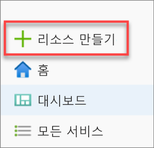

2. **새** 페이지에서 **데이터베이스**를 선택하고 **추천** 목록에서 **Azure Synapse Analytics(이전의 SQL DW)** 를 선택합니다.

   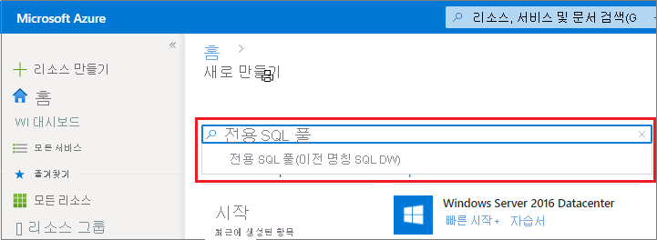

3. **기본 사항**에 구독, 리소스 그룹, SQL 풀 이름 및 서버 이름을 제공합니다.

   | 설정 | 제안 값 | Description |
   | :------ | :-------------- | :---------- |
   | **구독** | 사용자의 구독 | 구독에 대한 자세한 내용은 [구독](https://account.windowsazure.com/Subscriptions)을 참조하세요. |
   | **리소스 그룹** | myResourceGroup | 유효한 리소스 그룹 이름은 [명명 규칙 및 제한 사항](/azure/architecture/best-practices/resource-naming?toc=/azure/synapse-analytics/sql-data-warehouse/toc.json&bc=/azure/synapse-analytics/sql-data-warehouse/breadcrumb/toc.json)을 참조하세요. |
   | **SQL 풀 이름** | 전역적으로 고유한 이름(예: *mySampleDataWarehouse*) | 유효한 데이터베이스 이름은 [데이터베이스 식별자](/sql/relational-databases/databases/database-identifiers?toc=/azure/synapse-analytics/sql-data-warehouse/toc.json&bc=/azure/synapse-analytics/sql-data-warehouse/breadcrumb/toc.json&view=azure-sqldw-latest)를 참조하세요. SQL 풀은 데이터베이스의 한 가지 유형입니다. |
   | **Server** | 전역적으로 고유한 이름 | 기존 서버를 선택하거나 새 서버 이름을 만들고 **새로 만들기**를 선택합니다. 유효한 서버 이름은 [명명 규칙 및 제한 사항](/azure/architecture/best-practices/resource-naming?toc=/azure/synapse-analytics/sql-data-warehouse/toc.json&bc=/azure/synapse-analytics/sql-data-warehouse/breadcrumb/toc.json)을 참조하세요. |

   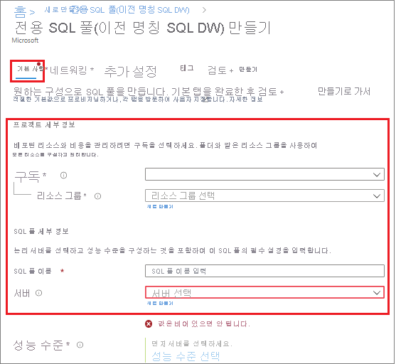

4. **성능 수준** 아래에서 **성능 수준 선택**을 선택하여 필요에 따라 슬라이더로 구성을 변경합니다.

   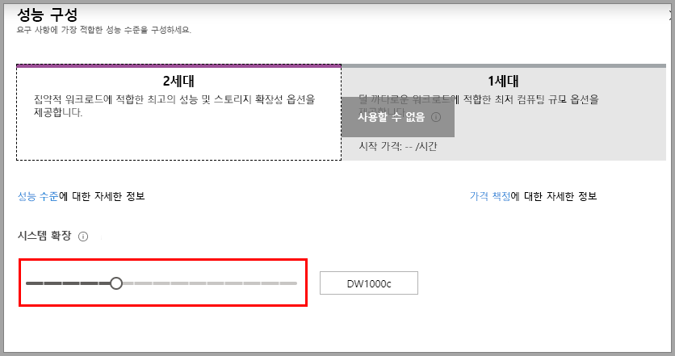  

   성능 수준에 대한 자세한 내용은 [Azure SQL Data Warehouse에서 컴퓨팅 관리](sql-data-warehouse-manage-compute-overview.md)를 참조하세요.

5. AdventureWorksDW가 샘플 데이터베이스로 생성되도록 **기존 데이터 사용**에서 **추가 설정**을 선택하고 **샘플**을 선택합니다.

    ![[기존 데이터 사용] 선택](./media/create-data-warehouse-portal/create-sql-pool-additional-1.png) 

6. Azure Synapse Analytics 양식의 기본 사항 탭을 완료했으면 **검토 + 만들기**와 **만들기**를 차례로 선택하여 SQL 풀을 만듭니다. 프로비전하는 데 몇 분이 걸립니다.

   

   

6. 도구 모음에서 **알림**을 선택하여 배포 프로세스를 모니터링합니다.

   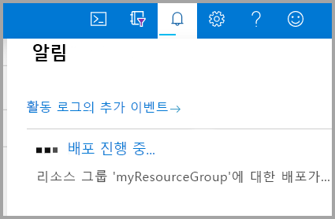

## <a name="create-a-server-level-firewall-rule"></a>서버 수준 방화벽 규칙 만들기

Azure Synapse 서비스는 서버 수준에서 방화벽을 만듭니다. 방화벽은 외부 애플리케이션 및 도구가 서버나 서버의 데이터베이스에 연결하지 못하도록 차단합니다. 연결을 사용하려면 특정 IP 주소에 대한 연결을 사용하도록 설정하는 방화벽 규칙을 추가할 수 있습니다. 다음 단계에 따라 클라이언트의 IP 주소에 대해 [서버 수준 방화벽 규칙](../../sql-database/sql-database-firewall-configure.md?toc=/azure/synapse-analytics/sql-data-warehouse/toc.json&bc=/azure/synapse-analytics/sql-data-warehouse/breadcrumb/toc.json)을 만듭니다.

> [!NOTE]
> Azure Synapse는 1433 포트를 통해 통신합니다. 회사 네트워크 내에서 연결하려는 경우 포트 1433을 통한 아웃바운드 트래픽이 네트워크 방화벽에서 허용되지 않을 수 있습니다. 이 경우 IT 부서에서 포트 1433을 열지 않으면 Azure SQL Database 서버에 연결할 수 없습니다.

1. 배포가 완료되면 왼쪽 메뉴에서 **모든 서비스**를 선택합니다. **데이터베이스**를 선택하고 **Azure Synapse Analytics** 옆에 있는 별표를 선택하여 Azure Synapse Analytics를 즐겨찾기에 추가합니다.

2. 왼쪽 메뉴에서 **Azure Synapse Analytics**를 선택한 다음, **Azure Synapse Analytics** 페이지에서 **mySampleDataWarehouse**를 선택합니다. 데이터베이스의 개요 페이지가 열리고 정규화된 서버 이름(예: **sqlpoolservername.database.windows.net**)이 표시되고 추가 구성을 위한 옵션이 제공됩니다.

3. 이 빠른 시작과 다른 빠른 시작에서 서버 및 해당 데이터베이스에 연결하는 데 사용하기 위해 정규화된 서버 이름을 복사합니다. 서버 설정을 열려면 서버 이름을 선택합니다.

   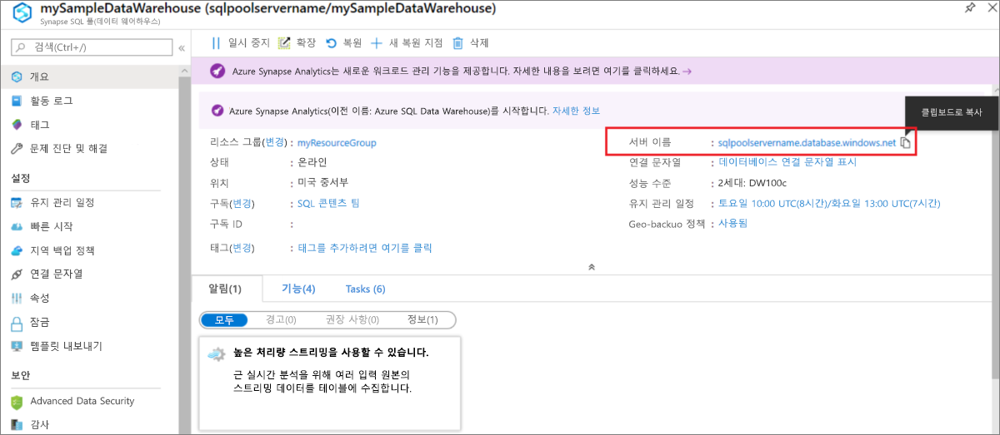

4. **방화벽 설정 표시**를 선택합니다.

   

5. SQL Database 서버에 대한 **방화벽 설정** 페이지가 열립니다.

   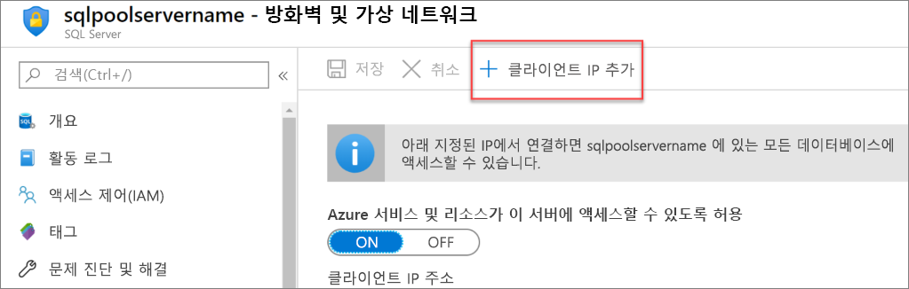

6. 현재 IP 주소를 새 방화벽 규칙에 추가하려면 도구 모음에서 **클라이언트 IP 추가**를 선택합니다. 방화벽 규칙은 단일 IP 주소 또는 IP 주소의 범위에 1433 포트를 열 수 있습니다.

7. **저장**을 선택합니다. 논리 서버의 1433 포트를 여는 현재 IP 주소에 서버 수준 방화벽 규칙이 생성됩니다.

8. **확인**을 선택한 다음, **방화벽 설정** 페이지를 닫습니다.

이제 이 IP 주소를 사용하여 SQL 서버 및 해당 SQL 풀에 연결할 수 있습니다. SQL Server Management Studio 또는 원하는 다른 도구에서 연결이 제대로 작동합니다. 연결할 때 이전에 만든 ServerAdmin 계정을 사용합니다.

> [!IMPORTANT]
> SQL Database 방화벽을 통한 액세스는 기본적으로 모든 Azure 서비스에 대해 사용됩니다. 이 페이지에서 **꺼짐**을 선택한 다음 **저장**을 선택하여 모든 Azure 서비스에 대한 방화벽을 사용하지 않도록 설정합니다.

## <a name="get-the-fully-qualified-server-name"></a>정규화된 서버 이름 확인

Azure Portal에서 SQL 서버의 정규화된 서버 이름을 확인합니다. 나중에 서버에 연결할 때 이 정규화된 이름을 사용합니다.

1. [Azure Portal](https://portal.azure.com/)에 로그인합니다.

2. 왼쪽 메뉴에서 **Azure Synapse Analytics**를 선택하고, **Azure Synapse Analytics** 페이지에서 선택합니다.

3. 데이터베이스의 경우 Azure Portal의 **개요** 창에서 **서버 이름**을 찾고 복사합니다. 이 예제에서 정규화된 이름은 sqlpoolservername.database.windows.net입니다.

    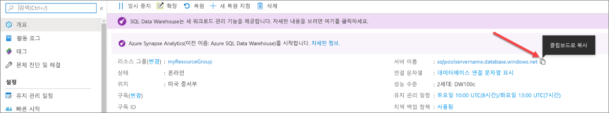

## <a name="connect-to-the-server-as-server-admin"></a>서버 관리자 권한으로 서버에 연결

이 섹션에서는 SSMS([SQL Server Management Studio](/sql/ssms/download-sql-server-management-studio-ssms?toc=/azure/synapse-analytics/sql-data-warehouse/toc.json&bc=/azure/synapse-analytics/sql-data-warehouse/breadcrumb/toc.json&view=azure-sqldw-latest))를 사용하여 Azure SQL 서버에 연결합니다.

1. SQL Server Management Studio를 엽니다.

2. **서버에 연결** 대화 상자에 다음 정보를 입력합니다.

   | 설정 | 제안 값 | Description |
   | :------ | :-------------- | :---------- |
   | 서버 유형 | 데이터베이스 엔진 | 이 값은 필수입니다. |
   | 서버 이름 | 정규화된 서버 이름 | 예를 들면 다음과 같습니다. **sqlpoolservername.database.windows.net**. |
   | 인증 | SQL Server 인증 | SQL 인증은 이 자습서에서 구성되어 있는 유일한 인증 유형입니다. |
   | 로그인 | 서버 관리자 계정 | 서버를 만들 때 지정한 계정입니다. |
   | 암호 | 서버 관리자 계정의 암호 | 서버를 만들 때 지정한 암호입니다. |
   ||||

   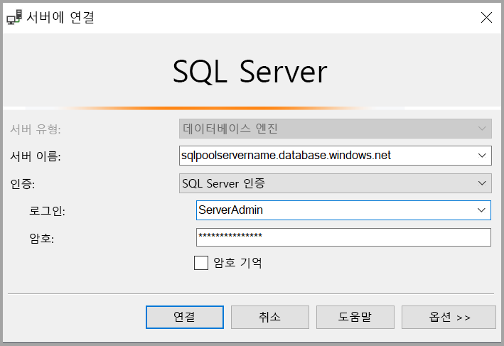

3. **연결**을 선택합니다. SSMS에서 개체 탐색기 창이 열립니다.

4. 개체 탐색기에서 **데이터베이스**를 확장합니다. 그런 다음 **mySampleDatabase**를 확장하여 새 데이터베이스의 개체를 표시합니다.

   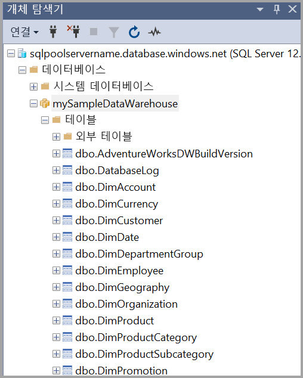

## <a name="run-some-queries"></a>일부 쿼리 실행

[제한된 리소스 클래스](resource-classes-for-workload-management.md)를 사용하므로 서버 관리자로 기록되는 동안에는 많은 쿼리를 실행하지 않는 것이 좋습니다. 대신 [자습서에 설명된](https://docs.microsoft.com/azure/synapse-analytics/sql-data-warehouse/load-data-wideworldimportersdw#create-a-user-for-loading-data) 대로 [워크로드 격리](https://docs.microsoft.com/azure/synapse-analytics/sql-data-warehouse/quickstart-configure-workload-isolation-tsql)를 구성합니다.

SQL Data Warehouse는 쿼리 언어로 T-SQL을 사용합니다. 쿼리 창을 열고 T-SQL 쿼리 몇 개를 실행하려면 다음 단계를 수행합니다.

1. 마우스 오른쪽 단추로 **mySampleDataWarehouse**를 선택하고 **새 쿼리**를 선택합니다. 새 쿼리 창이 열립니다.

2. 쿼리 창에서 다음 명령을 입력하여 데이터베이스 목록을 표시합니다.

    ```sql
    SELECT * FROM sys.databases
    ```

3. **실행**을 선택합니다. 쿼리 결과로 **master** 및 **mySampleDataWarehouse** 데이터베이스가 표시됩니다.

   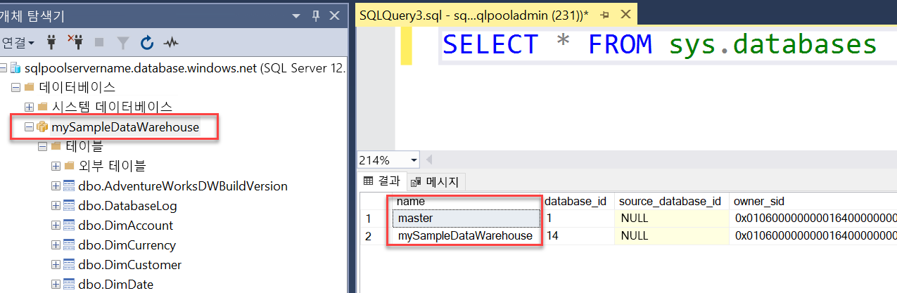

4. 일부 데이터를 살펴보려면 다음 명령을 사용하여 성이 Adams이고 자녀 세 명을 둔 고객의 수를 확인합니다. 결과에 6명의 고객이 나열됩니다.

    ```sql
    SELECT LastName, FirstName FROM dbo.dimCustomer
    WHERE LastName = 'Adams' AND NumberChildrenAtHome = 3;
    ```

   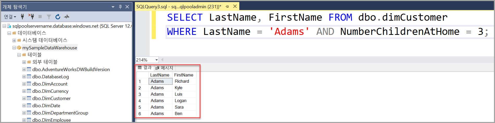

## <a name="clean-up-resources"></a>리소스 정리

데이터 웨어하우스 단위 및 SQL 풀에 저장된 데이터에 대해 요금이 청구됩니다. 이러한 컴퓨팅 및 스토리지 리소스에 대한 요금이 별도로 청구됩니다.

- 데이터를 스토리지에 보관하려는 경우 SQL 풀을 사용하지 않을 때 컴퓨팅을 일시 중지할 수 있습니다. 컴퓨팅을 일시 중지하면 데이터 스토리지 비용만 부과됩니다. 데이터를 작업할 준비가 완료되면 언제든지 컴퓨팅을 다시 시작할 수 있습니다.

- 앞으로 요금이 부과되지 않게 하려면 SQL 풀을 삭제하면 됩니다.

다음 단계에 따라 더 이상 필요없는 리소스를 정리할 수 있습니다.

1. [Azure Portal](https://portal.azure.com)에 로그인하고 SQL 풀을 선택합니다.

   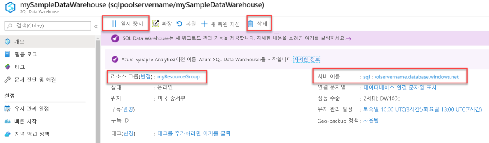

2. 컴퓨팅을 일시 중지하려면 **일시 중지** 단추를 선택합니다. SQL 풀이 일시 중지되면 **다시 시작** 단추가 표시됩니다. 컴퓨팅을 다시 시작하려면 **다시 시작**을 선택합니다.

3. 컴퓨팅 또는 스토리지에 대한 요금이 청구되지 않도록 SQL 풀을 제거하려면 **삭제**를 선택합니다.

4. 만든 SQL 서버를 제거하려면 이전 이미지에 있는 **sqlpoolservername.database.windows.net**을 선택한 다음, **삭제**를 선택합니다. 서버를 삭제하면 해당 서버에 할당된 모든 데이터베이스가 삭제되므로 주의해서 실행해야 합니다.

5. 리소스 그룹을 제거하려면 **myResourceGroup**을 선택한 다음, **리소스 그룹 삭제**를 선택합니다.

## <a name="next-steps"></a>다음 단계

SQL 풀에 데이터 로드에 대해 자세히 알아보려면 [SQL 풀에 데이터 로드](load-data-from-azure-blob-storage-using-polybase.md) 문서를 계속 진행하세요.
