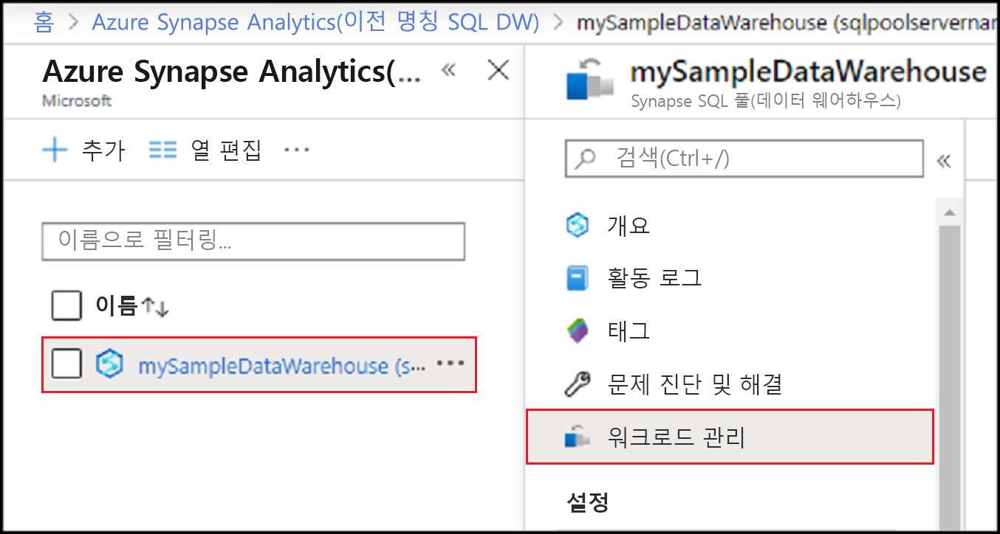
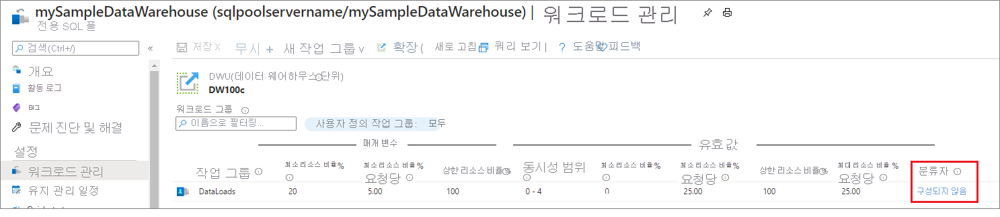
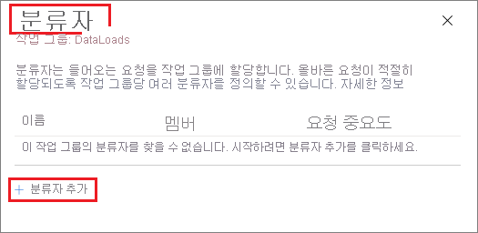
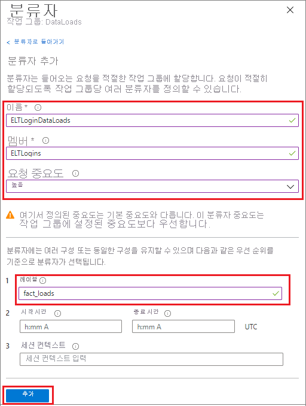
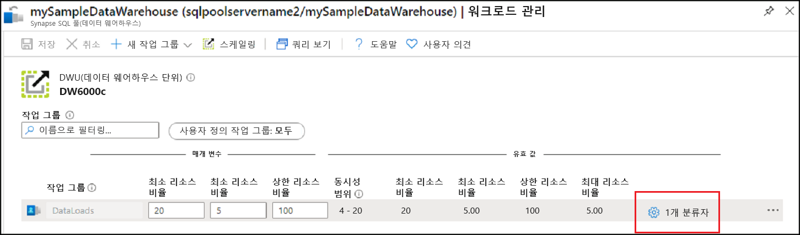
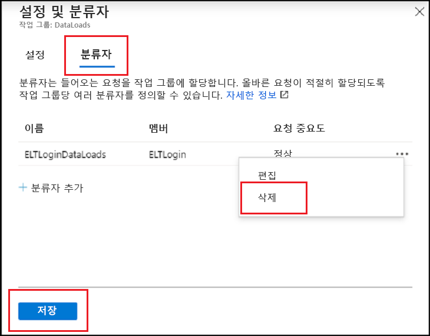
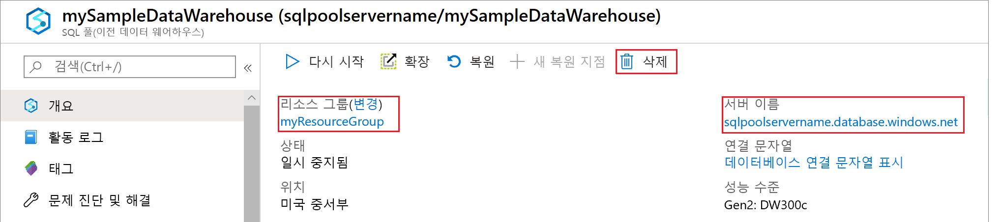

# <a name="quickstart-create-a-synapse-sql-pool-workload-classifier-using-the-azure-portal"></a>빠른 시작: Azure Portal을 사용하여 Synapse SQL 풀 워크로드 분류자 만들기

이 빠른 시작에서는 워크로드 그룹에 쿼리를 할당하기 위한 [워크로드 분류자](sql-data-warehouse-workload-classification.md)를 만듭니다.  분류자는 `ELTLogin` SQL 사용자의 요청을 `DataLoads` 워크로드 그룹에 할당합니다.   [빠른 시작: 워크로드 격리 구성](quickstart-configure-workload-isolation-portal.md) 자습서를 따라 `DataLoads` 워크로드 그룹을 만듭니다.  이 자습서에서는 요청을 올바르게 분류하는 데 도움이 되는 WLM_LABEL 옵션을 사용하여 워크로드 분류자를 만듭니다.  분류자는 `HIGH` [워크로드 중요도](sql-data-warehouse-workload-importance.md)를 이러한 요청에도 할당합니다.


Azure 구독이 아직 없는 경우 시작하기 전에 [체험](https://azure.microsoft.com/free/) 계정을 만듭니다.


## <a name="sign-in-to-the-azure-portal"></a>Azure Portal에 로그인

[Azure Portal](https://portal.azure.com/)에 로그인합니다.

> [!NOTE]
> Azure Synapse Analytics에서 SQL 풀 인스턴스를 만들면 새로운 청구 가능 서비스가 생성될 수 있습니다.  자세한 내용은 [Azure Synapse Analytics 가격 책정](https://azure.microsoft.com/pricing/details/sql-data-warehouse/)을 참조하세요.

## <a name="prerequisites"></a>사전 요구 사항

이 빠른 시작에서는 Synapse SQL에 SQL 풀 인스턴스가 이미 있고 CONTROL DATABASE 권한이 있다고 가정합니다. 하나 만들어야 할 경우 [만들기 및 연결 - 포털](create-data-warehouse-portal.md)을 사용하여 **mySampleDataWarehouse**라는 데이터 웨어하우스를 만듭니다.
<br><br>
워크로드 그룹 `DataLoads`가 있습니다.  [빠른 시작: 워크로드 격리 구성](quickstart-configure-workload-isolation-portal.md) 자습서를 참조하여 워크로드 그룹을 만듭니다.
<br><br>
>[!IMPORTANT] 
>워크로드 관리를 구성하려면 SQL 풀이 온라인 상태여야 합니다. 


## <a name="create-a-login-for-eltlogin"></a>ELTLogin에 대한 로그인 만들기

`ELTLogin`에 대해 [CREATE LOGIN](/sql/t-sql/statements/create-login-transact-sql?toc=/azure/synapse-analytics/sql-data-warehouse/toc.json&bc=/azure/synapse-analytics/sql-data-warehouse/breadcrumb/toc.json&view=azure-sqldw-latest)을 사용하여 `master` 데이터베이스에 SQL Server 인증 로그인을 만듭니다.

```sql
IF NOT EXISTS (SELECT * FROM sys.sql_logins WHERE name = 'ELTLogin')
BEGIN
CREATE LOGIN [ELTLogin] WITH PASSWORD='<strongpassword>'
END
;
```

## <a name="create-user-and-grant-permissions"></a>사용자 만들기 및 권한 부여

로그인을 만든 후에는 데이터베이스에서 사용자를 만들어야 합니다.  [CREATE USER](/sql/t-sql/statements/create-user-transact-sql?toc=/azure/synapse-analytics/sql-data-warehouse/toc.json&bc=/azure/synapse-analytics/sql-data-warehouse/breadcrumb/toc.json&view=azure-sqldw-latest)를 사용하여 **mySampleDataWarehouse**에서 SQL 사용자 `ELTRole`을 만듭니다.  이 자습서를 진행하는 동안 분류를 테스트하므로 **mySampleDataWarehouse**에 `ELTLogin` 권한을 부여합니다. 

```sql
IF NOT EXISTS (SELECT * FROM sys.database_principals WHERE name = 'ELTLogin')
BEGIN
CREATE USER [ELTLogin] FOR LOGIN [ELTLogin]
GRANT CONTROL ON DATABASE::mySampleDataWarehouse TO ELTLogin 
END
;
```

## <a name="configure-workload-classification"></a>워크로드 분류 구성
분류를 사용하면 일련의 규칙 세트를 기반으로 하는 요청을 워크로드 그룹으로 라우팅할 수 있습니다.  [빠른 시작: 워크로드 격리 구성](quickstart-configure-workload-isolation-portal.md) 자습서에서 `DataLoads` 워크로드 그룹을 만들었습니다.  이제 쿼리를 `DataLoads` 워크로드 그룹으로 라우팅하는 워크로드 분류자를 만듭니다.


1.  Azure Portal의 왼쪽 페이지에서 **Azure Synapse Analytics(이전의 SQL DW)** 를 클릭합니다.
2.  **Azure Synapse Analytics(이전의 SQL DW)** 페이지에서 **mySampleDataWarehouse**를 선택합니다. SQL 풀이 열립니다.
3.  **워크로드 관리**를 클릭합니다.

    

4.  `DataLoads` 워크로드 그룹의 오른쪽에 있는 **설정 & 분류자**를 클릭합니다.

    

5. **분류자**를 클릭합니다.
6. **분류자 추가**를 클릭합니다.

    

7.  **이름**에 `ELTLoginDataLoads`를 입력합니다.
8.  **멤버**에 `ELTLogin`을 입력합니다.
9.  **요청 중요도**에 `High`를 선택합니다.  *선택적* 일반적인 중요도는 기본값입니다.
10. **레이블**에 `fact_loads`를 입력합니다.
11. **추가**를 클릭합니다.
12. **저장**을 클릭합니다.

    

## <a name="verify-and-test-classification"></a>분류 확인 및 테스트
`ELTLoginDataLoads` 분류자가 있는지 확인하려면 [sys.workload_management_workload_classifiers](/sql/relational-databases/system-catalog-views/sys-workload-management-workload-classifiers-transact-sql?view=azure-sqldw-latest) 카탈로그 보기를 확인합니다.

```sql
SELECT * FROM sys.workload_management_workload_classifiers WHERE name = 'ELTLoginDataLoads'
```

분류자 세부 정보를 확인하려면 [sys.workload_management_workload_classifier_details](/sql/relational-databases/system-catalog-views/sys-workload-management-workload-classifier-details-transact-sql?view=azure-sqldw-latest) 카탈로그 보기를 확인합니다.

```sql
SELECT c.[name], c.group_name, c.importance, cd.classifier_type, cd.classifier_value
  FROM sys.workload_management_workload_classifiers c
  JOIN sys.workload_management_workload_classifier_details cd
    ON cd.classifier_id = c.classifier_id
  WHERE c.name = 'ELTLoginDataLoads'
```

다음 명령문을 실행하여 분류를 테스트합니다.  ``ELTLogin``으로 연결되어 있고 쿼리에서 ``Label``이 사용되는지 확인합니다.
```sql
CREATE TABLE factstaging (ColA int)
INSERT INTO factstaging VALUES(0)
INSERT INTO factstaging VALUES(1)
INSERT INTO factstaging VALUES(2)
GO

CREATE TABLE testclassifierfact WITH (DISTRIBUTION = ROUND_ROBIN)
AS
SELECT * FROM factstaging
OPTION (LABEL='fact_loads')
```

`ELTLoginDataLoads` 워크로드 분류자를 사용하여 `DataLoads` 워크로드 그룹으로 분류된 `CREATE TABLE` 문을 확인합니다.
```sql 
SELECT TOP 1 request_id, classifier_name, group_name, resource_allocation_percentage, submit_time, [status], [label], command 
FROM sys.dm_pdw_exec_requests 
WHERE [label] = 'fact_loads'
ORDER BY submit_time DESC
```


## <a name="clean-up-resources"></a>리소스 정리

이 자습서에서 만든 `ELTLoginDataLoads` 워크로드 분류자를 삭제하려면 다음을 수행합니다.

1. `DataLoads` 워크로드 그룹의 오른쪽에 있는 **1 분류자**를 클릭합니다.

    

2. **분류자**를 클릭합니다.
3. `ELTLoginDataLoads` 워크로드 분류자의 오른쪽에 있는 **`...`** 를 클릭합니다.
4. **삭제**를 클릭합니다.
5. **Save**를 클릭합니다.

    

데이터 웨어하우스 단위 및 데이터 웨어하우스에 저장된 데이터에 대해 요금이 청구됩니다. 이러한 컴퓨팅 및 스토리지 리소스에 대한 요금이 별도로 청구됩니다.

- 데이터를 스토리지에 보관하려는 경우 데이터 웨어하우스를 사용하지 않을 때 컴퓨팅을 일시 중지할 수 있습니다. 컴퓨팅을 일시 중지하면 데이터 스토리지 비용만 부과됩니다. 데이터로 작업할 준비가 되면 컴퓨팅을 다시 시작합니다.
- 앞으로 요금이 부과되지 않게 하려면 데이터 웨어하우스를 삭제하면 됩니다.

다음 단계에 따라 리소스를 정리합니다.

1. [Azure Portal](https://portal.azure.com)에 로그인하고 데이터 웨어하우스에서 선택합니다.

    

2. 컴퓨팅을 일시 중지하려면 **일시 중지** 단추를 선택합니다. 데이터 웨어하우스가 일시 중지되면 **시작** 단추가 표시됩니다.  컴퓨팅을 다시 시작하려면 **시작**을 선택합니다.

3. 컴퓨팅 또는 스토리지에 대한 요금이 청구되지 않도록 데이터 웨어하우스를 제거하려면 **삭제**를 선택합니다.

4. 만든 SQL 서버를 제거하려면 이전 이미지에 있는 **sqlpoolservername.database.windows.net**을 선택한 다음, **삭제**를 선택합니다.  서버를 삭제하면 해당 서버에 할당된 모든 데이터베이스가 삭제되므로 주의해서 실행해야 합니다.

5. 리소스 그룹을 제거하려면 **myResourceGroup**을 선택한 다음, **리소스 그룹 삭제**를 선택합니다.

## <a name="next-steps"></a>다음 단계

Azure Portal 모니터링 메트릭을 사용하여 워크로드를 모니터링합니다.  자세한 내용은 [Workload Management 관리 및 모니터링](sql-data-warehouse-how-to-manage-and-monitor-workload-importance.md)을 참조하세요.
