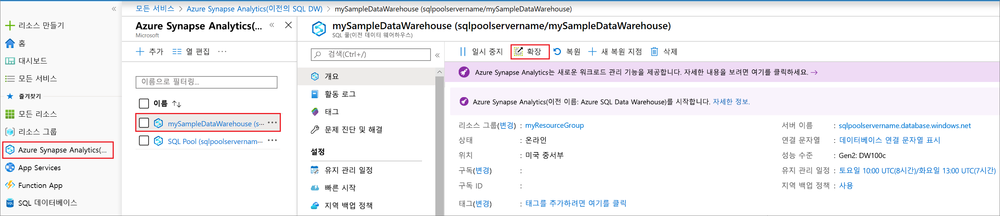
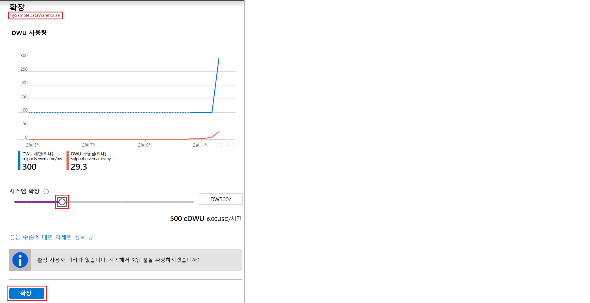

# 빠른 시작: Azure Portal을 사용하여 Synapse SQL 풀에 대한 컴퓨팅 크기 조정

Azure Portal을 사용하여 Synapse SQL 풀(데이터 웨어하우스)에 대한 컴퓨팅을 크기 조정할 수 있습니다. 더 나은 성능을 위해 [컴퓨팅 능력을 확장](sql-data-warehouse-manage-compute-overview.md)하거나 비용 절감을 위해 다시 축소할 수 있습니다. 

Azure 구독이 아직 없는 경우 시작하기 전에 [체험](https://azure.microsoft.com/free/) 계정을 만듭니다.

## Azure Portal에 로그인

[Azure Portal](https://portal.azure.com/)에 로그인합니다.

## 시작하기 전에

이미 있는 SQL 풀의 크기를 조정하거나 [빠른 시작: 만들기 및 연결 - 포털](create-data-warehouse-portal.md)을 사용하여 **mySampleDataWarehouse**라는 SQL 풀을 만듭니다. 이 빠른 시작은 **mySampleDataWarehouse** 크기를 조정합니다.

>[!IMPORTANT] 
>SQL 풀이 확장하려면 온라인 상태여야 합니다. 

## 컴퓨팅 크기 조정

SQL 풀 컴퓨팅 리소스는 데이터 웨어하우스 단위를 늘리거나 줄여서 확장할 수 있습니다. [만들기 및 연결 - 포털] 빠른 시작(create-data-warehouse-portal.md)에서 **mySampleDataWarehouse**를 만들고 이를 400DWU로 초기화했습니다. 다음 단계에서는 **mySampleDataWarehouse**에 대해 DWU를 조정합니다.

데이터 웨어하우스 단위를 변경하려면

1. Azure Portal의 왼쪽 페이지에서 **Azure Synapse Analytics(이전의 SQL DW)** 를 클릭합니다.
2. **Azure Synapse Analytics(이전의 SQL DW)** 페이지에서 **mySampleDataWarehouse**를 선택합니다. SQL 풀이 열립니다.
3. **크기 조정**을 클릭합니다.

    

2. 크기 조정 패널에서 슬라이더를 왼쪽 또는 오른쪽으로 이동해 DWU 설정을 변경합니다. 그런 다음, 크기 조정을 선택합니다.

    

## 다음 단계
SQL 풀에 대해 자세히 알아보려면 [SQL 풀에 데이터 로드](load-data-from-azure-blob-storage-using-polybase.md) 자습서를 계속 진행하세요. 
