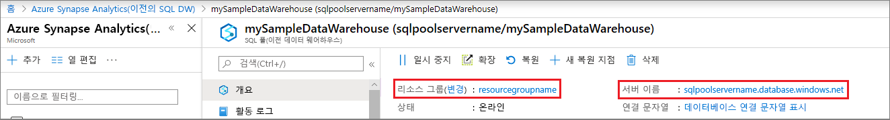

# <a name="quickstart-scale-compute-for-synapse-sql-pool-with-azure-powershell"></a>빠른 시작: Azure PowerShell을 사용하여 Synapse SQL 풀에 대한 컴퓨팅 크기 조정

Azure PowerShell을 사용하여 Synapse SQL 풀(데이터 웨어하우스)에 대한 컴퓨팅을 크기 조정할 수 있습니다. 더 나은 성능을 위해 [컴퓨팅 능력을 확장](sql-data-warehouse-manage-compute-overview.md)하거나 비용 절감을 위해 다시 축소할 수 있습니다.

Azure 구독이 아직 없는 경우 시작하기 전에 [체험](https://azure.microsoft.com/free/) 계정을 만듭니다.

## <a name="before-you-begin"></a>시작하기 전에

[!INCLUDE [updated-for-az](../../../includes/updated-for-az.md)]

이 빠른 시작에서는 규모를 조정할 수 있는 SQL 풀이 이미 있다고 가정합니다. 만들어야 하는 경우 [만들기 및 연결 - 포털](create-data-warehouse-portal.md)을 사용하여 **mySampleDataWarehouse**라는 SQL 풀을 만듭니다.

## <a name="log-in-to-azure"></a>Azure에 로그인

[Connect-AzAccount](/powershell/module/az.accounts/connect-azaccount?toc=/azure/synapse-analytics/sql-data-warehouse/toc.json&bc=/azure/synapse-analytics/sql-data-warehouse/breadcrumb/toc.json) 명령을 사용하여 Azure 구독에 로그인하고 화면의 지시를 따릅니다.

```powershell
Connect-AzAccount
```

사용 중인 구독을 보려면 [Get-AzSubscription](/powershell/module/az.accounts/get-azsubscription?toc=/azure/synapse-analytics/sql-data-warehouse/toc.json&bc=/azure/synapse-analytics/sql-data-warehouse/breadcrumb/toc.json)을 실행합니다.

```powershell
Get-AzSubscription
```

기본 구독과는 다른 구독을 사용해야 할 경우 [Set-AzContext](/powershell/module/az.accounts/set-azcontext?toc=/azure/synapse-analytics/sql-data-warehouse/toc.json&bc=/azure/synapse-analytics/sql-data-warehouse/breadcrumb/toc.json)를 실행합니다.

```powershell
Set-AzContext -SubscriptionName "MySubscription"
```

## <a name="look-up-data-warehouse-information"></a>데이터 웨어하우스 정보 조회

일시 중지 및 다시 시작하려는 데이터 웨어하우스의 데이터베이스 이름, 서버 이름 및 리소스 그룹을 찾습니다.

다음 단계에 따라 데이터 웨어하우스에 대한 위치 정보를 찾습니다.

1. [Azure Portal](https://portal.azure.com/)에 로그인합니다.
2. Azure Portal의 왼쪽 탐색 페이지에서 **Azure Synapse Analytics(이전의 SQL DW)** 를 클릭합니다.
3. **Azure Synapse Analytics(이전의 SQL DW)** 페이지에서 **mySampleDataWarehouse**를 선택하여 데이터 웨어하우스를 엽니다.

    

4. 데이터베이스 이름으로 사용되는 데이터 웨어하우스 이름을 적어 둡니다. 데이터 웨어하우스는 데이터베이스의 한 종류입니다. 또한 서버 이름 및 리소스 그룹도 적어 둡니다. 일시 중지 및 다시 시작 명령에서 서버 이름과 리소스 그룹 이름을 사용합니다.
5. PowerShell cmdlet에서 서버 이름의 첫 부분만 사용합니다. 위 그림에서 전체 서버 이름은 sqlpoolservername.database.windows.net입니다. PowerShell cmdlet에서는 **sqlpoolservername**을 서버 이름으로 사용합니다.

## <a name="scale-compute"></a>컴퓨팅 크기 조정

SQL 풀에서 데이터 웨어하우스 단위를 조정하여 컴퓨팅 리소스를 늘리거나 줄일 수 있습니다. [만들기 및 연결 - 포털](create-data-warehouse-portal.md)에서 **mySampleDataWarehouse**를 만들고 400 DWU로 초기화했습니다. 다음 단계에서는 **mySampleDataWarehouse**에 대해 DWU를 조정합니다.

데이터 웨어하우스 단위를 변경하려면 [Set-AzSqlDatabase](/powershell/module/az.sql/set-azsqldatabase?toc=/azure/synapse-analytics/sql-data-warehouse/toc.json&bc=/azure/synapse-analytics/sql-data-warehouse/breadcrumb/toc.json) PowerShell cmdlet을 사용합니다. 다음 예제에서는 **sqlpoolservername** 서버의 리소스 그룹 **resourcegroupname**에서 호스트되는 데이터베이스 **mySampleDataWarehouse**에 대해 데이터 웨어하우스 단위를 DW300c로 설정합니다.

```Powershell
Set-AzSqlDatabase -ResourceGroupName "resourcegroupname" -DatabaseName "mySampleDataWarehouse" -ServerName "sqlpoolservername" -RequestedServiceObjectiveName "DW300c"
```

## <a name="check-data-warehouse-state"></a>데이터 웨어하우스 상태 확인

데이터 웨어하우스의 현재 상태를 보려면 [Get-AzSqlDatabase](/powershell/module/az.sql/get-azsqldatabase?toc=/azure/synapse-analytics/sql-data-warehouse/toc.json&bc=/azure/synapse-analytics/sql-data-warehouse/breadcrumb/toc.json) PowerShell cmdlet을 사용합니다. 이 cmdlet에는 리소스 그룹 **resourcegroupname** 및 서버 **sqlpoolservername.database.windows.net**에 있는 **mySampleDataWarehouse** 데이터베이스의 상태가 표시됩니다.

```powershell
$database = Get-AzSqlDatabase -ResourceGroupName resourcegroupname -ServerName sqlpoolservername -DatabaseName mySampleDataWarehouse
```

결과는 다음과 유사합니다.

```powershell
ResourceGroupName             : resourcegroupname
ServerName                    : sqlpoolservername
DatabaseName                  : mySampleDataWarehouse
Location                      : North Europe
DatabaseId                    : 34d2ffb8-b70a-40b2-b4f9-b0a39833c974
Edition                       : DataWarehouse
CollationName                 : SQL_Latin1_General_CP1_CI_AS
CatalogCollation              :
MaxSizeBytes                  : 263882790666240
Status                        : Online
CreationDate                  : 11/20/2017 9:18:12 PM
CurrentServiceObjectiveId     : 284f1aff-fee7-4d3b-a211-5b8ebdd28fea
CurrentServiceObjectiveName   : DW300c
RequestedServiceObjectiveId   : 284f1aff-fee7-4d3b-a211-5b8ebdd28fea
RequestedServiceObjectiveName :
ElasticPoolName               :
EarliestRestoreDate           :
Tags                          :
ResourceId                    : /subscriptions/xxxxxxxx-xxxx-xxxx-xxxx-xxxxxxxxxxxx/
                                resourceGroups/resourcegroupname/providers/Microsoft.Sql/servers/sqlpoolservername/databases/mySampleDataWarehouse
CreateMode                    :
ReadScale                     : Disabled
ZoneRedundant                 : False
```

출력에서 데이터베이스의 **상태**를 확인할 수 있습니다. 이 경우 이 데이터베이스가 온라인 상태인지 확인할 수 있습니다.  이 명령을 실행하면 온라인, 일시 중지 중, 다시 시작 중, 크기 조정 또는 일시 중지됨의 상태가 표시됩니다.

상태를 자체적으로 확인하려면 다음 명령을 실행합니다.

```powershell
$database | Select-Object DatabaseName,Status
```

## <a name="next-steps"></a>다음 단계

지금까지 SQL 풀에 대한 컴퓨팅 규모를 조정하는 방법을 알아보았습니다. SQL 풀에 대해 자세히 알아보려면 데이터 로드에 대한 자습서를 계속 진행하세요.

> [!div class="nextstepaction"]
>[SQL 풀에 데이터 로드](load-data-from-azure-blob-storage-using-polybase.md)
