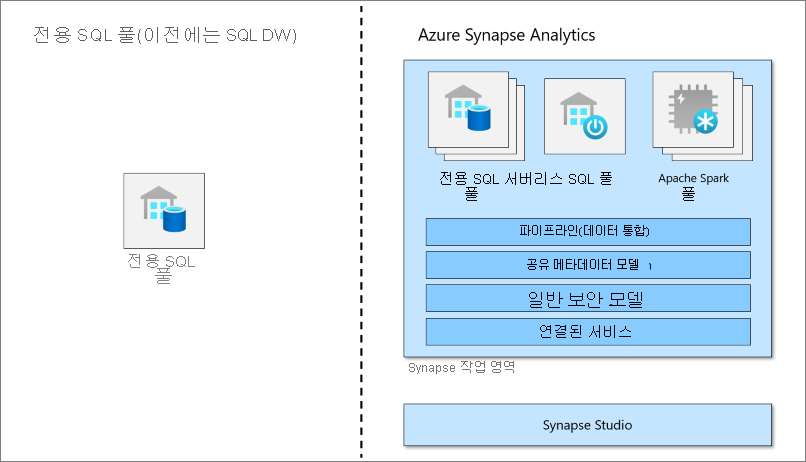

# Azure Synapse Analytics의 전용 SQL 풀(이전의 SQL DW)이란?

Azure Synapse Analytics는 엔터프라이즈 데이터 웨어하우징과 빅 데이터 분석을 결합한 분석 서비스입니다. 전용 SQL 풀(이전의 SQL DW)은 Azure Synapse Analytics에서 사용할 수 있는 엔터프라이즈 데이터 웨어하우징 기능을 나타냅니다.

전용 SQL 풀(이전의 SQL DW)은 Synapse SQL을 사용할 때 프로비저닝되는 분석 리소스의 컬렉션을 나타냅니다. 전용 SQL 풀(이전의 SQL DW)의 크기는 DWU(Data Warehousing Unit)에 의해 결정됩니다.

전용 SQL 풀이 생성되면 간단한 [PolyBase](/sql/relational-databases/polybase/polybase-guide?toc=/azure/synapse-analytics/sql-data-warehouse/toc.json&bc=/azure/synapse-analytics/sql-data-warehouse/breadcrumb/toc.json&view=azure-sqldw-latest&preserve-view=true) T-SQL 쿼리를 사용하여 빅 데이터를 가져온 다음, 분산 쿼리 엔진의 기능을 사용하여 고성능 분석을 실행할 수 있습니다. 데이터를 통합하고 분석할 때 전용 SQL 풀(이전의 SQL DW)은 비즈니스가 더 빠르고 강력한 인사이트를 위해 신뢰할 수 있는 단일 버전의 정보입니다.

> [!NOTE]
>[Azure Synapse Analytics 설명서](../overview-what-is.md)를 살펴보세요.
> 

## 빅 데이터 솔루션의 핵심 구성 요소

데이터 웨어하우징은 클라우드를 기반으로 하는 엔드투엔드 빅 데이터 솔루션의 핵심 구성 요소입니다.

클라우드 데이터 솔루션에서 데이터는 다양한 원본의 빅 데이터 저장소에 수집됩니다. 빅 데이터 저장소에서는 Hadoop, Spark 및 Machine Learning 알고리즘을 통해 데이터를 준비하고 학습합니다. 복잡한 분석에 대한 데이터가 준비되면 전용 SQL 풀은 PolyBase를 사용하여 빅 데이터 저장소를 쿼리합니다. PolyBase는 표준 T-SQL 쿼리를 사용하여 전용 SQL 풀(이전의 SQL DW) 테이블로 데이터를 가져옵니다.

전용 SQL 풀(이전의 SQL DW)은 열 형식 스토리지를 사용하여 관계형 테이블에 데이터를 저장합니다. 이 형식으로 인해 데이터 스토리지 비용이 상당히 감소하고 쿼리 성능이 향상됩니다. 데이터가 저장되면 대규모로 분석을 실행할 수 있습니다. 기존 데이터베이스 시스템에 비해 분석 쿼리는 몇 분이 아닌 몇 초, 몇 일이 아닌 몇 시간 안에 완료됩니다.

분석 결과는 전 세계 보고 데이터베이스 또는 애플리케이션으로 이동할 수 있습니다. 그러면 비즈니스 분석가가 합리적인 비즈니스 결정을 내리기 위한 정보를 파악할 수 있습니다.

## 다음 단계

- [Azure Synapse 아키텍처](massively-parallel-processing-mpp-architecture.md) 살펴보기
- 신속하게 [전용 SQL 풀 만들기](create-data-warehouse-portal.md)
- [샘플 데이터 로드](./load-data-from-azure-blob-storage-using-copy.md)
- [비디오](https://azure.microsoft.com/documentation/videos/index/?services=sql-data-warehouse) 살펴보기

또는 다음과 같은 기타 Azure Synapse 리소스를 살펴봅니다.

- [블로그](https://azure.microsoft.com/blog/tag/azure-sql-data-warehouse/) 검색
- [기능 요청](https://feedback.azure.com/forums/307516-sql-data-warehouse) 제출
- [지원 티켓 만들기](sql-data-warehouse-get-started-create-support-ticket.md)
- [Microsoft Q&A 질문 페이지](/answers/topics/azure-synapse-analytics.html) 검색
- [Stack Overflow 포럼](https://stackoverflow.com/questions/tagged/azure-sqldw) 검색