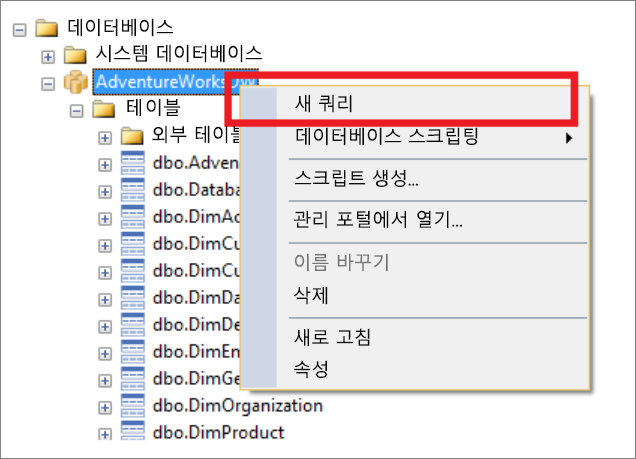
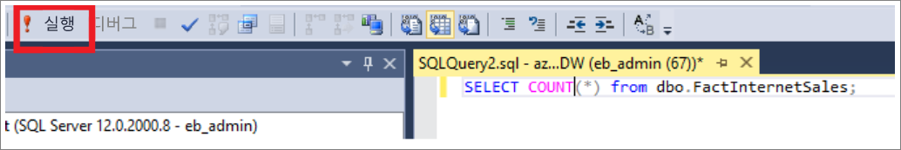
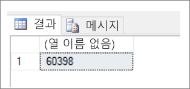

# <a name="connect-to-azure-synapse-analytics-with-sql-server-management-studio-ssms"></a>SQL 서버 관리 스튜디오(SSMS)를 사용하여 Azure 시냅스 분석에 연결

> [!div class="op_single_selector"]
>
> * [Power BI](sql-data-warehouse-get-started-visualize-with-power-bi.md)
> * [Azure 기계 학습](sql-data-warehouse-get-started-analyze-with-azure-machine-learning.md)
> * [Visual Studio](sql-data-warehouse-query-visual-studio.md)
> * [Sqlcmd](sql-data-warehouse-get-started-connect-sqlcmd.md)
> * [SSMS](sql-data-warehouse-query-ssms.md)

SSMS(SQL Server 관리 스튜디오)를 사용하여 Azure Synapse 내의 데이터 웨어하우스에 연결하고 쿼리합니다.

## <a name="prerequisites"></a>사전 요구 사항

이 자습서를 사용하려면 다음이 필요합니다.

* 기존 SQL 풀입니다. 하나를 만들려면 [SQL 풀 만들기를](create-data-warehouse-portal.md)참조하십시오.
* SSMS(SQL Server Management Studio) 설치됨. [SSMS를](/sql/ssms/download-sql-server-management-studio-ssms?toc=/azure/synapse-analytics/sql-data-warehouse/toc.json&bc=/azure/synapse-analytics/sql-data-warehouse/breadcrumb/toc.json&view=azure-sqldw-latest) 아직 가지고 있지 않은 경우 무료로 다운로드하십시오.
* 정규화된 SQL 서버 이름. 이 정보를 찾으려면 [SQL 풀에 연결 을](sql-data-warehouse-connect-overview.md)참조하십시오.

## <a name="1-connect-to-your-sql-pool"></a>1. SQL 풀에 연결

1. SSMS를 엽니다.
2. **파일** > 연결 개체 탐색기를 선택하여 개체**탐색기를 엽니다.**

    
3. 서버 창에 연결에서 필드를 입력합니다.

   

   * **서버 이름**. 이전에 식별한 **서버 이름** 을 입력합니다.
   * **인증**: **SQL Server 인증** 또는 **Active Directory 통합 인증**을 선택합니다.
   * **사용자 이름** 및 **암호**. 위에서 SQL Server 인증을 선택한 경우 사용자 이름 및 암호를 입력합니다.
   * **연결**을 클릭합니다.
4. 탐색하려면 SQL Azure Server를 확장합니다. 서버와 연결된 데이터베이스를 볼 수 있습니다. AdventureWorksDW를 확장하여 샘플 데이터베이스의 테이블을 확인합니다.

   

## <a name="2-run-a-sample-query"></a>2. 샘플 쿼리 실행

데이터베이스에 대한 연결을 설정했으므로 쿼리를 작성합니다.

1. SQL Server 개체 탐색기에서 데이터베이스를 마우스 오른쪽 단추로 클릭합니다.
2. **새 쿼리**를 선택합니다. 새 쿼리 창이 열립니다.

   
3. 다음 T-SQL 쿼리를 쿼리 창에 복사합니다.

   ```sql
   SELECT COUNT(*) FROM dbo.FactInternetSales;
   ```

4. 다음 바로 가기를 클릭하거나 `Execute` 사용하여 `F5`쿼리를 실행합니다.

   
5. 쿼리 결과를 봅니다. 이 예에서 FactInternetSales 테이블에는 60398 행이 있습니다.

   

## <a name="next-steps"></a>다음 단계

이제 연결하고 쿼리할 수 있으므로 [Power BI를 사용하여 데이터를 시각화해](sql-data-warehouse-get-started-visualize-with-power-bi.md)보십시오. Azure Active Directory 인증에 대한 환경을 구성하려면 [SQL 풀에 대한 인증 을](sql-data-warehouse-authentication.md)참조하십시오.
