# SQL 풀에 대한 원본 제어 통합

이 자습서에서는 SSDT(SQL Server Data Tools) 데이터베이스 프로젝트를 소스 제어와 통합하는 방법에 대해 간략하게 설명합니다.  원본 제어 통합은 Azure Synapse Analytics에서 SQL 풀 리소스를 사용하여 지속적인 통합 및 배포 파이프라인을 빌드하는 첫 번째 단계입니다.

## 시작하기 전에

- [Azure DevOps 조직](https://azure.microsoft.com/services/devops/)에 가입
- [만들기 및 연결](create-data-warehouse-portal.md) 자습서 진행
- [Visual Studio 2019 설치](https://visualstudio.microsoft.com/vs/older-downloads/)

## Azure DevOps 설정 및 연결

1. Azure DevOps 조직에서 Azure Repo 리포지토리를 통해 SSDT 데이터베이스 프로젝트를 호스트하는 프로젝트를 만듭니다.

   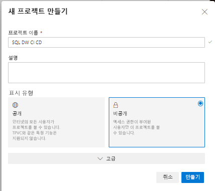

2. Visual Studio를 열고 **연결 관리**를 선택하여 1단계에서 Azure DevOps 조직 및 프로젝트에 연결합니다.

   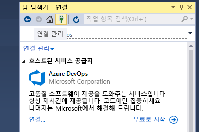

3. **연결 관리**를 선택한 다음, 프**프로젝트에 연결**을 선택하여 프로젝트에 연결합니다.
 

4. 1단계에서 만든 프로젝트를 찾고 **연결**을 선택합니다.

3. 프로젝트에서 로컬 머신으로 Azure DevOps 리포지토리를 복제합니다.

   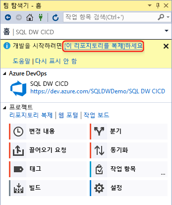

Visual Studio를 사용하여 프로젝트를 연결하는 방법에 대한 자세한 내용은 [팀 탐색기에서 프로젝트에 연결](https://docs.microsoft.com/visualstudio/ide/connect-team-project?view=vs-2019)을 참조하세요. Visual Studio를 사용하여 리포지토리를 복제하는 방법에 대한 지침은 [기존 Git 리포지토리 복제](https://docs.microsoft.com/azure/devops/repos/git/clone?view=azure-devops&tabs=visual-studio) 문서를 검토하세요. 

## 프로젝트 생성 및 연결

1. Visual Studio에서 **로컬 복제 리포지토리**의 디렉터리와 로컬 Git 리포지토리를 모두 사용하여 새 SQL Server 데이터베이스 프로젝트를 만듭니다.

   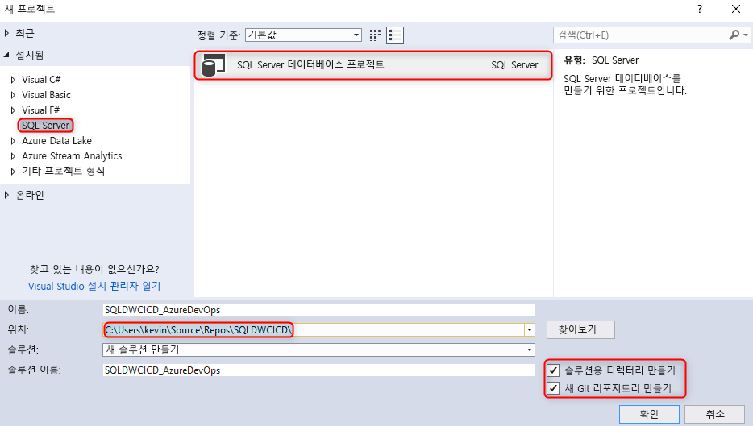  

2. 빈 sqlproject를 마우스 오른쪽 단추로 클릭하고 데이터 웨어하우스를 데이터베이스 프로젝트로 가져옵니다.

   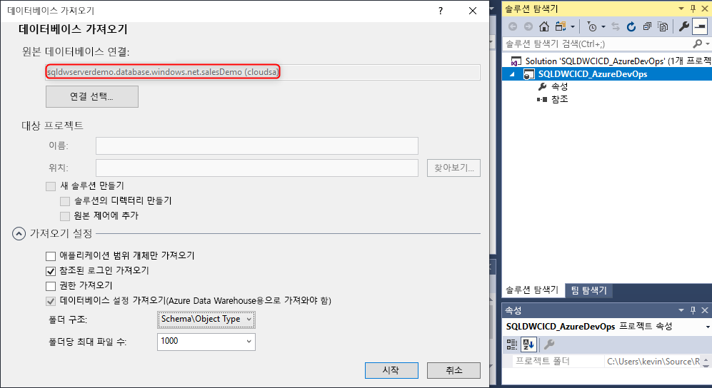  

3. Visual Studio의 팀 탐색기에서 로컬 Git 리포지토리에 대한 변경 내용을 커밋합니다.

   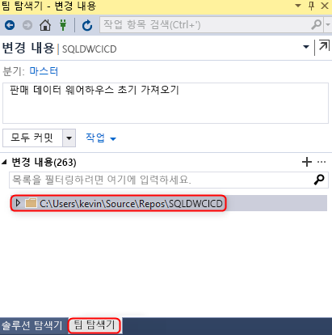  

4. 변경 내용이 복제된 리포지토리에 로컬로 커밋되었으므로 Azure DevOps 프로젝트에서 변경 내용을 Azure Repo 리포지토리에 동기화하고 푸시합니다.

   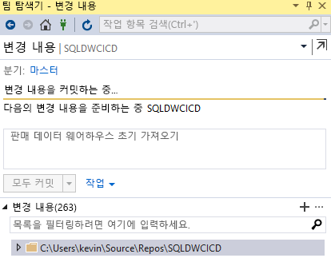

   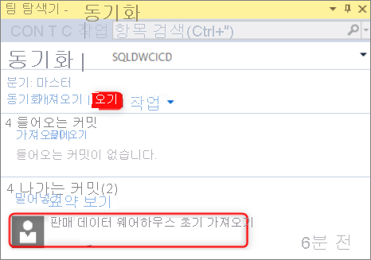  

## 유효성 검사

1. Visual Studio SSDT(SQL Server Data Tools)에서 데이터베이스 프로젝트의 테이블 열을 업데이트하여 변경 내용이 Azure Repo에 푸시되었는지 확인합니다.

   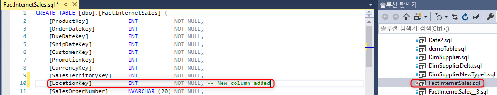

2. 변경 내용을 로컬 리포지토리에서 Azure Repo로 커밋하고 푸시합니다.

   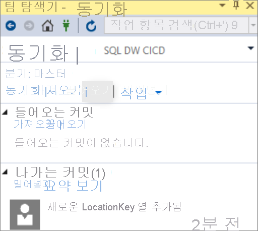

3. 변경 내용이 Azure Repo 리포지토리에 푸시되었는지 확인합니다.

   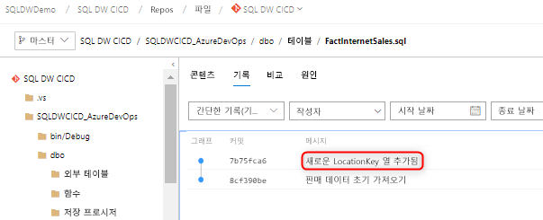

4. (**선택 사항**) 스키마 비교를 사용하고 SSDT를 사용하여 대상 데이터 웨어하우스의 변경 내용을 업데이트하여 Azure Repo 리포지토리 및 로컬 리포지토리의 개체 정의가 데이터 웨어하우스에 반영되도록 합니다.

## 다음 단계

- [SQL 풀 개발](sql-data-warehouse-overview-develop.md)
