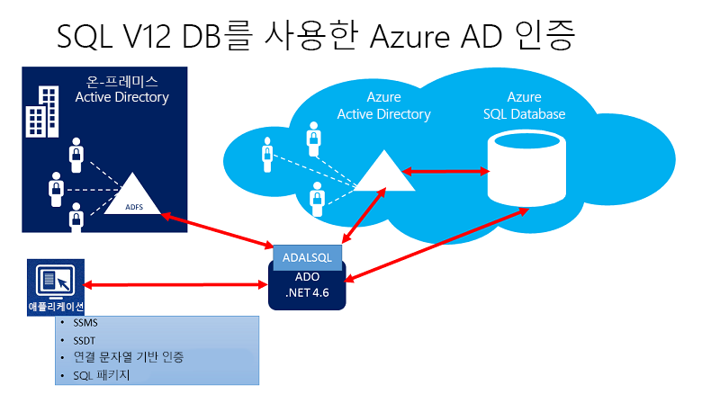
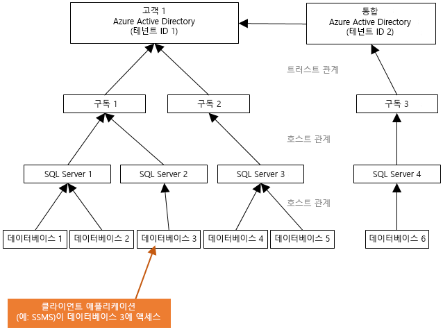
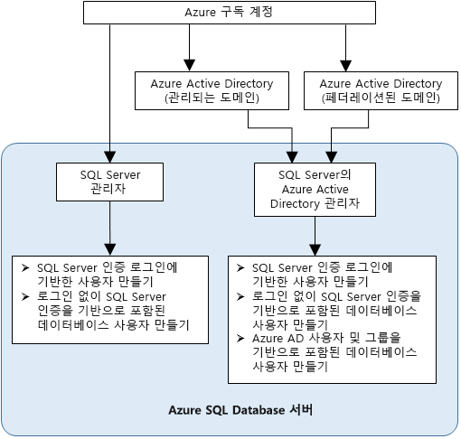

# Synapse SQL에서 인증에 Azure Active Directory 인증 사용

Azure Active Directory 인증은 Azure AD(Azure Active Directory)에서 ID를 사용하여 [Azure Synapse Analytics](../overview-faq.md)에 연결하는 메커니즘입니다.

Azure AD 인증을 사용하면 Azure Synapse에 액세스할 수 있는 사용자의 ID를 중앙에서 관리하여 권한 관리를 간소화할 수 있습니다. 이점은 다음과 같습니다.

- 일반 사용자 이름 및 암호 인증을 대신할 수 있는 대안을 제공합니다.
- 서버 전체에서 사용자 ID의 확산을 중지하는 데 도움이 됩니다.
- 한 곳에서 암호를 회전할 수 있습니다.
- 고객이 외부(Azure AD) 그룹을 사용하여 권한을 관리할 수 있습니다.
- Windows 통합 인증 또는 Azure Active Directory에서 지원하는 기타 인증을 사용하여 암호 저장을 제거할 수 있습니다.
- Azure AD는 Azure Synapse에 연결되는 애플리케이션에 대한 토큰 기반 인증을 지원합니다.
- Azure AD 인증은 도메인 동기화 없이 로컬 Azure Active Directory에 대해 ADFS(도메인 페더레이션) 또는 기본 사용자/암호 인증을 지원합니다.
- Azure AD는 MFA(Multi-Factor Authentication)를 포함하는 Active Directory 유니버설 인증을 사용하는 SQL Server Management Studio를 통해 연결하도록 지원합니다.  MFA는 전화 통화, 문자 메시지, 모바일 앱 알림 등의 여러 가지 간편한 검증 옵션을 제공하는 강력한 인증을 포함합니다. 자세한 내용은 [Synapse SQL에서 Azure AD MFA를 위한 SSMS 지원](mfa-authentication.md)을 참조하세요.
- Azure AD는 Active Directory 대화형 인증을 사용하는 유사한 SSDT(SQL Server Data Tools) 연결을 지원합니다. 자세한 내용은 [SSDT(SQL Server Data Tools)의 Azure Active Directory 지원](/sql/ssdt/azure-active-directory?toc=/azure/synapse-analytics/toc.json&bc=/azure/synapse-analytics/breadcrumb/toc.json&view=azure-sqldw-latest&preserve-view=true)을 참조하세요.

구성 단계에는 Azure Active Directory 인증의 구성 및 사용을 위한 다음 절차가 포함됩니다.

1. Azure AD를 만들고 채웁니다.
2. Azure Active Directory ID 만들기
3. Synapse 작업 영역(미리 보기)에서 만든 Azure Active Directory ID에 역할 할당
4. Azure AD ID를 사용하여 Synapse Studio에 연결합니다.

## Azure Synapse Analytics의 AAD 통과

Azure Synapse Analytics를 사용하면 Azure Active Directory ID를 사용하여 데이터 레이크의 데이터에 액세스할 수 있습니다.

다른 데이터 엔진에 적용되는 파일 및 데이터에 대한 액세스 권한을 정의하면 여러 위치에서 권한을 정의할 필요 없이 한 위치에서 권한을 정의할 수 있으므로 데이터 레이크 솔루션을 단순화할 수 있습니다.

## 트러스트 아키텍처

다음은 Synapse SQL에서 Azure AD 인증을 사용하는 솔루션 아키텍처를 요약하여 보여주는 간략한 다이어그램입니다. Azure AD 기본 사용자 암호를 지원하기 위해 클라우드 부분 및 Azure AD/Synapse SQL만 고려합니다. 페더레이션 인증(또는 Windows 자격 증명에 대한 사용자/암호)을 지원하려면 ADFS 블록과의 통신이 필요합니다. 화살표는 통신 경로 나타냅니다.

다음 다이어그램은 토큰을 제출하여 클라이언트가 데이터베이스에 연결할 수 있는 페더레이션, 신뢰 및 호스팅 관계를 나타냅니다. 이 토큰은 Azure AD를 통해 인증되고 데이터베이스에서 신뢰됩니다. 

고객 1은 기본 사용자가 있는 Azure Active Directory 또는 페더레이션된 사용자가 있는 Azure AD를 나타낼 수 있습니다. 고객 2는 가져온 사용자를 포함하는 가능한 해결 방법을 나타냅니다. 이 예에서는 Azure Active Directory와 동기화되는 ADFS로 페더레이션된 Azure Active Directory에서 가져옵니다. 

Azure AD 인증을 사용하는 데이터베이스에 액세스하려면 호스팅 구독이 Azure AD에 연결되어 있어야 합니다. Azure SQL Database 또는 SQL 풀을 호스트하는 SQL Server를 만들려면 동일한 구독을 사용해야 합니다.

## 관리자 구조

Azure AD 인증을 사용하는 경우 Synapse SQL의 관리자 계정으로는 원래 SQL Server 관리자와 Azure AD 관리자의 두 가지 관리자 계정이 있습니다. Azure AD 계정을 기반으로 하는 관리자만 사용자 데이터베이스에서 최초 Azure AD 포함 데이터베이스 사용자를 만들 수 있습니다. 

Azure AD 관리자 로그인은 Azure AD 사용자나 Azure AD 그룹이 될 수 있습니다. 관리자가 그룹 계정인 경우 모든 그룹 구성원이 사용할 수 있으므로 해당 Synapse SQL 인스턴스에 대해 여러 Azure AD 관리자를 지정할 수 있습니다. 

그룹 계정을 관리자로 사용하면 Synapse Analytics 작업 영역에서 사용자나 권한을 변경하지 않고도 Azure AD의 그룹 구성원을 중앙에서 추가 및 제거할 수 있으므로 관리 효율성이 향상됩니다. 한 번에 하나의 Azure AD 관리자(그룹 또는 사용자)를 구성할 수 있습니다.

## 사용 권한

새 사용자를 만들려면 데이터베이스에서 `ALTER ANY USER` 권한이 있어야 합니다. `ALTER ANY USER` 권한은 아무 데이터베이스 사용자에게나 부여할 수 있습니다. 서버 관리자 계정과, 해당 데이터베이스에 대한 `CONTROL ON DATABASE` 또는 `ALTER ON DATABASE` 권한이 있는 데이터베이스 사용자와, `db_owner` 데이터베이스 역할 그룹의 구성원도 `ALTER ANY USER` 권한을 보유할 수 있습니다.

Synapse SQL에 포함된 데이터베이스 사용자를 만들려면 Azure AD ID를 사용하여 데이터베이스 또는 인스턴스에 연결해야 합니다. 최초 포함 데이터베이스 사용자를 만들려면 Azure AD 관리자(데이터베이스 소유자)를 사용하여 데이터베이스에 연결해야 합니다. 

모든 Azure AD 인증은 Synapse SQL의 Azure AD 관리자가 생성된 경우에만 가능합니다. Azure Active Directory 관리자가 서버에서 제거된 경우 이전에 Synapse SQL 내에서 만든 기존 Azure Active Directory 사용자는 더 이상 Azure Active Directory 자격 증명을 사용하여 데이터베이스에 연결할 수 없습니다.
 
## Azure AD 기능 및 제한 사항

- 다음은 Synapse SQL에서 프로비저닝할 수 있는 Azure AD 구성원입니다.

  - 네이티브 멤버: 고객 도메인 또는 관리형 도메인 내 Azure AD에서 만든 멤버입니다. 자세한 내용은 [Azure AD에 고유한 도메인 이름을 추가](../../active-directory/fundamentals/add-custom-domain.md?toc=/azure/synapse-analytics/toc.json&bc=/azure/synapse-analytics/breadcrumb/toc.json)를 참조하세요.
  - 페더레이션된 도메인 멤버: 페더레이션 도메인으로 Azure AD에 만들어진 멤버입니다. 자세한 내용은 [Microsoft Azure는 이제 Windows Server Active Directory와의 페더레이션 지원](https://azure.microsoft.com/blog/20../../windows-azure-now-supports-federation-with-windows-server-active-directory/)을 참조하세요.
  - 네이티브 또는 페더레이션 도메인 멤버인 다른 Azure AD에서 가져온 멤버입니다.
  - 보안 그룹으로 만들어진 Active Directory 그룹.

- `db_owner` 서버 역할을 가진 그룹에 포함된 Azure AD 사용자는 Synapse SQL에 **[CREATE DATABASE SCOPED CREDENTIAL](/sql/t-sql/statements/create-database-scoped-credential-transact-sql?toc=/azure/synapse-analytics/toc.json&bc=/azure/synapse-analytics/breadcrumb/toc.json&view=azure-sqldw-latest&preserve-view=true)** 구문을 사용할 수 없습니다. 다음 오류가 표시됩니다.

    `SQL Error [2760] [S0001]: The specified schema name 'user@mydomain.com' either does not exist or you do not have permission to use it.`

    개별 Azure AD 사용자에게 직접 `db_owner` 역할을 부여하여 **CREATE DATABASE SCOPED CREDENTIAL** 문제를 해결하세요.

- Azure AD 보안 주체에 따라 실행될 경우 다음 시스템 함수는 NULL 값을 반환합니다.

  - `SUSER_ID()`
  - `SUSER_NAME(<admin ID>)`
  - `SUSER_SNAME(<admin SID>)`
  - `SUSER_ID(<admin name>)`
  - `SUSER_SID(<admin name>)`

## Azure AD ID를 사용하여 연결

Azure Active Directory 인증에서는 Azure AD ID를 사용하여 데이터베이스에 연결하는 다음 방법을 지원합니다.

- Azure Active Directory 암호
- Azure Active Directory 통합
- Azure Active Directory MFA 지원을 통한 유니버설 인증
- 애플리케이션 토큰 인증 사용

Azure AD 서버 보안 주체(로그인)(**공개 미리 보기**)에 대해 지원되는 인증 방법은 다음과 같습니다.

- Azure Active Directory 암호
- Azure Active Directory 통합
- Azure Active Directory MFA 지원을 통한 유니버설 인증

### 기타 고려 사항

- 관리 효율성을 높일 수 있게 관리자 권한으로 전용 Azure AD 그룹을 프로비전하는 것이 좋습니다.
- Synapse SQL 풀에 대한 Azure AD 관리자(사용자 또는 그룹)는 항상 한 명만 구성할 수 있습니다.
  - SQL 주문형(미리 보기)에 대한 Azure AD 서버 보안 주체(로그인)를 추가하면 `sysadmin` 역할에 추가할 수 있는 Azure AD 서버 보안 주체(로그인)를 여러 개 만들 수 있습니다.
- 오직 Synapse SQL의 Azure AD 관리자만이 Azure Active Directory 계정을 사용하여 Synapse SQL에 처음 연결할 수 있습니다. Active Directory 관리자가 이후의 Azure AD 데이터베이스 사용자를 구성할 수 있습니다.
- 연결 제한 시간은 30초로 설정하는 것이 좋습니다.
- SQL Server 2016 Management Studio 및 Visual Studio 2015용 SQL Server Data Tools(버전 14.0.60311.1 2016년 4월 이상)는 Azure Active Directory 인증을 지원합니다. Azure AD 인증은 **.NET Framework Data Provider for SqlServer**(.NET Framework 4.6 버전 이상)에서 지원됩니다. 따라서 이러한 도구 및 데이터 계층 애플리케이션(DAC 및 .BACPAC)의 최신 버전에서는 Azure AD 인증을 사용할 수 있습니다.
- 버전 15.0.1부터 [sqlcmd 유틸리티](/sql/tools/sqlcmd-utility?toc=/azure/synapse-analytics/toc.json&bc=/azure/synapse-analytics/breadcrumb/toc.json&view=azure-sqldw-latest&preserve-view=true) 및 [bcp 유틸리티](/sql/tools/bcp-utility?toc=/azure/synapse-analytics/toc.json&bc=/azure/synapse-analytics/breadcrumb/toc.json&view=azure-sqldw-latest&preserve-view=true)는 MFA를 사용하는 Active Directory 대화형 인증을 지원합니다.
- Visual Studio 2015용 SQL Server Data Tools는 Data Tools의 2016년 4월 버전 이상이 필요합니다(버전 14.0.60311.1). 현재 Azure AD 사용자는 SSDT 개체 탐색기에 표시되지 않습니다. 해결 방법으로 [sys.database_principals](/sql/relational-databases/system-catalog-views/sys-database-principals-transact-sql?toc=/azure/synapse-analytics/toc.json&bc=/azure/synapse-analytics/breadcrumb/toc.json&view=azure-sqldw-latest&preserve-view=true)에서 사용자를 봅니다.
- [SQL Server용 Microsoft JDBC 드라이버 6.0](https://www.microsoft.com/download/details.aspx?id=11774)은 Azure AD 인증을 지원합니다. 또한 [연결 속성 설정](/sql/connect/jdbc/setting-the-connection-properties?toc=/azure/synapse-analytics/toc.json&bc=/azure/synapse-analytics/breadcrumb/toc.json&view=azure-sqldw-latest&preserve-view=true)을 참조하세요.

## 다음 단계

- Synapse SQL의 액세스 및 제어에 대한 개요는 [Synapse SQL 액세스 제어](../sql/access-control.md)를 참조하세요.
- 데이터베이스 보안 주체에 대한 자세한 내용은 [보안 주체](/sql/relational-databases/security/authentication-access/principals-database-engine?toc=/azure/synapse-analytics/toc.json&bc=/azure/synapse-analytics/breadcrumb/toc.json&view=azure-sqldw-latest&preserve-view=true)를 참조하세요.
- 데이터베이스 역할에 대한 자세한 내용은 [데이터베이스 역할](/sql/relational-databases/security/authentication-access/database-level-roles?toc=/azure/synapse-analytics/toc.json&bc=/azure/synapse-analytics/breadcrumb/toc.json&view=azure-sqldw-latest&preserve-view=true)을 참조하세요.

 