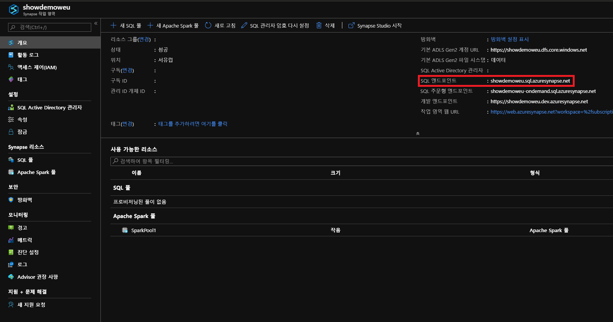
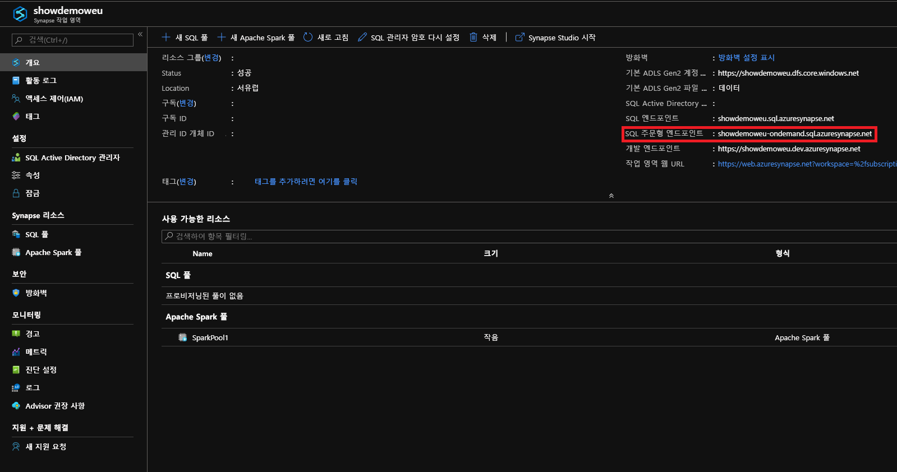

# <a name="connect-to-synapse-sql"></a>Synapse SQL에 연결
Azure Synapse Analytics의 Synapse SQL 기능에 연결합니다.

## <a name="supported-tools-for-sql-on-demand-preview"></a>SQL 주문형(미리 보기)에 지원되는 도구

[Azure Data Studio](/sql/azure-data-studio/download-azure-data-studio)는 버전 1.18.0부터 완전히 지원됩니다. SSMS는 버전 18.5부터 부분적으로 지원되며, 연결 및 쿼리에만 사용할 수 있습니다.

> [!NOTE]
> 쿼리 실행시 AAD 로그인에 1시간을 초과하여 연결이 열려 있는 경우 AAD를 사용하는 모든 쿼리는 실패합니다. 여기에는 AAD 통과 및 AAD와 상호 작용하는 명령문(예: CREATE EXTERNAL PROVIDER)을 사용하여 스토리지를 쿼리하는 작업이 포함됩니다. 이는 SSMS 및 ADS의 쿼리 편집기와 같이 연결이 열린 상태로 유지되는 모든 도구에 영향을 줍니다. 쿼리를 실행하기 위해 새 연결을 여는 도구(예: Synapse Studio)는 영향을 받지 않습니다.

> 이 문제를 완화하기 위해 SSMS를 다시 시작하거나 ADS에서 연결 및 연결 해제할 수 있습니다. 

## <a name="find-your-server-name"></a>서버 이름 찾기

다음 예제에서 SQL 풀의 서버 이름은 showdemoweu.sql.azuresynapse.net입니다.
다음 예제에서 SQL 주문형의 서버 이름은 showdemoweu-ondemand.sql.azuresynapse.net입니다.

정규화된 서버 이름을 찾으려면:

1. [Azure 포털](https://portal.azure.com)로 이동합니다.
2. **Synapse 작업 영역**을 선택합니다.
3. 연결하려는 작업 영역을 선택합니다.
4. 개요로 이동합니다.
5. 전체 서버 이름을 찾습니다.

## <a name="sql-pool"></a>**SQL 풀**



## <a name="sql-on-demand"></a>**SQL 주문형**



## <a name="supported-drivers-and-connection-strings"></a>지원되는 드라이버 및 연결 문자열
Synapse SQL은 [ADO.NET](https://msdn.microsoft.com/library/e80y5yhx(v=vs.110).aspx), [ODBC](https://msdn.microsoft.com/library/jj730314.aspx), [PHP](https://msdn.microsoft.com/library/cc296172.aspx?f=255&MSPPError=-2147217396) 및 [JDBC](https://msdn.microsoft.com/library/mt484311(v=sql.110).aspx)를 지원합니다. 최신 버전 및 설명서를 찾으려면 이전 드라이버 중 하나를 선택합니다. Azure Portal에서 사용 중인 드라이버에 대한 연결 문자열을 자동으로 생성하려면 앞의 예제에서 **데이터베이스 연결 문자열 표시**를 선택합니다. 또한 각 드라이버에 대한 연결 문자열의 모양에 대한 몇 가지 예는 다음과 같습니다.

> [!NOTE]
> 사용 불가능한 짧은 시간 동안 연결이 효력을 유지하려면 연결 제한 시간을 300초로 설정하는 것이 좋습니다.

### <a name="adonet-connection-string-example"></a>ADO.NET 연결 문자열 예제

```csharp
Server=tcp:{your_server}.sql.azuresynapse.net,1433;Database={your_database};User ID={your_user_name};Password={your_password_here};Encrypt=True;TrustServerCertificate=False;Connection Timeout=30;
```

### <a name="odbc-connection-string-example"></a>ODBC 연결 문자열 예제

```csharp
Driver={SQL Server Native Client 11.0};Server=tcp:{your_server}.sql.azuresynapse.net,1433;Database={your_database};Uid={your_user_name};Pwd={your_password_here};Encrypt=yes;TrustServerCertificate=no;Connection Timeout=30;
```

### <a name="php-connection-string-example"></a>PHP 연결 문자열 예제

```PHP
Server: {your_server}.sql.azuresynapse.net,1433 \r\nSQL Database: {your_database}\r\nUser Name: {your_user_name}\r\n\r\nPHP Data Objects(PDO) Sample Code:\r\n\r\ntry {\r\n   $conn = new PDO ( \"sqlsrv:server = tcp:{your_server}.sql.azuresynapse.net,1433; Database = {your_database}\", \"{your_user_name}\", \"{your_password_here}\");\r\n    $conn->setAttribute( PDO::ATTR_ERRMODE, PDO::ERRMODE_EXCEPTION );\r\n}\r\ncatch ( PDOException $e ) {\r\n   print( \"Error connecting to SQL Server.\" );\r\n   die(print_r($e));\r\n}\r\n\rSQL Server Extension Sample Code:\r\n\r\n$connectionInfo = array(\"UID\" => \"{your_user_name}\", \"pwd\" => \"{your_password_here}\", \"Database\" => \"{your_database}\", \"LoginTimeout\" => 30, \"Encrypt\" => 1, \"TrustServerCertificate\" => 0);\r\n$serverName = \"tcp:{your_server}.sql.azuresynapse.net,1433\";\r\n$conn = sqlsrv_connect($serverName, $connectionInfo);
```

### <a name="jdbc-connection-string-example"></a>JDBC 연결 문자열 예제

```Java
jdbc:sqlserver://yourserver.sql.azuresynapse.net:1433;database=yourdatabase;user={your_user_name};password={your_password_here};encrypt=true;trustServerCertificate=false;hostNameInCertificate=*.sql.azuresynapse.net;loginTimeout=30;
```

## <a name="connection-settings"></a>연결 설정
Synapse SQL은 연결 및 개체 생성 중에 몇 가지 설정을 표준화합니다. 이러한 설정은 재정의되거나 다음을 포함할 수 없습니다.

| 데이터베이스 설정 | 값 |
|:--- |:--- |
| [ANSI_NULLS](/sql/t-sql/statements/set-ansi-nulls-transact-sql?toc=/azure/synapse-analytics/toc.json&bc=/azure/synapse-analytics/breadcrumb/toc.json&view=azure-sqldw-latest&preserve-view=true) |켜기 |
| [QUOTED_IDENTIFIERS](/sql/t-sql/statements/set-quoted-identifier-transact-sql?toc=/azure/synapse-analytics/toc.json&bc=/azure/synapse-analytics/breadcrumb/toc.json&view=azure-sqldw-latest&preserve-view=true) |켜기 |
| [DATEFORMAT](/sql/t-sql/statements/set-dateformat-transact-sql?toc=/azure/synapse-analytics/toc.json&bc=/azure/synapse-analytics/breadcrumb/toc.json&view=azure-sqldw-latest&preserve-view=true) |mdy |
| [DATEFIRST](/sql/t-sql/statements/set-datefirst-transact-sql?toc=/azure/synapse-analytics/toc.json&bc=/azure/synapse-analytics/breadcrumb/toc.json&view=azure-sqldw-latest&preserve-view=true) |7 |

## <a name="recommendations"></a>권장 사항

**SQL 주문형** 쿼리를 실행하기 위해 권장되는 도구는 [Azure Data Studio](get-started-azure-data-studio.md) 및 Azure Synapse Studio입니다.

## <a name="next-steps"></a>다음 단계
Visual Studio를 사용하여 연결하고 쿼리하려면 [Visual Studio를 사용하여 쿼리](../sql-data-warehouse/sql-data-warehouse-query-visual-studio.md?toc=/azure/synapse-analytics/toc.json&bc=/azure/synapse-analytics/breadcrumb/toc.json)를 참조하세요. 인증 옵션에 대한 자세한 내용은 [Synapse SQL에 인증](../sql-data-warehouse/sql-data-warehouse-authentication.md?toc=/azure/synapse-analytics/toc.json&bc=/azure/synapse-analytics/breadcrumb/toc.json)을 참조하세요.