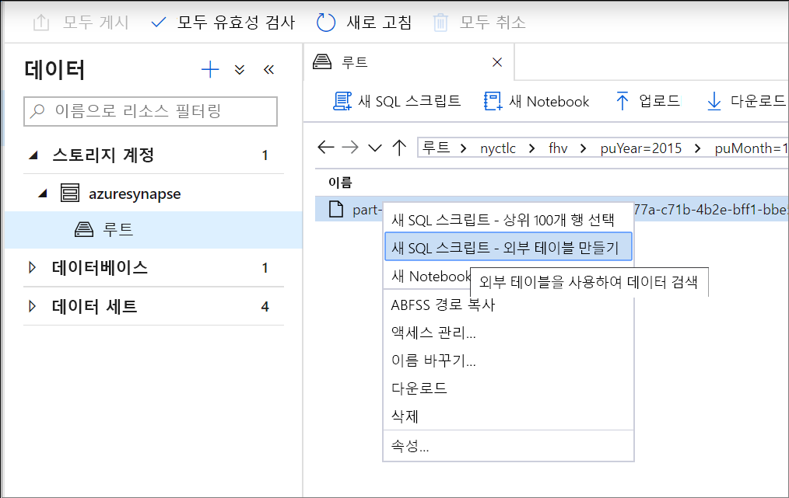
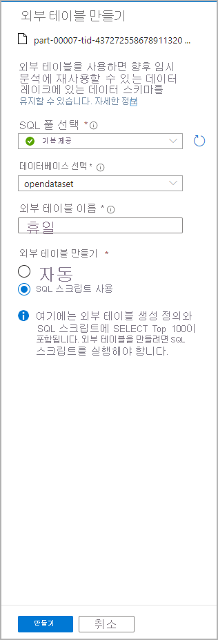
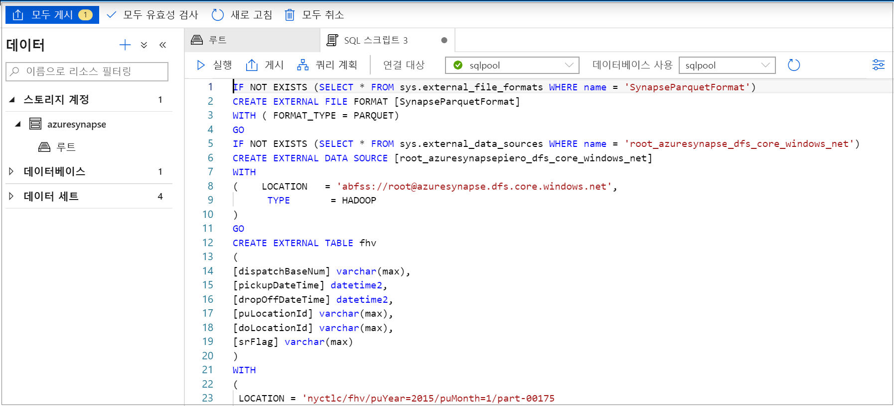
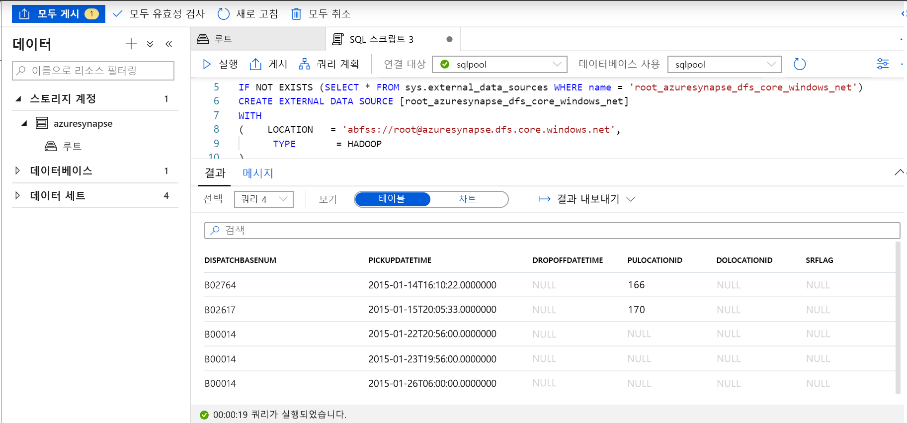
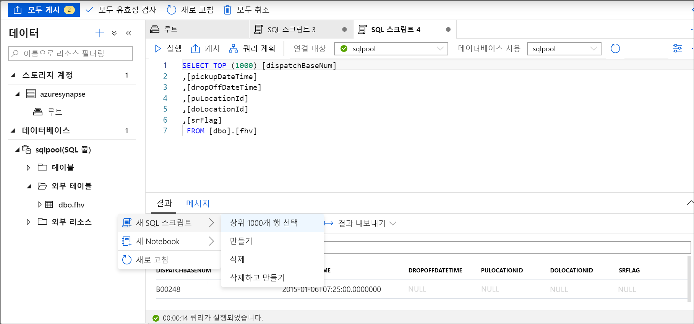

# <a name="use-external-tables-with-synapse-sql"></a>Synapse SQL에서 외부 테이블 사용

외부 테이블은 Hadoop, Azure Storage Blob 또는 Azure Data Lake Storage에 있는 데이터를 가리킵니다. 외부 테이블은 Azure Storage의 파일에서 데이터를 읽거나 쓰는 데 사용됩니다. Synapse SQL을 사용하면 외부 테이블을 사용하여 SQL 풀 또는 SQL 주문형(미리 보기)에서 데이터를 읽고 쓸 수 있습니다.

## <a name="external-tables-in-synapse-sql-pool-and-on-demand"></a>Synapse SQL 풀 및 주문형의 외부 테이블

### <a name="sql-pool"></a>[SQL 풀](#tab/sql-pool) 

SQL 풀에서 외부 테이블을 사용하여 다음을 수행할 수 있습니다.

- Transact-SQL 문을 사용하여 Azure Blob Storage 및 Azure Data Lake Gen2를 쿼리합니다.
- 데이터를 Azure Blob Storage 및 Azure Data Lake Storage에서 SQL 풀로 가져오고 저장합니다.

[CREATE TABLE AS SELECT](../sql-data-warehouse/sql-data-warehouse-develop-ctas.md?toc=/azure/synapse-analytics/toc.json&bc=/azure/synapse-analytics/breadcrumb/toc.json) 문과 함께 사용하는 경우 외부 테이블에서 선택하면 데이터를 SQL 풀 내의 테이블로 가져옵니다. 외부 테이블은 [COPY 문](/sql/t-sql/statements/copy-into-transact-sql?toc=/azure/synapse-analytics/toc.json&bc=/azure/synapse-analytics/breadcrumb/toc.json&view=azure-sqldw-latest) 외에도 데이터를 로드하는 데 유용합니다. 

로드 자습서는 [PolyBase를 사용하여 Azure Blob Storage에서 데이터 로드](../sql-data-warehouse/load-data-from-azure-blob-storage-using-polybase.md?toc=/azure/synapse-analytics/toc.json&bc=/azure/synapse-analytics/breadcrumb/toc.json)를 참조하세요.

### <a name="sql-on-demand"></a>[SQL 주문형](#tab/sql-on-demand)

SQL 주문형의 경우 외부 테이블을 사용하여 다음을 수행할 수 있습니다.

- Transact-SQL 문을 사용하여 Azure Blob Storage 또는 Azure Data Lake Storage에서 데이터를 쿼리합니다.
- [CETAS](develop-tables-cetas.md)를 사용하여 SQL 주문형 쿼리 결과를 Azure Blob Storage 또는 Azure Data Lake Storage의 파일에 저장합니다.

다음 단계를 통해 SQL 주문형을 사용하여 외부 테이블을 만들 수 있습니다.

1. CREATE EXTERNAL DATA SOURCE
2. CREATE EXTERNAL FILE FORMAT
3. CREATE EXTERNAL TABLE

---

### <a name="security"></a>보안

사용자가 데이터를 읽으려면 외부 테이블에 대해 `SELECT` 권한이 있어야 합니다.
다음 규칙을 사용하여 데이터 원본에 정의된 데이터베이스 범위의 자격 증명을 사용하는 기본 Azure Storage에 대한 외부 테이블 액세스:
- 자격 증명이 없는 데이터 원본의 경우 외부 테이블이 Azure Storage에서 공개적으로 사용 가능한 파일에 액세스할 수 있습니다.
- 데이터 원본에는 외부 테이블이 SAS 토큰 또는 작업 영역 관리 ID를 사용해서 Azure Storage에 있는 파일만 액세스하도록 설정하는 자격 증명이 포함되어 있습니다. 예를 들어 [스토리지 파일 개발 스토리지 액세스 제어](develop-storage-files-storage-access-control.md#examples) 문서를 참조하세요.

> [!IMPORTANT]
> SQL 풀에서 자격 증명이 없는 데이터 원본에서는 Azure AD 사용자가 자신의 Azure AD ID를 사용해서 스토리지 파일에 액세스할 수 있습니다. 주문형 SQL에서는 `IDENTITY='User Identity'` 속성이 포함된 데이터베이스 범위의 자격 증명을 사용하여 데이터 원본을 만들어야 합니다. [예제는 여기를 참조하세요](develop-storage-files-storage-access-control.md#examples).

## <a name="create-external-data-source"></a>CREATE EXTERNAL DATA SOURCE

외부 데이터 원본은 스토리지 계정에 연결하는 데 사용됩니다. 전체 설명서는 [여기](/sql/t-sql/statements/create-external-data-source-transact-sql?toc=/azure/synapse-analytics/toc.json&bc=/azure/synapse-analytics/breadcrumb/toc.json&view=azure-sqldw-latest)에 요약되어 있습니다.

### <a name="syntax-for-create-external-data-source"></a>CREATE EXTERNAL DATA SOURCE 구문

#### <a name="sql-pool"></a>[SQL 풀](#tab/sql-pool)

```syntaxsql
CREATE EXTERNAL DATA SOURCE <data_source_name>
WITH
(    LOCATION         = '<prefix>://<path>'
     [, CREDENTIAL = <database scoped credential> ]
     , TYPE = HADOOP
)
[;]
```

#### <a name="sql-on-demand"></a>[SQL 주문형](#tab/sql-on-demand)

```syntaxsql
CREATE EXTERNAL DATA SOURCE <data_source_name>
WITH
(    LOCATION         = '<prefix>://<path>'
     [, CREDENTIAL = <database scoped credential> ]
)
[;]
```

---

### <a name="arguments-for-create-external-data-source"></a>CREATE EXTERNAL DATA SOURCE 인수

data_source_name

데이터 원본에 대한 사용자 정의 이름을 지정합니다. 이름은 반드시 데이터베이스 내에서 고유해야 합니다.

#### <a name="location"></a>위치
LOCATION = `'<prefix>://<path>'` - 외부 데이터 원본에 대한 연결 프로토콜 및 경로를 제공합니다. 경로에는 `'<prefix>://<path>/container'` 형식의 컨테이너와 `'<prefix>://<path>/container/folder'` 형식의 폴더가 포함될 수 있습니다.

| 외부 데이터 원본        | 위치 접두사 | 위치 경로                                         |
| --------------------------- | --------------- | ----------------------------------------------------- |
| Azure Blob Storage          | `wasb[s]`       | `<container>@<storage_account>.blob.core.windows.net` |
| Azure Data Lake Store Gen 1 | `adl`           | `<storage_account>.azuredatalake.net`                 |
| Azure Data Lake Store Gen 2 | `abfs[s]`       | `<container>@<storage_account>.dfs.core.windows.net`  |

#### <a name="credential"></a>자격 증명
CREDENTIAL = `<database scoped credential>`은 Azure Storage에서 인증을 수행하기 위해 사용되는 선택적인 자격 증명입니다. 자격 증명이 없는 외부 데이터 원본은 공용 스토리지 계정에 액세스할 수 있습니다. 

SQL 풀에서 자격 증명이 없는 외부 데이터 원본은 또한 호출자 Azure AD ID를 사용하여 스토리지에 있는 파일에 액세스할 수 있습니다. 자격 증명이 있는 외부 데이터 원본은 자격 증명에 지정된 ID를 사용하여 파일에 액세스합니다.
- SQL 풀에서 데이터베이스 범위의 자격 증명은 사용자 지정 애플리케이션 ID, 작업 영역 관리 ID 또는 SAK 키를 지정할 수 있습니다. 
- 주문형 SQL에서 데이터베이스 범위의 자격 증명은 호출자의 Azure AD ID, 작업 영역 관리 ID 또는 SAS 키를 지정할 수 있습니다. 

#### <a name="type"></a>TYPE
TYPE = `HADOOP`는 SQL 풀에서 필수 옵션이며, 기본 파일 액세스를 위해 Polybase 기술이 사용되도록 지정합니다. 기본 제공되는 고유 판독기를 사용하는 주문형 SQL 서비스에서는 이 매개 변수를 사용할 수 없습니다.

### <a name="example-for-create-external-data-source"></a>CREATE EXTERNAL DATA SOURCE 예제

#### <a name="sql-pool"></a>[SQL 풀](#tab/sql-pool)

다음 예제에서는 뉴욕 데이터 세트를 가리키는 Azure Data Lake Gen2에 대한 외부 데이터 원본을 만듭니다.

```sql
CREATE EXTERNAL DATA SOURCE AzureDataLakeStore
WITH
  -- Please note the abfss endpoint when your account has secure transfer enabled
  ( LOCATION = 'abfss://newyorktaxidataset.azuredatalakestore.net' ,
    CREDENTIAL = ADLS_credential ,
    TYPE = HADOOP
  ) ;
```

#### <a name="sql-on-demand"></a>[SQL 주문형](#tab/sql-on-demand)

다음 예제에서는 SAS 자격 증명을 사용하여 액세스될 수 있는 Azure Data Lake Gen2에 대한 외부 데이터 원본을 만듭니다.

```sql
CREATE DATABASE SCOPED CREDENTIAL [sqlondemand]
WITH IDENTITY='SHARED ACCESS SIGNATURE',  
SECRET = 'sv=2018-03-28&ss=bf&srt=sco&sp=rl&st=2019-10-14T12%3A10%3A25Z&se=2061-12-31T12%3A10%3A00Z&sig=KlSU2ullCscyTS0An0nozEpo4tO5JAgGBvw%2FJX2lguw%3D'
GO

CREATE EXTERNAL DATA SOURCE SqlOnDemandDemo WITH (
    LOCATION = 'https://sqlondemandstorage.blob.core.windows.net',
    CREDENTIAL = sqlondemand
);
```

다음 예제에서는 공개적으로 사용할 수 있는 뉴욕 데이터 세트를 가리키는 Azure Data Lake Gen2에 대한 외부 데이터 원본을 만듭니다.

```sql
CREATE EXTERNAL DATA SOURCE YellowTaxi
WITH ( LOCATION = 'https://azureopendatastorage.blob.core.windows.net/nyctlc/yellow/')
```
---

## <a name="create-external-file-format"></a>CREATE EXTERNAL FILE FORMAT

Azure Blob Storage 또는 Azure Data Lake Storage에 저장된 외부 데이터를 정의하는 외부 파일 형식 개체를 만듭니다. 외부 파일 형식을 만드는 것은 외부 테이블을 만들기 위한 필수 구성 요소입니다. 전체 설명서는 [여기](/sql/t-sql/statements/create-external-file-format-transact-sql?toc=/azure/synapse-analytics/toc.json&bc=/azure/synapse-analytics/breadcrumb/toc.json&view=azure-sqldw-latest)에 있습니다.

외부 파일 형식을 만드는 경우 외부 테이블에서 참조하는 데이터의 실제 레이아웃을 지정합니다.

### <a name="syntax-for-create-external-file-format"></a>CREATE EXTERNAL FILE FORMAT 구문

```syntaxsql
-- Create an external file format for PARQUET files.  
CREATE EXTERNAL FILE FORMAT file_format_name  
WITH (  
    FORMAT_TYPE = PARQUET  
    [ , DATA_COMPRESSION = {  
        'org.apache.hadoop.io.compress.SnappyCodec'  
      | 'org.apache.hadoop.io.compress.GzipCodec'      }  
    ]);  

--Create an external file format for DELIMITED TEXT files
CREATE EXTERNAL FILE FORMAT file_format_name  
WITH (  
    FORMAT_TYPE = DELIMITEDTEXT  
    [ , DATA_COMPRESSION = 'org.apache.hadoop.io.compress.GzipCodec' ]
    [ , FORMAT_OPTIONS ( <format_options> [ ,...n  ] ) ]  
    );  

<format_options> ::=  
{  
    FIELD_TERMINATOR = field_terminator  
    | STRING_DELIMITER = string_delimiter
    | First_Row = integer
    | USE_TYPE_DEFAULT = { TRUE | FALSE }
    | Encoding = {'UTF8' | 'UTF16'}
}
```

### <a name="arguments-for-create-external-file-format"></a>CREATE EXTERNAL FILE FORMAT 인수

file_format_name - 외부 파일 형식의 이름을 지정합니다.

FORMAT_TYPE = [ PARQUET | DELIMITEDTEXT] - 외부 데이터의 형식을 지정합니다.

- PARQUET - Parquet 형식을 지정합니다.
- DELIMITEDTEXT - 필드 종결자라고도 하는 열 구분 기호가 있는 텍스트 형식을 만듭니다.

FIELD_TERMINATOR = *field_terminator* - 분리된 텍스트 파일에만 적용됩니다. 필드 종결자는 구분 기호로 분리된 텍스트 파일의 각 필드(열)의 끝을 표시하는 하나 이상의 문자를 지정합니다. 기본값은 파이프 문자('|')입니다.

예제:

- FIELD_TERMINATOR = '|'
- FIELD_TERMINATOR = ' '
- FIELD_TERMINATOR = \t

STRING_DELIMITER = *string_delimiter* - 텍스트 구분 파일에서 문자열 형식의 데이터에 대한 필드 종결자를 지정합니다. 문자열 구분 기호는 길이가 한 자 이상이며 작은따옴표로 묶입니다. 기본값은 빈 문자열("")입니다.

예제:

- STRING_DELIMITER = '"'
- STRING_DELIMITER = '*'
- STRING_DELIMITER = ,

FIRST_ROW = *First_row_int* - 먼저 읽고 모든 파일에 적용되는 행 번호를 지정합니다. 값이 2로 설정되면 데이터를 로드할 때 모든 파일의 첫 번째 행(머리글 행)을 건너뜁니다. 행은 행 종결자(/r/n, /r, /n)의 존재를 기준으로 건너뜁니다.

USE_TYPE_DEFAULT = { TRUE | **FALSE** } - 텍스트 파일에서 데이터를 검색하는 경우 분리된 텍스트 파일에서 누락된 값을 처리하는 방법을 지정합니다.

TRUE - 텍스트 파일에서 데이터를 검색하는 경우 외부 테이블 정의의 해당 열에 대한 기본값의 데이터 형식을 사용하여 누락된 각 값을 저장합니다. 예를 들어, 누락된 값을 다음으로 바꿉니다.

- 열이 숫자 열로 정의되었으면 0 10진수 열은 지원되지 않으며 오류가 발생합니다.
- 열이 문자열이면 빈 문자열("")입니다.
- 열이 날짜 열이면 1900-01-01

FALSE - 모든 누락된 값을 NULL로 저장합니다. 구분 기호로 분리된 텍스트 파일에서 NULL이라는 단어를 사용하여 저장된 모든 NULL 값은 문자열 'NULL'로 가져옵니다.

Encoding = {'UTF8' | 'UTF16'} - SQL 주문형에서 분리된 UTF8 및 UTF16 인코딩 텍스트 파일을 읽을 수 있습니다.

DATA_COMPRESSION = *data_compression_method* - 이 인수는 외부 데이터에 대한 데이터 압축 방법을 지정합니다. 

PARQUET 파일 형식 유형은 다음 압축 메서드를 지원합니다.

- DATA_COMPRESSION = 'org.apache.hadoop.io.compress.GzipCodec'
- DATA_COMPRESSION = 'org.apache.hadoop.io.compress.SnappyCodec'

PARQUET 외부 테이블에서 읽을 때는 이 인수가 무시되지만, [CETAS](develop-tables-cetas.md)를 사용하여 외부 테이블에 쓸 때 사용됩니다.

DELIMITEDTEXT 파일 형식 유형은 다음 압축 메서드를 지원합니다.

- DATA_COMPRESSION = 'org.apache.hadoop.io.compress.GzipCodec'

### <a name="example-for-create-external-file-format"></a>CREATE EXTERNAL FILE FORMAT 예제

다음 예제에서는 인구 조사 파일에 대한 외부 파일 형식을 만듭니다.

```sql
CREATE EXTERNAL FILE FORMAT census_file_format
WITH
(  
    FORMAT_TYPE = PARQUET,
    DATA_COMPRESSION = 'org.apache.hadoop.io.compress.SnappyCodec'
)
```

## <a name="create-external-table"></a>CREATE EXTERNAL TABLE

CREATE EXTERNAL TABLE 명령은 Synapse SQL에서 Azure Blob Storage 또는 Azure Data Lake Storage에 저장된 데이터에 액세스하기 위한 외부 테이블을 만듭니다. 

### <a name="syntax-for-create-external-table"></a>CREATE EXTERNAL TABLE 구문

```sql
CREATE EXTERNAL TABLE { database_name.schema_name.table_name | schema_name.table_name | table_name }
    ( <column_definition> [ ,...n ] )  
    WITH (
        LOCATION = 'folder_or_filepath',  
        DATA_SOURCE = external_data_source_name,  
        FILE_FORMAT = external_file_format_name
    )  
[;]  

<column_definition> ::=
column_name <data_type>
    [ COLLATE collation_name ]
```

### <a name="arguments-create-external-table"></a>CREATE EXTERNAL TABLE 인수

*{ database_name.schema_name.table_name | schema_name.table_name | table_name }*

만들려는 테이블의 한 부분에서 세 부분으로 이루어진 이름입니다. 외부 테이블의 경우 SQL 주문형은 테이블 메타데이터만 저장합니다. SQL 주문형에서는 실제 데이터가 이동하거나 저장되지 않습니다.

<column_definition>, ...*n* ]

CREATE EXTERNAL TABLE은 열 이름, 데이터 형식, Null 허용 여부 및 데이터 정렬을 구성하는 기능을 지원합니다. 외부 테이블에 DEFAULT CONSTRAINT를 사용할 수 없습니다.

>[!IMPORTANT]
>데이터 형식 및 열 수를 포함한 열 정의는 외부 파일의 데이터와 일치해야 합니다. 불일치가 있는 경우 실제 데이터를 쿼리할 때 파일 행이 거부됩니다.

Parquet 파일에서 읽는 경우 읽으려는 열만 지정하고 나머지는 건너뛸 수 있습니다.

LOCATION = '*folder_or_filepath*'

Azure Blob Storage의 실제 데이터에 대한 폴더 또는 파일 경로 및 파일 이름을 지정합니다. 위치는 루트 폴더에서 시작합니다. 루트 폴더는 외부 데이터 원본에 지정된 데이터 위치입니다.

폴더 위치가 지정되면 SQL 주문형 쿼리를 통해 외부 테이블에서 선택하고 폴더에서 파일을 검색합니다.

> [!NOTE]
> Hadoop 및 PolyBase와 달리 SQL 주문형은 하위 폴더를 반환하지 않습니다. 파일 이름이 밑줄(_) 또는 마침표(.)로 시작하는 파일을 반환합니다.

다음 예에서 LOCATION='/webdata/'이면 SQL 주문형 쿼리에서 mydata.txt 및 _hidden.txt의 행을 반환합니다. mydata2.txt 및 mydata3.txt는 하위 폴더에 있으므로 반환되지 않습니다.


DATA_SOURCE = *external_data_source_name* - 외부 데이터의 위치를 포함한 외부 데이터 원본의 이름을 지정합니다. 외부 데이터 원본을 만들려면 [CREATE EXTERNAL DATA SOURCE](#create-external-data-source)를 사용합니다.

FILE_FORMAT = *external_file_format_name* - 외부 데이터의 파일 형식 및 압축 방법을 저장하는 외부 파일 형식 개체의 이름을 지정합니다. 외부 파일 형식을 만들려면 [CREATE EXTERNAL FILE FORMAT](#create-external-file-format)을 사용합니다.

### <a name="permissions-create-external-table"></a>CREATE EXTERNAL TABLE 권한

외부 테이블에서 선택하려면 목록 및 읽기 권한이 있는 적절한 자격 증명이 필요합니다.

### <a name="example-create-external-table"></a>CREATE EXTERNAL TABLE 예제

다음 예제에서는 외부 테이블을 만듭니다. 첫 번째 행을 반환합니다.

```sql
CREATE EXTERNAL TABLE census_external_table
(
    decennialTime varchar(20),
    stateName varchar(100),
    countyName varchar(100),
    population int,
    race varchar(50),
    sex    varchar(10),
    minAge int,
    maxAge int
)  
WITH (
    LOCATION = '/parquet/',
    DATA_SOURCE = population_ds,  
    FILE_FORMAT = census_file_format
)
GO

SELECT TOP 1 * FROM census_external_table
```

## <a name="create-and-query-external-tables-from-a-file-in-azure-data-lake"></a>Azure Data Lake의 파일에서 외부 테이블 만들기 및 쿼리

이제 Data Lake 검색 기능을 사용하면 마우스 오른쪽 단추로 파일을 간단히 클릭하여 SQL 풀 또는 SQL 주문형에서 외부 테이블을 만들고 쿼리할 수 있습니다.

### <a name="prerequisites"></a>사전 요구 사항

- 작업 영역에 대한 액세스 권한(ADLS Gen2 계정에 대한 Storage Blob 데이터 기여자 ARM 액세스 역할 이상)이 있어야 합니다.

- SQL 풀 또는 SQL OD에서 외부 테이블을 [만들고 쿼리할 수 있는 권한](/sql/t-sql/statements/create-external-table-transact-sql?toc=/azure/synapse-analytics/toc.json&bc=/azure/synapse-analytics/breadcrumb/toc.json&view=azure-sqldw-latest#permissions-2) 이상이 있어야 합니다.

- ADLS Gen2 계정과 연결되는 연결된 서비스에는 **파일에 대한 액세스 권한**이 있어야 합니다. 예를 들어 연결된 서비스 인증 메커니즘이 관리 ID인 경우 작업 영역 관리 ID에는 스토리지 계정에 대한 Storage Blob 읽기 권한자 이상의 권한이 있어야 합니다.

[데이터] 패널에서 외부 테이블을 만드는 데 사용할 파일을 선택합니다.
> [!div class="mx-imgBorder"]
>

대화 상자 창이 열립니다. SQL 풀 또는 SQL 주문형을 선택하고, 테이블 이름을 지정하고, [스크립트 열기]를 선택합니다.

> [!div class="mx-imgBorder"]
>

파일에서 스키마를 유추하여 SQL 스크립트가 자동으로 생성됩니다.
> [!div class="mx-imgBorder"]
>

스크립트를 실행합니다. 스크립트에서 Select Top 100 *를 자동으로 실행합니다.
> [!div class="mx-imgBorder"]
>

이제 외부 테이블이 만들어집니다. 사용자는 나중에 [데이터] 창에서 직접 쿼리하여 이 외부 테이블의 콘텐츠를 검색할 수 있습니다.
> [!div class="mx-imgBorder"]
>

## <a name="next-steps"></a>다음 단계

쿼리 결과를 Azure Storage의 외부 테이블에 저장하는 방법은 [CETAS](develop-tables-cetas.md) 문서를 확인하세요. 또는 [Apache Spark for Azure Synapse 외부 테이블](develop-storage-files-spark-tables.md) 쿼리를 시작할 수 있습니다.
