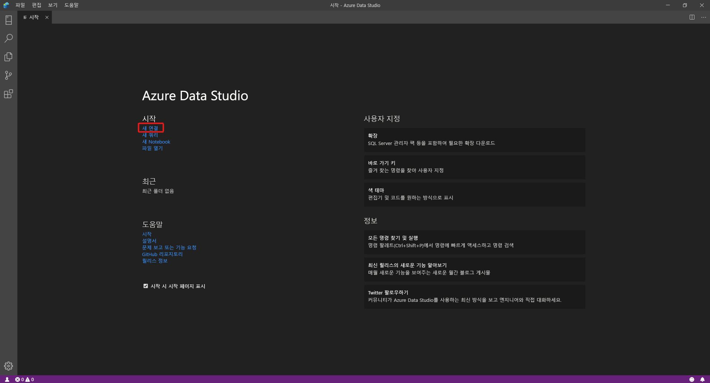
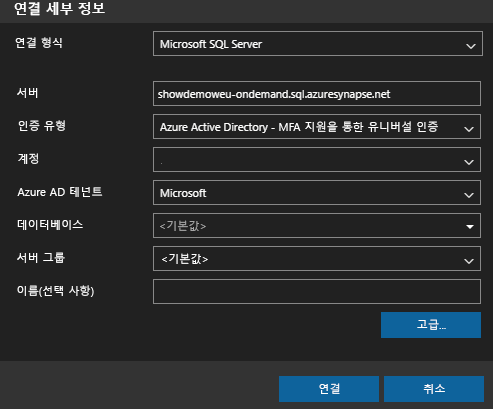
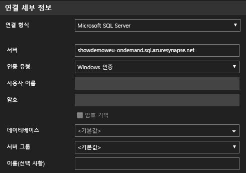
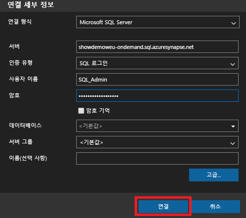
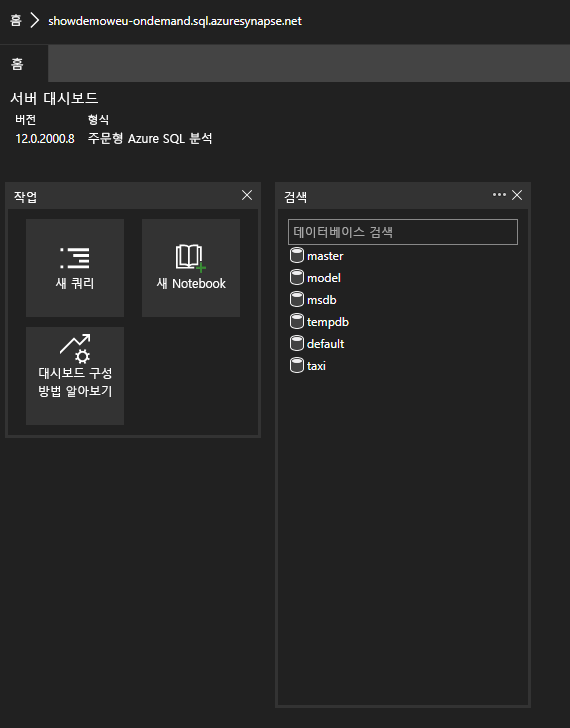
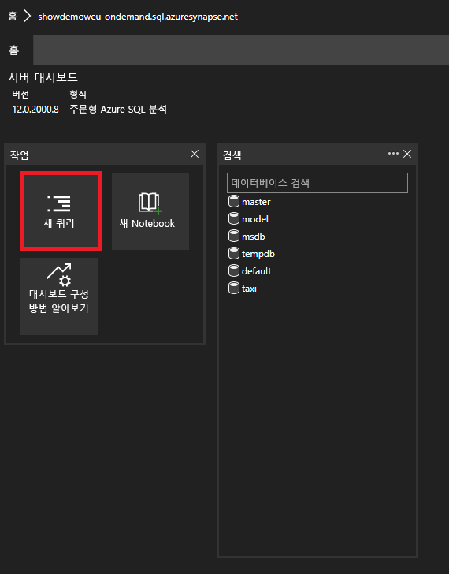

# <a name="connect-to-synapse-sql-with-azure-data-studio-preview"></a>Azure Data Studio를 사용하여 Synapse SQL에 연결(미리 보기)

> [!div class="op_single_selector"]
>
> * [Azure Data Studio](get-started-azure-data-studio.md)
> * [Power BI](get-started-power-bi-professional.md)
> * [Visual Studio](../sql-data-warehouse/sql-data-warehouse-query-visual-studio.md?toc=/azure/synapse-analytics/toc.json&bc=/azure/synapse-analytics/breadcrumb/toc.json)
> * [sqlcmd](get-started-connect-sqlcmd.md)
> * [SSMS](get-started-ssms.md)

[Azure Data Studio(미리 보기)](/sql/azure-data-studio/download-azure-data-studio?toc=/azure/synapse-analytics/toc.json&bc=/azure/synapse-analytics/breadcrumb/toc.json&view=azure-sqldw-latest)를 사용하여 Azure Synapse Analytics에서 Synapse SQL에 연결하고 쿼리할 수 있습니다. 

## <a name="connect"></a>연결

Synapse SQL에 연결하려면 Azure Data Studio를 열고 **새 연결** 을 선택합니다.



**연결 형식** 으로 **Microsoft SQL Server** 를 선택합니다.

연결에는 다음 매개 변수가 필요합니다.

* **서버:** `<Azure Synapse workspace name>`-ondemand.sql.azuresynapse.net 형식의 서버
* **데이터베이스:** 데이터베이스 이름

> [!NOTE]
> **SQL 주문형(미리 보기)** 을 사용하려는 경우 URL은 다음과 같아야 합니다.
>
> - `<Azure Synapse workspace name>`-ondemand.sql.azuresynapse.net.
>
> **SQL 풀** 을 사용하려는 경우 URL은 다음과 같아야 합니다.
>
> - `<Azure Synapse workspace name>`.sql.azuresynapse.net

**인증 유형** 으로 **Windows 인증** , **Azure Active Directory** 또는 **SQL 로그인** 을 선택합니다.

인증 유형으로 **SQL 로그인** 을 사용하려면 사용자 이름/암호 매개 변수를 추가합니다.

* **사용자:** `<User>` 양식의 서버 사용자
* **암호:** 사용자와 연결된 암호

Azure Active Directory를 사용하려면 필요한 인증 유형을 선택해야 합니다.



다음 스크린샷은 **Windows 인증** 에 대한 **연결 세부 정보** 를 보여줍니다.



다음 스크린샷은 **SQL 로그인** 을 사용하는 **연결 세부 정보** 를 보여줍니다.



성공적으로 로그인하면 다음과 같은 대시보드가 표시됩니다. 

## <a name="query"></a>쿼리

연결되면 인스턴스에 대해 지원되는 [T-SQL(Transact-SQL)](/sql/t-sql/language-reference?toc=/azure/synapse-analytics/toc.json&bc=/azure/synapse-analytics/breadcrumb/toc.json&view=azure-sqldw-latest) 문을 사용하여 Synapse SQL을 쿼리할 수 있습니다. 대시보드 보기에서 **새 쿼리** 를 선택하여 시작합니다.



예를 들어 다음 Transact-SQL 문을 사용하여 SQL 주문형을 통해 [Parquet 파일을 쿼리](query-parquet-files.md)할 수 있습니다.

```sql
SELECT COUNT(*)
FROM  
OPENROWSET(
    BULK 'https://azureopendatastorage.blob.core.windows.net/censusdatacontainer/release/us_population_county/year=20*/*.parquet',
    FORMAT='PARQUET'
)
```
## <a name="next-steps"></a>다음 단계 
Synapse SQL에 연결하는 다른 방법을 살펴봅니다. 

- [SSMS](get-started-ssms.md)
- [Power BI](get-started-power-bi-professional.md)
- [Visual Studio](../sql-data-warehouse/sql-data-warehouse-query-visual-studio.md?toc=/azure/synapse-analytics/toc.json&bc=/azure/synapse-analytics/breadcrumb/toc.json)
- [sqlcmd](get-started-connect-sqlcmd.md)

자세한 내용은 [Azure Data Studio를 통해 Azure Synapse Analytics의 전용 SQL 풀을 사용하여 데이터 연결 및 쿼리](https://docs.microsoft.com/sql/azure-data-studio/quickstart-sql-dw)를 참조하세요. 
