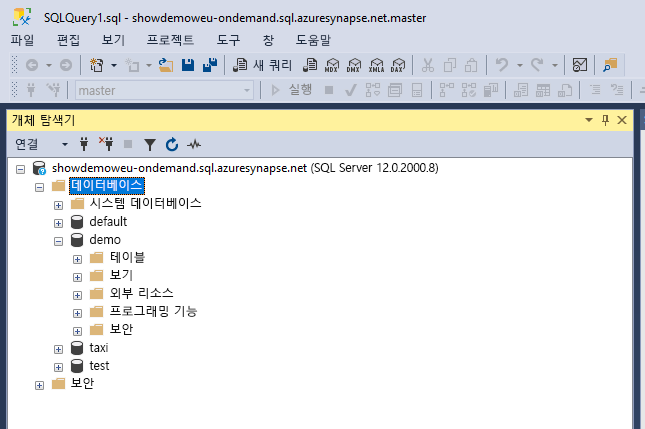
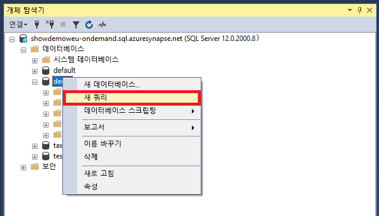
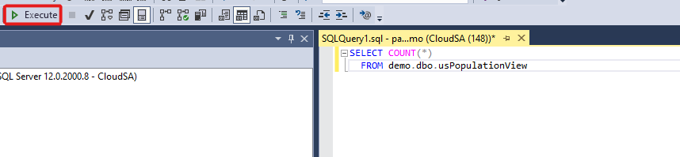
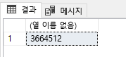

# <a name="connect-to-synapse-sql-with-sql-server-management-studio-ssms"></a>SSMS(SQL Server Management Studio)를 사용하여 Synapse SQL에 연결
> [!div class="op_single_selector"]
> * [Azure Data Studio](get-started-azure-data-studio.md)
> * [Power BI](get-started-power-bi-professional.md)
> * [Visual Studio](../sql-data-warehouse/sql-data-warehouse-query-visual-studio.md?toc=/azure/synapse-analytics/toc.json&bc=/azure/synapse-analytics/breadcrumb/toc.json)
> * [sqlcmd](../sql/get-started-connect-sqlcmd.md)
> * [SSMS](get-started-ssms.md)
> 
> 

SSMS([SQL Server Management Studio)](/sql/ssms/download-sql-server-management-studio-ssms)를 사용하여 SQL 주문형(미리 보기) 또는 SQL 풀 리소스를 통해 Azure Synapse Analytics에서 Synapse SQL에 연결하고 쿼리할 수 있습니다. 

### <a name="supported-tools-for-sql-on-demand-preview"></a>SQL 주문형(미리 보기)에 지원되는 도구

[Azure Data Studio](/sql/azure-data-studio/download-azure-data-studio)는 버전 1.18.0부터 완전히 지원됩니다. SSMS는 버전 18.5부터 부분적으로 지원되며, 연결 및 쿼리에만 사용할 수 있습니다.

> [!NOTE]
> 쿼리 실행시 AAD 로그인에 1시간을 초과하여 연결이 열려 있는 경우 AAD를 사용하는 모든 쿼리는 실패합니다. 여기에는 AAD 통과 및 AAD와 상호 작용하는 명령문(예: CREATE EXTERNAL PROVIDER)을 사용하여 스토리지를 쿼리하는 작업이 포함됩니다. 이는 SSMS 및 ADS의 쿼리 편집기와 같이 연결이 열린 상태로 유지되는 모든 도구에 영향을 줍니다. 쿼리를 실행하기 위해 새 연결을 여는 도구(예: Synapse Studio)는 영향을 받지 않습니다.
> 이 문제를 완화하기 위해 SSMS를 다시 시작하거나 ADS에서 연결 및 연결 해제할 수 있습니다. .
## <a name="prerequisites"></a>필수 구성 요소

시작하기 전에 다음 필수 조건을 갖추고 있는지 확인합니다.  

* [SSMS(SQL Server Management Studio)](/sql/ssms/download-sql-server-management-studio-ssms). 
* SQL 풀의 경우 기존 데이터 웨어하우스가 필요합니다. 만들려면 [SQL 풀 만들기](../quickstart-create-sql-pool-portal.md)를 참조하세요. SQL 주문형의 경우 만들 때 작업 영역에 이미 프로비저닝되어 있습니다. 
* 정규화된 SQL 서버 이름입니다. 이를 찾으려면 [Synapse SQL에 연결](connect-overview.md)을 참조하세요.

## <a name="connect"></a>연결

### <a name="sql-pool"></a>SQL 풀

SQL 풀을 사용하여 Synapse SQL에 연결하려면 다음 단계를 수행합니다. 

1. SSMS(SQL Server Management Studio)를 엽니다. 
1. **서버에 연결** 대화 상자에서 필드를 입력한 다음, **연결**을 선택합니다. 
  
    
   
   * **서버 이름**: 이전에 식별한 **서버 이름** 을 입력합니다.
   * **인증**:  **SQL Server 인증** 또는 **Active Directory 통합 인증**과 같은 인증 유형을 선택합니다.
   * **사용자 이름** 및 **암호**: 위에서 SQL Server 인증을 선택한 경우 사용자 이름 및 암호를 입력합니다.

1. **개체 탐색기**에서 Azure SQL Server를 확장합니다. 예제 AdventureWorksDW 데이터베이스와 같이 서버와 연결된 데이터베이스를 볼 수 있습니다. 데이터베이스를 확장하여 테이블을 볼 수 있습니다.
   
    


### <a name="sql-on-demand-preview"></a>SQL 주문형(미리 보기)

SQL 주문형을 사용하여 Synapse SQL에 연결하려면 다음 단계를 수행합니다. 

1. SSMS(SQL Server Management Studio)를 엽니다.
1. **서버에 연결** 대화 상자에서 필드를 입력한 다음, **연결**을 선택합니다. 
   
    
   
   * **서버 이름**: 이전에 식별한 **서버 이름** 을 입력합니다.
   * **인증**: **SQL Server 인증** 또는 **Active Directory 통합 인증**과 같은 인증 유형을 선택합니다.
   * **사용자 이름** 및 **암호**: 위에서 SQL Server 인증을 선택한 경우 사용자 이름 및 암호를 입력합니다.
   * **연결**을 클릭합니다.

4. 탐색하려면 SQL Azure Server를 확장합니다. 서버와 연결된 데이터베이스를 볼 수 있습니다. *데모*를 확장하여 예제 데이터베이스의 콘텐츠를 확인합니다.
   
    


## <a name="run-a-sample-query"></a>샘플 쿼리 실행

### <a name="sql-pool"></a>SQL 풀

이제 데이터베이스 연결이 설정되었으므로 데이터를 쿼리할 수 있습니다.

1. SQL Server 개체 탐색기에서 데이터베이스를 마우스 오른쪽 단추로 클릭합니다.
2. **새 쿼리**를 선택합니다. 새 쿼리 창이 열립니다.
   
    
3. 이 T-SQL 쿼리를 쿼리 창에 복사합니다.
   
    ```sql
    SELECT COUNT(*) FROM dbo.FactInternetSales;
    ```
4. 쿼리를 실행합니다. 이렇게 하려면 `Execute`를 클릭하거나 다음 바로 가기(`F5`)를 사용합니다.
   
    
5. 쿼리 결과를 봅니다. 이 예에서 FactInternetSales 테이블에는 60398 행이 있습니다.
   
    

### <a name="sql-on-demand"></a>SQL 주문형

이제 데이터베이스 연결이 설정되었으므로 데이터를 쿼리할 수 있습니다.

1. SQL Server 개체 탐색기에서 데이터베이스를 마우스 오른쪽 단추로 클릭합니다.
2. **새 쿼리**를 선택합니다. 새 쿼리 창이 열립니다.
   
    
3. 다음 T-SQL 쿼리를 쿼리 창에 복사합니다.
   
    ```sql
    SELECT COUNT(*) FROM demo.dbo.usPopulationView
    ```
4. 쿼리를 실행합니다. 이렇게 하려면 `Execute`를 클릭하거나 다음 바로 가기(`F5`)를 사용합니다.
   
    
5. 쿼리 결과를 봅니다. 이 예제에서 usPopulationView 보기에는 3664512개의 행이 있습니다.
   
    

## <a name="next-steps"></a>다음 단계
이제 연결 및 쿼리할 수 있으므로 [Power BI로 데이터 시각화](get-started-power-bi-professional.md)를 시도해 보세요.

Azure Active Directory 인증을 위한 환경을 구성하려면 [Synapse SQL에 대한 인증](../sql-data-warehouse/sql-data-warehouse-authentication.md?toc=/azure/synapse-analytics/toc.json&bc=/azure/synapse-analytics/breadcrumb/toc.json)을 참조하세요.

