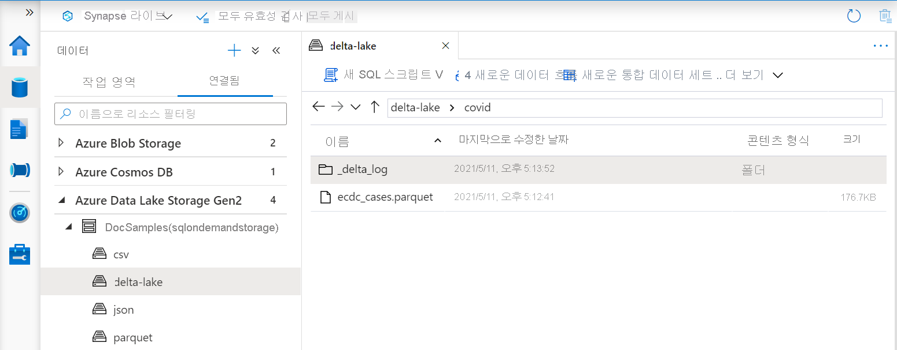
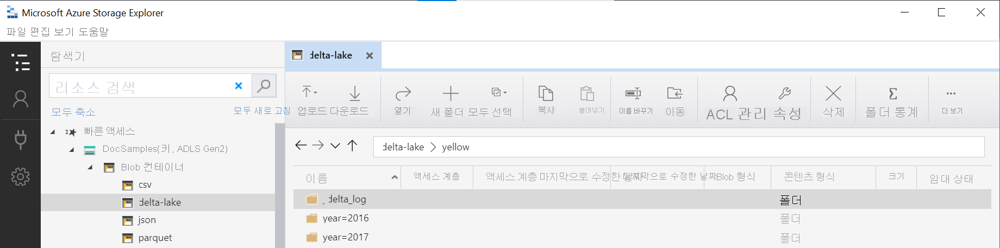

# <a name="query-delta-lake-files-preview-using-serverless-sql-pool-in-azure-synapse-analytics"></a>Azure Synapse Analytics에서 서버리스 SQL 풀을 사용하여 Delta Lake 파일 쿼리(미리 보기)

이 문서에서는 서버리스 Synapse SQL 풀을 사용하여 쿼리를 작성해 Apache Delta Lake 파일을 읽는 방법을 설명합니다.
Delta Lake는 오픈 소스 스토리지 레이어로, ACID(원자성, 일관성, 격리성, 내구성) 트랜잭션을 Apache Spark 및 빅 데이터 워크로드에 제공합니다.

Synapse 작업 영역에서 서버리스 SQL 풀을 사용하면 Delta Lake 형식에 저장된 데이터를 읽고 보고 도구에 제공할 수 있습니다. 서버리스 SQL 풀은 Apache Spark, Azure Databricks 또는 Delta Lake 형식의 다른 제작자를 통해 생성된 Delta Lake 파일을 읽을 수 있습니다.

Azure Synapse에서 Apache Spark 풀을 사용하면 데이터 엔지니어는 Scala, PySpark 및 .NET을 사용하여 Delta Lake 파일을 수정할 수 있습니다. 서버리스 SQL 풀은 데이터 엔지니어가 만든 Delta Lake 파일에 대한 보고서를 만드는 데이터 분석가에게 도움이 됩니다.

[!INCLUDE [synapse-analytics-preview-features](../../../includes/synapse-analytics-preview-features.md)]

## <a name="quickstart-example"></a>빠른 시작 예제

[OPENROWSET](develop-openrowset.md) 함수를 사용하면 루트 폴더에 URL을 제공하여 Delta Lake 파일 콘텐츠를 읽을 수 있습니다.

### <a name="read-delta-lake-folder"></a>Delta Lake 폴더 읽기

`DELTA` 파일 콘텐츠를 가장 쉽게 확인하는 방법은 파일 URL을 [OPENROWSET](develop-openrowset.md) 함수에 제공하고 `DELTA` 형식을 지정하는 것입니다. 파일을 공개적으로 사용할 수 있거나 Azure AD ID에서 이 파일에 액세스할 수 있으면 다음 예제와 같이 쿼리를 사용하여 파일 콘텐츠를 확인할 수 있습니다.

```sql
select top 10 *
from openrowset(
    bulk 'https://sqlondemandstorage.blob.core.windows.net/delta-lake/covid/',
    format = 'delta') as rows
```

열 이름 및 데이터 형식을 Delta Lake 파일에서 자동으로 읽습니다. `OPENROWSET` 함수는 문자열 열의 VARCHAR(1000)와 같은 최고의 추측 형식을 사용합니다.

`OPENROWSET` 함수의 URI는 `_delta_log`라고 하는 하위 폴더가 포함된 루트 Delta Lake 폴더를 참조해야 합니다.

> [!div class="mx-imgBorder"]
>

이 하위 폴더가 없으면 Delta Lake 형식을 사용하지 않습니다. 다음 Apache Spark Python 스크립트를 사용하여 폴더의 일반 Parquet 파일을 Delta Lake 형식으로 변환할 수 있습니다.

```python
%%pyspark
from delta.tables import *
deltaTable = DeltaTable.convertToDelta(spark, "parquet.`abfss://delta-lake@sqlondemandstorage.dfs.core.windows.net/covid`")
```

쿼리 성능을 향상시키려면 [`WITH` 절](#explicitly-specify-schema)에 명시적 형식을 지정하는 것이 좋습니다.

> [!NOTE]
> 서버리스 Synapse SQL 풀은 스키마 유추를 사용하여 자동으로 열과 열 형식을 결정합니다. 스키마 유추 규칙은 Parquet 파일에 사용되는 규칙과 동일합니다.
> Delta Lake 형식을 SQL 네이티브 형식으로 매핑은 [Parquet에 대한 형식 매핑](develop-openrowset.md#type-mapping-for-parquet)을 확인하세요. 

파일에 액세스할 수 있는지 확인합니다. 파일이 SAS 키나 사용자 지정 Azure ID로 보호되는 경우 [SQL 로그인에 대한 서버 수준 자격 증명](develop-storage-files-storage-access-control.md?tabs=shared-access-signature#server-scoped-credential)을 설정해야 합니다.

> [!IMPORTANT]
> UTF-8 데이터베이스 데이터 정렬(예: `Latin1_General_100_BIN2_UTF8`)을 사용하고 있는지 확인합니다. Delta Lake 파일의 문자열 값이 UTF-8 인코딩을 통해 인코딩되기 때문입니다.
> Delta Lake 파일의 텍스트 인코딩과 데이터 정렬이 일치하지 않으면 예기치 않은 변환 오류가 발생할 수 있습니다.
> 다음 T-SQL 문 `alter database current collate Latin1_General_100_BIN2_UTF8`을 사용하여 현재 데이터베이스의 기본 데이터 정렬을 쉽게 변경할 수 있습니다.

### <a name="data-source-usage"></a>데이터 원본 사용

이전 예제에서는 파일의 전체 경로를 사용했습니다. 전체 경로 대신 스토리지의 루트 폴더를 가리키는 위치를 사용하여 외부 데이터 원본을 만들 수 있습니다. 외부 데이터 원본을 만든 후 `OPENROWSET` 함수에서 데이터 원본과 파일의 상대 경로를 사용합니다. 이렇게 하면 파일의 전체 절대 URI를 사용하지 않아도 됩니다. 그런 다음, 사용자 지정 자격 증명을 정의하여 스토리지 위치에 액세스할 수도 있습니다.

> [!IMPORTANT]
> master 데이터베이스 또는 Apache Spark 풀에서 복제된 데이터베이스가 아니라 사용자 지정 데이터베이스에서만 데이터 원본을 만들 수 있습니다. 

다음 샘플을 사용하려면 다음 단계를 완료해야 합니다.
1. [NYC Yellow Taxi](https://azure.microsoft.com/services/open-datasets/catalog/nyc-taxi-limousine-commission-yellow-taxi-trip-records/) 스토리지 계정을 참조하는 데이터 원본을 사용하여 **데이터베이스를 만듭니다**. 
1. 1단계에서 만든 데이터베이스에서 [설치 스크립트](https://github.com/Azure-Samples/Synapse/blob/master/SQL/Samples/LdwSample/SampleDB.sql)를 실행하여 개체를 초기화합니다. 이 설치 스크립트는 이러한 샘플에서 사용되는 데이터 원본, 데이터베이스 범위 자격 증명 및 외부 파일 형식을 만듭니다.

데이터베이스를 만들고 컨텍스트를 데이터베이스로 전환한 경우(`USE database_name` 문 또는 드롭다운을 사용하여 일부 쿼리 편집기에서 데이터베이스 선택) 데이터 세트에 대한 루트 URI가 포함된 외부 데이터 원본을 만들어 Delta Lake 파일을 쿼리하는 데 사용할 수 있습니다.

```sql
create external data source DeltaLakeStorage
with ( location = 'https://sqlondemandstorage.blob.core.windows.net/delta-lake/' );
go

select top 10 *
from openrowset(
        bulk 'covid',
        data_source = 'DeltaLakeStorage',
        format = 'delta'
    ) as rows
```

데이터 원본이 SAS 키 또는 사용자 지정 ID를 통해 보호되는 경우, [데이터베이스 범위 자격 증명을 사용하여 데이터 원본](develop-storage-files-storage-access-control.md?tabs=shared-access-signature#database-scoped-credential)을 구성할 수 있습니다.

### <a name="explicitly-specify-schema"></a>스키마를 명시적으로 지정

`OPENROWSET`을 사용하면 `WITH` 절을 사용하여 파일에서 읽을 열을 명시적으로 지정할 수 있습니다.

```sql
select top 10 *
from openrowset(
        bulk 'covid',
        data_source = 'DeltaLakeStorage',
        format = 'delta'
    )
    with ( date_rep date,
           cases int,
           geo_id varchar(6)
           ) as rows
```

결과 집합 스키마의 명시적 사양을 사용하면 형식 크기를 최소화하고 문자열 열에 비관적 VARCHAR(1000) 대신 더욱 정밀한 VARCHAR(6) 형식을 사용할 수 있습니다. 형식을 최소화하면 쿼리 성능이 크게 향상될 수 있습니다.

> [!IMPORTANT]
> `WITH` 절의 모든 문자열 열에 UTF-8 데이터 정렬(예: `Latin1_General_100_BIN2_UTF8`)을 명시적으로 지정하거나 데이터베이스 수준에서 UTF-8 데이터 정렬을 설정했는지 확인합니다.
> 파일 및 문자열 열 데이터 정렬에서 텍스트 인코딩이 일치하지 않으면 예기치 않은 변환 오류가 발생할 수 있습니다.
> 다음 T-SQL 문 `alter database current collate Latin1_General_100_BIN2_UTF8`을 사용하여 현재 데이터베이스의 기본 데이터 정렬을 쉽게 변경할 수 있습니다.
> 다음 정의 `geo_id varchar(6) collate Latin1_General_100_BIN2_UTF8`을 사용하여 열 형식에 대한 데이터 정렬을 쉽게 설정할 수 있습니다.

## <a name="dataset"></a>데이터 세트

이 샘플에는 [NYC Yellow Taxi](https://azure.microsoft.com/services/open-datasets/catalog/nyc-taxi-limousine-commission-yellow-taxi-trip-records/) 데이터 세트가 사용됩니다. [CSV 파일을 읽는](query-parquet-files.md) 것과 동일한 방법으로 Parquet 파일을 쿼리할 수 있습니다. 유일한 차이점은 `FILEFORMAT` 매개 변수를 `PARQUET`로 설정해야 한다는 점입니다. 이 문서의 예제에서는 Parquet 파일 읽기의 세부 정보를 보여줍니다.


### <a name="query-partitioned-data"></a>분할된 데이터 쿼리
이 샘플에 제공된 데이터 세트는 별도의 하위 폴더로 분할(파티션)됩니다.
[Parquet](query-parquet-files.md)와 달리 `FILEPATH` 함수를 사용하여 특정 파티션을 대상으로 지정할 필요는 없습니다. `OPENROWSET`은 Delta Lake 폴더 구조에서 분할 열을 식별하고 이러한 열을 사용하여 데이터를 직접 쿼리할 수 있습니다. 이 예제에서는 2017년 첫 3개월 동안의 년, 월 및 payment_type별 요금을 보여줍니다.

```sql
SELECT
        YEAR(pickup_datetime) AS year,
        passenger_count,
        COUNT(*) AS cnt
FROM  
    OPENROWSET(
        BULK 'yellow',
        DATA_SOURCE = 'DeltaLakeStorage',
        FORMAT='DELTA'
    ) nyc
WHERE
    nyc.year = 2017
    AND nyc.month IN (1, 2, 3)
    AND pickup_datetime BETWEEN CAST('1/1/2017' AS datetime) AND CAST('3/31/2017' AS datetime)
GROUP BY
    passenger_count,
    YEAR(pickup_datetime)
ORDER BY
    YEAR(pickup_datetime),
    passenger_count;
```

`OPENROWSET` 함수는 where 절에서 `year`와 `month`가 일치하지 않는 파티션을 제거합니다. 이 파일/파티션 잘라내기 기술은 데이터 세트를 크게 줄이고 성능을 향상시키면서 쿼리 비용을 줄여 줍니다.

`OPENROWSET` 함수의 폴더 이름(이 예제의 `yellow`)은 `DeltaLakeStorage` 데이터 원본의 `LOCATION`을 사용하여 연결되며 `_delta_log`라는 하위 폴더가 포함된 루트 Delta Lake 폴더를 참조해야 합니다.

> [!div class="mx-imgBorder"]
>

이 하위 폴더가 없으면 Delta Lake 형식을 사용하지 않습니다. 다음 Apache Spark Python 스크립트를 사용하여 폴더의 일반 Parquet 파일을 Delta Lake 형식으로 변환할 수 있습니다.

```python
%%pyspark
from delta.tables import *
deltaTable = DeltaTable.convertToDelta(spark, "parquet.`abfss://delta-lake@sqlondemandstorage.dfs.core.windows.net/yellow`&quot;, &quot;year INT, month INT")
```

`DeltaTable.convertToDeltaLake` 함수의 두 번째 인수는 폴더 패턴의 한 부분(이 예제에서는 `year=*/month=*`)이자 해당 형식인 분할 열(year 및 month)을 나타냅니다.

## <a name="limitations"></a>제한 사항

- 데이터 형식이 복잡하면 스키마 유추가 작동하지 않습니다. 데이터 형식이 복잡한 경우 명시적 `WITH` 스키마를 사용하여 `VARCHAR(MAX)` 형식을 지정합니다. 
- `OPENROWSET` 함수는 Delta Lake 파일이나 시간 이동 업데이트를 지원하지 않습니다. Apache Spark 엔진을 사용하여 이러한 작업을 수행합니다.

## <a name="next-steps"></a>다음 단계

다음 문서로 진행하여 [Parquet 중첩 형식을 쿼리](query-parquet-nested-types.md)하는 방법을 알아봅니다.
Delta Lake 솔루션을 계속 빌드하려면 Delta Lake 폴더에서 [보기](create-use-views.md#delta-lake-views) 또는 [외부 테이블](create-use-external-tables.md#delta-lake-external-table)을 만드는 방법을 알아봅니다.

## <a name="see-also"></a>추가 정보

- [Delta Lake란?](../spark/apache-spark-what-is-delta-lake.md)
- [Azure Synapse Analytics용 Apache Spark 풀에서 Delta Lake를 사용하는 방법 알아보기](../spark/apache-spark-delta-lake-overview.md)
- [Azure Databricks Delta Lake 모범 사례](/azure/databricks/best-practices-index)
- [Delta Lake 문서 페이지](https://docs.delta.io/latest/delta-intro.html)
