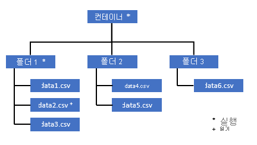
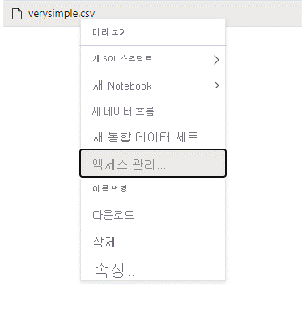
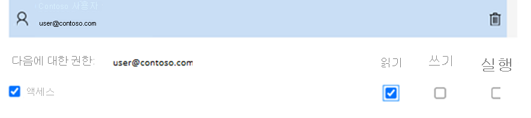

# <a name="self-help-for-serverless-sql-pool"></a>서버리스 SQL 풀에 대한 자가 진단

이 문서에는 Azure Synapse Analytics에서 서버리스 SQL 풀의 자주 발생하는 문제를 해결하는 방법에 대한 정보가 포함되어 있습니다.

## <a name="synapse-studio"></a>Synapse Studio

### <a name="serverless-sql-pool-is-grayed-out-in-synapse-studio"></a>Synapse Studio에서 서버리스 SQL 풀이 회색으로 표시됨

Synapse Studio가 서버리스 SQL 풀에 대한 연결을 설정할 수 없는 경우 서버리스 SQL 풀이 회색으로 표시되거나 "오프라인" 상태로 표시됩니다. 일반적으로 이 문제는 다음 중 하나에 해당할 때 발생합니다.

1) 네트워크에서 Azure Synapse 백 엔드와의 통신을 차단합니다. 대부분 1443 포트가 차단됩니다. 서버리스 SQL 풀을 작동시키려면 이 포트의 차단을 해제합니다. 다른 문제로 인해 서버리스 SQL 풀도 작동하지 않을 수 있습니다. [자세한 내용은 전체 문제 해결 가이드를 참조하세요](../troubleshoot/troubleshoot-synapse-studio.md).
2) 서버리스 SQL 풀에 로그인할 수 있는 권한이 없습니다. 액세스 권한을 얻으려면 Azure Synapse 작업 영역 관리자 중 한 명이 사용자를 작업 영역 관리자 또는 SQL 관리자 역할에 추가해야 합니다. [자세한 내용은 액세스 제어에 대한 전체 가이드를 참조하세요](../security/synapse-workspace-access-control-overview.md).

### <a name="query-fails-with-error-websocket-connection-was-closed-unexpectedly"></a>오류를 나타내며 쿼리 실패: Websocket 연결이 예기치 않게 닫혔습니다.

'Websocket 연결이 예기치 않게 닫혔습니다.'라는 오류 메시지를 나타내며 쿼리가 실패하는 경우 Synapse Studio 대한 브라우저 연결이 네트워크 문제 등으로 인해 중단된 것입니다. 

이 문제를 해결하려면 이 쿼리를 다시 실행합니다. 작업 환경에서 이 메시지가 자주 발생하는 경우 네트워크 관리자의 도움을 받고, 방화벽 설정을 확인하고, [이 문제 해결 가이드에서 자세한 내용을 참조하세요](../troubleshoot/troubleshoot-synapse-studio.md). 

문제가 계속되면 Azure Portal 통해 [지원 티켓](../../azure-portal/supportability/how-to-create-azure-support-request.md)을 만들고 추가 조사를 위해 Synapse Studio 대신 동일한 쿼리에 대해 [Azure Data Studio](/sql/azure-data-studio/download-azure-data-studio) 또는 [SQL Server Management Studio](/sql/ssms/download-sql-server-management-studio-ssms)를 사용해 봅니다.

## <a name="query-execution"></a>쿼리 실행

### <a name="query-fails-because-file-cannot-be-opened"></a>파일을 열 수 없어 쿼리가 실패

'파일이 없거나 다른 프로세스에서 사용되고 있어서 파일을 열 수 없습니다.'라는 내용의 오류 메시지와 함께 쿼리가 실패하고, 두 파일이 모두 존재하며 다른 프로세스에서 사용되고 있지 않다는 것이 확실한 경우에는 서버리스 SQL 풀이 파일에 액세스할 수 없다는 의미입니다. 이 문제는 일반적으로 Azure Active Directory ID에 파일에 대한 액세스 권한이 없거나 방화벽이 파일에 대한 액세스를 차단하고 있기 때문에 발생합니다. 기본적으로 서버리스 SQL 풀은 Azure Active Directory ID를 사용하여 파일에 액세스하려고 시도합니다. 이 이슈를 해결하려면 파일에 액세스할 수 있는 적절한 권한이 있어야 합니다. 가장 쉬운 방법은 쿼리하려는 스토리지 계정에 대한 'Storage Blob 데이터 기여자' 역할을 자신에게 부여하는 것입니다. 
- [자세한 내용은 스토리지에 대한 Azure Active Directory 액세스 제어 전체 가이드를 참조하세요](../../storage/blobs/assign-azure-role-data-access.md). 
- [Azure Synapse Analytics에서 서버리스 SQL 풀에 대한 스토리지 계정 액세스 제어 방문](develop-storage-files-storage-access-control.md)

#### <a name="alternative-to-storage-blob-data-contributor-role"></a>Storage Blob 데이터 기여자 역할의 대체 기능

Storage Blob 데이터 기여자를 부여하는 대신 파일 하위 세트에 대해 보다 세부적인 권한을 부여할 수도 있습니다. 

* 또한 이 컨테이너의 일부 데이터에 액세스해야 하는 모든 사용자는 루트(컨테이너)까지 모든 부모 폴더에 대한 EXECUTE 권한이 있어야 합니다. [Azure Data Lake Storage Gen2에서 ACL을 설정하는 방법](../../storage/blobs/data-lake-storage-explorer-acl.md)에 대해 자세히 알아봅니다. 

> [!NOTE]
> 컨테이너 수준에 대한 실행 권한은 Azure Data Lake Gen2 내에서 설정해야 합니다.
> 폴더에 대한 사용 권한은 Synapse 내에서 설정할 수 있습니다. 


이 예제에서 data2.csv를 쿼리하려면 다음 권한이 필요합니다. 
   - 컨테이너에 대한 실행 권한
   - folder1에 대한 실행 권한 
   - data2.csv에 대한 읽기 권한



* 액세스하려는 데이터에 대한 모든 권한이 있는 관리자로 Synapse에 로그인합니다.

* 데이터 창에서 파일을 마우스 오른쪽 단추로 클릭하고 액세스 관리를 선택합니다.



* "읽기" 권한 이상을 선택하고 사용자 UPN 또는 개체 ID를 입력한 다음(예: user@contoso.com), 추가를 클릭합니다.

* 이 사용자에 대한 읽기 권한을 부여합니다.


> [!NOTE]
> 게스트 사용자의 경우 이 작업을 Synapse를 통해 직접 수행할 수 없으므로 Azure Data Lake Service를 사용하여 직접 수행해야 합니다. 

### <a name="query-fails-because-it-cannot-be-executed-due-to-current-resource-constraints"></a>현재 리소스 제약 조건으로 인해 쿼리를 실행할 수 없어 쿼리가 실패 

'현재 리소스 제약 조건으로 인해 이 쿼리를 실행할 수 없습니다.'라는 오류 메시지와 함께 쿼리가 실패하는 경우에는 리소스 제약 조건으로 인해 현재 서버리스 SQL 풀이 쿼리를 실행할 수 없음을 의미입니다. 

- 적절한 크기의 데이터 형식이 사용되는지 확인합니다. 또한 문자열 열의 Parquet 파일에 대한 스키마를 지정하세요. 기본적으로 VARCHAR(8000)입니다. 

- 쿼리 대상이 CSV 파일인 경우 [통계 만들기](develop-tables-statistics.md#statistics-in-serverless-sql-pool)를 고려해 보세요. 

- 쿼리를 최적화하려면 [서버리스 SQL 풀의 성능 모범 사례](./best-practices-serverless-sql-pool.md)를 참조하세요.  

### <a name="could-not-allocate-tempdb-space-while-transferring-data-from-one-distribution-to-another"></a>한 배포에서 다른 배포로 데이터를 전송하는 동안 tempdb 공간을 할당할 수 없습니다.

이 오류는 일반 [현재 리소스 제약 조건으로 인해 실행할 수 없어 쿼리가 실패](#query-fails-because-it-cannot-be-executed-due-to-current-resource-constraints)하는 오류의 특수한 경우입니다. 이 오류는 `tempdb` 데이터베이스에 할당된 리소스가 쿼리를 실행하기에 충분하지 않을 때 반환됩니다. 

지원 티켓을 제출하기 전에 동일한 완화 및 모범 사례를 적용합니다.

### <a name="query-fails-with-error-while-handling-an-external-file"></a>외부 파일을 처리하는 동안 오류를 나타내며 쿼리가 실패합니다. 

'외부 파일 처리 오류: 최대 오류 수에 도달했습니다.'라는 오류 메시지를 나타내며 쿼리가 실패하면 지정된 열 형식과 로드해야 하는 데이터가 일치하지 않는 것입니다. 오류 및 확인할 행과 열에 대한 자세한 내용을 보려면 파서 버전을 '2.0'에서 '1.0'으로 변경합니다. 

#### <a name="example"></a>예제
이 쿼리 1을 사용하여 'names.csv' 파일을 쿼리하려는 경우 Synapse SQL 서버리스가 이러한 오류와 함께 반환됩니다. 

names.csv
```csv
Id,first name, 
1,Adam
2,Bob
3,Charles
4,David
5,Eva
```

쿼리 1:
```sql
SELECT
    TOP 100 *
FROM
    OPENROWSET(
        BULK '[FILE-PATH OF CSV FILE]',
        FORMAT = 'CSV',
        PARSER_VERSION='2.0',
       FIELDTERMINATOR =';',
       FIRSTROW = 2
    ) 
    WITH (
    [ID] SMALLINT, 
    [Text] VARCHAR (1) COLLATE Latin1_General_BIN2 
)

    AS [result]
```
원인:

```Error handling external file: ‘Max error count reached’. File/External table name: [filepath].```

파서 버전이 버전 2.0에서 버전 1.0으로 변경되는 즉시, 문제를 식별하는 데 도움이 되는 오류 메시지가 나타납니다. 이제 새 오류 메시지가 대신 표시됩니다. 

```Bulk load data conversion error (truncation) for row 1, column 2 (Text) in data file [filepath]```

잘림이 수행된다는 것은 열 형식이 너무 작아서 데이터에 맞지 않는다는 것을 의미합니다. 이 'names.csv' 파일의 가장 긴 이름은 7자입니다. 따라서 사용할 데이터 형식은 VARCHAR(7) 이상이어야 합니다. 이 오류는 다음 코드 줄로 인해 발생합니다. 

```sql 
    [Text] VARCHAR (1) COLLATE Latin1_General_BIN2
```
그에 따라 쿼리를 변경하면 오류가 해결됩니다. 최대 성능을 얻으려면 디버깅 후 파서 버전을 다시 2.0으로 변경합니다. [여기](develop-openrowset.md)에서 파서 버전을 사용하는 경우에 대해 자세히 읽어보세요. 

```sql 
SELECT
    TOP 100 *
FROM
    OPENROWSET(
        BULK '[FILE-PATH OF CSV FILE]',
        FORMAT = 'CSV',
        PARSER_VERSION='2.0',
        FIELDTERMINATOR =';',
        FIRSTROW = 2
    ) 
    WITH (
    [ID] SMALLINT, 
    [Text] VARCHAR (7) COLLATE Latin1_General_BIN2 
)

    AS [result]
```

### <a name="query-fails-with-conversion-error"></a>변환 오류를 나타내며 쿼리 실패
데이터 파일 [filepath]'의 행 n, 열 m [columnname]에 대해 대량 로드 데이터 변환 오류(지정된 코드 페이지의 형식 불일치 또는 잘못된 문자) 오류 메시지를 나타내며 쿼리가 실패하는 경우 데이터 형식이 행 번호 n 및 열 m의 실제 데이터와 일치하지 않음을 의미합니다. 

예를 들어, 데이터에 정수만 나와야 하지만 행 n에 문자열이 있는 경우 이 오류 메시지가 표시됩니다. 이 문제를 해결하려면 파일 및 선택한 데이터 형식을 검사합니다. 또한 행 구분 기호 및 필드 종결자 설정이 올바른지 확인합니다. 다음 예제에서는 VARCHAR를 열 형식으로 사용하여 검사를 수행하는 방법을 보여 줍니다. [여기](query-single-csv-file.md)에서 필드 종결자, 행 구분 기호 및 이스케이프 따옴표 문자에 대해 자세히 읽어보세요. 

#### <a name="example"></a>예제 
이 쿼리 1을 사용하여 'names.csv' 파일을 쿼리하려는 경우 Synapse SQL 서버리스가 이러한 오류와 함께 반환됩니다. 

names.csv
```csv
Id, first name, 
1,Adam
2,Bob
3,Charles
4,David
five,Eva
```

쿼리 1:
```sql 
SELECT
    TOP 100 *
FROM
    OPENROWSET(
        BULK '[FILE-PATH OF CSV FILE]',
        FORMAT = 'CSV',
        PARSER_VERSION='1.0',
       FIELDTERMINATOR =',',
       FIRSTROW = 2
    ) 
    WITH (
    [ID] SMALLINT, 
    [Firstname] VARCHAR (25) COLLATE Latin1_General_BIN2 
)

    AS [result]
```

다음 오류를 발생합니다. ```Bulk load data conversion error (type mismatch or invalid character for the specified codepage) for row 6, column 1 (ID) in data file [filepath]```

데이터를 찾아보고 정보를 토대로 이 문제를 처리해야 합니다. 이 문제를 유발하는 데이터를 살펴보려면 먼저 데이터 형식을 변경해야 합니다. 이제 데이터 형식이 "SMALLINT"인 열 "ID"를 쿼리하는 대신 VARCHAR(100)을 사용하여 이 문제를 분석합니다. 약간 변경된 쿼리 2를 사용하면 이제 데이터를 처리할 수 있으며 이름 목록이 표시됩니다. 

쿼리 2: 
```sql
SELECT
    TOP 100 *
FROM
    OPENROWSET(
        BULK '[FILE-PATH OF CSV FILE]',
        FORMAT = 'CSV',
        PARSER_VERSION='1.0',
       FIELDTERMINATOR =',',
       FIRSTROW = 2
    ) 
    WITH (
    [ID] VARCHAR(100), 
    [Firstname] VARCHAR (25) COLLATE Latin1_General_BIN2 
)

    AS [result]
```

names.csv
```csv
Id, first name, 
1,Adam
2,Bob
3,Charles
4,David
five,Eva
```

데이터의 다섯 번째 행에 ID에 대한 예기치 않은 값이 있는 것 같습니다. 이러한 상황에서는 데이터의 비즈니스 소유자와 함께 이와 같은 손상된 데이터를 방지할 수 있는 방법을 협의하는 것이 중요합니다. 애플리케이션 수준에서 방지가 불가능하고 ID에 대한 모든 종류의 데이터 형식을 처리해야 하는 경우 적절한 크기의 VARCHAR가 유일한 옵션일 수 있습니다.

> [!Tip]
> VARCHAR()를 최대한 짧게 만들어 보세요. VARCHAR(MAX)는 성능을 저하시킬 수 있으므로 가능하다면 사용하지 마세요. 

### <a name="the-result-table-does-not-look-like-expected-result-columns-are-empty-or-unexpected-loaded"></a>결과 테이블이 예상과 같지 않습니다. 결과 열이 비어 있거나 예기치 않게 로드됩니다. 

쿼리가 실패하지 않지만 결과 테이블이 예상대로 로드되지 않은 경우 행 구분 기호 또는 필드 종결자를 잘못 선택했을 수 있습니다. 이 문제를 해결하려면 데이터를 다시 살펴보고 해당 설정을 변경해야 합니다. 결과 테이블이 표시되면 다음 예제와 같이 이 쿼리를 쉽게 디버깅할 수 있습니다. 

#### <a name="example"></a>예제
이 쿼리 1을 사용하여 'names.csv' 파일을 쿼리하려는 경우 Synapse SQL 서버리스가 이상해 보이는 결과 테이블과 함께 반환됩니다. 

names.csv
```csv
Id,first name, 
1,Adam
2,Bob
3,Charles
4,David
5,Eva
```

```sql
SELECT
    TOP 100 *
FROM
    OPENROWSET(
        BULK '[FILE-PATH OF CSV FILE]',
        FORMAT = 'CSV',
        PARSER_VERSION='1.0',
       FIELDTERMINATOR =';',
       FIRSTROW = 2
    ) 
    WITH (
    [ID] VARCHAR(100), 
    [Firstname] VARCHAR (25) COLLATE Latin1_General_BIN2 
)

    AS [result]
```

이로 인해 다음 결과 테이블이 표시됩니다.

| ID            |   firstname   | 
| ------------- |-------------  | 
| 1,Adam        | NULL | 
| 2,Bob         | NULL | 
| 3,Charles     | NULL | 
| 4,David       | NULL | 
| 5,Eva         | NULL | 

열 "firstname"에 값이 없는 것 같습니다. 대신 모든 값이 열 "ID"에 있습니다. 값은 쉼표로 구분됩니다. 세미콜론 기호 대신 쉼표를 필드 종결자로 선택해야 하기 때문에 이 코드 줄로 인해 문제가 발생한 것입니다.

```sql
FIELDTERMINATOR =';',
```

이 단일 문자를 변경하면 문제가 해결됩니다.

```sql
FIELDTERMINATOR =',',
```

이제 쿼리 2에서 만든 결과 테이블이 예상대로 표시됩니다. 

쿼리 2:
```sql
SELECT
    TOP 100 *
FROM
    OPENROWSET(
        BULK '[FILE-PATH OF CSV FILE]',
        FORMAT = 'CSV',
        PARSER_VERSION='1.0',
       FIELDTERMINATOR =',',
       FIRSTROW = 2
    ) 
    WITH (
    [ID] VARCHAR(100), 
    [Firstname] VARCHAR (25) COLLATE Latin1_General_BIN2 
)

    AS [result]
``` 

다음을 반환합니다.

| ID            |   firstname   | 
| ------------- |-------------  | 
| 1        | Adam | 
| 2         | Bob | 
| 3     | Charles | 
| 4       | David | 
| 5         | Eva | 


### <a name="query-fails-with-error-column-column-name-of-type-type-name-is--not-compatible-with-external-data-type-external-data-type-name"></a>[type-name] 형식의 [column-name] 열이 외부 데이터 형식 [external-data-type-name]과(와) 호환되지 않음 오류를 나타내며 쿼리 실패 

'[type-name] 형식의 [column-name] 열이 외부 데이터 형식 [...]'과(와) 호환되지 않습니다.' 오류 메시지를 나타내며 쿼리가 실패하는 경우 PARQUET 데이터 형식을 잘못된 SQL 데이터 형식에 매핑하려고 시도했을 수 있습니다. 예를 들어, parquet 파일에 부동 소수점 숫자(예: 12.89)를 포함하는 열 가격이 있고 이 값을 INT에 매핑하려고 하면 이 오류 메시지가 표시됩니다. 

이 문제를 해결하려면 파일 및 선택한 데이터 형식을 검사합니다. 이 [매핑 테이블](develop-openrowset.md#type-mapping-for-parquet)은 SQL 데이터 형식을 선택하는 데 유용합니다. 모범 사례 힌트: VARCHAR 데이터 형식으로 확인되는 열에 대해서만 매핑을 지정합니다. 가능한 경우 VARCHAR를 방지하면 쿼리 성능이 향상됩니다. 

#### <a name="example"></a>예제
이 쿼리 1을 사용하여 'taxi-data.parquet' 파일을 쿼리하려는 경우 Synapse SQL 서버리스가 이러한 오류와 함께 반환됩니다.

taxi-data.parquet:

|PassengerCount |SumTripDistance|AvgTripDistance |
|---------------|---------------|----------------|
| 1 | 2635668.66000064 | 6.72731710678951 |
| 2 | 172174.330000005 | 2.97915543404919 |
| 3 | 296384.390000011 | 2.8991352022851  |
| 4 | 12544348.58999806| 6.30581582240281 |
| 5 | 13091570.2799993 | 111.065989028627 |

쿼리 1:
```sql
SELECT
    *
FROM
    OPENROWSET(
        BULK '<filepath>taxi-data.parquet',
        FORMAT='PARQUET'
    )  WITh
        (
        PassengerCount INT, 
        SumTripDistance INT, 
        AVGTripDistance FLOAT
        )

    AS [result]
```
다음 오류를 발생합니다. 

```Column 'SumTripDistance' of type 'INT' is not compatible with external data type 'Parquet physical type: DOUBLE', please try with 'FLOAT'. File/External table name: '<filepath>taxi-data.parquet'.```

이 오류 메시지는 데이터 형식이 호환되지 않으며 INT 대신 FLOAT를 사용하라는 제안 사항이 이미 제공되었음을 알려줍니다. 이 오류는 다음 코드 줄로 인해 발생합니다. 

```sql
SumTripDistance INT, 
```

약간 변경된 쿼리 2를 사용하면 이제 데이터를 처리할 수 있으며 세 개의 열이 모두 표시됩니다. 

쿼리 2: 
```sql
SELECT
    *
FROM
    OPENROWSET(
        BULK '<filepath>taxi-data.parquet',
        FORMAT='PARQUET'
    )  WITh
        (
        PassengerCount INT, 
        SumTripDistance FLOAT, 
        AVGTripDistance FLOAT
        )

    AS [result]
```

## <a name="configuration"></a>구성

### <a name="query-fails-with-please-create-a-master-key-in-the-database-or-open-the-master-key-in-the-session-before-performing-this-operation"></a>다음 오류를 나타내며 쿼리가 실패합니다. 이 작업을 수행하기 전에 데이터베이스에서 마스터 키를 만들거나 세션의 마스터 키를 여세요.

'이 작업을 수행하기 전에 데이터베이스에서 마스터 키를 만들거나 세션에서 마스터 키를 여세요.' 오류 메시지를 나타내며 쿼리가 실패하는 경우 현재 사용자 데이터베이스가 마스터 키에 액세스할 수 없음을 의미합니다. 

대부분의 경우 방금 새 사용자 데이터베이스를 만들었으며 아직 마스터 키를 만들지 않았습니다. 

이 문제를 해결하려면 다음 쿼리를 사용하여 마스터 키를 만듭니다.

```sql
CREATE MASTER KEY [ ENCRYPTION BY PASSWORD ='password' ];
```

> [!NOTE]
> 여기서 'password'를 다른 암호로 바꿉니다. 

### <a name="create-statement-is-not-supported-in-master-database"></a>CREATE STATEMENT는 master 데이터베이스에서 지원되지 않습니다.

다음 오류 메시지와 함께 쿼리가 실패하는 경우:

> '쿼리를 실행하지 못했습니다. 오류: CREATE EXTERNAL TABLE/DATA SOURCE/DATABASE SCOPED CREDENTIAL/FILE FORMAT은 마스터 데이터베이스에서 지원되지 않습니다.' 

즉, 서버리스 SQL 풀의 마스터 데이터베이스는 다음 생성을 지원하지 않습니다.
  - 외부 테이블
  - 외부 데이터 원본
  - 데이터베이스 범위 자격 증명
  - 외부 파일 형식

해결 방법:

  1. 사용자 데이터베이스를 만듭니다.

```sql
CREATE DATABASE <DATABASE_NAME>
```

  2. 마스터 데이터베이스에 대해 이전에 실패한 <DATABASE_NAME> 컨텍스트에서 create 문을 실행합니다. 
  
  외부 파일 형식 생성 예:
    
```sql
USE <DATABASE_NAME>
CREATE EXTERNAL FILE FORMAT [SynapseParquetFormat] 
WITH ( FORMAT_TYPE = PARQUET)
```

### <a name="operation-is-not-allowed-for-a-replicated-database"></a>복제된 데이터베이스에는 작업이 허용되지 않습니다.
   
데이터베이스에서 SQL 개체, 사용자 또는 변경 권한을 만들려는 경우 'CREATE USER 작업은 복제된 데이터베이스에 대해 허용되지 않습니다.'와 같은 오류가 발생할 수 있습니다. 이 오류는 [Spark 풀과 공유](../metadata/database.md)되는 데이터베이스에서 개체를 만들려고 하면 반환됩니다. Apache Spark 풀에서 복제되는 데이터베이스는 읽기 전용입니다. T-SQL을 사용하여 복제된 데이터베이스에 새 개체를 만들 수는 없습니다.

별도의 데이터베이스를 만들고 세 부분으로 구성된 이름 및 데이터베이스 간 쿼리를 사용하여 동기화된 [테이블](../metadata/table.md)을 참조합니다.

## <a name="cosmos-db"></a>Cosmos DB

가능한 오류 및 문제 해결 작업은 다음 표에 나와 있습니다.

| 오류 | 근본 원인 |
| --- | --- |
| 구문 오류:<br/> - `Openrowset` 근처의 구문이 잘못되었습니다.<br/> - `...`가 인식할 수 있는 `BULK OPENROWSET` 공급자 옵션이 아닙니다.<br/> - `...` 근처의 구문이 잘못되었습니다. | 가능한 근본 원인:<br/> - 첫 번째 매개 변수로 CosmosDB를 사용하지 않음.<br/> - 세 번째 매개 변수에서 식별자 대신 문자열 리터럴을 사용함.<br/> - 세 번째 매개 변수(컨테이너 이름)를 지정하지 않음. |
| CosmosDB 연결 문자열에 오류가 발생했습니다. | - 계정, 데이터베이스 또는 키가 지정되지 않음. <br/> - 인식되지 않는 연결 문자열에는 몇 가지 옵션이 있음.<br/> - 세미콜론(`;`)은 연결 문자열의 끝에 배치됩니다. |
| "잘못된 계정 이름" 또는 "잘못된 데이터베이스 이름" 오류로 인해 CosmosDB 경로를 확인하지 못했습니다. | 지정된 계정 이름, 데이터베이스 이름 또는 컨테이너를 찾을 수 없거나 지정된 컬렉션에 대해 분석 스토리지를 사용하도록 설정하지 않았습니다.|
| "잘못된 비밀 값" 또는 "비밀이 Null이거나 비어 있습니다." 오류로 인해 CosmosDB 경로를 확인하지 못했습니다. | 계정 키가 잘못되었거나 없습니다. |
| `type name` 유형의 `column name` 열이 외부 데이터 유형 `type name`과 호환되지 않습니다. | `WITH` 절에서 지정된 열 유형이 Azure Cosmos DB 컨테이너의 유형과 일치하지 않습니다. [Azure Cosmos DB에서 SQL 형식 매핑](query-cosmos-db-analytical-store.md#azure-cosmos-db-to-sql-type-mappings) 섹션에 설명된 바와 같이 열 형식을 변경하거나 `VARCHAR` 형식을 사용하십시오. |
| 열이 모든 셀의 `NULL` 값을 포함합니다. | `WITH` 절에 잘못된 열 이름 또는 경로 식이 있을 수 있습니다. `WITH` 절에서 열 이름(또는 열 유형 뒤의 경로 식)은 Azure Cosmos DB 컬렉션의 일부 속성 이름과 일치해야 합니다. 비교 시 *대/소문자가 구분* 됩니다. 예를 들어 `productCode`와 `ProductCode`는 서로 다른 속성입니다. |

[Azure Synapse Analytics 피드백 페이지](https://feedback.azure.com/forums/307516-azure-synapse-analytics?category_id=387862)에서 제안과 문제를 보고할 수 있습니다.

### <a name="utf-8-collation-warning-is-returned-while-reading-cosmosdb-string-types"></a>CosmosDB 문자열 형식을 읽는 동안 UTF-8 데이터 정렬 경고가 반환됩니다.

서버리스 SQL 풀은 `OPENROWSET` 열 데이터 정렬에 UTF-8 인코딩이 없으면 컴파일 시간 경고를 반환합니다. T-SQL 문 `alter database current collate Latin1_General_100_CI_AS_SC_UTF8`을 사용하여 현재 데이터베이스에서 실행되는 모든 `OPENROWSET` 함수에 대한 기본 데이터 정렬을 쉽게 변경할 수 있습니다.

[Latin1_General_100_BIN2_UTF8 데이터 정렬](best-practices-serverless-sql-pool.md#use-proper-collation-to-utilize-predicate-pushdown-for-character-columns)은 문자열 조건자를 사용하여 데이터를 필터링할 때 최상의 성능을 제공합니다.

### <a name="some-rows-are-not-returned"></a>일부 행이 반환되지 않음

- 트랜잭션 저장소와 분석 저장소 간에 동기화 지연이 발생합니다. Cosmos DB 트랜잭션 저장소에 입력한 문서가 2-3분 후에 분석 저장소에 표시될 수 있습니다.
- 문서가 [스키마 제약 조건](../../cosmos-db/analytical-store-introduction.md#schema-constraints)을 위반할 수 있습니다. 

### <a name="query-returns-null-values"></a>쿼리가 `NULL` 값을 반환함

Synapse SQL 다음과 같은 경우 트랜잭션 저장소에 표시되는 값 대신 `NULL`을 반환합니다.
- 트랜잭션 저장소와 분석 저장소 간에 동기화 지연이 발생합니다. Cosmos DB 트랜잭션 저장소에 입력한 값이 2-3분 후에 분석 저장소에 표시될 수 있습니다.
- `WITH` 절에 잘못된 열 이름 또는 경로 식이 있을 수 있습니다. `WITH` 절에서 열 이름(또는 열 유형 뒤의 경로 식)은 Cosmos DB 컬렉션의 속성 이름과 일치해야 합니다. 비교는 대/소문자를 구분합니다(예: `productCode` 및 `ProductCode`는 서로 다른 속성임). 열 이름이 Cosmos DB 속성 이름과 정확히 일치하는지 확인합니다.
- 이 속성은 1000개를 초과하는 속성 또는 127개를 초과하는 중첩 수준과 같은 [스키마 제약 조건](../../cosmos-db/analytical-store-introduction.md#schema-constraints)을 위반하기 때문에 분석 스토리지로 이동되지 않을 수 있습니다.
- 잘 정의된 [스키마 표현](../../cosmos-db/analytical-store-introduction.md#schema-representation)을 사용하는 경우 트랜잭션 저장소의 값 형식이 잘못되었을 수 있습니다. 잘 정의된 스키마는 문서를 샘플링하여 각 속성에 대한 형식을 잠급니다. 트랜잭션 저장소에 추가된 값 중에서 형식과 일치하지 않는 값은 잘못된 값으로 처리되고 분석 저장소로 마이그레이션되지 않습니다. 
- 전체 충실도 [스키마 표현](../../cosmos-db/analytical-store-introduction.md#schema-representation)을 사용하는 경우 속성 이름 뒤에 형식 접미사를 추가해야 합니다(예: `$.price.int64`). 참조된 경로에 대한 값이 표시되지 않으면 다른 형식 경로(예: `$.price.float64`)에 저장되어 있을 수 있습니다. [전체 충실도 스키마에서 Cosmos Db 컬렉션을 쿼리하는 방법](query-cosmos-db-analytical-store.md#query-items-with-full-fidelity-schema)을 참조하세요.

### <a name="column-is-not-compatible-with-external-data-type"></a>열이 외부 데이터 형식과 호환되지 않음

`WITH` 절에 지정된 값이 분석 스토리지의 기본 Cosmos DB 형식과 일치하지 않아 암시적으로 변환할 수 없습니다. 스키마에서 `VARCHAR` 형식을 사용합니다.

### <a name="cosmosdb-performance-issues"></a>CosmosDB 성능 문제

예기치 않은 성능 문제가 발생하는 경우 다음과 같은 모범 사례를 적용했는지 확인합니다.
- 클라이언트 애플리케이션, 서버리스 풀 및 Cosmos DB 분석 스토리지를 [동일한 지역](best-practices-serverless-sql-pool.md#colocate-your-cosmosdb-analytical-storage-and-serverless-sql-pool)에 배치했는지 확인합니다.
- [최적 데이터 형식](best-practices-serverless-sql-pool.md#use-appropriate-data-types)으로 `WITH` 절을 사용하고 있는지 확인합니다.
- 문자열 조건자를 사용하여 데이터를 필터링할 때 [Latin1_General_100_BIN2_UTF8](best-practices-serverless-sql-pool.md#use-proper-collation-to-utilize-predicate-pushdown-for-character-columns) 데이터 정렬을 사용하고 있는지 확인합니다.
- 캐시될 수 있는 반복 쿼리가 있는 경우 [Azure Data Lake Storage에 쿼리 결과를 저장하는 CETAS](best-practices-serverless-sql-pool.md#use-cetas-to-enhance-query-performance-and-joins)를 사용해 보세요.

## <a name="delta-lake"></a>Delta Lake

Delta Lake 지원은 현재 서버리스 SQL 풀에서 퍼블릭 미리 보기로 제공됩니다. 미리 보기 중에 나타날 수 있는 몇 가지 알려진 문제가 있습니다.
- [OPENROWSET](./develop-openrowset.md) 함수 또는 외부 테이블 위치에서 루트 Delta Lake 폴더를 참조하고 있는지 확인합니다.
  - 루트 폴더에는 `_delta_log`라는 하위 폴더가 있어야 합니다. `_delta_log` 폴더가 없으면 쿼리가 실패합니다. 해당 폴더가 표시되지 않으면 Apache Spark 풀을 사용하여 [Delta Lake로 변환](../spark/apache-spark-delta-lake-overview.md?pivots=programming-language-python#convert-parquet-to-delta)해야 하는 일반 Parquet 파일을 참조하는 것입니다.
  - 파티션 스키마를 설명하는 와일드카드를 지정하지 마세요. Delta Lake 쿼리는 Delta Lake 파티션을 자동으로 식별합니다. 
- Apache Spark 풀에서 만든 Delta Lake 테이블은 서버리스 SQL 풀에서 동기화되지 않습니다. T-SQL 언어를 사용하여 Apache Spark 풀에서 Delta Lake 테이블을 쿼리할 수 없습니다.
- 외부 테이블은 분할을 지원하지 않습니다. Delta Lake 폴더에서 [분할된 뷰](create-use-views.md#delta-lake-partitioned-views)를 사용하여 파티션 제거를 활용합니다. 아래에서 알려진 문제 및 해결 방법을 참조하세요.
- 서버리스 SQL 풀은 시간 이동 쿼리를 지원하지 않습니다. [Azure 피드백 사이트](https://feedback.azure.com/forums/307516-azure-synapse-analytics/suggestions/43656111-add-time-travel-feature-in-delta-lake)에서 이 기능에 대해 투표할 수 있습니다. Azure Synapse Analytics에서 Apache Spark 풀을 사용하여 [기록 데이터를 읽습니다](../spark/apache-spark-delta-lake-overview.md?pivots=programming-language-python#read-older-versions-of-data-using-time-travel).
- 서버리스 SQL 풀은 Delta Lake 파일 업데이트를 지원하지 않습니다. 서버리스 SQL 풀을 사용하여 최신 버전의 Delta Lake를 쿼리할 수 있습니다. Azure Synapse Analytics에서 Apache Spark 풀을 사용하여 [Delta Lake를 업데이트](../spark/apache-spark-delta-lake-overview.md?pivots=programming-language-python#update-table-data)합니다.
- Delta Lake 지원은 전용 SQL 풀에서 사용할 수 없습니다. 서버리스 풀을 사용하여 Delta Lake 파일을 쿼리하고 있는지 확인합니다.

[Azure Synapse 피드백 사이트](https://feedback.azure.com/forums/307516-azure-synapse-analytics?category_id=171048)에서 아이디어와 향상된 기능을 제안할 수 있습니다.

### <a name="content-of-directory-on-path-cannot-be-listed"></a>경로에 있는 디렉터리의 콘텐츠를 나열할 수 없음

서버리스 SQL 풀이 Delta Lake 트랜잭션 로그 폴더를 읽을 수 없는 경우 다음 오류가 반환됩니다.

```
Msg 13807, Level 16, State 1, Line 6
Content of directory on path 'https://.....core.windows.net/.../_delta_log/*.json' cannot be listed.
```

`_delta_log` 폴더가 있는지 확인합니다(Delta Lake 형식으로 변환되지 않은 일반 Parquet 파일을 쿼리하고 있을 수 있음).

`_delta_log` 폴더가 있는 경우 기본 Delta Lake 폴더에 대한 읽기 및 나열 권한이 둘 다 있는지 확인합니다.
FORMAT='CSV'를 사용하여 직접 \*.json 파일을 읽어 보세요(BULK 매개 변수에 URI 배치).

```sql
select top 10 * 
from openrowset(BULK 'https://.....core.windows.net/.../_delta_log/*.json', 
FORMAT='csv', FIELDQUOTE = '0x0b', FIELDTERMINATOR ='0x0b', ROWTERMINATOR = '0x0b') with (line varchar(max)) as logs
```

이 쿼리가 실패하면 호출자는 기본 스토리지 파일을 읽을 수 있는 권한이 없습니다. 

가장 쉬운 방법은 쿼리하려는 스토리지 계정에 대한 'Storage Blob 데이터 기여자' 역할을 자신에게 부여하는 것입니다. 
- [자세한 내용은 스토리지에 대한 Azure Active Directory 액세스 제어 전체 가이드를 참조하세요](../../storage/blobs/assign-azure-role-data-access.md). 
- [Azure Synapse Analytics에서 서버리스 SQL 풀에 대한 스토리지 계정 액세스 제어 방문](develop-storage-files-storage-access-control.md)

### <a name="partitioning-column-returns-null-values"></a>분할 열이 NULL 값을 반환합니다.

분할된 Delta Lake 폴더를 읽는 `OPENROWSET` 함수에 대한 보기를 사용하는 경우 분할 열에 대한 실제 열 값 대신 `NULL` 값을 가져올 수 있습니다. `Year` 및 `Month` 분할 열을 참조하는 보기의 예는 다음 예에 나와 있습니다.

```sql
create or alter view test as
select top 10 * 
from openrowset(bulk 'https://storageaccount.blob.core.windows.net/path/to/delta/lake/folder',
                format = 'delta') 
     with (ID int, Year int, Month int, Temperature float) 
                as rows
```

알려진 문제로 인해 `WITH` 절이 있는 `OPENROWSET` 함수는 분할 열에서 값을 읽을 수 없습니다. Delta Lake의 [분할된 뷰](create-use-views.md#delta-lake-partitioned-views)에는 `OPENROWSET` 절이 있는 `WITH` 함수가 없어야 합니다. 명시적으로 지정된 스키마가 없는 `OPENROWSET` 함수를 사용해야 합니다.

**해결 방법:** 보기에 사용되는 `OPENROWSET` 함수에서 `WITH` 절을 제거합니다. 예:

```sql
create or alter view test as
select top 10 * 
from openrowset(bulk 'https://storageaccount.blob.core.windows.net/path/to/delta/lake/folder',
                format = 'delta') 
   --with (ID int, Year int, Month int, Temperature float) 
                as rows
```

### <a name="query-failed-because-of-a-topology-change-or-compute-container-failure"></a>토폴로지 변경 또는 컴퓨팅 컨테이너 오류로 인해 쿼리 실패

데이터베이스 데이터 정렬이 `Latin1_General_100_BIN2_UTF8`이 아닌 경우 분할된 데이터 세트에 대한 일부 Delta Lake 쿼리가 이 오류 메시지를 나타내며 실패할 수 있습니다. 기본 데이터 정렬을 사용하여 master 및 기타 데이터베이스를 만드는 대신, `Latin1_General_100_BIN2_UTF8` 데이터 정렬을 사용하여 데이터베이스를 만들고 해당 데이터베이스에 대해 쿼리를 실행합니다.

```sql
CREATE DATABASE mydb 
    COLLATE Latin1_General_100_BIN2_UTF8;
```

master 데이터베이스를 통해 실행되는 쿼리는 이 문제의 영향을 받습니다. 분할된 데이터를 읽는 모든 쿼리에 적용되는 것은 아닙니다. 문자열 열로 분할된 데이터 세트는 이 문제의 영향을 받습니다.

**해결 방법:** `Latin1_General_100_BIN2_UTF8` 데이터베이스 데이터 정렬을 통해 사용자 지정 데이터베이스에서 쿼리를 실행합니다.

### <a name="column-of-type-varchar-is-not-compatible-with-external-data-type-parquet-column-is-of-nested-type"></a>'VARCHAR' 형식의 열은 외부 데이터 형식과 호환되지 않음 'Parquet 열이 중첩 형식임'

WITH 절을 지정하지 않고 일부 중첩 형식 열이 포함된 Delta Lake 파일을 읽으려고 합니다(자동 스키마 유추 사용). 자동 스키마 유추는 Delta Lake의 중첩 열에서 작동하지 않습니다.

**해결 방법:** `WITH` 절을 사용하고 `VARCHAR` 형식을 중첩 열에 명시적으로 할당합니다. `WITH` 절이 파티션 열에 대해 `NULL`을 반환하는 또 다른 알려진 문제로 인해 데이터 세트가 분할된 경우에는 작동하지 않습니다. 복합 유형 열이 있는 분할된 데이터 세트는 현재 지원되지 않습니다.

### <a name="cannot-find-value-of-partitioning-column-in-file"></a>파일에서 분할 열 값을 찾을 수 없음 

Delta Lake 데이터 세트는 분할 열에 `NULL` 값이 있을 수 있습니다. 이러한 파티션은 `HIVE_DEFAULT_PARTITION` 폴더에 저장됩니다. 이것은 현재 서버리스 SQL 풀에서 지원되지 않습니다. 이 경우 다음과 같은 오류가 발생합니다.

```
Resolving Delta logs on path 'https://....core.windows.net/.../' failed with error:
Cannot find value of partitioning column '<column name>' in file 
'https://......core.windows.net/...../<column name>=__HIVE_DEFAULT_PARTITION__/part-00042-2c0d5c0e-8e89-4ab8-b514-207dcfd6fe13.c000.snappy.parquet'.
```

**해결 방법:** Apache Spark 풀을 사용하여 Delta Lake 데이터 세트를 업데이트하고 분할 열에 `null` 대신 일부 값(빈 문자열 또는 `"null"`)을 사용합니다.

### <a name="json-text-is-not-properly-formatted"></a>JSON 텍스트의 형식이 잘못되었습니다.

이 오류는 서버리스 SQL 풀이 Delta Lake 트랜잭션 로그를 읽을 수 없음을 나타냅니다. 다음 오류와 같은 오류가 표시될 수 있습니다.

```
Msg 13609, Level 16, State 4, Line 1
JSON text is not properly formatted. Unexpected character '{' is found at position 263934.
Msg 16513, Level 16, State 0, Line 1
Error reading external metadata.
```
먼저 Delta Lake 데이터 세트가 손상되지 않았는지 확인합니다.
- Synapse 또는 Databricks 클러스터에서 Apache Spark 풀을 사용하여 Delta Lake 폴더의 콘텐츠를 읽을 수 있는지 확인합니다. 이렇게 하면 `_delta_log` 파일이 손상되지 않도록 할 수 있습니다.
- `FORMAT='PARQUET'`를 지정하고 URI 경로 끝에 재귀 와일드카드 `/**`를 사용하여 데이터 파일의 내용을 읽을 수 있는지 확인합니다. 모든 Parquet 파일을 읽을 수 있는 경우 문제는 `_delta_log` 트랜잭션 로그 폴더에 있습니다.

**해결 방법:** 이 문제는 일부 `_UTF8` 데이터베이스 데이터 정렬을 사용하는 경우 발생할 수 있습니다. `master` 데이터베이스 또는 UTF8이 아닌 데이터 정렬이 있는 다른 데이터베이스에서 쿼리를 실행해 보세요. 이 해결 방법으로 문제가 해결되면 `_UTF8` 데이터 정렬이 없는 데이터베이스를 사용합니다.

데이터 세트가 유효하고 해결 방법이 도움이 되지 않는 경우 지원 티켓을 보고하고 Azure 지원에 재현을 제공합니다.
- 열 추가/제거 또는 테이블 최적화와 같은 변경을 수행하지 마세요. 이렇게 하면 Delta Lake 트랜잭션 로그 파일의 상태가 변경될 수 있습니다.
- `_delta_log` 폴더의 콘텐츠를 새 빈 폴더에 복사합니다. `.parquet data` 파일을 복사하지 **마세요**.
- 새 폴더에 복사한 내용을 읽고 동일한 오류가 발생하는지 확인합니다.
- 이제 Spark 풀과 함께 Delta Lake 폴더를 계속 사용할 수 있습니다. 이를 공유할 수 있는 경우 복사된 데이터를 Microsoft 지원에 제공합니다.
- 복사한 `_delta_log` 파일의 콘텐츠를 Azure 지원에 보냅니다.

Azure 팀은 `delta_log` 파일의 콘텐츠를 조사하고 가능한 오류 및 해결 방법에 대한 추가 정보를 제공합니다.

## <a name="constraints"></a>제약 조건

워크로드에 영향을 줄 수 있는 몇 가지 일반적인 시스템 제약 조건이 있습니다.

| 속성 | 제한 사항 |
|---|---|
| 구독당 Synapse 작업 영역의 최대 수 | 20 |
| 서버리스 풀당 최대 데이터베이스 수 | 20(Apache Spark 풀에서 동기화된 데이터베이스 제외) |
| Apache Spark 풀에서 동기화된 최대 데이터베이스 수 | 제한 없음 |
| 데이터베이스당 최대 데이터베이스 개체 수 | 데이터베이스에 있는 모든 개체 수의 합계는 2,147,483,647을 초과할 수 없습니다([SQL Server 데이터베이스 엔진의 제한 사항](/sql/sql-server/maximum-capacity-specifications-for-sql-server#objects) 참조). |
| 최대 식별자 길이(문자 수) | 128([SQL Server 데이터베이스 엔진의 제한 사항](/sql/sql-server/maximum-capacity-specifications-for-sql-server#objects) 참조)|
| 최대 쿼리 기간 | 30분 |
| 결과 집합의 최대 크기 | 80GB(현재 실행 중인 모든 동시 쿼리 간에 공유) |
| 최대 동시성 | 제한되지 않으며 쿼리 복잡성 및 검색된 데이터의 양에 따라 달라집니다. 하나의 서버리스 SQL 풀은 간단한 쿼리를 실행하는 1000개의 활성 세션을 동시에 처리할 수 있지만 쿼리가 더 복잡하거나 더 많은 양의 데이터를 검색하면 숫자가 줄어듭니다. |

## <a name="next-steps"></a>다음 단계

다음 문서를 검토하여 서버리스 SQL 풀을 사용하는 방법에 대해 자세히 알아보세요.

- [단일 CSV 파일 쿼리](query-single-csv-file.md)

- [폴더 및 여러 CSV 파일 쿼리](query-folders-multiple-csv-files.md)

- [특정 파일 쿼리](query-specific-files.md)

- [Parquet 파일 쿼리](query-parquet-files.md)

- [Parquet 중첩 형식 쿼리](query-parquet-nested-types.md)

- [JSON 파일 쿼리](query-json-files.md)

- [보기 만들기 및 사용](create-use-views.md)

- [외부 테이블 만들기 및 사용](create-use-external-tables.md)

- [스토리지에 쿼리 결과 저장](create-external-table-as-select.md)