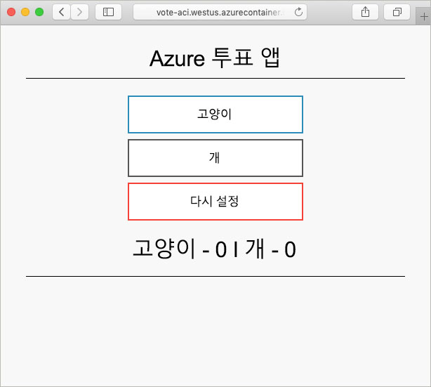

# <a name="create-a-terraform-configuration-for-azure"></a>Azure에 대한 Terraform 구성 파일 만들기

이 예제에서는 Terraform 구성을 만들고 Azure에 이 구성을 배포하는 경험을 얻을 수 있습니다. 모두 마치면 Azure Cosmos DB 인스턴스, Azure Container Instances 및 두 리소스에서 작동하는 애플리케이션이 배포됩니다. 이 문서에서는 모든 작업을 Terraform 도구가 미리 설치된 Azure Cloud Shell에서 완료한다고 가정합니다. 자신의 시스템에서 예제를 연습하고 싶으면 [여기](../virtual-machines/linux/terraform-install-configure.md) 지침에 따라 Terraform을 설치하면 됩니다.

## <a name="create-first-configuration"></a>첫 번째 구성 만들기

이 섹션에서는 Azure Cosmos DB 인스턴스에 대한 구성을 만들겠습니다.

**지금 사용해 보기**를 선택하여 Azure 클라우드 셸을 엽니다. 열리면 `code .`를 입력하여 클라우드 셸 코드 편집기를 엽니다.

```azurecli-interactive
code .
```

다음 Terraform 구성을 복사하여 붙여넣습니다.

이 구성은 Azure 리소스 그룹, 임의의 정수 및 Azure Cosmos DB 인스턴스를 모델링합니다. 임의의 정수는 Cosmos DB 인스턴스 이름에 사용됩니다. 또한 여러 Cosmos DB 설정이 구성됩니다. Cosmos DB Terraform 구성의 전체 목록은 [Cosmos DB Terraform 참조](https://www.terraform.io/docs/providers/azurerm/r/cosmosdb_account.html)를 확인하세요.

모두 마치면 파일을 `main.tf`로 저장합니다. 코드 편집기의 오른쪽 상단에 있는 줄임표를 사용하여 이 작업을 수행할 수도 있습니다.

```azurecli-interactive
resource "azurerm_resource_group" "vote-resource-group" {
  name     = "vote-resource-group"
  location = "westus"
}

resource "random_integer" "ri" {
  min = 10000
  max = 99999
}

resource "azurerm_cosmosdb_account" "vote-cosmos-db" {
  name                = "tfex-cosmos-db-${random_integer.ri.result}"
  location            = "${azurerm_resource_group.vote-resource-group.location}"
  resource_group_name = "${azurerm_resource_group.vote-resource-group.name}"
  offer_type          = "Standard"
  kind                = "GlobalDocumentDB"

  consistency_policy {
    consistency_level       = "BoundedStaleness"
    max_interval_in_seconds = 10
    max_staleness_prefix    = 200
  }

  geo_location {
    location          = "westus"
    failover_priority = 0
  }
}
```

[terraform init](https://www.terraform.io/docs/commands/init.html) 명령은 작업 디렉터리를 초기화합니다. 클라우드 셸 터미널에서 `terraform init`를 실행하여 새 구성을 배포할 준비를 합니다.

```azurecli-interactive
terraform init
```

[terraform plan](https://www.terraform.io/docs/commands/plan.html) 명령은 구성의 형식이 올바른지 유효성을 검사하고 어떤 리소스가 생성, 업데이트 또는 제거되는지 시각화하는 데 사용할 수 있습니다. 결과를 파일에 저장해 두었다가 나중에 구성을 적용하는 데 사용할 수 있습니다.

`terraform plan`을 실행하여 새 Terraform 구성을 테스트합니다.

```azurecli-interactive
terraform plan --out plan.out
```

[terraform apply](https://www.terraform.io/docs/commands/apply.html)를 사용하여 구성을 적용하고 계획 파일의 이름을 지정합니다. 이 명령은 Azure 구독의 리소스를 배포합니다.

```azurecli-interactive
terraform apply plan.out
```

완료되면 리소스 그룹이 만들어지고 리소스 그룹에 Azure Cosmos DB 인스턴스가 배치된 것을 볼 수 있습니다.

## <a name="update-configuration"></a>구성 업데이트

Azure Container Instance를 포함하도록 구성을 업데이트합니다. 컨테이너는 Cosmos DB에 데이터를 읽고 쓰는 애플리케이션을 실행합니다.

`main.tf` 파일의 맨 아래에 다음 구성을 복사합니다. 모두 마치면 파일을 저장합니다.

두 환경 변수는 `COSMOS_DB_ENDPOINT` 및 `COSMOS_DB_MASTERKEY`로 설정됩니다. 이러한 변수는 데이터베이스에 액세스하기 위한 위치 및 키를 보관합니다. 이러한 변수의 값은 마지막 단계에서 만든 데이터베이스 인스턴스에서 가져옵니다. 이 프로세스를 보간이라고 합니다. Terraform 보간에 대한 자세한 내용은 [보간 구문](https://www.terraform.io/docs/configuration/interpolation.html)을 참조하세요.


구성에는 컨테이너 인스턴스의 FQDN(정규화된 도메인 이름)을 반환하는 출력 블록도 포함됩니다.

```azurecli-interactive
resource "azurerm_container_group" "vote-aci" {
  name                = "vote-aci"
  location            = "${azurerm_resource_group.vote-resource-group.location}"
  resource_group_name = "${azurerm_resource_group.vote-resource-group.name}"
  ip_address_type     = "public"
  dns_name_label      = "vote-aci"
  os_type             = "linux"

  container {
    name   = "vote-aci"
    image  = "microsoft/azure-vote-front:cosmosdb"
    cpu    = "0.5"
    memory = "1.5"
    ports  = {
      port     = 80
      protocol = "TCP"
    }

    secure_environment_variables {
      "COSMOS_DB_ENDPOINT"  = "${azurerm_cosmosdb_account.vote-cosmos-db.endpoint}"
      "COSMOS_DB_MASTERKEY" = "${azurerm_cosmosdb_account.vote-cosmos-db.primary_master_key}"
      "TITLE"               = "Azure Voting App"
      "VOTE1VALUE"          = "Cats"
      "VOTE2VALUE"          = "Dogs"
    }
  }
}

output "dns" {
  value = "${azurerm_container_group.vote-aci.fqdn}"
}
```

`terraform plan`을 실행하여 업데이트된 계획을 만들고 변경할 내용을 시각화합니다. Azure Container Instance 리소스가 구성에 추가된 것이 보일 것입니다.

```azurecli-interactive
terraform plan --out plan.out
```

마지막으로 `terraform apply`를 실행하여 구성을 적용합니다.

```azurecli-interactive
terraform apply plan.out
```

완료되면 컨테이너 인스턴스 FQDN을 적어 둡니다.

## <a name="test-application"></a>애플리케이션 테스트

컨테이너 인스턴스의 FQDN으로 이동합니다. 모든 것이 올바르게 구성되면 다음 애플리케이션이 보입니다.



## <a name="clean-up-resources"></a>리소스 정리

모두 마친 후에는 [terraform destroy](https://www.terraform.io/docs/commands/destroy.html) 명령을 사용하여 Azure 리소스 및 리소스 그룹을 제거해도 됩니다.

```azurecli-interactive
terraform destroy -auto-approve
```

## <a name="next-steps"></a>다음 단계

이 예제에서는 Terraform 구성을 생성, 배포 및 제거했습니다. Azure에서 Terraform을 사용하는 방법에 대한 자세한 내용은 Azure Terraform 공급 기업 설명서를 참조하세요.

> [!div class="nextstepaction"]
> [Azure Terraform 공급 기업](https://www.terraform.io/docs/providers/azurerm/)