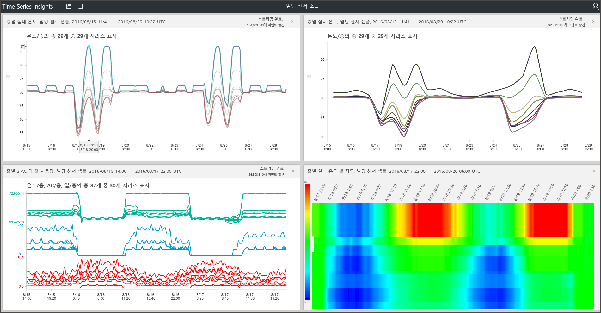

# Azure Time Series Insights 탐색기

이 문서는 기능을 설명 하 고 Azure Time Series Insights에 대 한 일반적 가용성 옵션 [탐색기 웹 앱](https://insights.timeseries.azure.com/)합니다. Time Series Insights 탐색기는 서비스에서 제공 하는 강력한 데이터 시각화 기능을 보여 줍니다 및 고유한 환경 내에서 액세스할 수 있습니다.

Azure Time Series Insights는 완전히 관리되는 분석, 저장 및 시각화 서비스이며 수십억 개의 IoT 이벤트를 동시에 간편하게 탐색 및 분석할 수 있습니다. 데이터에 대한 글로벌 보기를 제공하므로 사용자는 IoT 솔루션의 유효성을 빠르게 검사할 수 있으며, 숨겨진 동향을 찾고, 문제를 찾아내고, 거의 실시간으로 근본 원인 분석을 수행할 수 있도록 지원하는 기능을 통해, 큰 비용이 수반되는 중요 업무용 장치의 가동 중지 시간을 방지할 수 있습니다. Time Series Insights 탐색기는 현재 공개 미리 보기로 제공됩니다.

> [!TIP]
> 살펴볼 데모 환경에 대 한 읽기를 [빠른 시작 Azure Time Series Insights](time-series-quickstart.md)합니다.

## 비디오

### Time Series Insights 탐색기를 사용 하 여 데이터를 쿼리 하는 방법을 알아봅니다.  

> [!VIDEO https://www.youtube.com/embed/SHFPZvrR71s]

>[!NOTE]
>위의 비디오를 참조 하세요. <a href="https://www.youtube.com/watch?v=6ehNf6AJkFo">"시작 Time Series Insights를 사용 하 여 Azure IoT 솔루션 가속기를 사용 하 여."</a>

## 필수 조건

Time Series Insights 탐색기를 사용하려면 다음을 준비해야 합니다.

- Time Series Insights 환경을 만듭니다. 자세한 내용은 [Time Series Insights를 사용 하 여 시작 하는 방법을](./time-series-insights-get-started.md)합니다.
- [액세스할](time-series-insights-data-access.md) 환경에서 계정에 있습니다.
- 추가 [IoT hub](time-series-insights-how-to-add-an-event-source-iothub.md) 하거나 [이벤트 허브](time-series-insights-how-to-add-an-event-source-eventhub.md) 를 이벤트 소스입니다.

## 데이터 탐색 및 쿼리하기

이벤트 소스를 Time Series Insights 환경에 연결하면 몇 분 안에 시계열 데이터를 탐색하고 쿼리할 수 있습니다.

1. 시작 하려면 엽니다는 [Time Series Insights 탐색기](https://insights.timeseries.azure.com/) 웹 브라우저에서. 창의 왼쪽에서 환경을 선택 합니다. 액세스 가능한 모든 환경이 알파벳 순으로 표시됩니다.

1. 환경을 선택한 후 사용 하거나 합니다 **에서** 및 **에** 맨 위에 있는 구성 하거나 클릭 하 고 원하는 시간 범위 위로 끌기. 오른쪽 위 모서리의 돋보기를 선택 하거나 선택한 시간 범위를 마우스 오른쪽 단추로 클릭 하 고 선택 **검색**합니다.

1. 또한 새로 고칠 수 있습니다 가용성 자동으로 1 분 마다 선택 하 여 합니다 **자동 켜기** 단추입니다. 합니다 **자동 켜기** 단추는 기본 시각화의 콘텐츠가 아닌 가용성 차트에만 적용 됩니다.

1. Azure 클라우드 아이콘을 Azure portal에서 환경에 이동합니다.

   

1. 선택한 시간 범위에 포함된 모든 이벤트의 개수가 표시된 차트를 보게 됩니다. 여기서 몇 가지 옵션을 사용할 수 있습니다.

    - **기간 편집기 패널**: 기간 공간에서 환경을 쿼리할 수 있습니다. 화면 왼쪽에서 발견 된:
      - **측정값**: 이 드롭다운 목록은 모든 숫자 열 (**Double**).
      - **분할 기준**: 이 드롭다운 목록은 범주 열 (**문자열**).
      - 단계 보간 사용, 최소값 및 최대값을 표시 및 옆에 제어판에서 y 축을 조정할 **측정값**합니다. 조정할 수도 있습니다 개수, 평균 또는 데이터의 합계 표시 되는 데이터를 인지 합니다.
      - 동일한 x 축에 표시할 최대 5 개의 기간을 추가할 수 있습니다. 사용 하 여 합니다 **copy-down** 용어를 더 추가 하려면 단추 또는 선택 **추가** 새 용어를 추가 합니다.

        

      - **조건자**: 조건자를 사용 하 여 신속 하 게 다음 표에 나열 된 피연산자 집합을 사용 하 여 이벤트를 필터링 합니다. 선택 하거나 클릭 하 여 검색을 수행 하면 조건자 업데이트에 따라 자동으로 검색 합니다. 지원되는 연산자는 다음과 같습니다.

         |작업(Operation)  |지원되는 형식  |메모  |
         |---------|---------|---------|
         |`<`, `>`, `<=`, `>=`     |  Double, DateTime, TimeSpan       |         |
         |`=`, `!=`, `<>`     | String, Bool, Double, DateTime, TimeSpan, NULL        |         |
         |IN     | String, Bool, Double, DateTime, TimeSpan, NULL        |  모든 연산자는 같은 형식이거나 NULL 상수여야 합니다.        |
         |HAS     | String        |  오른쪽에 있는 상수 문자열 리터럴만 허용 됩니다. 빈 문자열과 NULL은 허용 되지 않습니다.       |

      - **쿼리 예**

         

1. 사용할 수는 **간격 크기** 슬라이더 도구를 통해 같은 시간 간격으로 확대/축소 합니다. 슬라이더 사이 시간을 밀리초 단위로 작게 부드러운 추세를 표시 하는 세부적인, 고해상도 긴 데이터를 볼 수 있도록 하는 보다 정확한 제어를 제공 합니다. 슬라이더의 기본 시작점 해상도, 쿼리 속도 및 세분성을 분산 하 데이터의 최적의 뷰로 선택 항목에서 설정 됩니다.

1. 합니다 **브러시 시간** 도구를 사용 하면 다른 하나의 timespan에서 탐색 하기가 쉽습니다.

1. 사용 된 **저장** 현재 쿼리를 저장 하 고 환경의 다른 사용자와 공유 하는 명령입니다. 사용 하는 경우 **열려**, 저장 된 쿼리의 모든 및 환경에 액세스할 수 있는 다른 사용자의 공유 쿼리를 볼 수 있습니다.

   

## 데이터 가상화

1. 사용 합니다 **원근감 뷰** 최대 4 개의 고유 쿼리를 동시에 볼에 대 한 도구입니다. 합니다 **원근감 뷰** 단추는 차트의 오른쪽 위 모퉁이.

   

1. 시각적으로 데이터를 탐색 하 고 사용 하 여 차트를 확인 합니다 **차트** 도구:

    - **선택** 나 **클릭** 특정 시간 범위 또는 단일 데이터 계열입니다.
    - Timespan 선택 내에서 확대/축소 하거나 이벤트를 살펴볼 수 있습니다.
    - 하나의 데이터 계열에서 다른 열을 기준으로 계열을 분할하거나, 계열을 새 기간으로 추가하거나, 선택한 계열만 표시하거나, 선택한 계열을 제외하거나, 계열에 대해 ping을 보내거나 선택한 계열의 이벤트를 탐색할 수 있습니다.
    - 차트의 왼쪽에 필터 영역에서 모든 표시 되는 데이터 계열을 볼 수 있으며 값 또는 이름으로 다시 정렬할 수 있습니다. 또한 보면 모든 데이터 계열 또는 모든 고정 또는 고정 해제 된 시리즈. 수 단일 데이터 계열을 선택 및 계열을 다른 열에서 분할 계열을 새 용어로 추가, 선택한 계열만 표시, 선택한 계열을 제외, 해당 계열의 고정 또는 선택한 계열의 이벤트를 탐색 합니다.
    - 여러 용어를 동시에 볼 때 스택, 스택, 데이터 계열에 대 한 추가 데이터 보고 수 모든 용어 전체에서 동일한 y 축을 사용 합니다. 차트의 오른쪽 위 모퉁이의 단추를 사용 합니다.

    

1. 사용 하 여는 **heatmap** 주어진 쿼리에서 고유한 또는 비정상적인 데이터 계열을 빨리 찾아낼 수 있습니다. 하나의 검색 기간만 열 지도로 시각화할 수 있습니다.

    

1. 선택 하거나 마우스 오른쪽 단추로 클릭 하 여 이벤트를 살펴볼 때, **이벤트** 패널 제공 됩니다. 여기에서 원시 이벤트를 보고 이벤트를 JSON 또는 CSV 파일로 내보낼 수 있습니다. Time Series Insights는 모든 원시 데이터를 저장합니다.

    

1. 선택 된 **통계** 탭 하 여 패턴과 열 통계는 이벤트를 탐색 합니다.

    - **패턴**: 이 기능은 선택한 데이터 영역에서 통계적으로 가장 중요 한 패턴을 사전에 표시합니다. 수천 개의 패턴 필요 가장 많은 시간과 에너지를 이해 하는 이벤트를 살펴볼 필요가 없습니다. Time Series Insights를 사용 하 여 분석을 수행 하려면 이러한 통계적으로 중요 한 패턴으로 직접 이동할 수 있습니다. 이 기능은 과거 데이터에 대한 사후 평가 분석을 실시할 때도 유용합니다.
    - **열 통계**: 열 통계는 선택한 시간에 선택한 데이터 계열의 각 열에서 데이터를 테이블과 차트를 제공 합니다.

      

이제 다양 한 기능 및 Time Series Insights 탐색기 웹 앱 내에서 사용할 수 있는 옵션을 확인 했습니다.

## 다음 단계

- 설명 하는 방법 [문제 진단 및 해결](time-series-insights-diagnose-and-solve-problems.md) Time Series Insights 환경에서.
- 수행 합니다 안내식 [빠른 시작 Azure Time Series Insights](time-series-quickstart.md) 둘러보기입니다.
