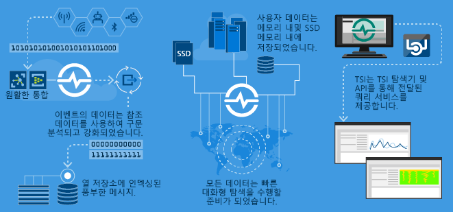

# Azure Time Series Insights란?

Azure Time Series Insights는 IoT 디바이스에서 생성된 것과 같은 대량의 시계열 데이터를 저장, 시각화 및 쿼리하도록 빌드되었습니다. 클라우드의 시계열 데이터를 저장, 관리, 쿼리 또는 시각화하려면 Time Series Insights를 사용하는 것이 좋습니다. 

Time Series Insights에는 다음 4가지 핵심 작업이 포함됩니다.

- Azure IoT Hub 및 Azure Event Hubs 같은 클라우드 게이트웨이와 완전히 통합되었습니다. 이러한 이벤트 소스에 쉽게 연결해서 깨끗한 행 및 열에 있는 데이터가 포함된 메시지 및 구조체에서 JSON을 구문 분석할 수 있습니다. 메타데이터를 원격 분석과 조인하고 열 형식 저장소에 데이터를 인덱싱합니다.
- Time Series Insights는 데이터 스토리지를 관리합니다. 항상 데이터에 쉽게 액세스할 수 있도록 메모리 및 SSD에서 데이터를 최대 400일 동안 저장합니다. 요청 시 수십억 개의 이벤트를 대화형으로 수초 내에 쿼리할 수 있습니다.
- Time Series Insights는 Time Series Insights 탐색기를 통해 즉시 사용 가능한 시각화를 제공합니다. 
- Time Series Insights는 Time Series Insights 탐색기 및 시계열 데이터를 사용자 지정 애플리케이션에 포함시켜 쉽게 통합할 수 있는 API를 사용하여 쿼리 서비스를 제공합니다.

내부에서 사용하거나 외부 고객이 사용할 애플리케이션을 구축하는 경우 Time Series Insights를 백 엔드로 사용할 수 있습니다. 이를 사용하여 시계열 데이터를 인덱싱, 저장 및 집계할 수 있습니다. 또한 사용자 지정 시각화 및 사용자 환경을 빌드하기 위해 [클라이언트 SDK](tutorial-explore-js-client-lib.md)를 사용합니다. 뿐만 아니라 Time Series Insights는 이러한 사용자 지정 시나리오를 지원하는 여러 [쿼리 API](how-to-shape-query-json.md)를 갖추고 있습니다.

시계열 데이터는 자산 또는 프로세스가 시간이 지남에 따라 어떻게 달라지는지를 나타냅니다. 시계열 데이터는 타임스탬프를 통해 인덱싱되며, 시간은 이러한 데이터를 구성하는 가장 의미 있는 축입니다. 시계열 데이터는 일반적으로 순차적으로 도착하므로 대개 데이터베이스 업데이트보다는 삽입으로 처리됩니다.

대량의 시계열 데이터를 저장, 인덱싱, 쿼리, 분석 및 시각화하는 것이 어려울 수 있습니다.
Azure Time Series Insights는 새로운 모든 이벤트를 하나의 행으로 캡처하고 저장하며, 시간이 지남에 따라 변경 내용을 효율적으로 측정합니다. 결과적으로 과거를 돌아보고 과거의 인사이트를 끌어내어 미래의 변화를 예측하는 데 도움이 될 수 있습니다.

## 비디오

### 클라우드 기반 IoT 분석 플랫폼인 Azure Time Series Insights에 대해 알아보세요. 

## 기본 시나리오

- 시계열 데이터를 확장 가능한 방식으로 저장합니다. 

   기본적으로 Time Series Insights에서는 시계열 데이터를 고려해서 디자인된 데이터베이스를 제공합니다. Time Series Insights는 확장 가능하고 완벽하게 관리되므로 이벤트를 저장하고 관리하는 작업을 처리합니다.

- 데이터를 거의 실시간으로 검색합니다. 

   Time Series Insights는 환경으로 스트림되는 모든 데이터를 시각화하는 탐색기를 제공합니다. 이벤트 원본을 연결하는 즉시 Time Series Insights 내에서 이벤트 데이터를 보고, 검색하고, 쿼리할 수 있습니다. 이 데이터는 디바이스가 예상대로 데이터를 내보내는지 확인하고 IoT 자산의 상태, 생산성 및 전반적인 효율성을 모니터링하는 데 유용합니다. 

- 근본 원인 분석을 수행하고 이상 현상을 검색합니다.

   Time Series Insights는 패턴 및 원근감 보기와 같은 도구를 통해 다단계 근본 원인 분석을 수행하고 저장합니다. 또한 Time Series Insights는 Azure Stream Analytics와 같은 경고 서비스에서 작동하므로 Time Series Insights 탐색기에서 경고 및 검색된 이상 현상을 거의 실시간으로 확인할 수 있습니다. 

- 여러 자산 또는 사이트를 비교하기 위해 서로 다른 위치에서 스트림하는 시계열 데이터에 대한 글로벌 보기를 얻습니다.

   여러 이벤트 원본을 Time Series Insights 환경에 연결할 수 있습니다. 이렇게 하면 서로 다른 여러 위치에서 스트림되는 데이터를 모두 거의 실시간으로 볼 수 있습니다. 사용자는 이러한 가시성을 활용하여 데이터를 비즈니스 리더와 공유할 수 있습니다. 또한 전문 지식을 적용하여 문제 해결, 모범 사례 적용 및 학습 공유를 지원할 수 있는 도메인 전문가와 더 효율적으로 협업할 수 있습니다.

- Time Series Insights를 기반으로 하여 고객 애플리케이션을 빌드합니다. 

   Time Series Insights는 REST 쿼리 API를 공개하므로 시계열 데이터를 사용하는 애플리케이션을 빌드할 수 있습니다.

## 기능

- **빠른 시작**: Azure Time Series Insights는 데이터를 미리 준비할 필요가 없으므로 IoT Hub 또는 이벤트 허브에서 수백만 개의 이벤트에 빠르게 연결할 수 있습니다. 연결되면 센서 데이터를 시각화하고 상호 작용하여 IoT 솔루션의 유효성을 빠르게 검사할 수 있습니다. 코드를 작성하지 않고도 데이터와 상호 작용할 수 있으며, 새로운 언어를 습득할 필요가 없습니다. Time Series Insights는 고급 사용자 및 가리키고 클릭 검색을 위해 세분화된 자유 텍스트 쿼리 화면을 제공합니다.

- **거의 실시간에 가까운 인사이트**: Time Series Insights는 1분 대기 시간을 통해 하루에 수백만 개의 센서 이벤트를 수집할 수 있습니다. Time Series Insights를 사용하면 센서 데이터에 대한 인사이트를 얻을 수 있습니다. 이를 통해 추세와 이상 현상을 파악하고, 근본 원인을 분석하며, 비용이 많이 드는 가동 중지 시간을 방지합니다. 실시간 데이터와 기록 데이터 간의 상호 상관 관계를 사용하면 데이터에 숨겨진 추세를 찾을 수 있습니다.

- **사용자 지정 솔루션 빌드**: Azure Time Series Insights 데이터를 기존 애플리케이션에 포함시킵니다. 또한 Time Series Insights REST API를 사용하여 새로운 사용자 지정 솔루션을 만들 수도 있습니다. 공유할 수 있는 개인 설정 보기를 만들어 다른 사용자가 여러분이 알아낸 정보를 탐색할 수 있도록 합니다.

- **확장성**: Time Series Insights는 대규모 IoT를 지원하도록 설계되었습니다. 기본 보존 기간을 31일로 설정하면 하루에 1백만 ~ 1억 개의 이벤트를 수신할 수 있습니다. 기록 데이터와 함께 라이브 데이터 스트림을 거의 실시간으로 시각화하고 분석할 수 있습니다.

## 시작하기

시작하려면 다음 단계를 수행합니다.

1. Azure Portal에서 Time Series Insights 환경을 프로비저닝합니다
1. IoT Hub 또는 이벤트 허브와 같은 이벤트 원본에 연결합니다. 
1. 참조 데이터를 업로드합니다. 이는 추가 서비스가 아닙니다.
1. Time Series Insights 탐색기를 사용하여 몇 분 만에 데이터를 볼 수 있습니다.

## Time Series Insights 탐색기

다음 다이어그램에서는 Time Series Insights 탐색기를 통해 확인되는 Time Series Insights 데이터의 예를 보여 줍니다.

## 다음 단계

- Azure Time Series Insights 일반 공급 [무료 데모 환경](./time-series-quickstart.md)을 살펴봅니다.
- [Time Series Insights 환경을 계획하는 방법](time-series-insights-environment-planning.md)을 자세히 알아봅니다.
