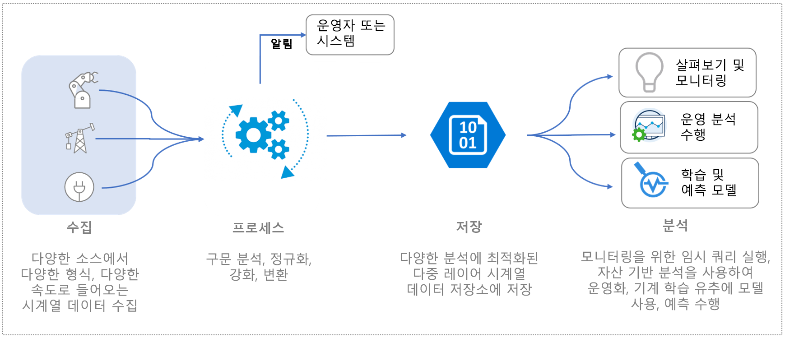
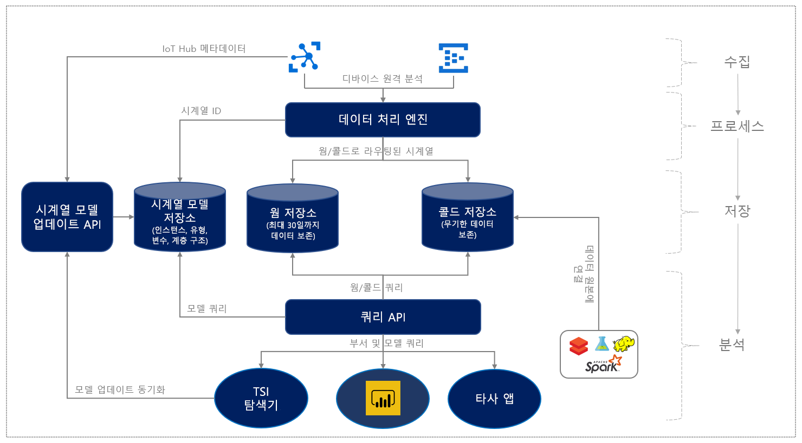

# Azure Time Series Insights Preview란?

Azure Time Series Insights 미리 보기는 엔드투엔드 PaaS(Platform as a Service) 제품입니다. 이 제품을 사용하여 IoT(사물 인터넷) 규모에서 시계열에 맞게 고도로 컨텍스트화되고 최적화된 데이터를 수집, 처리, 저장, 분석 및 쿼리할 수 있습니다. 

Time Series Insights는 임시 데이터 탐색 및 운영 분석을 위해 고안되었습니다. TSI는 산업용 IoT 배포의 광범위한 필요를 충족하는 고유하게 확장 가능하고 사용자 지정된 서비스 제품입니다.

## 비디오

Azure Time Series Insights 미리 보기에 대해 자세히 알아보세요.

> [!VIDEO https://channel9.msdn.com/Shows/Internet-of-Things-Show/Azure-Time-Series-Insights-e2e-solution-for-industrial-IoT-analytics/player]

## IoT 데이터의 정의

자산 집약적 조직의 산업용 IoT 데이터는 산업 설정에서 사용되는 디바이스 및 센서의 다양한 특성으로 인해 구조적 일관성이 부족한 경우가 많습니다. 이러한 스트림의 데이터는 상당한 차이, 경우에 따라 손상된 메시지 및 거짓 판독값 등의 특성이 나타냅니다. 대체로 IoT 데이터는 CRM 또는 ERP와 같이 엔드투엔드 워크플로에 대한 컨텍스트를 추가하며 자사 또는 타사 원본에서 제공되는 추가 데이터 입력의 컨텍스트에서만 의미가 있습니다. 날씨 데이터와 같은 타사 데이터 원본의 입력은 지정된 설치에서 원격 분석 스트림을 확대하는 데 유용할 수 있습니다. 

즉, 데이터의 일부만 운영 및 비즈니스 목적으로 사용되며 분석에는 컨텍스트화가 필요합니다. 주로 산업 데이터는 장기간에 걸친 심층 분석을 거치면서 추세를 이해하고 상관 관계를 파악하게 됩니다. 수집된 IoT 데이터를 작업 가능한 인사이트로 전환하려면 다음이 필요합니다. 

* 분석을 위해 데이터를 정리, 필터링, 보간, 변환 및 준비하는 데이터 처리
* 데이터를 탐색 및 파악하는(즉, 데이터를 정규화 및 컨텍스트화하는) 구조
* 처리되거나 파생된 데이터 및 원시 데이터의 장기 또는 무기한 보존을 위한 경제적인 스토리지

이러한 데이터는 비즈니스 분석 및 보고에 대한 현재의 일관적이고 포괄적이며 올바른 정보를 제공합니다.

다음 이미지는 일반적인 IoT 데이터 흐름을 보여 줍니다.

## 산업 IoT용 Azure Time Series Insights

IoT Landscape는 제조, 자동차, 에너지, 유틸리티, 스마트 빌딩 및 컨설팅을 비롯한 다양한 산업 부문의 고객을 포함합니다. 이러한 광범위한 산업용 IoT 시장에서 대규모 IoT 데이터를 대상으로 하는 포괄적인 분석을 제공하는 클라우드 네이티브 솔루션은 여전히 진화하고 있습니다. 

Azure Time Series Insights는 시계열 데이터의 컨텍스트화를 위한 풍부한 의미 체계 모델링, 자산 기반 인사이트, 검색, 추세, 변칙 검색, 운영 인텔리전스를 위한 최고의 사용자 환경을 갖춘 턴키 및 엔드투엔드 IoT 분석 솔루션을 제공하여 이 시장의 요구 사항을 해결합니다. 

대화형 데이터 탐색 기능과 결합된 풍부한 운영 분석 플랫폼에서 Time Series Insights를 사용하여 IoT 자산에서 수집한 데이터를 최대한 활용할 수 있습니다. 미리 보기 제품은 다음을 지원합니다. 

* 웜 데이터의 대화형 분석 뿐만 아니라 수십 년 간의 기록 데이터에 대한 운영 인텔리전스를 위해 웜 및 콜드 데이터 간에 데이터 경로를 지정할 수 있는 옵션을 제공하는 웜 및 콜드 분석이 지원되는 다중 계층화 스토리지 솔루션 

    *    훨씬 더 짧은 시간 간격의 데이터에 대해 자주 많은 수의 쿼리를 수행하기 위한 고도의 대화형 웜 분석 솔루션 
    *    Azure Storage 기반의 확장 가능하고 성능이 뛰어나고 비용이 최적화된 시계열 데이터 레이크는 고객이 수년 가치의 시계열 데이터 추세를 몇 초 안에 파악할 수 있도록 합니다. 

* 자산과 디바이스의 파생 신호 및 원시 신호와 관련된 도메인과 메타데이터를 설명하는 의미 체계 모델 지원

* 고객 소유 Azure Storage 계정에 기록 시계열 데이터를 저장하여 고객이 IoT 데이터 소유권을 유지할 수 있도록 하는 유연한 분석 플랫폼. 데이터는 예측 분석, 기계 학습 및 친숙한 기술(예: Spark, Databricks 및 Jupyter)을 사용하여 수행되는 기타 사용자 지정 컴퓨팅을 비롯한 다양한 데이터 시나리오에서 연결 및 상호 운용성을 지원하는 오픈 소스 Apache Parquet 형식으로 저장됩니다.

* 자산 기반 데이터 인사이트를 심도 깊은 분석을 위해 보간, 스칼라 및 집계 함수, 범주 변수, 산점도 및 시간 이동 시계열 신호를 지원하는 풍부한 임시 데이터 분석과 결합되는 향상된 쿼리 API 및 사용자 환경을 갖춘 풍부한 분석

*    엔터프라이즈 IoT 고객의 확장성, 성능, 보안 및 안정성 요구를 지원하기 위한 엔터프라이즈급 플랫폼

* 엔드투엔드 분석에 대한 확장성 및 통합 지원. Time Series Insights는 다양한 데이터 시나리오에 대한 확장 가능한 분석 플랫폼을 제공합니다. Time Series Insights Power BI 커넥터를 사용하여 고객은 Time Series Insights에서 수행하는 쿼리를 Power BI로 직접 가져와 단일 창구에서 통합된 BI 및 시계열 분석을 볼 수 있습니다.

다음 다이어그램은 개괄적인 데이터 흐름을 보여 줍니다.

  

Azure Time Series Insights는 데이터 처리, 스토리지(데이터 및 메타데이터) 및 쿼리에 대해 확장 가능한 종량제 가격 책정 모델을 제공하므로 고객운 비즈니스 요구에 맞게 사용량을 조정할 수 있습니다. 
 
이러한 주요 산업 IoT 기능이 도입되면서, Time Series Insights는 다음과 같은 주요 혜택도 제공합니다.  

| | |
| ---| ---|
| IoT 규모 시계열 데이터에 대한 다중 계층 스토리지 | 데이터 수집을 위한 공유 데이터 처리 파이프라인을 사용하여 웜 및 콜드 저장소에 데이터로 수집할 수 있습니다. 대량의 데이터를 저장하기 위한 대화형 쿼리 및 콜드 조정소에 웜 저장소를 사용합니다. 고성능 자산 기반 쿼리를 활용하는 방법에 대한 자세한 내용은 [쿼리](./concepts-query-overview.md)를 참조하세요. |
| 원시 원격 분석을 컨텍스트화하고 자산 기반 인사이트를 제공하는 시계열 모델 | 시계열 모델을 사용하여 시계열 데이터에 대한 인스턴스, 계층, 유형 및 변수를 만들 수 있습니다. 시계열 모델에 대해 자세히 알아보려면 [시계열 모델](./concepts-model-overview.md)을 참조하세요.  |
| 다른 데이터 솔루션과의 지속적인 통합 | Time Series Insights 콜드 저장소의 데이터는 오픈 소스 Apache Parquet 파일에 [저장](concepts-storage.md)됩니다. 이를 통해 비즈니스 인텔리전스, 고급 기계 학습 및 예측 분석을 포함하는 시나리오에서 다른 데이터 솔루션(자사 또는 타사)과 데이터를 통합할 수 있습니다. |
| 거의 실시간 데이터 검색 | [Azure Time Series Insights Preview 탐색기](./time-series-insights-update-explorer.md) 사용자 환경은 수집 파이프라인을 통한 모든 데이터 스트리밍에 대해 시각화를 제공합니다. 이벤트 원본을 연결하면 이벤트 데이터를 보고 탐색하고 쿼리할 수 있습니다. 이러한 방식으로, 디바이스에서 예상대로 데이터를 내보내는지 여부를 확인할 수 있습니다. IoT 자산의 상태, 생산성 및 전반적인 효율성을 모니터링할 수도 있습니다. | 
| 확장성 및 통합 | Azure Time Series Insights Power BI 커넥터 통합은 **내보내기** 옵션을 통해 시계열 탐색기 사용자 환경에서 직접 사용할 수 있으므로, 고객이 사용자 환경에서 만든 시계열 쿼리를 Power BI 데스크톱에 직접 내보내고 다른 BI 분석과 함께 시계열 차트를 볼 수 있습니다. 이를 통해 IoT 시계열을 비롯한 다양한 데이터 원본에 대해 단일 창구를 제공함으로써 Power BI 분야에 투자한 산업용 IoT 엔터프라이즈를 대상으로 하는 새로운 차원의 시나리오가 가능해집니다. | 
| Time Series Insights 플랫폼에 빌드된 사용자 지정 애플리케이션 | Time Series Insights는 [JavaScript SDK](https://github.com/microsoft/tsiclient/blob/master/docs/API.md)를 지원합니다. SDK는 풍부한 컨트롤 및 간소화된 쿼리 액세스를 제공합니다. SDK를 사용하여 비즈니스 요구에 맞는 사용자 지정 IoT 애플리케이션을 Time Series Insights에 빌드할 수 있습니다. Time Series Insights [쿼리 API](./concepts-query-overview.md)를 직접 사용하여 사용자 지정 IoT 애플리케이션에 데이터를 제공할 수도 있습니다. |

## 다음 단계

Azure Time Series Insights 미리 보기 시작:

> [!div class="nextstepaction"]
> [빠른 시작 가이드](./time-series-insights-update-quickstart.md)

사용 사례에 대한 자세한 정보:

> [!div class="nextstepaction"]
> [Azure Time Series Insights Preview 사용 사례](./time-series-insights-update-use-cases.md)