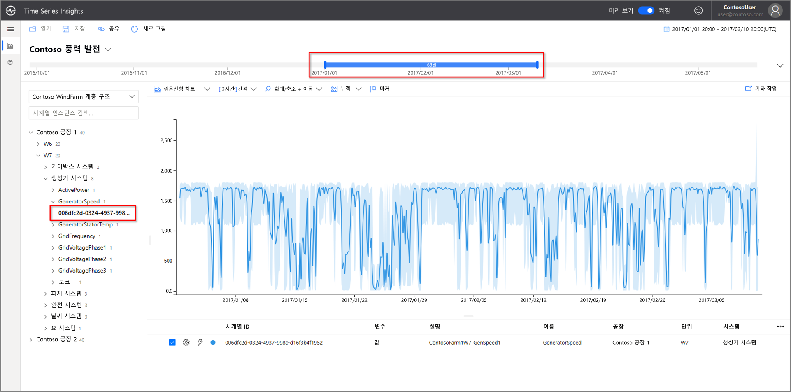
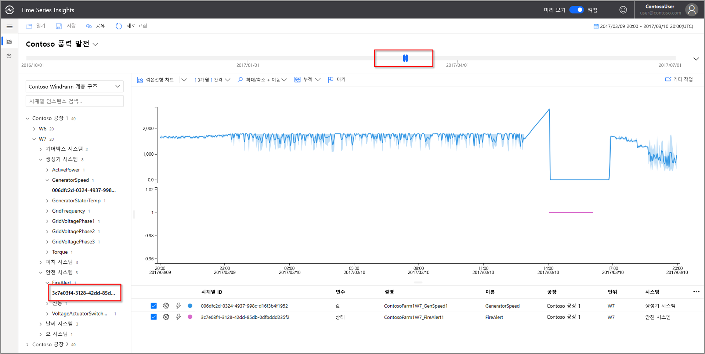
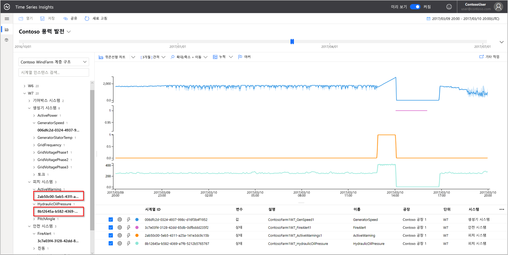
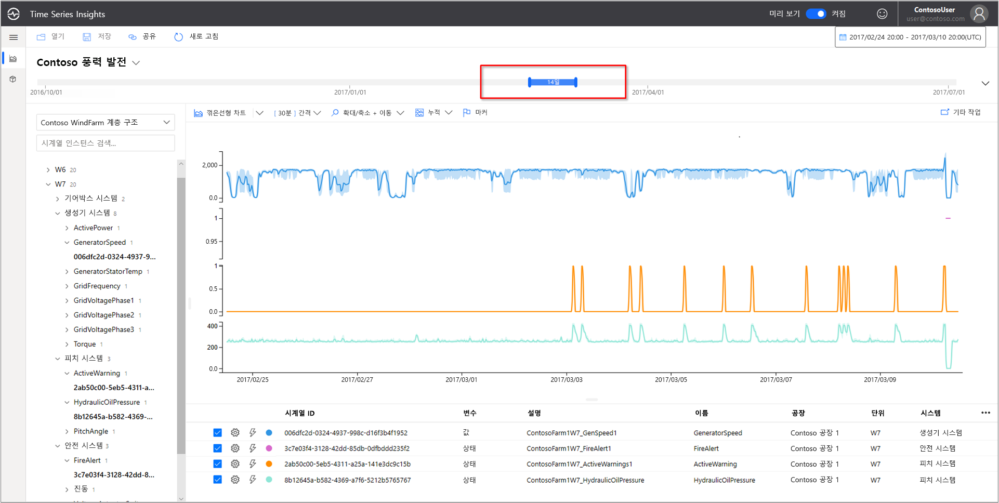
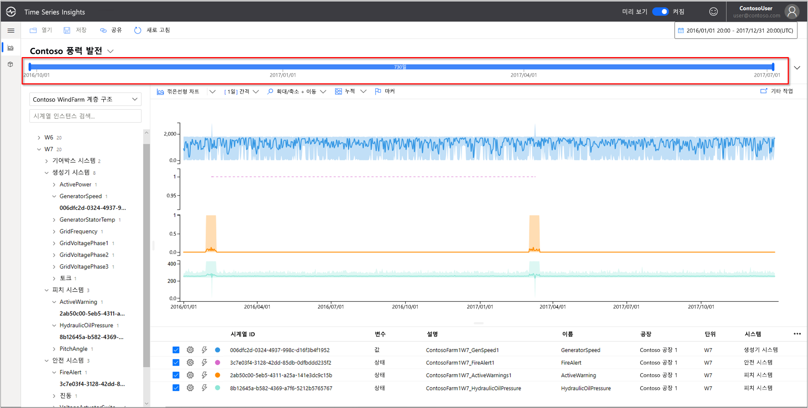
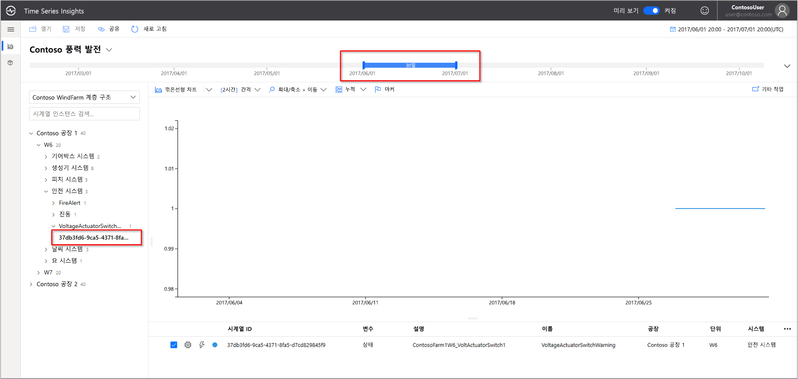
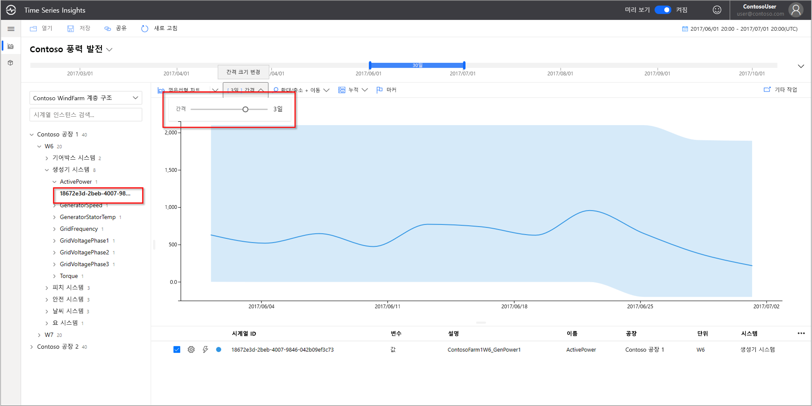
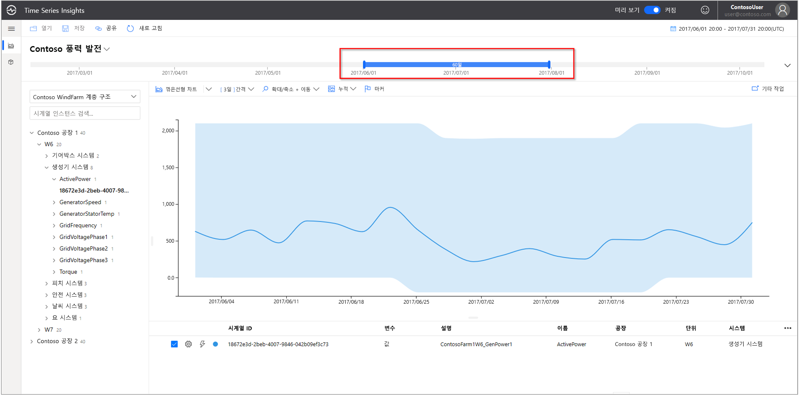
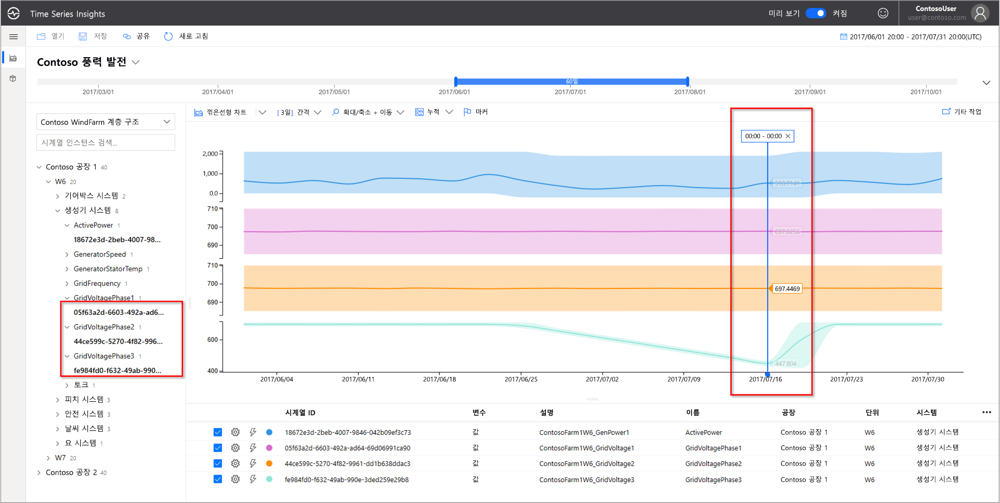
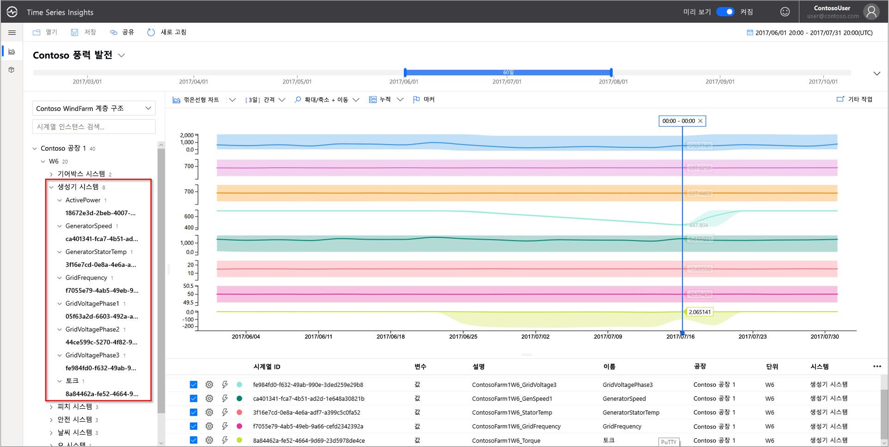

# 빠른 시작: Azure Time Series Insights Preview 데모 환경 탐색

이 빠른 시작에서는 Azure Time Series Insights 미리 보기를 사용합니다. 무료 데모를 통해 Time Series Insights 미리 보기에 추가된 주요 기능을 살펴봅니다.

미리 보기 데모 환경에는 시나리오 회사인 Contoso가 포함되어 있습니다. 이 회사는 각각 10개의 터빈이 있는 2개의 풍력 터빈 팜을 운영하고 있습니다. 각 터빈에는 1분마다 Azure IoT Hub에 데이터를 보고하는 20개의 센서가 있습니다. 센서는 기상 조건, 블레이드 피치 및 요 위치에 대한 정보를 수집합니다. 또한 발전기 성능, 기어 상자 동작 및 보안 모니터도 수집합니다.

 Time Series Insights를 사용하여 Contoso 데이터에서 실행 가능한 인사이트를 찾는 방법을 알아봅니다. 그뿐 아니라 간단한 근본 원인 분석을 수행하여 중요한 오류를 보다 잘 예측하고 유지 관리를 수행합니다.

## 데모 환경에서 Time Series Insights 탐색기 살펴보기

Time Series Insights 미리 보기 탐색기는 기록 데이터 및 근본 원인 분석 과정을 보여 줍니다. 시작하기:

1.  [Azure 체험 계정](https://azure.microsoft.com/free/?ref=microsoft.com&utm_source=microsoft.com&utm_medium=docs&utm_campaign=visualstudio) 을 아직 만들지 않은 경우 만듭니다.

1.  [Contoso 풍력 팜 데모](https://insights.timeseries.azure.com/preview/samples) 환경으로 이동합니다.  

1. 로그인하도록 요구되면 Azure 계정 자격 증명을 사용하여 Time Series Insights 탐색기에 로그인합니다.

## 기록 데이터 사용

1. **Contoso Plant 1**의 풍력 터빈 **W7**을 살펴보겠습니다.  

    * 보기 범위를 **1/1/17 20:00 - 3/10/17 20:00(UTC)** 으로 업데이트합니다.
    * **Contoso Plant 1** > **W7** > **발전기 시스템** > **GeneratorSpeed** 센서를 선택합니다. 그런 다음, 결과 값을 검토합니다.

      

1. 최근에 Contoso는 풍력 터빈 **W7**에서 화재를 발견했습니다. 화재의 가장 가까운 원인에 대한 의견이 분분합니다. 면밀히 확인해본 결과, 화재가 발생하는 동안 화재 경고 센서가 작동된 것을 알게 되었습니다.

    * 보기 범위를 **3/9/17 20:00 - 3/10/17 20:00(UTC)** 으로 업데이트합니다.
    * **안전 시스템** > **FireAlert** 센서를 선택합니다.

      

1. 문제 발생 시에 나타난 다른 이벤트를 검토하여 상황을 이해하세요. 화재 직전에 유압 및 활성 경고가 최대로 높아졌습니다.

    * **피치 시스템** > **HydraulicOilPressure** 센서를 선택합니다.
    * **피치 시스템** > **ActiveWarning** 센서를 선택합니다.

      

1. 화재가 발생하기 직전에 오일 압력과 활성 경고가 증가했습니다. 표시된 시계열을 확장하여 화재로 이어진 기타 징후가 있었는지 확인합니다. 시간이 지나면서 두 센서 모두 일관되게 변동되면서 지속적인 잘못된 패턴을 나타냅니다.

    * 보기 범위를 **2/24/17 20:00 - 3/10/17 20:00(UTC)** 으로 업데이트합니다.

      

1. 2년 동안의 기록 데이터를 검토한 결과, 동일한 센서 변동을 보인 다른 화재 이벤트가 확인되었습니다.

    * 보기 범위를 **1/1/16 - 12/31/17**(모든 데이터)로 업데이트합니다.

      

Azure Time Series Insights 및 센서 원격 분석을 사용하여 기록 데이터에 숨겨진 문제가 되는 장기적인 추세를 발견했습니다. 이러한 새 인사이트를 사용하여 다음과 같은 작업을 수행할 수 있습니다.

> [!div class="checklist"]
> * 실제로 발생한 문제를 설명합니다.
> * 문제를 해결합니다.
> * 상위 경고 알림 시스템을 가동합니다.

## 근본 원인 분석

1. 일부 시나리오에는 데이터에서 미묘한 단서를 파악하기 위해 복잡한 분석이 필요합니다. 날짜 **6/25** 풍차 **W6** 선택

    * 보기 범위를 **6/1/17 20:00 - 7/1/17 20:00(UTC)** 으로 업데이트합니다.
    * 그런 후 **Contoso Plant 1** > **W6** > **안전 시스템** > **VoltageActuatorSwitchWarning**  센서를 선택합니다.

      

1. 경고는 발전기에서 출력되는 전압에 문제가 있음을 나타냅니다. 발전기의 전체 전력 출력은 현재 간격일 때 정상 매개 변수 내에서 작동합니다. 이 간격을 늘리면 다른 패턴이 나타납니다. 한정된 기간 동안 감소가 발생합니다.

    * **VoltageActuatorSwitchWarning** 센서를 분리합니다.
    * **발전기 시스템** > **ActivePower** 센서를 선택합니다.
    * 간격을 **3d**로 업데이트합니다.

      

1. 시간 범위를 확장하여 문제가 중지되었는지 또는 계속되는지를 확인할 수 있습니다.

    * 시간 범위를 60일로 확장합니다.

      

1. 유용한 상황을 제공하기 위해 다른 센서 데이터 요소를 추가할 수 있습니다. 더 많은 센서를 확인할수록 문제에 대한 이해의 폭이 넓어집니다. 실제 값을 보기 위해 표식을 놓겠습니다. 

    * **Generator System** > **GridVoltagePhase1**, **GridVoltagePhase2** 및 **GridVoltagePhase3** 센서를 선택합니다.
    * 표시 영역의 마지막 데이터 요소에 마커를 놓습니다.

      

    세 가지 전압 센서가 정상 매개 변수 내에서 동등하게 작동하고 있습니다. **GridVoltagePhase3** 센서가 문제인 것으로 보입니다.

1. 상황에 좀 더 적합한 데이터를 추가하면 3단계 감소가 더 문제인 것처럼 보입니다. 이제 경고의 원인을 미리 파악하여 유지 관리 팀에 문제를 알릴 준비가 되었습니다.  

    * 동일한 차트 배율로 모든 **발전기 시스템** 센서를 오버레이하도록 화면 표시를 업데이트합니다.

       

## 다음 단계

사용자 고유의 Time Series Insights Preview 환경을 만들 준비가 되었습니다.

> [!div class="nextstepaction"]
> [Time Series Insights Preview 환경 계획](time-series-insights-update-plan.md)

데모 및 해당 기능을 살펴보는 방법을 알아봅니다.

> [!div class="nextstepaction"]
> [Time Series Insights 미리 보기 탐색기](time-series-insights-update-explorer.md)
