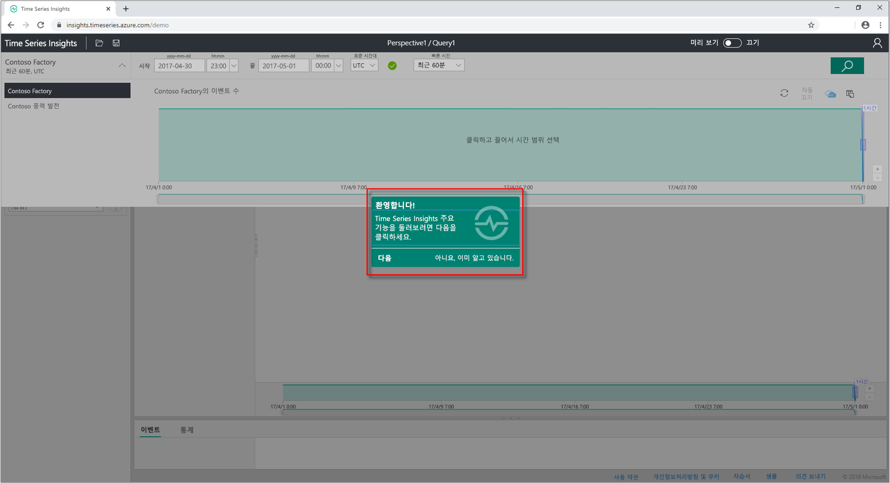
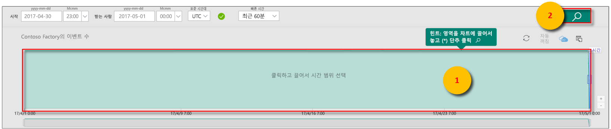
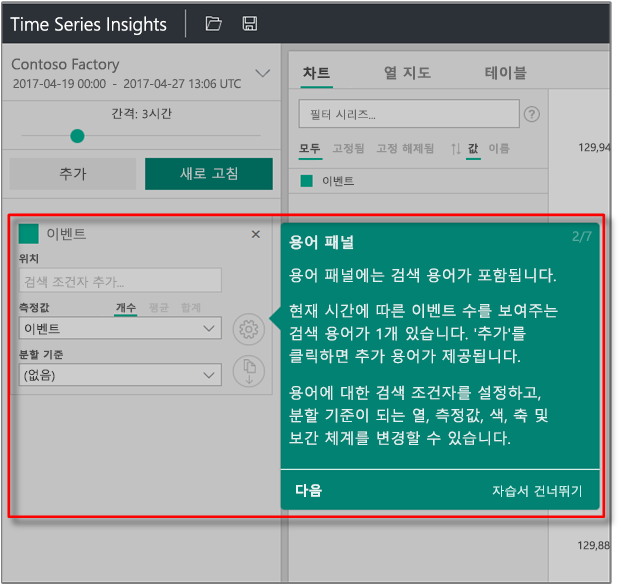
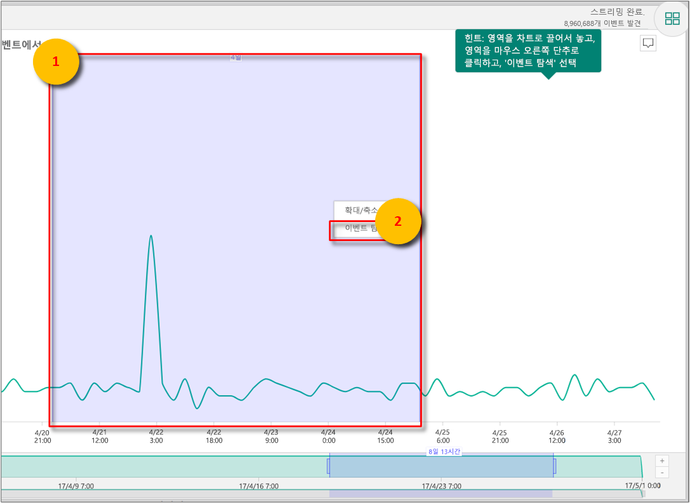
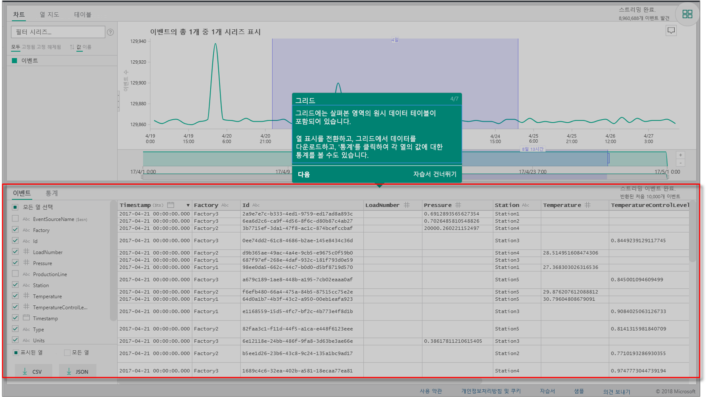
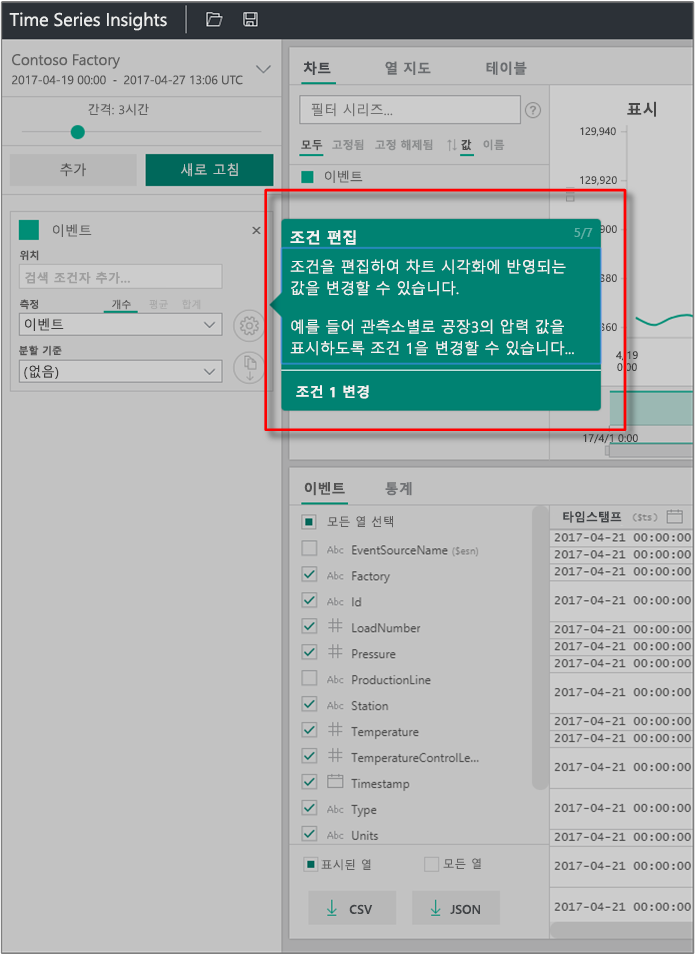
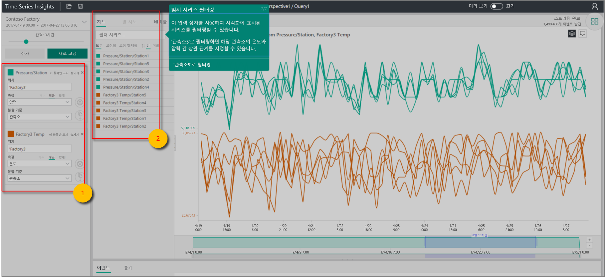

# 빠른 시작: Azure Time Series Insights Gen1 살펴보기

이 Azure Time Series Insights 탐색기 빠른 시작에서는 무료 데모 환경에서 Azure Time Series Insights를 시작하는 방법을 안내합니다. 이 빠른 시작에서는 웹 브라우저를 사용하여 대량의 IoT 데이터를 시각화하는 방법을 알아보고, 일반 공급되는 주요 기능을 둘러봅니다.

Azure Time Series Insights는 완전 관리형 분석, 스토리지 및 시각화 서비스이며, 수십억 개의 IoT 이벤트를 동시에 간편하게 탐색 및 분석할 수 있습니다. 데이터에 대한 글로벌 보기를 제공하므로 사용자는 IoT 솔루션의 유효성을 빠르게 검사할 수 있으며, 큰 비용이 수반되는 중요 업무용 디바이스의 가동 중지 시간을 방지할 수 있습니다. Azure Time Series Insights는 거의 실시간으로 숨겨진 추세를 발견하고, 문제를 찾아내고, 근본 원인을 분석할 수 있습니다.

강력한 [REST API](./concepts-query-overview.md) 및 [클라이언트 SDK](https://github.com/microsoft/tsiclient)를 통해 Azure Time Series Insights를 기존 애플리케이션에 추가하면 유연성을 더욱 높일 수 있습니다. API를 사용하여 원하는 클라이언트 애플리케이션에 시계열 데이터를 저장하고, 쿼리하고, 사용할 수 있습니다. 클라이언트 SDK를 사용하여 기존 애플리케이션에 UI 구성 요소를 추가할 수도 있습니다.

이 Azure Time Series Insights 탐색기 빠른 시작에서는 기능을 둘러볼 수 있습니다.

> [!IMPORTANT]
> 아직 Azure 계정이 없는 경우 [Azure 체험 계정](https://azure.microsoft.com/free/?ref=microsoft.com&utm_source=microsoft.com&utm_medium=docs&utm_campaign=visualstudio)을 만듭니다.

## 데모 환경 준비

1. 브라우저에서 [Gen1 데모](https://insights.timeseries.azure.com/demo)로 이동합니다.

1. 메시지가 표시되면 Azure 계정 자격 증명을 사용하여 Azure Time Series Insights 탐색기에 로그인합니다.

1. Azure Time Series Insights 간단한 둘러보기 페이지가 표시됩니다. **다음**을 선택하여 간단한 둘러보기를 시작합니다.

   

## 데모 환경 살펴보기

1. **시간 선택 패널**이 표시됩니다. 이 패널에서 시각화할 시간 프레임을 선택합니다.

   

1. 시간 프레임을 선택하여 영역으로 끌어서 놓습니다. **검색**을 선택합니다.

   

   Azure Time Series Insights에 지정한 시간 프레임에 대해 시각화된 차트가 표시됩니다. 꺾은선형 차트 내에서 다양한 작업을 수행할 수 있습니다. 예를 들어 필터링, 고정, 정렬 및 쌓기를 수행할 수 있습니다.

   **시간 선택 패널**로 돌아가려면 다음과 같이 아래쪽 화살표를 선택합니다.

   

1. **기간 패널**에서 **추가**를 선택하고 새 검색 기간을 추가합니다.

   

1. 이 차트에서는 특정 지역을 선택하고, 마우스 오른쪽 단추로 클릭한 다음 **이벤트 탐색**을 선택할 수 있습니다.

   

   탐색 중인 지역의 원시 데이터가 그리드로 표시됩니다.

   

## 데이터 선택 및 필터링

1. 차트의 값을 변경하려면 기간을 편집합니다. 다양한 형식의 값 사이에 어떤 상관 관계가 있는지 확인하려면 또 다른 기간을 추가합니다.

   

1. 선택한 모든 검색어를 표시하려면 **필터 계열** 상자를 비워 두거나 급조된 시리즈 필터링을 위해 **필터 계열** 상자에 필터 조건을 입력합니다.

   

   여기서는 **Station5**를 입력하여 해당 측정소의 온도와 기압 사이의 상관관계를 확인합니다.

빠른 시작을 완료했으면 샘플 데이터 집합을 이용하여 다양한 시각화를 수행해 봅니다.

## 리소스 정리

이제 자습서를 완료했으므로 만든 리소스를 정리합니다.

1. [Azure Portal](https://portal.azure.com)의 왼쪽 메뉴에서 **모든 리소스**를 선택하고 Azure Time Series Insights 리소스 그룹을 찾습니다.
1. **삭제**를 선택하여 전체 리소스 그룹(및 그 안에 포함된 모든 리소스)을 삭제하거나 각 리소스를 개별적으로 제거합니다.

## 다음 단계

* 이제 Azure Time Series Insights 환경을 만들 준비가 완료되었습니다. [Azure Time Series Insights 환경 계획](time-series-insights-environment-planning.md)을 확인하세요.
