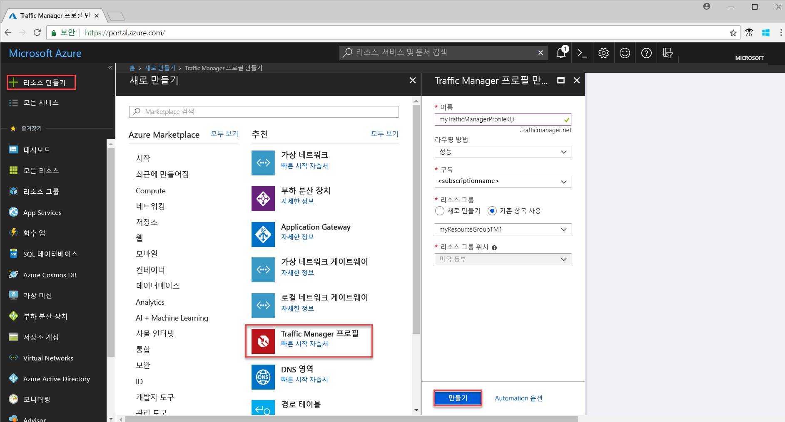
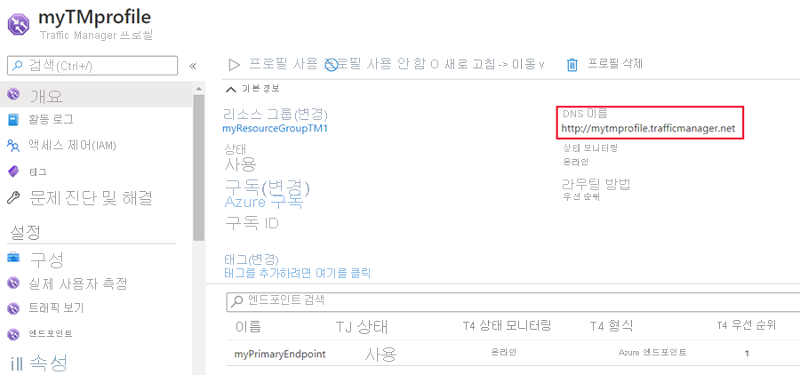
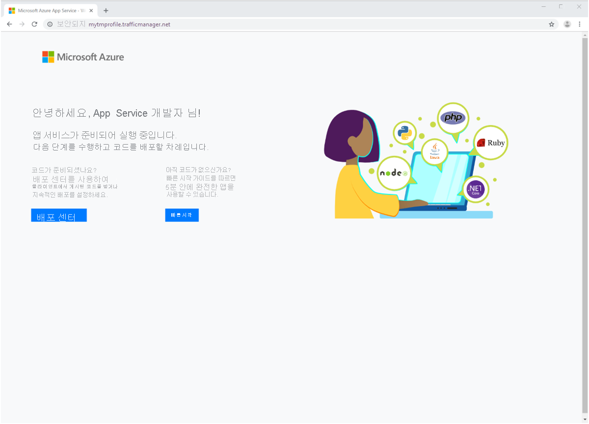

# 빠른 시작: 고가용성 웹 응용 프로그램을 위한 Traffic Manager 프로필 만들기

이 빠른 시작에서는 고가용성 웹 응용 프로그램을 제공하는 Traffic Manager 프로필을 만드는 방법을 설명합니다. 

이 빠른 시작에 설명된 시나리오에는 서로 다른 Azure 지역에서 실행되는 두 개의 웹 응용 프로그램 인스턴스가 포함되어 있습니다. 사용자 응용 프로그램을 실행하는 기본 사이트로 사용자 트래픽을 보내는 [엔드포인트 우선 순위](traffic-manager-routing-methods.md#priority) 기반의 Traffic Manager 프로필을 만듭니다. Traffic Manager는 지속적으로 웹 응용 프로그램을 모니터링하다가 기본 사이트를 사용할 수 없게 되면 백업 사이트로 자동 장애 조치(failover)합니다.

Azure 구독이 아직 없는 경우 시작하기 전에 [체험 계정](https://azure.microsoft.com/free/?WT.mc_id=A261C142F)을 만듭니다.

## Azure에 로그인 
https://portal.azure.com에서 Azure Portal에 로그인합니다.

## 필수 조건
이 빠른 시작을 진행하려면 서로 다른 Azure 지역(*미국 동부* 및 *유럽 서부*)에서 실행되는 두 개의 웹 응용 프로그램 인스턴스를 배포해야 합니다. 두 개의 웹 응용 프로그램 인스턴스는 Traffic Manager의 기본 및 백업 엔드포인트 역할을 합니다.

1. 화면 왼쪽 상단에서 **리소스 만들기** > **웹** > **웹앱** > **만들기**를 선택합니다.
2. **웹앱**에서, 다음 정보를 입력 또는 선택하고, 지정된 설정이 없으면 기본 설정을 입력합니다.

     | 설정         | 값     |
     | ---              | ---  |
     | Name           | 웹앱의 고유한 이름을 입력합니다.  |
     | 리소스 그룹          | **새로 만들기**를 선택하고 *myResourceGroupTM1*을 입력합니다. |
     | App Service 계획/위치         | **새로 만들기**를 선택합니다.  App Service 계획에서 *myAppServicePlanEastUS*를 입력하고 **확인**을 선택합니다. 
     |      위치  |   미국 동부        |
    |||

3. **만들기**를 선택합니다.
4. 웹앱이 배포되면 기본 웹 사이트가 생성됩니다.
5. 1-3 단계를 반복하여 다른 Azure 지역에 다음 설정으로 두 번째 웹 사이트를 만듭니다.

     | 설정         | 값     |
     | ---              | ---  |
     | Name           | 웹앱의 고유한 이름을 입력합니다.  |
     | 리소스 그룹          | **새로 만들기**를 선택하고 *myResourceGroupTM2*를 입력합니다. |
     | App Service 계획/위치         | **새로 만들기**를 선택합니다.  App Service 계획에서 *myAppServicePlanWestEurope*을 입력하고 **확인**을 선택합니다. 
     |      위치  |   서유럽      |
    |||

## Traffic Manager 프로필 만들기
엔드포인트 우선 순위에 따라 사용자 트래픽을 전달하는 Traffic manager 프로필을 만듭니다.

1. 화면 왼쪽 상단에서 **리소스 만들기** > **네트워킹** > **Traffic Manager 프로필** > **만들기**를 선택합니다.
2. **Traffic Manager 프로필 만들기**에서 다음 정보를 입력하거나 선택하고, 나머지 설정은 기본값을 그대로 적용한 다음, **만들기**를 선택합니다.
    
    | 설정                 | 값                                              |
    | ---                     | ---                                                |
    | Name                   | 이 이름은 trafficmanager.net 영역 내에서 고유해야 하며, Traffic Manager 프로필에 액세스하는 데 사용되는 DNS 이름 **trafficmanager.net**이 됩니다.|
    | 라우팅 방법          | **우선 순위** 라우팅 방법을 선택합니다.|
    | 구독            | 구독을 선택합니다.|
    | 리소스 그룹          | **기존 항목 사용**을 선택한 다음, *myResourceGroupTM1*을 선택합니다.|
    |위치 |이 설정은 리소스 그룹의 위치를 나타내며 전역적으로 배포되는 Traffic Manager 프로필에는 영향을 미치지 않습니다.|
    |||
    
    
   

## Traffic Manager 끝점 추가

*미국 동부*에서 모든 사용자 트래픽을 라우팅할 기본 엔드포인트로 웹 사이트를 추가합니다. *유럽 서부*에서 백업 엔드포인트로 웹 사이트를 추가합니다. 기본 엔드포인트를 사용할 수 없게 되면 트래픽이 자동으로 보조 엔드포인트로 라우팅됩니다.

1. 포털의 검색 창에서 이전 섹션에서 만든 Traffic Manager 프로필 이름을 검색하고, 표시되는 결과에서 해당 프로필을 선택합니다.
2. **Traffic Manager 프로필**의 **설정** 섹션에서 **엔드포인트**를 클릭한 다음, **추가**를 클릭합니다.
3. 다음 정보를 입력하거나 선택하고, 나머지 설정에 대한 기본값을 그대로 적용한 다음, **확인**을 선택합니다.

    | 설정                 | 값                                              |
    | ---                     | ---                                                |
    | type                    | Azure 엔드포인트                                   |
    | Name           | myPrimaryEndpoint                                        |
    | 대상 리소스 종류           | App Service                          |
    | 대상 리소스          | **앱 서비스 선택**을 클릭하여 동일한 구독에서 Web Apps의 목록을 표시합니다. **리소스**에서 첫 번째 엔드포인트로 추가할 앱 서비스를 선택합니다. |
    | 우선 순위               | **1**을 선택합니다. 이제 모든 트래픽이 정상일 경우 이 끝점으로 전송됩니다.    |
    
4. 다음 Azure Web Apps 엔드포인트에 대해 2, 3단계를 반복합니다. **우선 순위** 값을 **2**로 설정한 상태에서 추가해야 합니다.
5.  두 엔드포인트 추가가 완료되면 **온라인**인 모니터링 상태와 함께 **Traffic Manager 프로필**에 표시됩니다.

    

## Traffic Manager 프로필 테스트
이 섹션에서는 Traffic Manager 프로필의 도메인 이름을 확인한 다음, 기본 엔드포인트를 사용할 수 없게 되면 Traffic Manager가 어떻게 보조 엔드포인트로 장애 조치(failover)되는지 살펴봅니다.
### DNS 이름 확인
1.  포털의 검색 창에서 이전 섹션에서 만든 **Traffic Manager 프로필** 이름을 검색합니다. 표시되는 결과에서 Traffic Manager 프로필을 클릭합니다.
2. **개요**를 클릭합니다.
3. **Traffic Manager 프로필**에 새로 만든 Traffic Manager 프로필의 DNS 이름이 표시됩니다.
  
   

### 실행 중인 Traffic Manager 보기

1. 웹 브라우저에서 Traffic Manager 프로필의 DNS 이름을 입력하여 웹앱의 기본 웹 사이트를 봅니다. 이 빠른 시작 시나리오에서는 모든 요청이 **우선 순위 1**로 설정된 기본 엔드포인트로 라우팅됩니다.

2. Traffic Manager가 실제로 장애 조치(failover)되는 모습을 보려면 다음과 같이 기본 사이트를 중지합니다.
    1. Traffic Manager 프로필 페이지에서 **설정**>**엔드포인트**>*MyPrimaryEndpoint*를 선택합니다.
    2. *MyPrimaryEndpoint*에서 **사용 안 함**을 선택합니다. 
    3. 이제 기본 엔드포인트 *MyPrimaryEndpoint* 상태가 **사용 안 함**으로 표시됩니다.
3. 웹 브라우저에서 웹 사이트를 보려면 이전 단계에서 Traffic Manager 프로필의 DNS 이름을 복사합니다. 기본 엔드포인트가 중지되면 사용자 트래픽이 보조 엔드포인트로 라우팅됩니다.

## 리소스 정리
더 이상 필요하지 않은 리소스 그룹, 웹 응용 프로그램 및 모든 관련 리소스를 삭제합니다. 이렇게 하려면 리소스 그룹(*myResourceGroupTM1* 및 *myResourceGroupTM2*)을 선택하고 **삭제**를 클릭합니다.

## 다음 단계
이 빠른 시작에서는 고가용성 웹 응용 프로그램을 만들기 위해 사용자 트래픽을 전달하는 Traffic Manager 프로필을 만들었습니다. 트래픽 라우팅에 대해 자세히 알아보려면 Traffic Manager에 대한 자습서를 계속 진행하세요.

> [!div class="nextstepaction"]
> [Traffic Manager 자습서](traffic-manager-configure-performance-routing-method.md)

