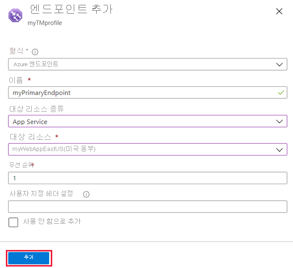

# 빠른 시작: Azure Portal을 사용하여 Traffic Manager 프로필 만들기

이 빠른 시작에서는 웹 애플리케이션에 고가용성을 제공하는 Traffic Manager 프로필을 만드는 방법에 대해 설명합니다.

여기서는 웹 애플리케이션의 두 가지 인스턴스를 읽습니다. 각각 다른 Azure 지역에서 실행됩니다. [엔드포인트 우선 순위](traffic-manager-routing-methods.md#priority)에 따라 Traffic Manager 프로필을 만듭니다. 프로필은 웹 애플리케이션을 실행하는 주 사이트로 사용자 트래픽을 보냅니다. Traffic Manager는 웹 애플리케이션을 지속적으로 모니터링합니다. 주 사이트를 사용할 수 없는 경우 백업 사이트에 자동 장애 조치를 제공합니다.

Azure 구독이 없는 경우 [무료 계정](https://azure.microsoft.com/free/?WT.mc_id=A261C142F)을 지금 만드세요.

## Azure에 로그인

[Azure Portal](https://portal.azure.com)에 로그인합니다.

## 필수 조건

이 빠른 시작에는 두 개의 서로 다른 Azure 지역(*미국 동부* 및 *유럽 서부*)에 배포된 두 개의 웹 애플리케이션 인스턴스가 필요합니다. 각각은 Traffic Manager에 대한 기본 및 장애 조치 엔드포인트의 역할을 합니다.

1. 화면의 왼쪽 위에서 **리소스 만들기** > **웹** > **웹앱**을 차례로 선택합니다.
2. **웹앱**에서 다음 설정을 입력하거나 선택합니다.

    | 설정 | 값 |
    | ------- | ----- |
    | 앱 이름 | 웹앱에 대한 고유한 이름을 입력합니다.  |
    | 구독 | 웹앱에 적용하려는 구독을 선택합니다. |
    | 리소스 그룹 | **새로 만들기**를 선택하고, *myResourceGroupTM1*을 입력합니다. |
    | OS | 운영 체제로 **Windows**를 선택합니다. |
    | 게시 | 게시하려는 형식으로 **코드**를 선택합니다. |

3. **App Service 계획/위치**를 선택합니다.
4. **App Service 계획**에서 **새로 만들기**를 선택합니다.
5. **새 App Service 계획**에서 다음 설정을 입력하거나 선택합니다.

    | 설정 | 값 |
    | ------- | ----- |
    | App Service 계획 | *myAppServicePlanEastUS*를 입력합니다. |
    | 위치 | 미국 동부 |
    | 가격 책정 계층  | S1 표준 |

6. **확인**을 선택합니다.

7. **웹앱**에서 **만들기**를 선택합니다. 웹앱이 성공적으로 배포되면, 그것은 기본 웹 사이트를 만듭니다.

8. 다른 Azure 지역에 두 번째 웹 사이트를 만들려면 다음 설정을 사용하여 1-7단계를 반복합니다.

    | 설정 | 값 |
    | --------| ----- |
    | 이름 | 웹앱에 대한 고유한 이름을 입력합니다. |
    | 구독 | 웹앱에 적용하려는 구독을 선택합니다. |
    | 리소스 그룹 | **새로 만들기**를 선택한 다음, *myResourceGroupTM2*를 입력합니다. |
    | OS | 운영 체제로 **Windows**를 선택합니다. |
    | 게시 | 게시하려는 형식으로 **코드**를 선택합니다. |
    | App Service 계획/위치 | *myAppServicePlanWestEurope*을 입력합니다. |
    | 위치 | 서유럽 |
    | 가격 책정 계층  | S1 표준 |

## Traffic Manager 프로필 만들기

엔드포인트 우선 순위에 따라 사용자 트래픽을 보내는 Traffic Manager 프로필을 만듭니다.

1. 화면의 왼쪽 위에서 **리소스 만들기** > **네트워킹** > **Traffic Manager 프로필**을 차례로 선택합니다.
2. **Traffic Manager 프로필 만들기**에서 다음 설정을 입력하거나 선택합니다.

    | 설정 | 값 |
    | --------| ----- |
    | 이름 | Traffic Manager 프로필에 대한 고유한 이름을 입력합니다.|
    | 라우팅 방법 | **우선 순위**를 선택합니다.|
    | 구독 | Traffic Manager 프로필에 적용하려는 구독을 선택합니다. |
    | 리소스 그룹 | *myResourceGroupTM1*을 선택합니다.|
    | 위치 |이 설정은 리소스 그룹의 위치를 가리킵니다. 글로벌로 배포될 Traffic Manager 프로필에는 영향을 주지 않습니다.|

3. **만들기**를 선택합니다.

## Traffic Manager 엔드포인트 추가

*미국 동부*에서 모든 사용자 트래픽을 라우팅할 기본 엔드포인트로 웹 사이트를 추가합니다. *유럽 서부*에 웹 사이트를 장애 조치 엔드포인트로 추가합니다. 기본 엔드포인트를 사용할 수 없으면 트래픽이 자동으로 장애 조치 엔드포인트로 라우팅됩니다.

1. 포털의 검색 창에 이전 섹션에서 만든 Traffic Manager 프로필 이름을 입력합니다.
2. 검색 결과에서 프로필을 선택합니다.
3. **Traffic Manager 프로필**의 **설정** 섹션에서 **엔드포인트**를 선택한 다음, **추가**를 클릭합니다.
4. 다음 설정을 입력하거나 선택합니다.

    | 설정 | 값 |
    | ------- | ------|
    | type | **Azure 엔드포인트**를 선택합니다. |
    | 이름 | *myPrimaryEndpoint*를 선택합니다. |
    | 대상 리소스 종류 | **App Service**를 선택합니다. |
    | 대상 리소스 | **앱 서비스 선택** > **미국 동부**를 차례로 선택합니다. |
    | 우선 순위 | **1**을 선택합니다. 모든 트래픽이 정상 상태이면 엔드포인트로 이동합니다. |

    

5. **확인**을 선택합니다.
6. 두 번째 Azure 지역에 대한 장애 조치 엔드포인트를 만들려면 다음 설정을 사용하여 3-4단계를 반복합니다.

    | 설정 | 값 |
    | ------- | ------|
    | type | **Azure 엔드포인트**를 선택합니다. |
    | 이름 | *myFailoverEndpoint*를 입력합니다. |
    | 대상 리소스 종류 | **App Service**를 선택합니다. |
    | 대상 리소스 | **앱 서비스 선택** > **유럽 서부**를 차례로 선택합니다. |
    | 우선 순위 | **2**를 선택합니다. 기본 엔드포인트가 비정상 상태이면 모든 트래픽이 이 장애 조치 엔드포인트로 이동합니다. |

7. **확인**을 선택합니다.

두 개의 엔드포인트가 추가되면 **Traffic Manager 프로필**에 표시됩니다. 이제 모니터링 상태는 **온라인**입니다.

## Traffic Manager 프로필 테스트

이 섹션에서는 Traffic Manager 프로필의 도메인 이름을 확인합니다. 또한 기본 엔드포인트를 사용할 수 없도록 구성합니다. 마지막으로 웹앱을 계속 사용할 수 있는지 확인합니다. 이는 Traffic Manager에서 트래픽을 장애 조치 엔드포인트로 보내기 때문입니다.

### DNS 이름 확인

1. 포털의 검색 창에서 이전 섹션에서 만든 **Traffic Manager 프로필** 이름을 검색합니다.
2. Traffic Manager 프로필을 선택합니다. **개요**가 표시됩니다.
3. **Traffic Manager 프로필**에 새로 만든 Traffic Manager 프로필의 DNS 이름이 표시됩니다.
  
   

### 실행 중인 Traffic Manager 보기

1. 웹 브라우저에서 Traffic Manager 프로필의 DNS 이름을 입력하여 웹앱의 기본 웹 사이트를 봅니다.

    > [!NOTE]
    > 이 빠른 시작 시나리오에서는 모든 요청이 기본 엔드포인트로 라우팅됩니다. **우선 순위 1**로 설정됩니다.

    

2. 실행 중인 Traffic Manager 장애 조치를 보려면 기본 사이트를 사용하지 않도록 설정합니다.
    1. Traffic Manager 프로필 페이지의 **개요** 섹션에서 **myPrimaryEndpoint**를 선택합니다.
    2. *myPrimaryEndpoint*에서 **사용 안 함** > **저장**을 차례로 선택합니다.
    3. **myPrimaryEndpoint**를 닫습니다. 이제 상태는 **사용 안 함**입니다.
3. 이전 단계에서 Traffic Manager 프로필의 DNS 이름을 복사하여 새 웹 브라우저 세션에서 웹 사이트를 봅니다.
4. 웹앱을 계속 사용할 수 있는지 확인합니다.

기본 엔드포인트는 사용할 수 없으므로 장애 조치 엔드포인트로 라우팅됩니다.

## 리소스 정리

완료되면 리소스 그룹, 웹 애플리케이션 및 모든 관련 리소스를 삭제합니다. 이렇게 하려면 대시보드에서 개별 항목을 각각 선택하고, 각 페이지의 위쪽에 있는 **삭제**를 선택합니다.

## 다음 단계

이 빠른 시작에서는 Traffic Manager 프로필을 만들었습니다. 고가용성 웹 애플리케이션에 대한 사용자 트래픽을 보낼 수 있게 해줍니다. 트래픽 라우팅에 대해 자세히 알아보려면 Traffic Manager 자습서로 계속 진행하세요.

> [!div class="nextstepaction"]
> [Traffic Manager 자습서](tutorial-traffic-manager-improve-website-response.md)
