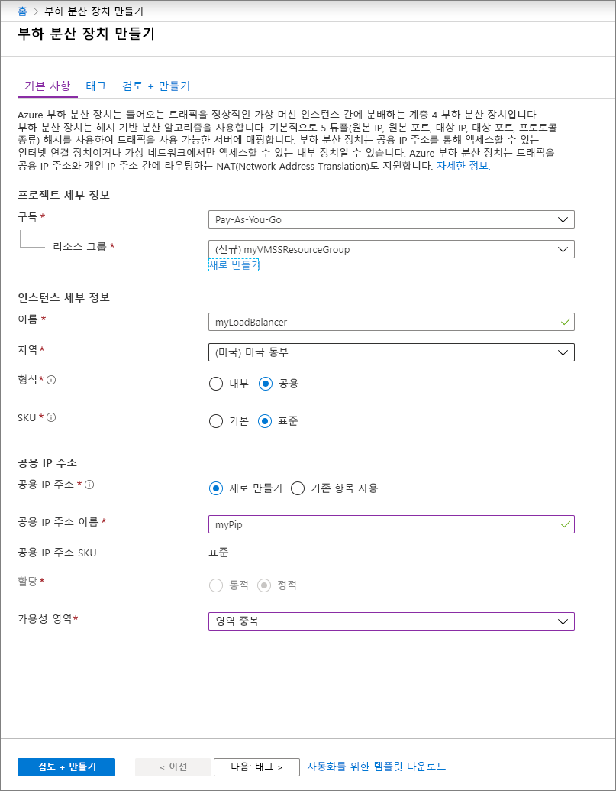
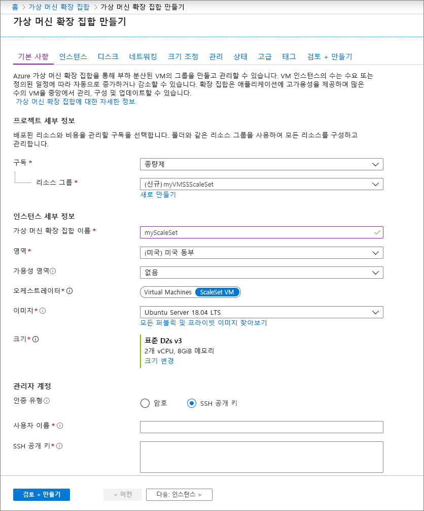

# 빠른 시작: Azure Portal에서 가상 머신 확장 집합 만들기

가상 머신 확장 집합을 사용하면 자동 크기 조정 가상 머신 세트를 배포하고 관리할 수 있습니다. 확장 집합의 VM 수를 수동으로 조정하거나 리소스 사용량(예: CPU, 메모리 요구량 또는 네트워크 트래픽)에 따라 자동으로 크기를 조정하는 규칙을 정의할 수 있습니다. 그러면 Azure 부하 분산 장치에서 확장 집합의 VM 인스턴스에 트래픽을 분산합니다. 이 빠른 시작에서는 Azure Portal에서 가상 머신 확장 집합을 만듭니다.

Azure 구독이 아직 없는 경우 시작하기 전에 [체험 계정](https://azure.microsoft.com/free/?WT.mc_id=A261C142F)을 만듭니다.

## Azure에 로그인
Azure Portal ( https://portal.azure.com ) 에 로그인합니다.

## 부하 분산 장치 만들기

Azure [Load Balancer](../load-balancer/load-balancer-overview.md)는 들어오는 트래픽을 정상 상태의 가상 머신 인스턴스 간에 분산합니다. 

먼저 포털을 사용하여 공용 표준 Load Balancer를 만듭니다. 만드는 이름과 공용 IP 주소는 자동으로 부하 분산 장치의 프런트 엔드로 구성됩니다.

1. 검색 상자에 **부하 분산 장치**를 입력합니다. 검색 결과의 **Marketplace**에서 **부하 분산 장치**를 선택합니다.
1. **부하 분산 장치 만들기** 페이지의 **기본 사항** 탭에서 다음 정보를 입력하거나 선택합니다.

    | 설정                 | 값   |
    | ---| ---|
    | Subscription  | 구독을 선택합니다.    |    
    | Resource group | **새로 만들기**를 선택하고 텍스트 상자에 *myVMSSResourceGroup*을 입력합니다.|
    | Name           | *myLoadBalancer*         |
    | 지역         | **미국 동부**를 선택합니다.       |
    | Type          | **공용**을 선택합니다.       |
    | SKU           | **표준**을 선택합니다.       |
    | 공용 IP 주소 | **새로 만들기**를 선택합니다. |
    | 공용 IP 주소 이름  | *myPip*   |
    | 할당| 정적 |
    | 가용성 영역 | **영역 중복**을 선택합니다. |

1. 완료되면 **검토 + 만들기**를 선택합니다. 
1. 유효성 검사를 통과하면 **만들기**를 선택합니다. 

## 가상 머신 확장 집합 만들기
RHEL, CentOS, Ubuntu 또는 SLES와 같은 Windows Server 이미지 또는 Linux 이미지를 사용하여 확장 집합을 배포할 수 있습니다.

1. 검색 상자에 **확장 집합**을 입력합니다. 결과의 **Marketplace** 아래에서 **가상 머신 확장 집합**을 선택합니다. **가상 머신 크기 집합** 페이지에서 **만들기**를 선택하면 **가상 머신 확장 집합 만들기** 페이지가 열립니다. 
1. **기본** 탭의 **프로젝트 세부 정보** 아래에서 올바른 구독이 선택되어 있는지 확인한 다음, 리소스 그룹 **새로 만들기**를 선택합니다. 이름에 *myVMSSResourceGroup*을 입력하고 **확인**을 선택합니다. 
1. 확장 집합의 이름으로 *myScaleSet*을 입력합니다.
1. **지역**에서 사용자 영역과 가까운 지역을 선택합니다.
1. **오케스트레이션 모드**의 기본값 **ScaleSet VM**을 그대로 둡니다.
1. **이미지**에 대해 Marketplace 이미지를 선택합니다. 이 예제에서는 *Ubuntu Server 18.04 LTS*를 선택했습니다.
1. 원하는 사용자 이름을 입력한 후 원하는 인증 유형을 선택합니다.
   - **암호**는 12자 이상 길이여야 하며 1개의 소문자, 1개의 대문자, 1개의 숫자 및 1개의 특수 문자 등 네 가지 복잡성 요구 사항 중 적어도 세 가지를 충족해야 합니다. 자세한 내용은 [사용자 이름 및 암호 요구 사항](../virtual-machines/windows/faq.md#what-are-the-username-requirements-when-creating-a-vm)을 참조하세요.
   - Linux OS 디스크 이미지를 선택하는 경우 **SSH 공개 키**를 대신 선택할 수 있습니다. 공개 키만을 제공합니다(예: *~/.ssh/id_rsa.pub*). 포털에서 Azure Cloud Shell을 사용하여 [SSH 키를 만들고 사용](../virtual-machines/linux/mac-create-ssh-keys.md)할 수 있습니다.
   
    

1. **다음**을 선택 여 다른 페이지로 이동합니다. 
1. **인스턴스** 및 **디스크** 페이지의 기본값을 그대로 둡니다.
1. **네트워킹** 페이지의 **부하 분산**에서 **예**를 선택하여 확장 집합 인스턴스를 부하 분산 장치 뒤에 배치합니다. 
1. **부하 분산 옵션**에서 **Azure Load Balancer**를 선택합니다.
1. **부하 분산 장치 선택**에서 이전에 만든 *myLoadBalancer*를 선택합니다.
1. **백 엔드 풀 선택**에서 **새로 만들기**를 선택하고 *myBackendPool*을 입력한 다음, **만들기**를 선택합니다.
1. 완료되면 **검토 + 만들기**를 선택합니다. 
1. 유효성 검사를 통과하면 **만들기**를 선택하여 확장 집합을 배포합니다.

## 리소스 정리
더 이상 필요하지 않을 때 리소스 그룹, 확장 집합 및 모든 관련 리소스를 삭제합니다. 이렇게 하려면 확장 집합의 리소스 그룹을 선택하고 **삭제**를 선택합니다.

## 다음 단계
이 빠른 시작에서는 Azure Portal에서 기본 확장 집합을 만들었습니다. 더 자세히 알아보려면 Azure 가상 머신 확장 집합을 만들고 관리하는 방법에 대한 자습서로 계속 진행하세요.

> [!div class="nextstepaction"]
> [Azure 가상 머신 확장 집합 만들기 및 관리](tutorial-create-and-manage-powershell.md)
