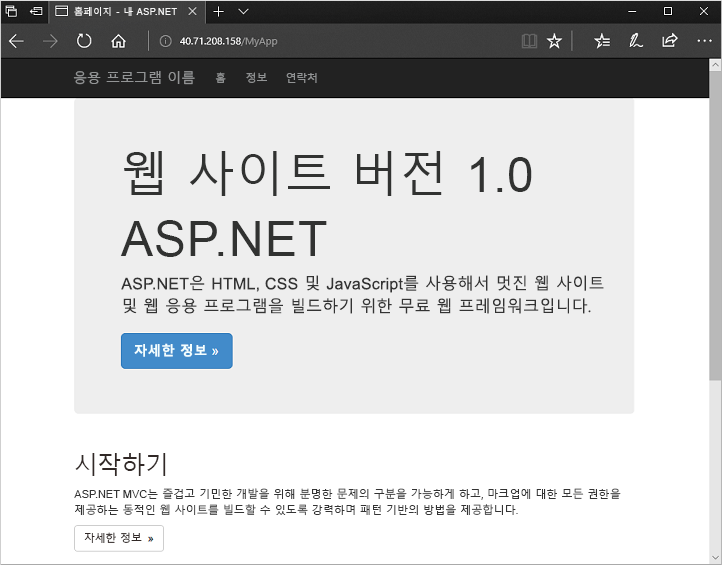

# <a name="quickstart-create-a-virtual-machine-scale-set-with-azure-powershell"></a>빠른 시작: Azure PowerShell을 사용하여 가상 머신 확장 집합 만들기


가상 머신 확장 집합을 사용하면 동일한 자동 크기 조정 가상 머신 집합을 배포하고 관리할 수 있습니다. 확장 집합의 VM 수를 수동으로 조정하거나 리소스 사용량(예: CPU, 메모리 요구량 또는 네트워크 트래픽)에 따라 자동으로 크기를 조정하는 규칙을 정의할 수 있습니다. 그러면 Azure 부하 분산 장치에서 확장 집합의 VM 인스턴스에 트래픽을 분산합니다. 이 빠른 시작에서는 Azure PowerShell을 사용하여 가상 머신 확장 집합을 만들고, 샘플 애플리케이션을 배포합니다.

Azure 구독이 아직 없는 경우 시작하기 전에 [체험 계정](https://azure.microsoft.com/free/?WT.mc_id=A261C142F)을 만듭니다.

[!INCLUDE [cloud-shell-try-it.md](../../includes/cloud-shell-try-it.md)]


## <a name="create-a-scale-set"></a>확장 집합 만들기
[New-AzVmss](/powershell/module/az.compute/new-azvmss)를 사용하여 가상 머신 확장 집합을 만듭니다. 다음 예제에서는 *Windows Server 2016 Datacenter* 플랫폼 이미지를 사용하는 *myScaleSet*이라는 확장 집합을 만듭니다. 가상 네트워크, 공용 IP 주소 및 부하 분산 장치에 대한 Azure 네트워크 리소스가 자동으로 만들어집니다. 메시지가 표시되면 확장 집합에서 VM 인스턴스에 대해 사용자 고유의 관리 자격 증명을 설정할 수 있습니다.

```azurepowershell-interactive
New-AzVmss `
  -ResourceGroupName "myResourceGroup" `
  -Location "EastUS" `
  -VMScaleSetName "myScaleSet" `
  -VirtualNetworkName "myVnet" `
  -SubnetName "mySubnet" `
  -PublicIpAddressName "myPublicIPAddress" `
  -LoadBalancerName "myLoadBalancer" `
  -UpgradePolicyMode "Automatic"
```

확장 집합 리소스와 VM을 모두 만들고 구성하는 데 몇 분 정도 걸립니다.


## <a name="deploy-sample-application"></a>샘플 애플리케이션 배포
확장 집합을 테스트하려면 기본 웹 애플리케이션을 설치합니다. Azure 사용자 지정 스크립트 확장을 사용하여 VM 인스턴스에 IIS를 설치하는 스크립트를 다운로드하고 실행합니다. 이 확장은 배포 후 구성, 소프트웨어 설치 또는 기타 구성/관리 작업에 유용합니다. 자세한 내용은 [사용자 지정 스크립트 확장 개요](../virtual-machines/windows/extensions-customscript.md)를 참조하세요.

사용자 지정 스크립트 확장을 사용하여 기본 IIS 웹 서버 설치 다음과 같이 IIS를 설치하는 사용자 지정 스크립트 확장을 적용합니다.

```azurepowershell-interactive
# Define the script for your Custom Script Extension to run
$publicSettings = @{
    "fileUris" = (,"https://raw.githubusercontent.com/Azure-Samples/compute-automation-configurations/master/automate-iis.ps1");
    "commandToExecute" = "powershell -ExecutionPolicy Unrestricted -File automate-iis.ps1"
}

# Get information about the scale set
$vmss = Get-AzVmss `
            -ResourceGroupName "myResourceGroup" `
            -VMScaleSetName "myScaleSet"

# Use Custom Script Extension to install IIS and configure basic website
Add-AzVmssExtension -VirtualMachineScaleSet $vmss `
    -Name "customScript" `
    -Publisher "Microsoft.Compute" `
    -Type "CustomScriptExtension" `
    -TypeHandlerVersion 1.8 `
    -Setting $publicSettings

# Update the scale set and apply the Custom Script Extension to the VM instances
Update-AzVmss `
    -ResourceGroupName "myResourceGroup" `
    -Name "myScaleSet" `
    -VirtualMachineScaleSet $vmss
```

## <a name="allow-traffic-to-application"></a>애플리케이션에 트래픽 허용

 기본 웹 애플리케이션에 대한 액세스를 허용하려면 [New-AzNetworkSecurityRuleConfig](/powershell/module/az.network/new-aznetworksecurityruleconfig) 및 [New-AzNetworkSecurityGroup](/powershell/module/az.network/new-aznetworksecuritygroup)을 사용하여 네트워크 보안 그룹을 만듭니다. 자세한 내용은 [Azure 가상 머신 확장 집합에 대한 네트워킹](virtual-machine-scale-sets-networking.md)을 참조하세요.

 ```azurepowershell-interactive
 # Get information about the scale set
 $vmss = Get-AzVmss `
             -ResourceGroupName "myResourceGroup" `
             -VMScaleSetName "myScaleSet"

 #Create a rule to allow traffic over port 80
 $nsgFrontendRule = New-AzNetworkSecurityRuleConfig `
   -Name myFrontendNSGRule `
   -Protocol Tcp `
   -Direction Inbound `
   -Priority 200 `
   -SourceAddressPrefix * `
   -SourcePortRange * `
   -DestinationAddressPrefix * `
   -DestinationPortRange 80 `
   -Access Allow

 #Create a network security group and associate it with the rule
 $nsgFrontend = New-AzNetworkSecurityGroup `
   -ResourceGroupName  "myResourceGroup" `
   -Location EastUS `
   -Name myFrontendNSG `
   -SecurityRules $nsgFrontendRule

 $vnet = Get-AzVirtualNetwork `
   -ResourceGroupName  "myResourceGroup" `
   -Name myVnet

 $frontendSubnet = $vnet.Subnets[0]

 $frontendSubnetConfig = Set-AzVirtualNetworkSubnetConfig `
   -VirtualNetwork $vnet `
   -Name mySubnet `
   -AddressPrefix $frontendSubnet.AddressPrefix `
   -NetworkSecurityGroup $nsgFrontend

 Set-AzVirtualNetwork -VirtualNetwork $vnet

 # Update the scale set and apply the Custom Script Extension to the VM instances
 Update-AzVmss `
     -ResourceGroupName "myResourceGroup" `
     -Name "myScaleSet" `
     -VirtualMachineScaleSet $vmss
 ```

## <a name="test-your-scale-set"></a>확장 집합 테스트
작동 중인 확장 집합을 확인하려면 웹 브라우저에서 샘플 웹 애플리케이션에 액세스합니다. [Get-AzPublicIpAddress](/powershell/module/az.network/get-azpublicipaddress)를 사용하여 부하 분산 장치의 공용 IP 주소를 가져옵니다. 다음 예제에서는 *myResourceGroup* 리소스 그룹에서 만든 IP 주소를 표시합니다.

```azurepowershell-interactive
Get-AzPublicIpAddress -ResourceGroupName "myResourceGroup" | Select IpAddress
```

웹 브라우저에 부하 분산 장치의 공용 IP 주소를 입력합니다. 부하 분산 장치는 다음 예제와 같이 VM 인스턴스 중 하나에 트래픽을 분산합니다.




## <a name="clean-up-resources"></a>리소스 정리
더 이상 필요하지 않은 경우 다음과 같이 [Remove-AzResourceGroup](/powershell/module/az.resources/remove-azresourcegroup)을 사용하여 리소스 그룹, 확장 집합 및 모든 관련 리소스를 제거할 수 있습니다. `-Force` 매개 변수는 작업을 수행하는 추가 프롬프트 없이 리소스를 삭제할 것인지 확인합니다. `-AsJob` 매개 변수는 작업이 완료될 때까지 대기하지 않고 프롬프트로 제어를 반환합니다.

```azurepowershell-interactive
Remove-AzResourceGroup -Name "myResourceGroup" -Force -AsJob
```


## <a name="next-steps"></a>다음 단계
이 빠른 시작에서는 기본 확장 집합을 만들고, 사용자 지정 스크립트 확장을 사용하여 VM 인스턴스에 기본 IIS 웹 서버를 설치했습니다. 더 자세히 알아보려면 Azure 가상 머신 확장 집합을 만들고 관리하는 방법에 대한 자습서로 계속 진행하세요.

> [!div class="nextstepaction"]
> [Azure 가상 머신 확장 집합 만들기 및 관리](tutorial-create-and-manage-powershell.md)
