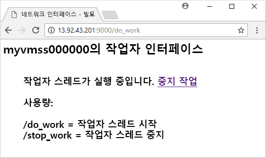

# <a name="quickstart-create-a-linux-virtual-machine-scale-set-with-an-azure-template"></a>빠른 시작: Azure 템플릿을 사용하여 Linux 가상 머신 확장 집합 만들기
가상 머신 확장 집합을 사용하면 동일한 자동 크기 조정 가상 머신 집합을 배포하고 관리할 수 있습니다. 확장 집합의 VM 수를 수동으로 조정하거나 리소스 사용량(예: CPU, 메모리 요구량 또는 네트워크 트래픽)에 따라 자동으로 크기를 조정하는 규칙을 정의할 수 있습니다. 그러면 Azure 부하 분산 장치에서 확장 집합의 VM 인스턴스에 트래픽을 분산합니다. 이 빠른 시작에서는 Azure Resource Manager 템플릿을 사용하여 가상 머신 확장 집합을 만들고, 샘플 응용 프로그램을 배포합니다.

Azure 구독이 아직 없는 경우 시작하기 전에 [체험 계정](https://azure.microsoft.com/free/?WT.mc_id=A261C142F)을 만듭니다.

[!INCLUDE [cloud-shell-try-it.md](../../includes/cloud-shell-try-it.md)]

CLI를 로컬로 설치하고 사용하도록 선택하는 경우 이 자습서에서는 Azure CLI 버전 2.0.29 이상을 실행해야 합니다. `az --version`을 실행하여 버전을 찾습니다. 설치 또는 업그레이드해야 하는 경우 [Azure CLI 설치]( /cli/azure/install-azure-cli)를 참조하세요.


## <a name="define-a-scale-set-in-a-template"></a>템플릿에서 확장 집합 정의
Azure Resource Manager 템플릿을 사용하면 관련 리소스 그룹을 배포할 수 있습니다. 템플릿은 JSON(JavaScript Object Notation)으로 작성되며, 응용 프로그램에 대한 전체 Azure 인프라 환경을 정의합니다. 단일 템플릿에서 가상 머신 확장 집합을 만들고, 응용 프로그램을 설치하고, 자동 크기 조정 규칙을 구성할 수 있습니다. 변수와 매개 변수를 사용하면 이 템플릿을 다시 사용하여 기존의 확장 집합을 업데이트하거나 추가 확장 집합을 만들 수 있습니다. Azure Portal, Azure CLI 또는 Azure PowerShell을 통하거나 CI/CD(지속적인 통합/지속적인 업데이트) 파이프라인에서 템플릿을 배포할 수 있습니다.

템플릿에 대한 자세한 내용은 [Azure Resource Manager 개요](https://docs.microsoft.com/azure/azure-resource-manager/resource-group-overview#template-deployment)를 참조하세요.

템플릿을 사용하여 확장 집합을 만들려면 적절한 리소스를 정의합니다. 가상 머신 확장 집합 리소스 종류의 주요 부분은 다음과 같습니다.

| 자산                     | 속성 설명                                  | 예제 템플릿 값                    |
|------------------------------|----------------------------------------------------------|-------------------------------------------|
| 형식                         | 만들 Azure 리소스 종류                            | Microsoft.Compute/virtualMachineScaleSets |
| 이름                         | 확장 집합 이름                                       | myScaleSet                                |
| location                     | 확장 집합을 만들 위치                     | 미국 동부                                   |
| sku.name                     | 각 확장 집합 인스턴스에 대한 VM 크기                  | Standard_A1                               |
| sku.capacity                 | 처음에 만들 VM 인스턴스의 수           | 2                                         |
| upgradePolicy.mode           | 변경 발생 시의 VM 인스턴스 업그레이드 모드              | 자동                                 |
| imageReference               | VM 인스턴스에 사용할 플랫폼 또는 사용자 지정 이미지 | Canonical Ubuntu Server 16.04-LTS         |
| osProfile.computerNamePrefix | 각 VM 인스턴스에 대한 이름 접두사                     | myvmss                                    |
| osProfile.adminUsername      | 각 VM 인스턴스에 대한 사용자 이름                        | azureuser                                 |
| osProfile.adminPassword      | 각 VM 인스턴스에 대한 암호                        | P@ssw0rd!                                 |

 다음 예제에서는 코어 확장 집합이 리소스 정의를 설정하는 것을 보여 줍니다. 확장 집합 템플릿을 사용자 지정하려면 VM 크기 또는 초기 용량을 변경하거나 다른 플랫폼 또는 사용자 지정 이미지를 사용할 수 있습니다.

```json
{
  "type": "Microsoft.Compute/virtualMachineScaleSets",
  "name": "myScaleSet",
  "location": "East US",
  "apiVersion": "2017-12-01",
  "sku": {
    "name": "Standard_A1",
    "capacity": "2"
  },
  "properties": {
    "upgradePolicy": {
      "mode": "Automatic"
    },
    "virtualMachineProfile": {
      "storageProfile": {
        "osDisk": {
          "caching": "ReadWrite",
          "createOption": "FromImage"
        },
        "imageReference":  {
          "publisher": "Canonical",
          "offer": "UbuntuServer",
          "sku": "16.04-LTS",
          "version": "latest"
        }
      },
      "osProfile": {
        "computerNamePrefix": "myvmss",
        "adminUsername": "azureuser",
        "adminPassword": "P@ssw0rd!"
      }
    }
  }
}
```

 샘플을 짧게 유지하기 위해 가상 NIC(네트워크 인터페이스 카드) 구성이 표시되지 않습니다. 부하 분산 장치와 같은 추가 구성도 표시되지 않습니다. 완전한 확장 집합 템플릿은 [이 문서의 끝 부분](#deploy-the-template)에 표시되어 있습니다.


## <a name="add-a-sample-application"></a>샘플 응용 프로그램 추가
확장 집합을 테스트하려면 기본 웹 응용 프로그램을 설치합니다. 확장 집합을 배포하는 경우 VM 확장에서 배포 후 구성 및 자동화 작업(예: 응용 프로그램 설치)을 제공할 수 있습니다. 스크립트는 Azure 저장소 또는 GitHub에서 다운로드하거나 확장 런타임에서 Azure Portal에 제공할 수 있습니다. 확장 집합에 확장을 적용하려면 앞의 리소스 예제에 *extensionProfile* 섹션을 추가합니다. 확장 프로필은 일반적으로 다음 속성을 정의합니다.

- 확장 형식
- 확장 게시자
- 확장 버전
- 구성 또는 설치 스크립트의 위치
- VM 인스턴스에서 실행할 명령

[Linux의 Python HTTP 서버](https://github.com/Azure/azure-quickstart-templates/tree/master/201-vmss-bottle-autoscale) 템플릿은 사용자 지정 스크립트 확장을 사용하여 [Bottle](http://bottlepy.org/docs/dev/) Python 웹 프레임워크 및 간단한 HTTP 서버를 설치합니다. 

두 스크립트는 **fileUris** - *installserver.sh* 및 *workserver.py*에 정의되어 있습니다. 이러한 파일은 GitHub에서 다운로드한 다음 *commandToExecute*에서 `bash installserver.sh`를 실행하여 앱을 설치하고 구성합니다.

```json
"extensionProfile": {
  "extensions": [
    {
      "name": "AppInstall",
      "properties": {
        "publisher": "Microsoft.Azure.Extensions",
        "type": "CustomScript",
        "typeHandlerVersion": "2.0",
        "autoUpgradeMinorVersion": true,
        "settings": {
          "fileUris": [
            "https://raw.githubusercontent.com/Azure/azure-quickstart-templates/master/201-vmss-bottle-autoscale/installserver.sh",
            "https://raw.githubusercontent.com/Azure/azure-quickstart-templates/master/201-vmss-bottle-autoscale/workserver.py"
          ],
          "commandToExecute": "bash installserver.sh"
        }
      }
    }
  ]
}
```


## <a name="deploy-the-template"></a>템플릿 배포
다음 **Azure에 배포** 단추를 사용하여 [Linux의 Python HTTP 서버](https://github.com/Azure/azure-quickstart-templates/tree/master/201-vmss-bottle-autoscale) 템플릿을 배포할 수 있습니다. 이 단추는 Azure Portal을 열고, 전체 템플릿을 로드하고, 몇 가지 매개 변수(예: 확장 집합 이름, 인스턴스 수 및 관리자 자격 증명)를 요구하는 메시지를 표시합니다.

[](https://portal.azure.com/#create/Microsoft.Template/uri/https%3A%2F%2Fraw.githubusercontent.com%2FAzure%2Fazure-quickstart-templates%2Fmaster%2F201-vmss-bottle-autoscale%2Fazuredeploy.json)

또한 Azure CLI를 사용하여 다음과 같이 [az group deployment create](/cli/azure/group/deployment#az_group_deployment_create)를 통해 Linux에서 Python HTTP 서버를 설치할 수도 있습니다.

```azurecli-interactive
# Create a resource group
az group create --name myResourceGroup --location EastUS

# Deploy template into resource group
az group deployment create \
    --resource-group myResourceGroup \
    --template-uri https://raw.githubusercontent.com/Azure/azure-quickstart-templates/master/201-vmss-bottle-autoscale/azuredeploy.json
```

프롬프트에 응답하여 VM 인스턴스에 대한 확장 집합 이름, 인스턴스 수 및 관리자 자격 증명을 제공합니다. 확장 집합과 지원 리소스를 만드는 데 몇 분 정도 걸립니다.


## <a name="test-your-scale-set"></a>확장 집합 테스트
작동 중인 확장 집합을 확인하려면 웹 브라우저에서 샘플 웹 응용 프로그램에 액세스합니다. 다음과 같이 [az network public-ip list](/cli/azure/network/public-ip#show)를 사용하여 부하 분산 장치의 공용 IP 주소를 가져옵니다.

```azurecli-interactive
az network public-ip list \
    --resource-group myResourceGroup \
    --query [*].ipAddress -o tsv
```

웹 브라우저에 부하 분산 장치의 공용 IP 주소를 *http://publicIpAddress:9000/do_work* 형식으로 입력합니다. 부하 분산 장치는 다음 예제와 같이 VM 인스턴스 중 하나에 트래픽을 분산합니다.




## <a name="clean-up-resources"></a>리소스 정리
더 이상 필요하지 않은 경우 다음과 같이 [az group delete](/cli/azure/group#az_group_delete)를 사용하여 리소스 그룹, 확장 집합 및 모든 관련 리소스를 제거할 수 있습니다. `--no-wait` 매개 변수는 작업이 완료될 때까지 대기하지 않고 프롬프트로 제어를 반환합니다. `--yes` 매개 변수는 작업을 수행하는 추가 프롬프트 없이 리소스를 삭제할 것인지 확인합니다.

```azurecli-interactive
az group delete --name myResourceGroup --yes --no-wait
```


## <a name="next-steps"></a>다음 단계
이 빠른 시작에서는 Azure 템플릿을 사용하여 Linux 확장 집합을 만들고, 사용자 지정 스크립트 확장을 사용하여 VM 인스턴스에 기본 Python 웹 서버를 설치했습니다. 더 자세히 알아보려면 Azure 가상 머신 확장 집합을 만들고 관리하는 방법에 대한 자습서로 계속 진행하세요.

> [!div class="nextstepaction"]
> [Azure 가상 머신 확장 집합 만들기 및 관리](tutorial-create-and-manage-cli.md)