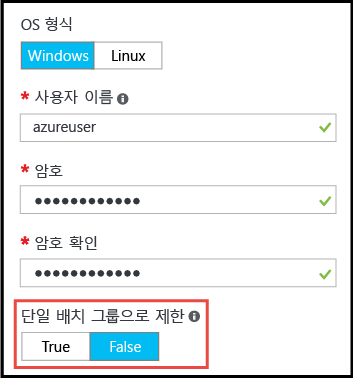

# <a name="working-with-large-virtual-machine-scale-sets"></a>대규모 가상 머신 확장 집합과 작동
이제 최대 1,000대 VM의 용량을 갖춘 Azure [가상 머신 확장 집합](/azure/virtual-machine-scale-sets/)을 만들 수 있습니다. 이 문서에서는 _대규모 가상 머신 확장 집합_이 100대 이상의 VM까지 확장할 수 있는 확장 집합으로 정의됩니다. 이 기능은 확장 집합 속성에 의해 설정됩니다(_singlePlacementGroup=False_). 

부하 분산 및 장애 도메인 등 대규모 확장 집합의 특정 측면은 표준 확장 집합과 다르게 동작합니다. 이 문서에서는 대규모 확장 세트의 특징에 대해 설명하고 애플리케이션에서 성공적으로 사용하기 위해 알아야 할 내용을 설명합니다. 

큰 크기의 클라우드 인프라를 배포하기 위한 일반적인 방법은 여러 VNET 및 저장소 계정에 대해 여러 VM 확장 집합을 만드는 것과 같이 _배율 단위_의 집합을 만드는 것입니다. 이는 단일 VM 관리보다 쉬운 방법이며, 여러 배율 단위는 여러 가상 네트워크와 엔드포인트 등 기타 스택 가능한 구성 요소를 필요로 하는 많은 애플리케이션에 특히 유용합니다. 그러나 애플리케이션이 하나의 대규모 클러스터를 필요로 하는 경우 최대 1,000대 VM의 단일 확장 세트을 간단히 배포할 수 있습니다. 예제 시나리오에는 중앙 집중화된 빅 데이터 배포 또는 작업자 노드의 대용량 풀을 간단하게 관리해야 하는 컴퓨팅 그리드가 있습니다. 가상 머신 확장 집합인 [연결된 데이터 디스크](virtual-machine-scale-sets-attached-disks.md)와 결합된 대규모 확장 집합을 사용하면 수천 개의 vCPU와 페타바이트 크기의 저장소로 구성된 확장형 인프라를 단일 작업으로 배포할 수 있습니다.

## <a name="placement-groups"></a>배치 그룹 
_대규모_ 확장 집합을 특별하게 만드는 것은 VM의 수가 아닌 포함된 _배치 그룹_의 수입니다. 배치 그룹은 자체 장애 도메인과 업그레이드 도메인이 있는 Azure 가용성 집합과 비슷한 구조입니다. 기본적으로 확장 집합은 최대 100대의 VM을 갖춘 단일 배치 그룹으로 구성됩니다. _singlePlacementGroup_이라고 하는 확장 집합 속성이 _false_로 설정된 경우, 확장 집합은 여러 배치 그룹으로 구성될 수 있으며 0-1,000대의 VM을 가집니다. 기본값을 _true_로 설정하면 확장 집합은 하나의 배치 그룹으로 구성되며 0-100대의 VM을 가집니다.

## <a name="checklist-for-using-large-scale-sets"></a>대규모 확장 집합을 사용하는 경우 검사 목록
애플리케이션이 대규모 확장 세트을 효과적으로 사용할 수 있는지 판단하기 위해서는 다음 요구 사항을 고려합니다.

- VM을 대량으로 배포하려는 경우 Compute vCPU 할당량 제한을 늘려야 할 수 있습니다. 
- Azure Marketplace 이미지에서 만든 확장 집합은 최대 1,000대의 VM까지 확장할 수 있습니다.
- 사용자 지정 이미지(직접 작성하여 업로드한 VM 이미지)에서 만든 확장 집합은 현재 최대 600대의 VM까지 확장할 수 있습니다.
- 대규모 확장 집합은 Azure Managed Disks가 필요합니다. Managed Disks로 만들어지지 않은 확장 집합은 여러 저장소 계정이 필요합니다(20대의 VM에 대해 하나씩). 대규모 확장 집합은 저장소 관리 오버헤드를 줄이고 저장소 계정에 대해 구독 제한에 실행되지 않도록 오직 Managed Disks와 작동하도록 설계되어 있습니다. 
- 여러 배치 그룹으로 구성된 확장 집합에 레이어-4 부하 분산을 사용하려면 [Azure Load Balancer 표준 SKU](../load-balancer/load-balancer-standard-overview.md)가 필요합니다. Load Balancer 표준 SKU는 여러 확장 집합 간에 부하를 분산하는 기능 같은 추가 이점을 제공합니다. 또한 표준 SKU는 확장 집합에 네트워크 보안 그룹이 연결되어야 합니다. 그렇지 않으면 NAT 풀이 제대로 작동하지 않습니다. Azure Load Balancer 기본 SKU를 사용해야 하는 경우 확장 집합이 기본 설정인 단일 배치 그룹을 사용하도록 구성되었는지 확인합니다.
- Azure Application Gateway의 계층 7 부하 분산은 모든 확장 세트에 대해 지원됩니다.
- 확장 집합은 단일 서브넷으로 정의됩니다. 필요한 모든 VM에 대해 서브넷의 주소 공간이 충분한지 확인합니다. 기본적으로 확장 집합은 오버프로비전하여(배포 또는 확장 시 VM을 추가로 생성하며 요금은 부과되지 않음) 배포 안정성 및 성능을 향상시킵니다. 주소 공간을 확장하려는 VM의 수보다 20% 크게 설정합니다.
- 장애 도메인 및 업그레이드 도메인은 배치 그룹 내에서만 일관됩니다. 이 아키텍처는 VM이 고유한 물리적 하드웨어에 고르게 분산되어 확장 집합의 전체 가용성을 변경하지 않지만, 두 VM이 서로 다른 하드웨어에 있다는 것을 보장해야 하는 경우 동일한 배치 그룹의 다른 장애 도메인에 있도록 해야 함을 의미합니다. [Azure 지역 및 가용성](https://docs.microsoft.com/azure/virtual-machines/windows/regions-and-availability/) 링크를 참조하세요. 
- 장애 도메인 및 배치 그룹 ID는 확장 집합 VM의 _인스턴스 보기_에 표시됩니다. [Azure Resource Explorer](https://resources.azure.com/)에서 확장 집합 VM의 인스턴스 보기를 볼 수 있습니다.

## <a name="creating-a-large-scale-set"></a>대규모 확장 집합 만들기
Azure Portal에서 확장 집합을 만들 때 *인스턴스 수* 값을 최대 1,000까지 지정할 수 있습니다. 인스턴스 수가 100개를 초과하는 경우 *100개 이상의 인스턴스로 확장 사용*이 *예*로 설정되고, 여러 배치 그룹으로 확장할 수 있게 됩니다. 



[Azure CLI](https://github.com/Azure/azure-cli) _az vmss create_ 명령을 사용하여 대규모 가상 머신 확장 집합을 만들 수 있습니다. 이 명령은 _instance-count_ 인수를 기반으로 한 서브넷 크기와 같은 지능형 기본값을 설정합니다.

```bash
az group create -l southcentralus -n biginfra
az vmss create -g biginfra -n bigvmss --image ubuntults --instance-count 1000
```
기본값을 지정하지 않으면 _vmss create_ 명령은 특정 구성 값을 기본값으로 지정합니다. 재정의할 수 있는 사용 가능한 옵션을 확인하려면 다음을 사용하세요.
```bash
az vmss create --help
```

Azure Resource Manager 템플릿을 작성하여 대규모 확장 집합을 만드는 경우 템플릿이 Azure Managed Disks에 기반하여 확장 집합을 만드는지 확인합니다. _Microsoft.Compute/virtualMachineScaleSets_ 리소스의 _속성_ 섹션에서 _singlePlacementGroup_ 속성을 _false_에 설정할 수 있습니다. 다음 JSON 조각은 1,000대의 VM 용량과 _"singlePlacementGroup": false_를 포함하여 확장 집합 템플릿의 시작 부분을 보여줍니다.
```json
{
  "type": "Microsoft.Compute/virtualMachineScaleSets",
  "location": "australiaeast",
  "name": "bigvmss",
  "sku": {
    "name": "Standard_DS1_v2",
    "tier": "Standard",
    "capacity": 1000
  },
  "properties": {
    "singlePlacementGroup": false,
    "upgradePolicy": {
      "mode": "Automatic"
    }
```
대규모 확장 집합 템플릿의 전체 예제는 [https://github.com/gbowerman/azure-myriad/blob/master/bigtest/bigbottle.json](https://github.com/gbowerman/azure-myriad/blob/master/bigtest/bigbottle.json)을 참조하세요.

## <a name="converting-an-existing-scale-set-to-span-multiple-placement-groups"></a>여러 배치 그룹을 확장하기 위해 기존 확장 집합을 변환
기존의 가상 머신 확장 집합을 100대 이상의 VM으로 확장할 수 있도록 하려면 확장 집합 모델에서 _singlePlacementGroup_ 속성을 _false_로 변경해야 합니다. [Azure 리소스 탐색기](https://resources.azure.com/)로 이 속성 변경을 테스트할 수 있습니다. 기존 크기 집합을 찾아 _편집_을 선택하고 _singlePlacementGroup_ 속성을 변경합니다. 이 속성이 표시되지 않으면 Microsoft.Compute API의 이전 버전으로 크기 집합을 볼 수 있습니다.

> [!NOTE]
> 단일 배치 그룹만 지원하는 것(기본 동작)에서 여러 배치 그룹을 지원하도록 확장 집합을 변경할 수 있지만 그 반대로는 변환할 수 없습니다. 따라서 변환하기 전에 대규모 확장 집합의 속성을 이해해야 합니다.


