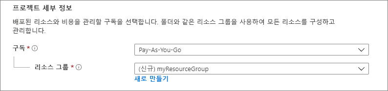
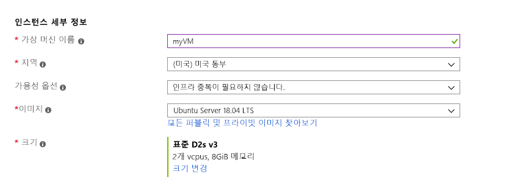
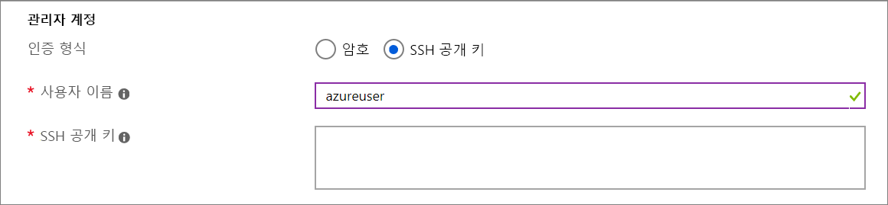
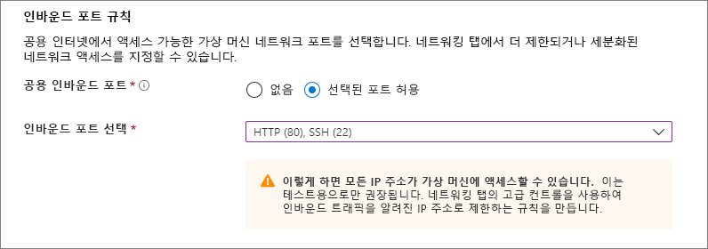
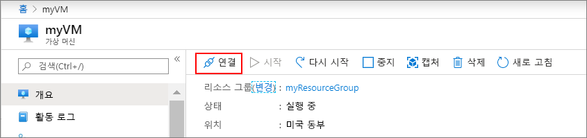

# <a name="quickstart-create-a-linux-virtual-machine-in-the-azure-portal"></a>빠른 시작: Azure Portal에서 Linux 가상 머신 만들기

Azure Portal을 통해 Azure VM(가상 머신)을 만들 수 있습니다. Azure Portal은 VM 및 관련 리소스를 만드는 브라우저 기반 사용자 인터페이스를 제공합니다. 이 빠른 시작에서는 Azure Portal을 사용하여 Ubuntu 16.04 LTS를 실행하는 Azure에서 Linux VM(가상 머신)을 배포하는 방법을 보여줍니다. VM 작동을 확인하기 위해 VM에 대해 SSH를 수행하고 NGINX 웹 서버를 설치합니다.

Azure 구독이 아직 없는 경우 시작하기 전에 [체험 계정](https://azure.microsoft.com/free/?WT.mc_id=A261C142F)을 만듭니다.

## <a name="create-ssh-key-pair"></a>SSH 키 쌍 만들기

이 빠른 시작을 완료하려면 SSH 키 쌍이 필요합니다. SSH 키 쌍이 이미 있는 경우 이 단계를 건너뜁니다.

Bash 셸을 열고 [ssh-keygen](https://www.ssh.com/ssh/keygen/)을 사용하여 SSH 키 쌍을 만듭니다. 로컬 컴퓨터에 Bash 셸이 없는 경우 [Azure Cloud Shell](https://shell.azure.com/bash)을 사용할 수 있습니다.  

```bash
ssh-keygen -t rsa -b 2048
```

위의 명령은 `~/.ssh directory`에서 기본 이름 `id_rsa`로 공용 및 프라이빗 키를 생성합니다. 명령이 공개 키의 전체 경로를 반환합니다. 공개 키의 전체 경로를 사용하여 `cat` 및 해당 콘텐츠를 표시합니다.

```bash 
cat ~/.ssh/id_rsa.pub
```

명령의 출력을 저장합니다. 이 항목은 관리자 계정이 VM에 로그인하도록 구성할 때 필요합니다.

PuTTy 사용을 포함하여 SSH 키 쌍을 만드는 방법에 대한 자세한 내용은 [Windows에 SSH 키를 사용하는 방법](ssh-from-windows.md)을 참조하세요.

Cloud Shell을 사용하여 SSH 키 쌍을 만드는 경우 [Cloud Shell에서 자동으로 탑재되는](https://docs.microsoft.com/azure/cloud-shell/persisting-shell-storage) Azure File Share에 저장됩니다. 키를 검색할 때까지 이 파일 공유나 저장소 계정을 삭제하지 마세요. VM에 대한 액세스를 잃게 됩니다. 

## <a name="sign-in-to-azure"></a>Azure에 로그인

[Azure Portal](https://portal.azure.com)에 로그인합니다.

## <a name="create-virtual-machine"></a>가상 머신 만들기

1. Azure Portal의 왼쪽 위 모서리에서 **리소스 만들기**를 선택합니다.

1. Azure Marketplace 리소스 목록 위에 있는 검색 상자에서 Canonical의 **Ubuntu Server 16.04 LTS**를 검색하고 선택한 다음, **만들기**를 선택합니다.

1. **기본** 탭의 **프로젝트 세부 정보** 아래에서 올바른 구독이 선택되어 있는지 확인한 다음, **리소스 그룹** 아래에서 **새로 만들기**를 선택합니다. 팝업에서 리소스 그룹의 이름에 *myResourceGroup*을 입력한 다음, **확인**을 선택합니다. 

    

1. **인스턴스 세부 정보** 아래에서 **가상 머신 이름**에 *myVM*을 입력하고 **지역**에 *미국 동부*를 선택합니다. 다른 기본값을 그대로 둡니다.

    

1. **관리자 계정** 아래에서 **SSH 공개 키**를 선택하고, 사용자 이름을 입력한 다음, 공개 키를 텍스트 상자에 붙여넣습니다. 공개 키에서 선행 또는 후행 공백을 모두 제거합니다.

    

1. **인바운드 포트 규칙** > **공용 인바운드 포트** 아래에서 **선택한 포트 허용**을 선택한 다음, 드롭다운에서 **SSH(22)** 및 **HTTP(80)** 를 선택합니다. 

    

1. 나머지 기본값은 그대로 둔 다음, 페이지의 하단에 있는 **검토 + 만들기** 단추를 선택합니다.

1. **가상 머신 만들기** 페이지에서 만들려는 VM의 세부 정보를 볼 수 있습니다. 준비가 되면 **만들기**를 선택합니다.

VM 배포에는 몇 분 정도 걸립니다. 배포가 완료되면 다음 섹션으로 이동합니다.

    
## <a name="connect-to-virtual-machine"></a>가상 머신에 연결

VM과의 SSH 연결을 만듭니다.

1. VM의 개요 페이지에서 **연결** 단추를 선택합니다. 

    

2. **가상 머신 연결** 페이지에서 포트 22를 통해 IP 주소로 연결하는 기본 옵션을 유지합니다. **VM 로컬 계정을 사용하여 로그인**에 연결 명령이 표시됩니다. 단추를 클릭하여 명령을 복사합니다. 다음 예제에서는 SSH 연결 명령의 모양을 보여줍니다.

    ```bash
    ssh azureuser@10.111.12.123
    ```

3. SSH 키 쌍을 만들 때와 같은 Bash 셸을 사용하여(예: [Azure Cloud Shell](https://shell.azure.com/bash) 또는 로컬 Bash 셸) SSH 연결 명령을 셸에 붙여 넣어 SSH 세션을 만듭니다. 

## <a name="install-web-server"></a>웹 서버 설치

실제로 작동 중인 VM을 보려면 NGINX 웹 서버를 설치합니다. SSH 세션에서 패키지 소스를 업데이트한 다음, 최신 NGINX 패키지를 설치합니다.

```bash
sudo apt-get -y update
sudo apt-get -y install nginx
```

완료되면 `exit`를 입력하여 SSH 세션을 종료합니다.


## <a name="view-the-web-server-in-action"></a>실제로 작동 중인 웹 서버 보기

원하는 웹 브라우저를 사용하여 기본 NGINX 시작 페이지를 봅니다. VM의 공용 IP 주소를 웹 주소로 입력합니다. 공용 IP 주소는 VM 개요 페이지나, 앞서 사용한 SSH 구성 문자열 부분에 있습니다.


## <a name="clean-up-resources"></a>리소스 정리

리소스 그룹, 가상 머신 및 모든 관련 리소스가 더 이상 필요 없는 경우 삭제해도 됩니다. 삭제하려면 가상 머신의 리소스 그룹을 선택하고 **삭제**를 선택한 다음, 삭제할 리소스 그룹의 이름을 확인합니다.

## <a name="next-steps"></a>다음 단계

이 빠른 시작에서는 간단한 가상 머신을 배포하고, 네트워크 보안 그룹 및 규칙을 만들고 기본 웹 서버를 설치했습니다. Azure 가상 머신에 대한 자세한 내용을 알아보려면 Linux VM의 자습서를 계속 진행합니다.

> [!div class="nextstepaction"]
> [Azure Linux 가상 머신 자습서](./tutorial-manage-vm.md)
