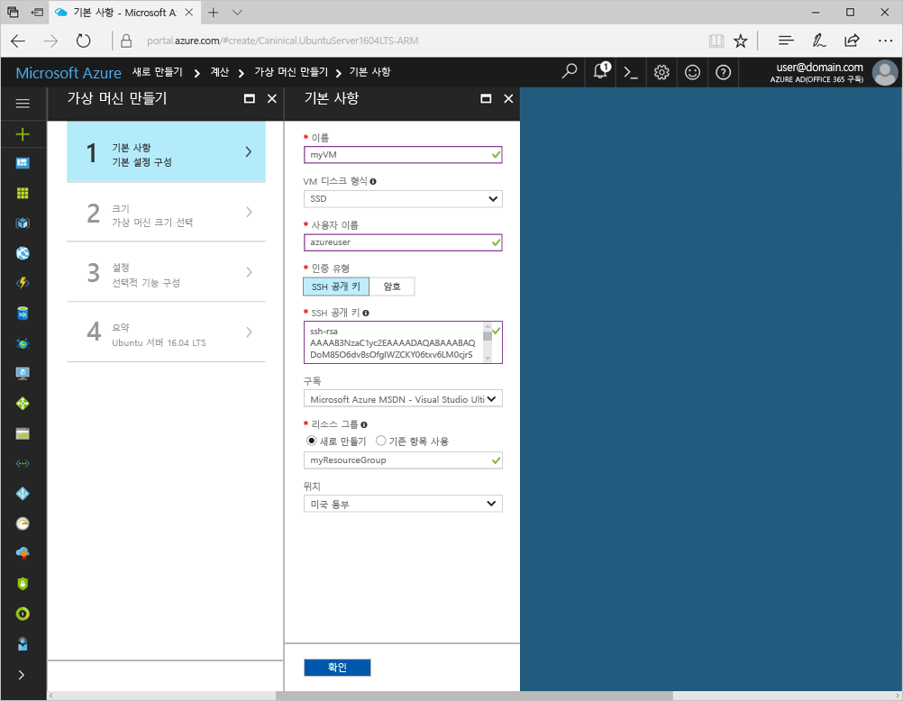
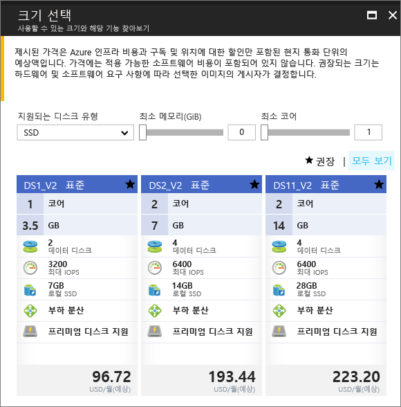

# <a name="create-a-linux-virtual-machine-with-the-azure-portal"></a>Azure Portal을 사용하여 Linux 가상 머신 만들기

Azure Portal을 통해 Azure Virtual Machines를 만들 수 있습니다. 이 메서드는 가상 머신 및 관련된 모든 리소스를 만들고 구성하기 위한 브라우저 기반 사용자 인터페이스를 제공합니다. 이 빠른 시작에서는 가상 머신을 만들고 VM에 웹 서버를 설치하는 방법에 대해 단계별로 설명합니다.

Azure 구독이 아직 없는 경우 시작하기 전에 [체험 계정](https://azure.microsoft.com/free/?WT.mc_id=A261C142F)을 만듭니다.

## <a name="create-ssh-key-pair"></a>SSH 키 쌍 만들기

이 빠른 시작을 완료하려면 SSH 키 쌍이 필요합니다. 기존 SSH 키 쌍을 사용하는 경우 이 단계를 건너뛸 수 있습니다.

Bash 셸에서 이 명령을 실행하고 화면에 나타나는 지시를 따릅니다. 명령 출력은 공개 키 파일의 파일 이름을 포함합니다. 공개 키 파일의 콘텐츠(`cat ~/.ssh/id_rsa.pub`)를 클립보드에 복사합니다. Linux용 Windows 하위 시스템을 사용할 경우 출력에서 줄 바꿈 문자를 복사하지 않도록 합니다. 나중에 사용할 수 있게 개인 키의 파일 이름에 유의합니다.

```bash
ssh-keygen -t rsa -b 2048
```

이 프로세스에 대한 자세한 정보는 [여기](https://docs.microsoft.com/azure/virtual-machines/linux/mac-create-ssh-keys)에서 제공합니다.

## <a name="log-in-to-azure"></a>Azure에 로그인 

Azure Portal ( http://portal.azure.com ) 에 로그인합니다.

## <a name="create-virtual-machine"></a>가상 컴퓨터 만들기

1. Azure Portal의 왼쪽 위 모서리에서 **리소스 만들기**를 클릭합니다.

2. **Compute**를 선택한 후 **Ubuntu Server 16.04 LTS**를 선택합니다. 

3. 가상 컴퓨터 정보를 입력합니다. **인증 유형**으로 **SSH 공용 키**를 선택합니다. SSH 공용 키를 붙여 넣을 때 선행 또는 후행 공백을 모두 제거해야 합니다. 완료되면 **확인**을 클릭합니다.

    

4. VM의 크기를 선택합니다. 더 많은 크기를 보려면 **모두 보기**를 선택하거나 **지원되는 디스크 형식** 필터를 변경합니다. 

      

5. **설정** 아래에서 기본값을 유지하고 **확인**을 클릭합니다.

6. 요약 페이지에서 **확인**을 클릭하여 가상 머신 배포를 시작합니다.

7. Azure Portal 대시보드에 VM을 고정합니다. 배포가 완료되면 VM 요약이 자동으로 열립니다.


## <a name="connect-to-virtual-machine"></a>가상 머신에 연결

가상 머신과 SSH 연결 만들기

1. 가상 머신 속성에서 **연결** 단추를 클릭합니다. 연결 단추를 클릭하면 가상 머신에 연결하는 데 사용할 수 있는 SSH 연결 문자열이 표시됩니다.

     

2. 다음 명령을 실행하여 SSH 세션을 만듭니다. 이 연결 문자열을 Azure Portal에서 복사한 것으로 바꿉니다.

```bash 
ssh azureuser@40.112.21.50
```

## <a name="install-nginx"></a>NGINX 설치

다음 bash 스크립트를 사용하여 패키지 원본을 업데이트하고 최신 NGINX 패키지를 설치합니다. 

```bash 
#!/bin/bash

# update package source
sudo apt-get -y update

# install NGINX
sudo apt-get -y install nginx
```

작업이 완료되면 SSH 세션을 종료하고 Azure Portal에서 VM 속성을 반환합니다.


## <a name="open-port-80-for-web-traffic"></a>웹 트래픽에 대해 포트 80 열기 

NSG(네트워크 보안 그룹)는 인바운드 및 아웃바운드 트래픽의 보안을 유지합니다. Azure Portal에서 VM이 만들어지면 SSH 연결의 포트 22 인바운드 규칙이 만들어집니다. 이 VM이 웹 서버를 호스트하기 때문에 포트 80에 NSG 규칙을 만들어야 합니다.

1. 가상 머신에서 **리소스 그룹**의 이름을 클릭합니다.
2. **네트워크 보안 그룹**을 선택합니다. NSG는 **형식** 열을 사용하여 식별할 수 있습니다. 
3. 왼쪽 메뉴의 설정에서 **인바운드 보안 규칙**을 클릭합니다.
4. **추가**를 클릭합니다.
5. **이름**에서 **http**를 입력합니다. **원본 포트 범위**가 `*`, **대상 포트 범위**가 *80*, **작업**이 *허용*으로 설정되었는지 확인합니다. 
6. **확인**을 클릭합니다.


## <a name="view-the-nginx-welcome-page"></a>NGINX 시작 페이지 보기

NGINX를 설치하고 VM에 포트 80을 열어서 인터넷에서 웹 서버에 액세스할 수 있습니다. 웹 브라우저를 열고 VM의 공용 IP 주소를 입력합니다. 공용 IP 주소는 Azure Portal의 VM 속성에서 찾을 수 있습니다.

 

## <a name="clean-up-resources"></a>리소스 정리

더 이상 필요하지 않을 때 리소스 그룹, 가상 머신 및 모든 관련 리소스를 삭제합니다. 이렇게 하려면 가상 머신의 해당 리소스 그룹을 선택하고 **삭제**를 클릭합니다.

## <a name="next-steps"></a>다음 단계

이 빠른 시작에서 간단한 가상 머신, 네트워크 보안 그룹 규칙을 배포했으며 웹 서버를 설치했습니다. Azure 가상 머신에 대한 자세한 내용을 알아보려면 Linux VM의 자습서를 계속 진행합니다.

> [!div class="nextstepaction"]
> [Azure Linux 가상 머신 자습서](./tutorial-manage-vm.md)
