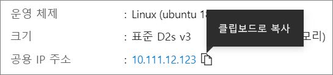

# <a name="quickstart-create-a-linux-virtual-machine-in-the-azure-portal"></a>빠른 시작: Azure Portal에서 Linux 가상 머신 만들기

Azure Portal을 통해 Azure VM(가상 머신)을 만들 수 있습니다. Azure Portal은 Azure 리소스를 만드는 브라우저 기반 사용자 인터페이스입니다. 이 빠른 시작에서는 Azure Portal을 사용하여 Ubuntu 18.04 LTS를 실행하는 Linux VM(가상 머신)을 배포하는 방법을 보여줍니다. VM 작동을 확인하기 위해 VM에 대해 SSH를 수행하고 NGINX 웹 서버를 설치합니다.

Azure 구독이 아직 없는 경우 시작하기 전에 [체험 계정](https://azure.microsoft.com/free/?WT.mc_id=A261C142F)을 만듭니다.

## <a name="sign-in-to-azure"></a>Azure에 로그인

[Azure Portal](https://portal.azure.com)에 로그인합니다(아직 로그인하지 않은 경우).

## <a name="create-virtual-machine"></a>가상 머신 만들기

1. 검색에서 **가상 머신**을 입력합니다.
1. **서비스**에서 **가상 머신**을 선택합니다.
1. **가상 머신** 페이지에서 **추가**를 선택합니다. **가상 머신 만들기** 페이지가 열립니다.
1. **기본** 탭의 **프로젝트 세부 정보** 아래에서 올바른 구독이 선택되어 있는지 확인한 다음, 리소스 그룹 **새로 만들기**를 선택합니다. 이름으로 *myResourceGroup*을 입력합니다.* 

    

1. **인스턴스 세부 정보** 아래에서 **가상 머신 이름**에 *myVM*을 입력하고 **지역**에 *미국 동부*를 선택한 후 **이미지**로 *Ubuntu 18.04 LTS*를 선택합니다. 다른 기본값을 그대로 둡니다.

    

1. **관리자 계정**에서 **SSH 공개 키**를 선택합니다.

1. **사용자 이름**에서 *azureuser*를 입력합니다.

1. **SSH 공개 키 원본**의 경우 기본값인 **새 키 쌍 생성**을 그대로 둔 다음, **키 쌍 이름**에 *myKey*를 입력합니다.

    

1. **인바운드 포트 규칙** > **공용 인바운드 포트**에서 **선택된 포트 허용을** 선택한 다음, 드롭다운에서 **SSH(22)** 및 **HTTP(80)** 를 선택합니다. 

    

1. 나머지 기본값을 그대로 둔 다음, 페이지의 아래에서 **검토 + 만들기** 단추를 선택합니다.

1. **가상 머신 만들기** 페이지에서 만들려는 VM의 세부 정보를 볼 수 있습니다. 준비가 되면 **만들기**를 선택합니다.

1. **새 키 쌍 생성** 창이 열리면 **프라이빗 키 다운로드 및 리소스 만들기**를 선택합니다. 키 파일은 **myKey.pem**으로 다운로드됩니다. `.pem` 파일을 다운로드한 위치를 확인하고 다음 단계에서 해당 파일에 대한 경로가 필요합니다.

1. 배포가 완료되면 **리소스로 이동**을 선택합니다.

1. 새 VM에 대한 페이지에서 공용 IP 주소를 선택하고 클립보드에 복사합니다.


    

## <a name="connect-to-virtual-machine"></a>가상 머신에 연결

VM과의 SSH 연결을 만듭니다.

1. Mac 또는 Linux 머신을 사용하는 경우 Bash 프롬프트를 엽니다. Windows 머신을 사용하는 경우 PowerShell 프롬프트를 엽니다. 

1. 프롬프트에서 가상 머신에 대한 SSH 연결을 엽니다. IP 주소를 VM의 IP 주소로 바꾸고, `.pem`에 대한 경로를 키 파일이 다운로드된 경로로 바꿉니다.

```console
ssh -i .\Downloads\myKey1.pem azureuser@10.111.12.123
```

> [!TIP]
> 만든 SSH 키는 다음에 Azure에서 VM을 만들 때 사용할 수 있습니다. 다음에 VM을 만들 때 **SSH 공개 키 원본**에 대해 **Azure에 저장된 키 사용**을 선택하면 됩니다. 컴퓨터에 프라이빗 키가 이미 있으므로 아무것도 다운로드하지 않아도 됩니다.

## <a name="install-web-server"></a>웹 서버 설치

실제로 작동 중인 VM을 보려면 NGINX 웹 서버를 설치합니다. SSH 세션에서 패키지 소스를 업데이트한 다음, 최신 NGINX 패키지를 설치합니다.

```bash
sudo apt-get -y update
sudo apt-get -y install nginx
```

완료되면 `exit`를 입력하여 SSH 세션을 종료합니다.


## <a name="view-the-web-server-in-action"></a>실제로 작동 중인 웹 서버 보기

원하는 웹 브라우저를 사용하여 기본 NGINX 시작 페이지를 봅니다. VM의 공용 IP 주소를 웹 주소로 입력합니다. 공용 IP 주소는 VM 개요 페이지나, 앞서 사용한 SSH 구성 문자열 부분에 있습니다.


## <a name="clean-up-resources"></a>리소스 정리

리소스 그룹, 가상 머신 및 모든 관련 리소스가 더 이상 필요 없는 경우 삭제해도 됩니다. 삭제하려면 가상 머신의 리소스 그룹을 선택하고 **삭제**를 선택한 다음, 삭제할 리소스 그룹의 이름을 확인합니다.

## <a name="next-steps"></a>다음 단계

이 빠른 시작에서는 간단한 가상 머신을 배포하고, 네트워크 보안 그룹 및 규칙을 만들고 기본 웹 서버를 설치했습니다. Azure 가상 머신에 대한 자세한 내용을 알아보려면 Linux VM의 자습서를 계속 진행합니다.

> [!div class="nextstepaction"]
> [Azure Linux 가상 머신 자습서](./tutorial-manage-vm.md)
