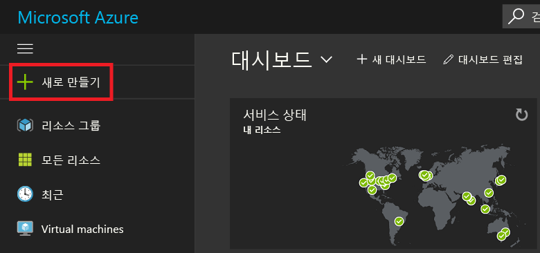
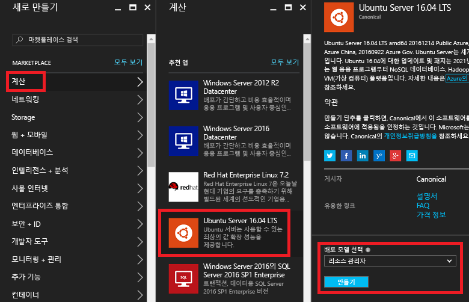
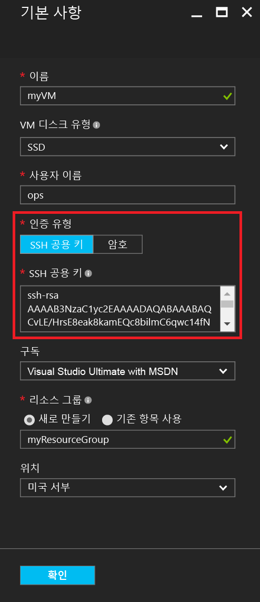
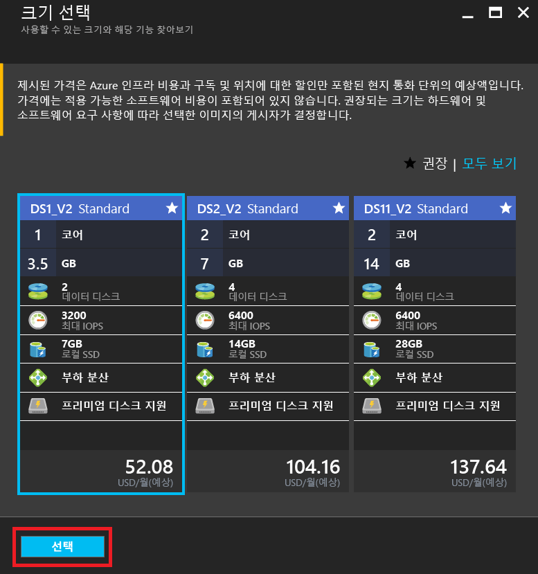
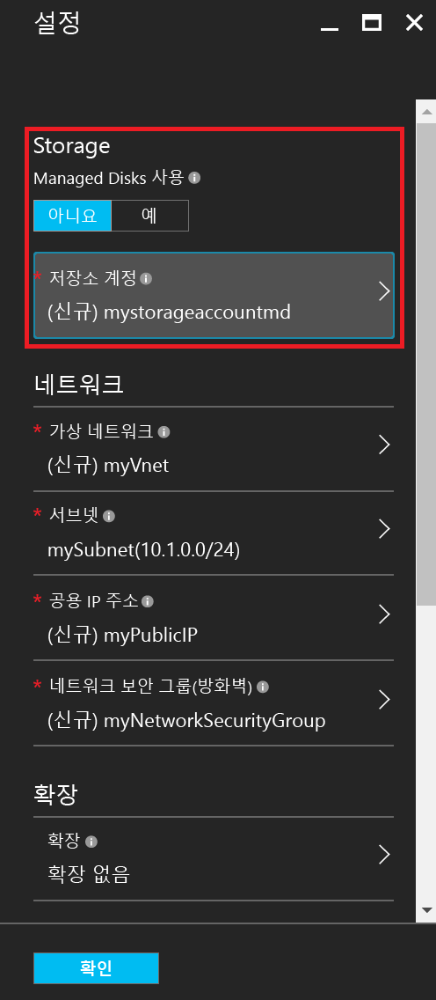
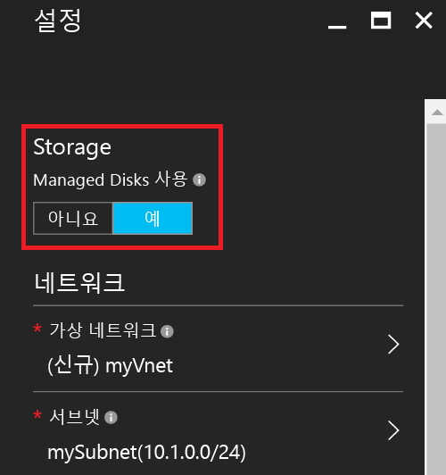
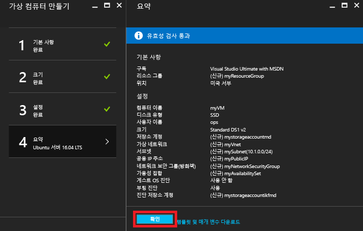
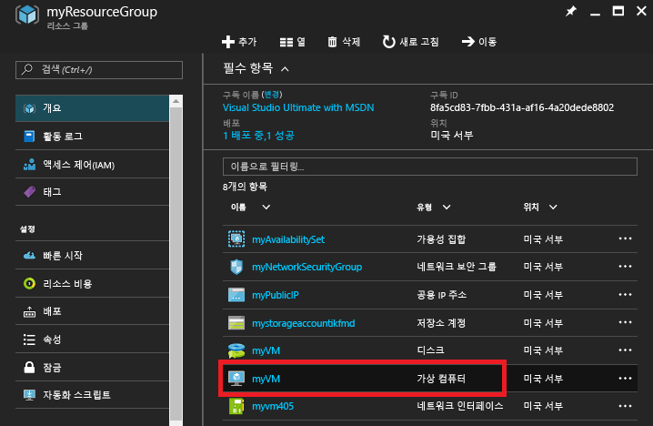
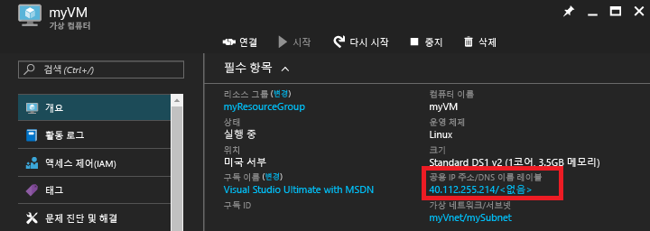

# <a name="create-a-linux-vm-on-azure-using-the-portal"></a>포털을 사용하여 Azure에서 Linux VM 만들기
이 문서에서는 [Azure 포털](https://portal.azure.com/)을 사용하여 Linux 가상 컴퓨터를 만드는 방법을 보여 줍니다.

요구 사항은 다음과 같습니다.

* [Azure 계정](https://azure.microsoft.com/pricing/free-trial/)
* [SSH 공용 및 개인 키 파일](virtual-machines-linux-mac-create-ssh-keys.md?toc=%2fazure%2fvirtual-machines%2flinux%2ftoc.json)

## <a name="sign-in"></a>로그인
Azure 계정 ID로 Azure Portal에 로그인합니다. 왼쪽 위 모서리에서 **+ 새로 만들기**를 클릭합니다.



## <a name="choose-vm"></a>VM 선택
**Marketplace**에서 **Compute**를 클릭한 다음 **추천 앱** 이미지 목록에서 **Ubuntu Server 16.04 LTS**를 클릭합니다.  맨 아래에서 배포 모델이 `Resource Manager` 인지 확인하고 **만들기**를 클릭합니다.



## <a name="enter-vm-options"></a>VM 옵션 입력
**기본** 페이지에서 다음을 입력합니다.

* VM의 이름
* VM 디스크 유형(기본적으로 SSD 또는 HDD)
* 관리 사용자의 사용자 이름
* **인증 유형**을 **SSH 공개 키**로 설정
* SSH 공개 키 문자열(`~/.ssh/` 디렉터리에 있음)
* 리소스 그룹 이름 또는 기존 리소스 그룹 선택

**확인**을 클릭하여 계속합니다. 블레이드가 다음 화면과 유사하게 표시됩니다.



## <a name="choose-vm-size"></a>VM 크기 선택
VM 크기를 선택합니다. 다음 예제에서는 Premium SSD에 Ubuntu를 설치하는 **DS1_V2 Standard**를 선택합니다. VM 크기의 **S**는 SSD 지원을 나타냅니다. **선택**을 클릭하여 설정을 구성합니다.



## <a name="storage-and-network"></a>저장소 및 네트워크
**설정** 블레이드에서 Azure Managed Disks를 VM으로 사용하도록 선택할 수 있습니다. 현재 기본 설정은 관리되지 않는 디스크를 사용하기 위한 설정입니다. Azure Managed Disks는 Azure 플랫폼을 통해 처리되며 디스크를 저장할 위치나 준비가 필요하지 않습니다. Azure Managed Disks에 대한 자세한 내용은 [Azure Managed Disks 개요](../storage/storage-managed-disks-overview.md)를 참조하세요. 관리되지 않는 디스크의 경우 가상 하드 디스크에 대한 저장소 계정을 만들거나 선택해야 합니다.



Azure Managed Disks를 사용하기로 선택하는 경우에는 아래 예제에 표시된 것과 같이 추가로 구성할 저장소 옵션이 없습니다.



나머지 네트워크 설정을 기본 설정대로 유지합니다.

## <a name="confirm-vm-settings-and-launch"></a>VM 설정 확인 및 시작
새로운 Ubuntu VM에 대한 설정을 확인하고 **확인**을 클릭합니다.



## <a name="select-the-vm-resource"></a>VM 리소스 선택
포털 홈 페이지의 왼쪽 위 모서리에 있는 메뉴에서 **리소스 그룹**을 선택합니다. 필요한 경우 메뉴 맨 위의 막대 세 개를 클릭하여 다음과 같이 목록을 확장합니다.


리소스 그룹을 선택한 다음 새 VM을 클릭합니다.



## <a name="find-the-public-ip"></a>공용 IP 찾기
VM에 할당된 **공용 IP 주소**를 살펴봅니다.



## <a name="ssh-to-the-vm"></a>VM에 SSH
SSH 공개 키를 사용하여 공용 IP로 SSH합니다.  Mac 또는 Linux 워크스테이션에서 터미널에서 직접 SSH할 수 있습니다. Windows 워크스테이션에 있으면 PuTTY, MobaXTerm 또는 Cygwin을 사용하여 Linux에 SSH해야 합니다.  아직 없는 경우 Linux에 SSH하도록 Windows 워크스테이션을 준비하는 문서는 다음과 같습니다.

[Azure에서 Windows를 통해 SSH 키를 사용하는 방법](virtual-machines-linux-ssh-from-windows.md?toc=%2fazure%2fvirtual-machines%2flinux%2ftoc.json)

```
ssh -i ~/.ssh/azure_id_rsa ops@40.112.255.214
```

## <a name="next-steps"></a>다음 단계
이제 Linux VM을 신속하게 만들었으므로 테스트 또는 데모를 위해 사용합니다. 이러한 문서 중 하나를 수행하여 인프라에 대해 사용자 지정된 Linux VM을 만들 수 있습니다.

* [템플릿을 사용하여 Azure에서 Linux VM 만들기](virtual-machines-linux-cli-deploy-templates.md?toc=%2fazure%2fvirtual-machines%2flinux%2ftoc.json)
* [템플릿을 사용하여 Azure에서 SSH 보안 Linux VM 만들기](virtual-machines-linux-create-ssh-secured-vm-from-template.md?toc=%2fazure%2fvirtual-machines%2flinux%2ftoc.json)
* [Azure CLI를 사용하여 Linux VM 만들기](virtual-machines-linux-create-cli-complete.md?toc=%2fazure%2fvirtual-machines%2flinux%2ftoc.json)


