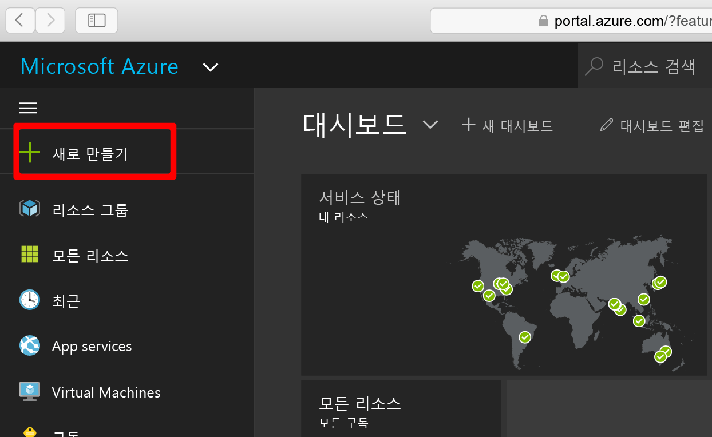
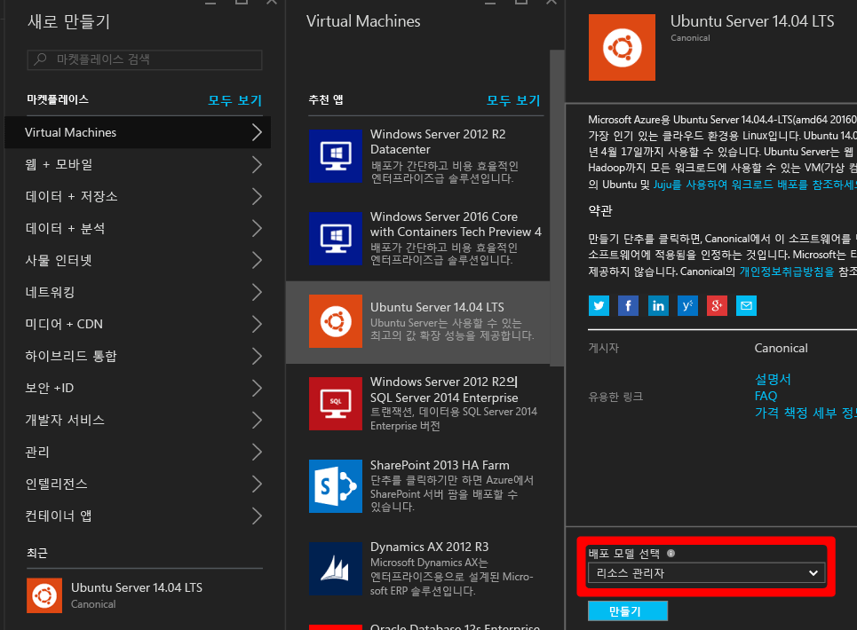
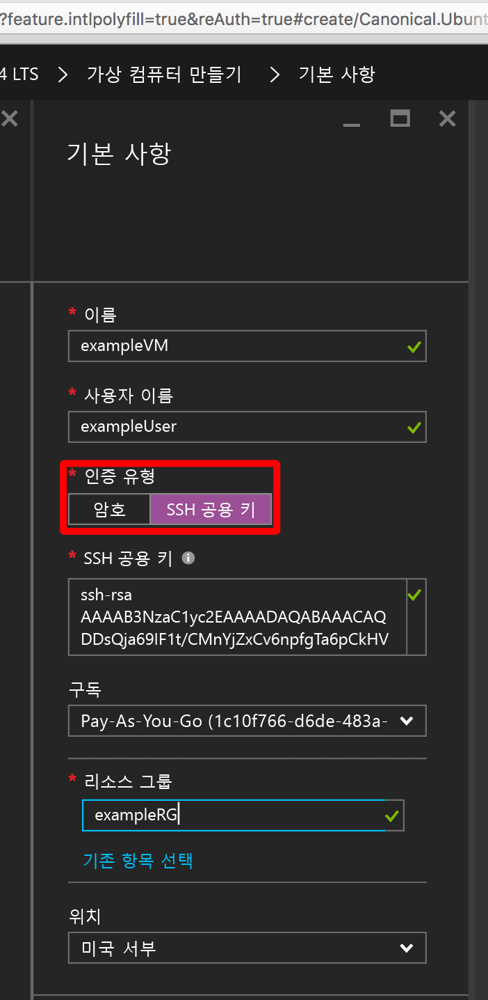
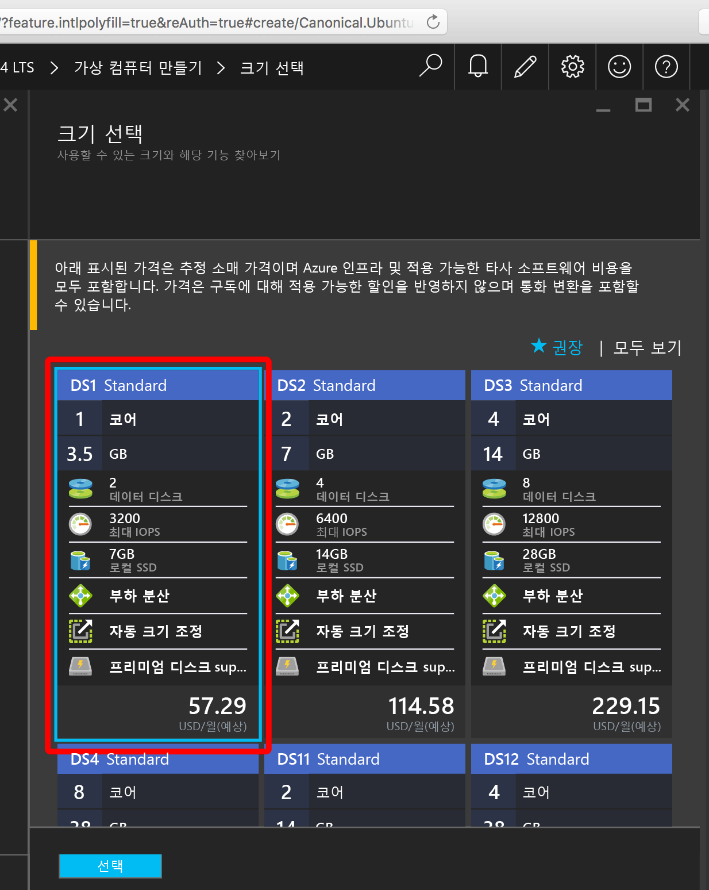
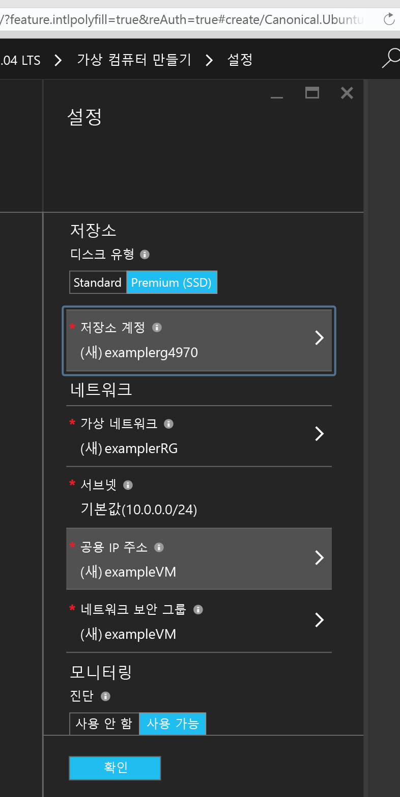
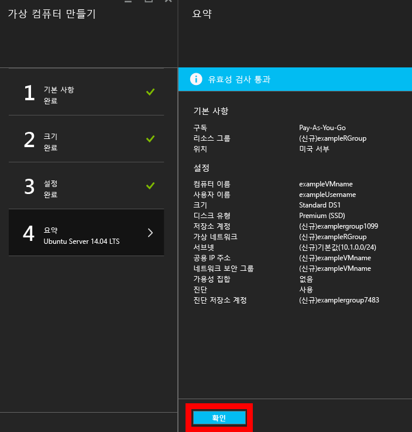
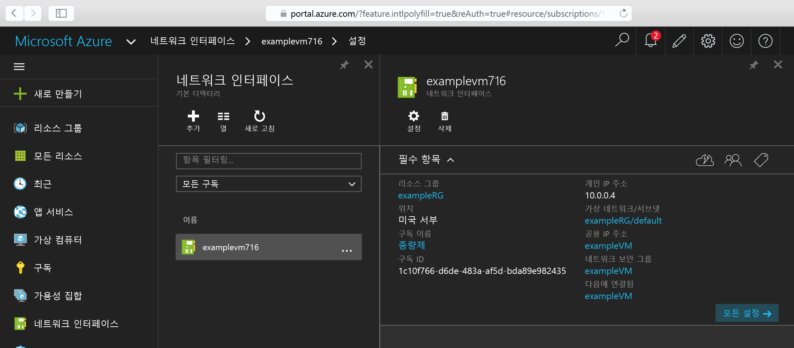
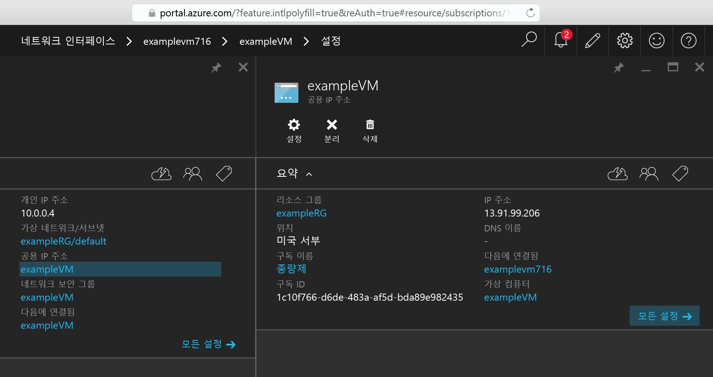

<properties
    pageTitle="Azure 포털을 사용하여 Linux VM 만들기 | Microsoft Azure"
    description="Azure 포털을 사용하여 Linux VM을 만듭니다."
    services="virtual-machines-linux"
    documentationCenter=""
    authors="vlivech"
    manager="timlt"
    editor=""
    tags="azure-resource-manager"
/>

<tags
    ms.service="virtual-machines-linux"
    ms.workload="infrastructure-services"
    ms.tgt_pltfrm="vm-linux"
    ms.devlang="na"
    ms.topic="hero-article"
    ms.date="04/29/2016"
    ms.author="v-livech"
/>

# 포털을 사용하여 Azure에서 Linux VM 만들기

이 문서에서는 [Azure 포털](https://portal.azure.com/)을 사용하여 Linux 가상 컴퓨터를 빠르게 만드는 방법을 보여 줍니다. 유일한 요구 사항은 [Azure 계정](https://azure.microsoft.com/pricing/free-trial/) 및 [SSH 공용 및 개인 키 파일](virtual-machines-linux-mac-create-ssh-keys.md)입니다.

[AZURE.NOTE] VM에 대한 액세스를 보호하기 위해 암호를 사용하도록 선택한 경우 암호는 12자보다 커야 하며 하나 이상의 대문자, 소문자, 특수 문자 및 숫자가 있어야 합니다.


1. Azure 계정 ID를 사용하여 Azure 포털에 로그인하고 왼쪽 위에서 **+ 새로 만들기**를 클릭합니다.

    

2. **마켓플레이스**에서 **가상 컴퓨터**를 클릭한 후 **추천 앱** 이미지 목록에서 **Ubuntu Server 14.04 LTS**를 클릭합니다. 맨 아래에서 배포 모델이 `Resource Manager`인지 확인하고 **만들기**를 클릭합니다.

    

3. **기본** 페이지에서 다음을 입력합니다.
    - VM의 이름
    - 관리 사용자의 사용자 이름
    - 인증 유형이 **SSH 공개 키**로 설정됨
    - 문자열로 SSH 공개 키(기본적으로 `~/.ssh/` 디렉터리에서)
    - 리소스 그룹 이름(새 배포 그룹 만들기) 또는 기존 그룹 선택

    계속하려면 **확인**을 클릭하고 VM 크기를 선택합니다. 다음과 같이 표시됩니다.

    

4. Premium SSD에 Ubuntu를 설치하는 **DS1** 크기를 선택하고 **선택**을 클릭하여 설정을 구성합니다.

    

5. **설정**에서 저장소 및 네트워크에 대한 기본값을 그대로 두고 **확인**을 클릭하여 요약을 봅니다. DS1을 선택하여 디스크 유형을 프리미엄 SSD로 설정하면 **S**는 SSD를 나타냅니다.

    

6. 새로운 Ubuntu VM에 대한 설정을 확인하고 **확인**을 클릭합니다.

    

7. 포털 대시보드를 열고 **네트워크 인터페이스**에서 NIC를 선택합니다.

    

8. NIC 설정 아래에서 공용 IP 주소 메뉴를 엽니다.

    

9. SSH 공개 키를 사용하여 공용 IP로 SSH합니다.

```
ssh -i ~/.ssh/azure_id_rsa ubuntu@13.91.99.206
```

## 다음 단계

이제 Linux VM을 신속하게 만들었으므로 테스트 또는 데모를 위해 사용합니다. 아래 문서 중 하나를 수행하여 인프라에 대해 사용자 지정된 Linux VM을 만들 수 있습니다.

- [템플릿을 사용하여 Azure에서 Linux VM 만들기](virtual-machines-linux-cli-deploy-templates.md)
- [템플릿을 사용하여 Azure에서 SSH 보안 Linux VM 만들기](virtual-machines-linux-create-ssh-secured-vm-from-template.md)
- [Azure CLI를 사용하여 Linux VM 만들기](virtual-machines-linux-create-cli-complete.md)

이러한 문서로 Azure 인프라뿐만 아니라 독점 및 오픈 소스 인프라 배포, 구성 및 오케스트레이션 도구 작성을 시작합니다.

<!---HONumber=AcomDC_0608_2016-->