<properties
	pageTitle="첫 번째 Windows VM에 IIS 설치 | Microsoft Azure"
	description="Azure 포털을 사용하여 IIS를 설치하고 포트 80을 열어 첫 번째 Windows 가상 컴퓨터로 실험합니다."
	keywords=""
	services="virtual-machines-windows"
	documentationCenter=""
	authors="cynthn"
	manager="timlt"
	editor=""
	tags="azure-resource-manager"/>
<tags
	ms.service="virtual-machines-windows"
	ms.workload="infrastructure-services"
	ms.tgt_pltfrm="vm-windows"
	ms.devlang="na"
	ms.topic="article"
	ms.date="09/06/2016"
	ms.author="cynthn"/>

# Windows VM에서 역할을 설치하여 실험
	
첫 번째 VM(가상 컴퓨터)이 작동 및 실행되는 경우 소프트웨어 및 서비스 설치를 계속 진행할 수 있습니다. 이 자습서에서는 Windows Server VM의 서버 관리자를 사용하여 IIS를 설치하려고 합니다. 그런 다음 Azure 포털을 사용하여 NSG(네트워크 보안 그룹)를 만들고 IIS 트래픽에 대해 포트 80을 엽니다.

첫 번째 VM을 아직 만들지 않은 경우 이 자습서를 계속 진행하기 전에 [Azure 포털에서 첫 번째 Windows 가상 컴퓨터 만들기](virtual-machines-windows-hero-tutorial.md)로 되돌아가야 합니다.

## VM이 실행되고 있는지 확인

1. [Azure 포털](https://portal.azure.com)을 엽니다.
2. 허브 메뉴에서 **가상 컴퓨터**를 클릭합니다. 목록에서 가상 컴퓨터를 선택합니다.
3. 상태가 **중지됨(할당 취소됨)**이면 VM의 **Essentials** 블레이드에서 **시작** 단추를 클릭합니다. 상태가 **실행 중**이면 다음 단계로 이동할 수 있습니다.

## 가상 컴퓨터에 연결 및 로그인

1.	허브 메뉴에서 **가상 컴퓨터**를 클릭합니다. 목록에서 가상 컴퓨터를 선택합니다.

3. 가상 컴퓨터 블레이드에서 **연결**을 클릭합니다. 컴퓨터에 연결하는 바로 가기와 같은 원격 데스크톱 프로토콜 파일(.rdp 파일)을 만들고 다운로드합니다. 쉽게 액세스할 수 있도록 바탕 화면에 파일을 저장 수 있습니다. 이 파일을 **열어서** VM에 연결합니다.

	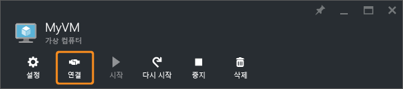

4. .rdp이 알 수 없는 게시자에게서 비롯되었다는 경고를 받게 됩니다. 이것은 정상입니다. 원격 데스크톱 창에서 **연결**을 클릭하여 계속합니다.

	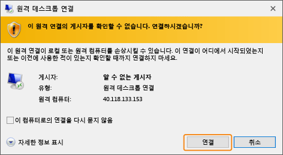

5. Windows 보안 창에서 VM을 만들 때 생성한 로컬 계정에 대한 사용자 이름 및 암호를 입력합니다. 사용자 이름을 *vmname*& #92;*사용자 이름*으로 입력한 다음 **확인**을 클릭합니다.

	
 	
6.	인증서를 확인할 수 없다는 경고를 받게 됩니다. 이것은 정상입니다. **예**를 클릭하여 가상 컴퓨터의 ID를 확인하고 로그온을 완료합니다.

	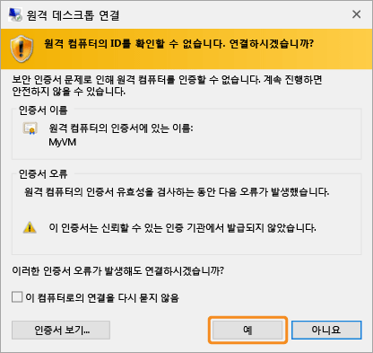

연결하려고 할 때 문제가 발생할 경우 [Windows 기반 Azure 가상 컴퓨터에 대한 원격 데스크톱 연결 문제 해결](virtual-machines-windows-troubleshoot-rdp-connection.md)을 참조하세요.

## VM에 IIS 설치

VM에 로그인했으므로 더 실험할 수 있도록 서버 역할을 설치합니다.

1. 아직 열려 있지 않은 경우 **서버 관리자**를 엽니다. **시작** 메뉴를 클릭한 다음 **서버 관리자**를 클릭합니다.
2. **서버 관리자**의 왼쪽 창에서 **로컬 서버**를 선택합니다.
3. 메뉴에서 **관리** > **역할 및 기능 추가**를 선택합니다.
4. 역할 및 기능 마법사 추가의 **설치 유형** 페이지에서 **역할 기반 또는 기능 기반 설치**를 선택하고 **다음**을 클릭합니다.

	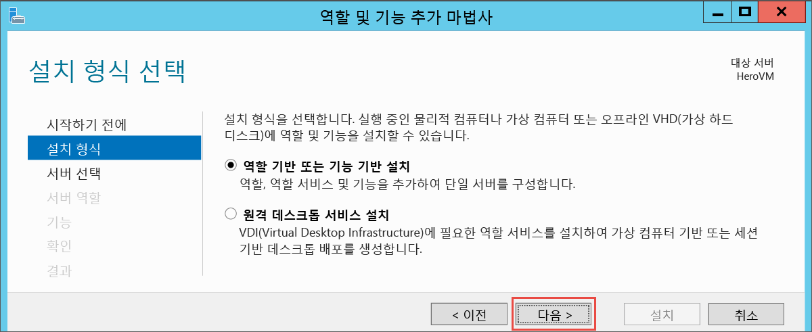

5. 서버 풀에서 VM을 선택하고 **다음**을 클릭합니다.
6. **서버 역할** 페이지에서 **Web Server(IIS)**를 선택합니다.

	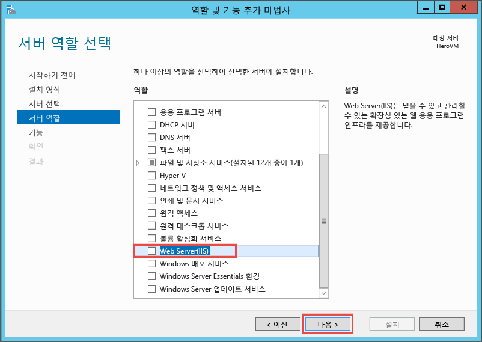

7. IIS에 필요한 기능을 추가하는 방법에 대한 팝업에서 **관리 도구 포함**을 선택한 다음 **기능 추가**를 클릭해야 합니다. 팝업을 닫을 때 마법사에서 **다음**을 클릭합니다.

	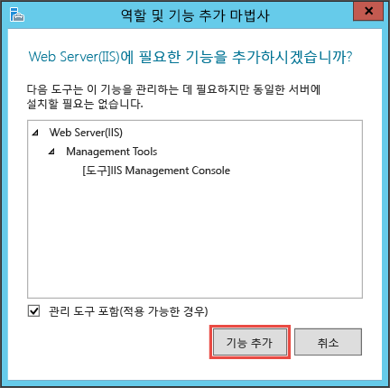

8. 기능 페이지에서 **다음**을 클릭합니다.
9. **웹 서버 역할(IIS)** 페이지에서 **다음**을 클릭합니다.
10. **역할 서비스** 페이지에서 **다음**을 클릭합니다.
11. **확인** 페이지에서 **설치**를 클릭합니다.
12. 설치가 완료되면 마법사에서 **닫기**를 클릭합니다.

## 포트 80 열기 

VM이 포트 80을 통한 인바운드 트래픽을 허용하기 위해 네트워크 보안 그룹에 인바운드 규칙을 추가해야 합니다.

1. [Azure 포털](https://portal.azure.com)을 엽니다.
2. **가상 컴퓨터**에서 만든 VM을 선택합니다.
3. 가상 컴퓨터 설정에서 **네트워크 인터페이스**를 선택한 다음 기존 네트워크 인터페이스를 선택합니다.

	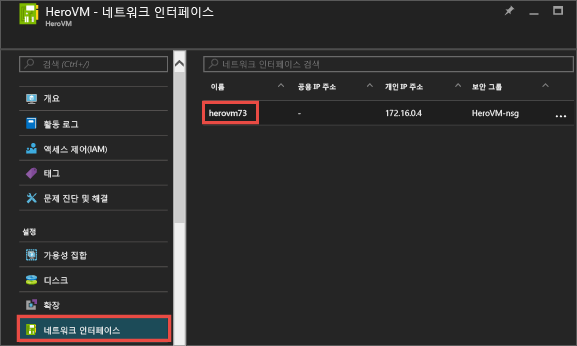

4. 네트워크 인터페이스에 대한 **Essentials**에서 **네트워크 보안 그룹**을 클릭합니다.

	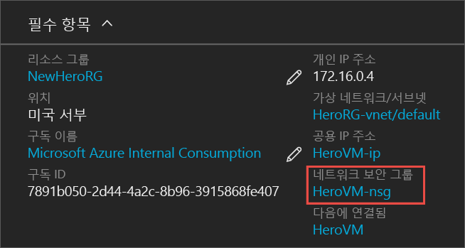

5. NSG에 대한 **Essentials** 블레이드에서 VM에 로그인할 수 있는 **default-allow-rdp**에 하나의 기존 기본 인바운드 규칙이 있어야 합니다. IIS 트래픽을 허용하도록 인바운드 규칙을 추가합니다. **인바운드 보안 규칙**을 클릭합니다.

	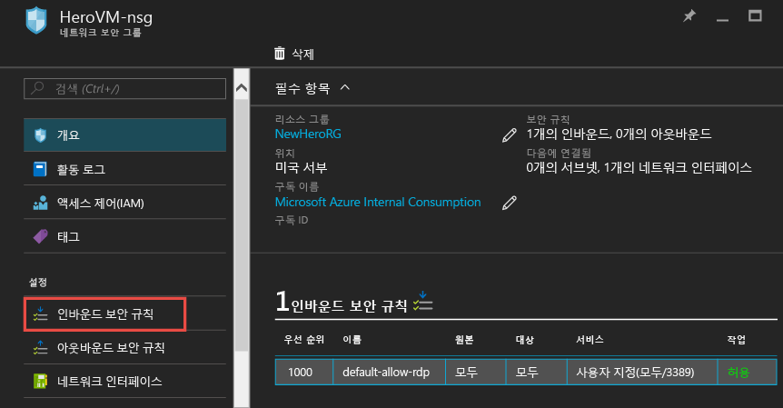

6. **인바운드 보안 규칙**에서 **추가**를 클릭합니다.

	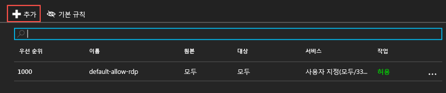

7. **인바운드 보안 규칙**에서 **추가**를 클릭합니다. 포트 범위에 **80**을 입력하고 **허용**을 선택해야 합니다. 완료되면 **확인**을 클릭합니다.

	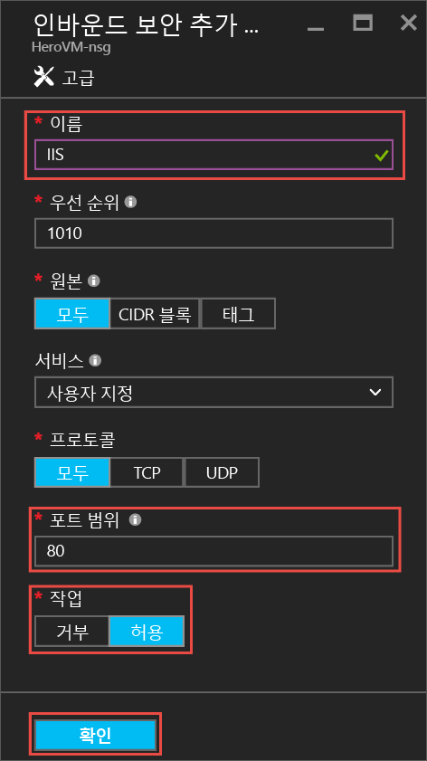
 
NSG, 인바운드 및 아웃바운드 규칙에 대한 자세한 내용은 [Azure 포털을 사용하여 VM에 대한 외부 액세스 허용](virtual-machines-windows-nsg-quickstart-portal.md)을 참조하세요.
 
## 기본 IIS 웹 사이트에 연결

1. Azure 포털에서 **가상 컴퓨터**를 클릭한 다음 VM을 선택합니다.
2. **Essentials** 블레이드에서 **공용 IP 주소**를 복사합니다.

	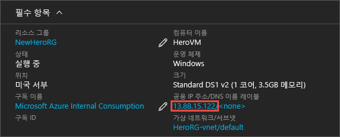

2. 브라우저를 열고 주소 표시줄에 http://<publicIPaddress>와 같은 공용 IP 주소를 입력하고 **입력**을 클릭하여 해당 주소로 이동합니다.
3. 브라우저에서 기본 IIS 웹 페이지가 열립니다. 모양은 다음과 같습니다.

	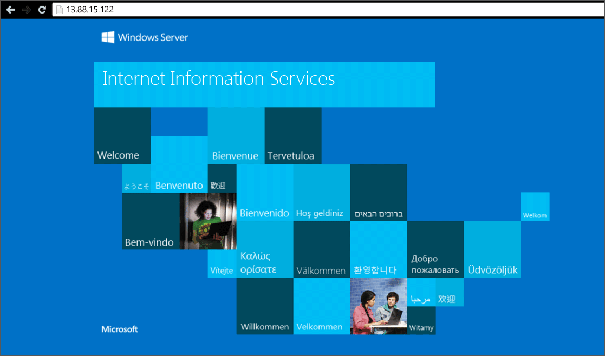

    

## 다음 단계

- 또한 가상 컴퓨터에 대한 [데이터 디스크 연결](virtual-machines-windows-attach-disk-portal.md)을 실험할 수 있습니다. 데이터 디스크는 가상 컴퓨터에 대한 더 많은 저장소를 제공합니다.

<!---HONumber=AcomDC_0914_2016-->